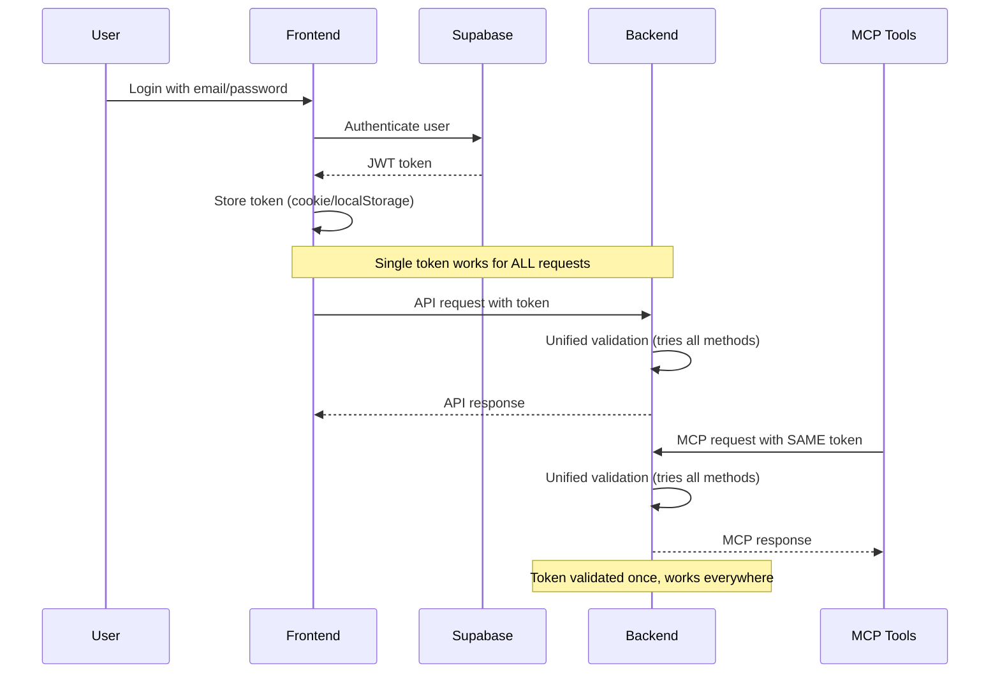

# Authentication Architecture

## Overview

The DhafnckMCP platform uses a **unified single-token authentication system** where any valid token authenticates the user for ALL request types. This simplifies authentication by eliminating the need to manage different tokens for different endpoints.

## Unified Token System

### Single Token for All Access
The server accepts ONE token that works universally:

- **Supabase JWT Tokens**: From user login via frontend
- **Local JWT Tokens**: For development/testing
- **MCP Generated Tokens**: For tool and agent access

### Key Benefits
- **Simplicity**: Pass one token, access everything
- **Flexibility**: Any valid token type is accepted
- **Seamless Integration**: No token conversion needed
- **Automatic Detection**: Middleware handles token validation

### Token Sources (in priority order)
1. **Authorization Header**: `Bearer <token>` or `Token <token>`
2. **Custom Headers**: `x-mcp-token` or `mcp-token`
3. **Cookies**: `access_token` (for browser requests)
4. **Query Parameters**: `?token=` (testing only, insecure)

## Authentication Flow



## Authentication Stack

### Active Authentication Systems

1. **JWT Authentication** (`auth/middleware/jwt_auth_middleware.py`)
   - Primary authentication mechanism
   - Validates both Supabase and MCP JWTs
   - Extracts user context from tokens

2. **Dual Authentication** (`auth/middleware/dual_auth_middleware.py`)
   - Combines multiple auth methods
   - Supports JWT and Bearer tokens
   - Provides flexible authentication strategy

3. **Request Context** (`auth/middleware/request_context_middleware.py`)
   - Propagates authentication context through requests
   - Provides helper functions for getting current user
   - Maintains auth state across request lifecycle

4. **JWT Bearer Provider** (`server/auth/providers/jwt_bearer.py`)
   - Validates JWT tokens for MCP protocol
   - Maps token scopes to MCP permissions
   - Checks token existence in database

5. **Supabase Client** (`auth/supabase_client.py`)
   - Integrates with Supabase auth service
   - Handles user registration and login
   - Manages email verification

### Middleware Processing Order

```
Request → DualAuthMiddleware → RequestContextMiddleware → DebugLoggingMiddleware → Application
```

## Token Types and Scopes

### Supabase Token Claims
```json
{
  "sub": "user-uuid",
  "email": "user@example.com",
  "roles": ["authenticated"],
  "aud": "authenticated",
  "exp": 1234567890
}
```

### MCP Token Claims
```json
{
  "token_id": "tok_abc123",
  "user_id": "user-uuid",
  "scopes": ["mcp:read", "mcp:write", "mcp:execute"],
  "type": "api_token",
  "exp": 1234567890
}
```

### Available MCP Scopes
- `mcp:access` - Basic MCP access
- `mcp:read` - Read operations (tasks, context)
- `mcp:write` - Write operations (create, update)
- `mcp:execute` - Execute MCP tools
- `mcp:admin` - Administrative operations

## Security Features

### Token Security
- JWT tokens signed with `JWT_SECRET_KEY`
- Tokens stored hashed in database
- Rate limiting per token
- Token expiration enforcement
- Secure cookie storage (httpOnly, sameSite)

### Middleware Security
- Automatic token refresh on 401
- Request context isolation
- User scope validation
- Cross-user access prevention

## Configuration

### Environment Variables
```bash
# Supabase Authentication
SUPABASE_URL=https://[project].supabase.co
SUPABASE_ANON_KEY=eyJ...
SUPABASE_SERVICE_ROLE_KEY=eyJ...
SUPABASE_JWT_SECRET=xxx...

# JWT Configuration
JWT_SECRET_KEY=your-secret-key
JWT_ALGORITHM=HS256
JWT_EXPIRATION_MINUTES=1440

# Authentication Control
DHAFNCK_AUTH_ENABLED=true
MCP_AUTH_ENABLED=true
```

### Authentication Modes
1. **Full Authentication** (Production)
   - Supabase for user auth
   - JWT for MCP tokens
   - All security features enabled

2. **MVP Mode** (Development)
   - Simplified auth without Supabase
   - Local JWT generation
   - Faster development cycle

3. **Stateless HTTP Mode**
   - No session persistence
   - Token-only authentication
   - Suitable for serverless

## API Endpoints

### User Authentication (Supabase)
- `POST /auth/supabase/signup` - User registration
- `POST /auth/supabase/signin` - User login
- `POST /auth/supabase/signout` - User logout
- `POST /auth/supabase/refresh` - Token refresh

### MCP Token Management
- `POST /api/v2/tokens` - Generate MCP token
- `GET /api/v2/tokens` - List user's tokens
- `DELETE /api/v2/tokens/{id}` - Revoke token
- `GET /api/v2/tokens/{id}` - Get token details
- `GET /api/v2/tokens/{id}/usage` - Token usage stats

## Frontend Integration

### Authentication Hook (`useAuth`)
```typescript
const { user, tokens, login, logout, refreshToken } = useAuth();
```

### Authenticated Fetch
```typescript
// Automatically adds Supabase JWT to requests
const response = await authenticatedFetch('/api/v2/tasks');
```

### Token Service
```typescript
// Generate MCP token (requires Supabase auth)
const mcpToken = await tokenService.generateToken({
  name: "My MCP Token",
  scopes: ["mcp:read", "mcp:write"],
  expires_in_days: 30
});
```

## Removed/Deprecated Systems

The following authentication systems were removed in the cleanup (2025-08-26):

- **FastAPI Auth Bridge** - Not needed (using Starlette)
- **Bearer Env Provider** - Replaced by JWT
- **Dev Auth Endpoints** - Security risk
- **MCP Token Service** - Legacy implementation
- **Thread Context Manager** - Not needed for async
- **User Context Middleware** - Duplicate functionality

## Best Practices

1. **Never expose JWT secrets** in code or logs
2. **Always validate tokens** before processing requests
3. **Use appropriate scopes** for MCP tokens
4. **Implement token rotation** for long-lived integrations
5. **Monitor token usage** for anomalies
6. **Store tokens securely** (httpOnly cookies for browser)

## Troubleshooting

### Common Issues

1. **"No authentication provided"**
   - Check if Supabase token is in cookies
   - Verify token hasn't expired
   - Ensure `DHAFNCK_AUTH_ENABLED=true`

2. **"Invalid MCP token"**
   - Verify token hasn't expired
   - Check token exists in database
   - Ensure correct scopes for operation

3. **"Session expired"**
   - Refresh token has expired
   - User needs to login again
   - Check refresh token endpoint

## Migration Guide

### From Legacy Auth to Current System

1. **Update environment variables**
   - Add Supabase configuration
   - Set JWT_SECRET_KEY
   - Enable DHAFNCK_AUTH_ENABLED

2. **Update API calls**
   - Use `/auth/supabase/*` endpoints
   - Include Bearer token in headers
   - Handle 401 with token refresh

3. **Update MCP tools**
   - Use MCP tokens, not user tokens
   - Request appropriate scopes
   - Handle rate limiting

## Related Documentation

- [Token Flow Guide](./token-flow.md)
- [API Authentication](../api/authentication.md)
- [Security Best Practices](../security/best-practices.md)
- [Supabase Integration](../integrations/supabase.md)