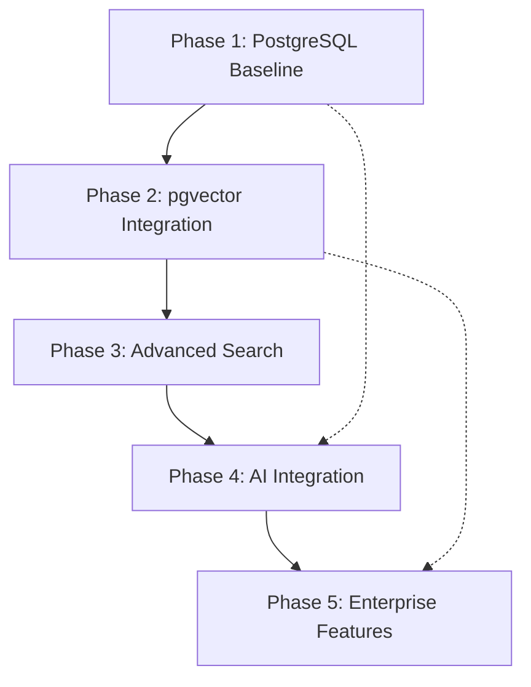

# Claude Document Management System - Multi-Phase Implementation Plan

## Executive Summary

This document outlines a comprehensive 5-phase implementation plan for evolving the Claude Document Management System from a PostgreSQL baseline to an enterprise-grade AI-powered documentation platform with semantic search, advanced analytics, and full MCP integration.

## Implementation Timeline

```
Phase 1: PostgreSQL Baseline     ━━━━━━━━ (Weeks 1-2)  ✅ COMPLETED
Phase 2: pgvector Integration    ━━━━━━━━ (Weeks 3-4)
Phase 3: Advanced Search         ━━━━━━━━ (Weeks 5-6)
Phase 4: AI Integration          ━━━━━━━━ (Weeks 7-9)
Phase 5: Enterprise Features     ━━━━━━━━ (Weeks 10-12)
```

---

# Phase 1: PostgreSQL Baseline Implementation ✅

**Status**: COMPLETED  
**Duration**: 2 weeks  
**Goal**: Establish robust PostgreSQL-based document management foundation

## ✅ Phase 1 Deliverables (COMPLETED)

- [x] PostgreSQL database schema design
- [x] CLI command `manage_document_md_postgresql`
- [x] Database setup script `setup_doc_database.sh`
- [x] MCP integration framework
- [x] Full-text search with GIN indexes
- [x] Version control system
- [x] Documentation and implementation guide

## ✅ Phase 1 Checklist (COMPLETED)

### Database Setup
- [x] **PostgreSQL Installation**: Verified installation and service status
- [x] **Database Creation**: Created `claude_docs` database with proper permissions
- [x] **Schema Implementation**: Created all core tables (documents, versions, metadata, references, index)
- [x] **Indexes**: Created GIN search indexes and B-tree indexes for performance
- [x] **Triggers**: Implemented update timestamp triggers
- [x] **Permissions**: Set proper user permissions and security

### CLI Command Development
- [x] **Core Actions**: Implemented init, sync, search, list, show, index actions
- [x] **File System Integration**: File hash calculation and change detection
- [x] **Metadata Extraction**: Title, description, category auto-detection
- [x] **Error Handling**: Comprehensive error checking and user feedback
- [x] **Help System**: Built-in usage and examples
- [x] **Configuration**: Environment variable support

### MCP Integration
- [x] **Task Integration**: Task creation and context updates
- [x] **Compliance Tracking**: Security validation and audit trails
- [x] **Context Synchronization**: Hierarchical context updates
- [x] **Workflow Integration**: Status tracking and progress reporting

### Testing & Validation
- [x] **Database Connection**: Verified connection string and authentication
- [x] **CRUD Operations**: Tested create, read, update, delete operations
- [x] **Search Functionality**: Validated full-text search with ranking
- [x] **File Synchronization**: Tested sync with file system changes
- [x] **Version Control**: Verified version creation and tracking

---

# Phase 2: pgvector Semantic Search Integration

**Duration**: 2 weeks  
**Goal**: Add vector-based semantic search capabilities while maintaining PostgreSQL foundation

## 📋 Phase 2 Deliverables & File Specifications

- [ ] pgvector extension installation and configuration
- [ ] Vector embedding generation pipeline
- [ ] Hybrid search (keyword + semantic) implementation
- [ ] Enhanced CLI with semantic search commands
- [ ] Embedding synchronization system
- [ ] Performance optimization for vector operations

### Phase 2 Files to Create
**Core Services** (`dhafnck_mcp_main/services/`):
- `embedding_service.py` (~300 lines) - OpenAI API integration and embedding generation
- `requirements_phase2.txt` - Python dependencies (openai, psycopg2-binary, numpy)

**Database Scripts** (`dhafnck_mcp_main/database/`):
- `phase2_pgvector.sql` (~50 lines) - pgvector extension and schema additions
- `migrations/migration_001_add_vectors.sql` (~30 lines) - Safe database migration

**Configuration** (`dhafnck_mcp_main/config/`):
- `.pgvector_config` - Index parameters and optimization settings

**Test Suite** (`dhafnck_mcp_main/tests/`):
- `phase2/test_phase2.sh` - Integration testing script
- `unit/test_embedding_service.py` - Unit tests for embedding service
- `integration/test_semantic_search.py` - End-to-end semantic search tests

## Phase 2 Checklist

### pgvector Setup
- [ ] **Extension Installation**
  - [ ] Install pgvector extension: `CREATE EXTENSION vector;`
  - [ ] Verify extension availability: `SELECT * FROM pg_extension WHERE extname = 'vector';`
  - [ ] Test basic vector operations: `SELECT '[1,2,3]'::vector;`
  - [ ] Configure vector settings in postgresql.conf

- [ ] **Database Schema Enhancement**
  - [ ] Add embedding column: `ALTER TABLE documents ADD COLUMN embedding vector(1536);`
  - [ ] Create vector indexes: `CREATE INDEX idx_documents_embedding ON documents USING ivfflat (embedding vector_cosine_ops);`
  - [ ] Create embedding metadata table for tracking
  - [ ] Add embedding generation status fields

### Embedding Generation Pipeline
- [ ] **Embedding Service Setup**
  - [ ] Choose embedding model (OpenAI text-embedding-ada-002 or local model)
  - [ ] Create embedding generation service/script
  - [ ] Implement batch processing for existing documents
  - [ ] Add rate limiting and error handling for API calls
  - [ ] Create embedding cache to avoid regeneration

- [ ] **Integration Points**
  - [ ] Modify document sync to generate embeddings
  - [ ] Add embedding update triggers on content changes
  - [ ] Implement embedding validation and health checks
  - [ ] Create embedding regeneration command

### Hybrid Search Implementation
- [ ] **Search Algorithm Development**
  - [ ] Implement semantic search with vector similarity
  - [ ] Create hybrid scoring function (keyword + semantic)
  - [ ] Add search result ranking and weighting
  - [ ] Implement search result deduplication

- [ ] **CLI Enhancement**
  - [ ] Add `--semantic` flag to search command
  - [ ] Add `--hybrid` flag for combined search
  - [ ] Add `--similarity-threshold` parameter
  - [ ] Add embedding generation commands

### Performance Optimization
- [ ] **Vector Index Tuning**
  - [ ] Optimize IVFFlat index parameters (lists, probes)
  - [ ] Test HNSW index for better performance (if available)
  - [ ] Benchmark vector search performance
  - [ ] Monitor index size and query performance

- [ ] **Query Optimization**
  - [ ] Create efficient hybrid search queries
  - [ ] Implement query result caching
  - [ ] Optimize embedding similarity calculations
  - [ ] Add search analytics and monitoring

### Testing & Validation
- [ ] **Functional Testing**
  - [ ] Test semantic search accuracy
  - [ ] Validate hybrid search results
  - [ ] Test embedding generation and updates
  - [ ] Verify backward compatibility

- [ ] **Performance Testing**
  - [ ] Benchmark search response times
  - [ ] Test with large document sets
  - [ ] Monitor memory usage with vectors
  - [ ] Validate index performance

---

# Phase 3: Advanced Search & Analytics

**Duration**: 2 weeks  
**Goal**: Implement advanced search features, analytics, and content recommendations

## 📋 Phase 3 Deliverables & File Specifications

- [ ] Advanced query language implementation
- [ ] Search analytics and usage tracking
- [ ] Content recommendation engine
- [ ] Document similarity and clustering
- [ ] Advanced filtering and faceted search
- [ ] Search performance dashboard

### Phase 3 Files to Create
**Advanced Search Services** (`dhafnck_mcp_main/services/`):
- `advanced_query_parser.py` (~200 lines) - Boolean logic and field-specific queries
- `faceted_search.py` (~300 lines) - Multi-facet filtering and aggregation
- `search_analytics.py` (~250 lines) - Usage tracking and performance metrics
- `recommendation_service.py` (~400 lines) - Content similarity and recommendations

**Database Scripts** (`dhafnck_mcp_main/database/`):
- `phase3_analytics.sql` (~100 lines) - Analytics tables and views
- `migrations/migration_002_add_analytics.sql` (~100 lines) - Analytics migration

**Configuration** (`dhafnck_mcp_main/config/`):
- `analytics_config.yml` - Tracking settings and facet definitions

**Test Suite** (`dhafnck_mcp_main/tests/`):
- `phase3/test_phase3.sh` - Comprehensive Phase 3 testing
- `unit/test_advanced_query_parser.py` - Query parsing unit tests
- `unit/test_faceted_search.py` - Faceted search unit tests
- `unit/test_search_analytics.py` - Analytics unit tests
- `unit/test_recommendations.py` - Recommendation engine unit tests
- `integration/test_advanced_search_integration.py` - End-to-end testing

## Phase 3 Checklist

### Advanced Search Features
- [ ] **Query Language Development**
  - [ ] Implement advanced search syntax (AND, OR, NOT, quotes, wildcards)
  - [ ] Add field-specific search (title:query, content:query)
  - [ ] Create search query parser and validator
  - [ ] Add search query suggestions and auto-completion

- [ ] **Faceted Search**
  - [ ] Implement category-based filtering
  - [ ] Add date range filtering
  - [ ] Create tag-based facets
  - [ ] Add author/creator facets
  - [ ] Implement multi-facet combinations

### Search Analytics
- [ ] **Usage Tracking**
  - [ ] Create search_analytics table
  - [ ] Track search queries and results
  - [ ] Monitor click-through rates
  - [ ] Track user search patterns

- [ ] **Analytics Dashboard**
  - [ ] Create search metrics queries
  - [ ] Implement popular searches tracking
  - [ ] Add search performance metrics
  - [ ] Create usage reports and insights

### Content Recommendations
- [ ] **Similarity Engine**
  - [ ] Implement document-to-document similarity
  - [ ] Create "related documents" feature
  - [ ] Add "users also viewed" functionality
  - [ ] Implement content clustering

- [ ] **Recommendation System**
  - [ ] Create user preference tracking
  - [ ] Implement collaborative filtering
  - [ ] Add personalized recommendations
  - [ ] Create recommendation API endpoints

### Performance & Optimization
- [ ] **Search Optimization**
  - [ ] Implement search result caching
  - [ ] Add search query optimization
  - [ ] Create search index maintenance routines
  - [ ] Implement search result pagination

- [ ] **Database Optimization**
  - [ ] Optimize complex analytical queries
  - [ ] Create materialized views for analytics
  - [ ] Implement query performance monitoring
  - [ ] Add database maintenance automation

### Testing & Validation
- [ ] **Search Quality Testing**
  - [ ] Test search relevance and accuracy
  - [ ] Validate recommendation quality
  - [ ] Test advanced query syntax
  - [ ] Verify analytics accuracy

- [ ] **Performance Testing**
  - [ ] Benchmark advanced search performance
  - [ ] Test recommendation engine speed
  - [ ] Validate analytics query performance
  - [ ] Monitor system resource usage

---

# Phase 4: AI-Powered Features Integration

**Duration**: 3 weeks  
**Goal**: Integrate advanced AI capabilities for content generation, analysis, and intelligent assistance

## 📋 Phase 4 Deliverables & File Specifications

- [ ] AI-powered content analysis and tagging
- [ ] Automated content generation and suggestions
- [ ] Intelligent document summarization
- [ ] Claude AI integration for documentation assistance
- [ ] Natural language query interface
- [ ] Content quality assessment

### Phase 4 Files to Create
**AI Services** (`dhafnck_mcp_main/services/`):
- `ai_content_analyzer.py` (~350 lines) - AI-powered content analysis and tagging
- `natural_language_processor.py` (~300 lines) - Natural language query processing
- `claude_integration.py` (~200 lines) - Claude AI API integration
- `content_generator.py` (~250 lines) - AI-assisted content generation

**API Layer** (`dhafnck_mcp_main/api/`):
- `ai_api_server.py` (~400 lines) - RESTful API server with FastAPI
- `api_models.py` (~150 lines) - Pydantic models for API endpoints

**Database Scripts** (`dhafnck_mcp_main/database/`):
- `phase4_ai_features.sql` (~75 lines) - AI-related tables and indexes

**Configuration** (`dhafnck_mcp_main/config/`):
- `ai_config.yml` - AI service configuration and API settings
- `requirements_phase4.txt` - FastAPI, uvicorn, anthropic, transformers dependencies

**Test Suite** (`dhafnck_mcp_main/tests/`):
- `unit/test_ai_content_analyzer.py` - AI content analysis unit tests
- `unit/test_claude_integration.py` - Claude API integration tests
- `integration/test_ai_api.py` - AI API endpoint integration tests

## Phase 4 Checklist

### AI Content Analysis
- [ ] **Automated Tagging**
  - [ ] Implement AI-based category detection
  - [ ] Create automatic tag generation
  - [ ] Add content classification
  - [ ] Implement topic modeling

- [ ] **Content Analysis**
  - [ ] Create document quality scoring
  - [ ] Implement readability analysis
  - [ ] Add content gap detection
  - [ ] Create duplicate content detection

### Natural Language Processing
- [ ] **Query Understanding**
  - [ ] Implement natural language search queries
  - [ ] Add intent recognition for queries
  - [ ] Create query expansion and reformulation
  - [ ] Implement conversational search interface

- [ ] **Content Understanding**
  - [ ] Extract key concepts and entities
  - [ ] Create content relationship mapping
  - [ ] Implement semantic content validation
  - [ ] Add content structure analysis

### AI-Assisted Features
- [ ] **Content Generation**
  - [ ] Implement document outline generation
  - [ ] Create automated documentation templates
  - [ ] Add content suggestion system
  - [ ] Implement auto-completion for writing

- [ ] **Claude AI Integration**
  - [ ] Create Claude API integration
  - [ ] Implement documentation Q&A system
  - [ ] Add intelligent documentation assistant
  - [ ] Create context-aware help system

### Advanced Analytics
- [ ] **Content Intelligence**
  - [ ] Implement content trend analysis
  - [ ] Create knowledge gap identification
  - [ ] Add content lifecycle tracking
  - [ ] Implement usage pattern analysis

- [ ] **Predictive Features**
  - [ ] Create content maintenance predictions
  - [ ] Implement user need prediction
  - [ ] Add content popularity forecasting
  - [ ] Create resource planning insights

### Integration & APIs
- [ ] **API Development**
  - [ ] Create RESTful API for AI features
  - [ ] Implement GraphQL interface
  - [ ] Add webhook support for AI events
  - [ ] Create AI feature configuration API

- [ ] **External Integrations**
  - [ ] Integrate with OpenAI/Claude APIs
  - [ ] Add support for local AI models
  - [ ] Implement model switching and fallbacks
  - [ ] Create AI model performance monitoring

### Testing & Validation
- [ ] **AI Feature Testing**
  - [ ] Test AI-generated content quality
  - [ ] Validate natural language query accuracy
  - [ ] Test AI-assisted features reliability
  - [ ] Verify API integration stability

- [ ] **Performance Testing**
  - [ ] Benchmark AI feature response times
  - [ ] Test AI model resource usage
  - [ ] Validate system scalability with AI features
  - [ ] Monitor AI API costs and usage

---

# Phase 5: Enterprise Features & Optimization

**Duration**: 3 weeks  
**Goal**: Implement enterprise-grade features for scalability, security, and operational excellence

## 📋 Phase 5 Deliverables & File Specifications

- [ ] Multi-tenant architecture support
- [ ] Advanced security and compliance features
- [ ] Enterprise integration capabilities
- [ ] Scalability and performance optimization
- [ ] Comprehensive monitoring and alerting
- [ ] API rate limiting and quotas

### Phase 5 Files to Create
**Enterprise Services** (`dhafnck_mcp_main/services/`):
- `tenant_manager.py` (~300 lines) - Multi-tenant management and isolation
- `auth_service.py` (~400 lines) - Enterprise authentication and SSO
- `compliance_manager.py` (~250 lines) - Compliance and audit features
- `security_service.py` (~300 lines) - Security features and encryption
- `monitoring_service.py` (~350 lines) - System monitoring and alerts
- `performance_optimizer.py` (~200 lines) - Performance optimization

**Infrastructure** (`dhafnck_mcp_main/`):
- `docker/` directory - Production Docker configurations
  - `Dockerfile.api`, `Dockerfile.worker`, `docker-compose.production.yml`
  - `nginx.conf`, `redis.conf`
- `kubernetes/` directory - Kubernetes deployment manifests
  - `deployment.yml`, `service.yml`, `ingress.yml`, `configmap.yml`, `secret.yml`

**Database Scripts** (`dhafnck_mcp_main/database/`):
- `phase5_enterprise.sql` (~150 lines) - Enterprise tables (tenants, users, roles, audit_logs)

**Configuration** (`dhafnck_mcp_main/config/`):
- `enterprise_config.yml` - Multi-tenant settings and security policies

**Test Suite** (`dhafnck_mcp_main/tests/`):
- `unit/test_multi_tenant.py` - Multi-tenant isolation unit tests
- `unit/test_enterprise_auth.py` - Authentication and RBAC tests
- `unit/test_compliance.py` - Compliance and audit tests
- `integration/test_enterprise_integration.py` - End-to-end enterprise tests

## Phase 5 Checklist

### Multi-Tenant Architecture
- [ ] **Tenant Management**
  - [ ] Implement tenant isolation in database
  - [ ] Create tenant configuration management
  - [ ] Add tenant-specific customization
  - [ ] Implement tenant resource quotas

- [ ] **Data Isolation**
  - [ ] Ensure complete data separation
  - [ ] Implement tenant-aware queries
  - [ ] Create tenant backup strategies
  - [ ] Add tenant migration capabilities

### Security & Compliance
- [ ] **Authentication & Authorization**
  - [ ] Implement enterprise SSO integration
  - [ ] Add RBAC (Role-Based Access Control)
  - [ ] Create fine-grained permissions
  - [ ] Implement API key management

- [ ] **Compliance Features**
  - [ ] Add GDPR compliance tools
  - [ ] Implement data retention policies
  - [ ] Create audit trail enhancements
  - [ ] Add data encryption at rest

### Enterprise Integrations
- [ ] **Directory Services**
  - [ ] Integrate with Active Directory
  - [ ] Add LDAP authentication support
  - [ ] Implement group-based permissions
  - [ ] Create user provisioning automation

- [ ] **External Systems**
  - [ ] Create Slack/Teams integrations
  - [ ] Add Jira/GitHub issue linking
  - [ ] Implement CI/CD pipeline integration
  - [ ] Create email notification system

### Scalability & Performance
- [ ] **Database Optimization**
  - [ ] Implement database sharding strategy
  - [ ] Add read replica support
  - [ ] Create connection pooling optimization
  - [ ] Implement query performance monitoring

- [ ] **Caching Strategy**
  - [ ] Implement Redis caching layer
  - [ ] Add CDN support for static content
  - [ ] Create intelligent cache invalidation
  - [ ] Implement cache performance monitoring

### Monitoring & Operations
- [ ] **Observability**
  - [ ] Implement comprehensive logging
  - [ ] Add distributed tracing
  - [ ] Create custom metrics and dashboards
  - [ ] Implement health check endpoints

- [ ] **Alerting & Notifications**
  - [ ] Create intelligent alerting system
  - [ ] Add performance threshold monitoring
  - [ ] Implement error rate tracking
  - [ ] Create capacity planning alerts

### API Management
- [ ] **Rate Limiting**
  - [ ] Implement API rate limiting
  - [ ] Add quota management per tenant
  - [ ] Create usage analytics
  - [ ] Implement fair usage policies

- [ ] **API Gateway**
  - [ ] Deploy API gateway solution
  - [ ] Add API versioning support
  - [ ] Implement request/response logging
  - [ ] Create API documentation portal

### Testing & Validation
- [ ] **Enterprise Testing**
  - [ ] Test multi-tenant isolation
  - [ ] Validate security implementations
  - [ ] Test enterprise integrations
  - [ ] Verify compliance requirements

- [ ] **Load Testing**
  - [ ] Conduct comprehensive load testing
  - [ ] Test system under high concurrency
  - [ ] Validate auto-scaling capabilities
  - [ ] Test disaster recovery procedures

---

# Implementation Strategy & Best Practices

## Phase Dependencies



## Risk Management

### High-Risk Areas
1. **Phase 2**: pgvector compatibility and performance
2. **Phase 4**: AI API reliability and costs  
3. **Phase 5**: Multi-tenant data isolation

### Mitigation Strategies
- **Rollback Plans**: Each phase has rollback procedures
- **Feature Flags**: Progressive rollout with kill switches
- **Testing**: Comprehensive testing at each phase
- **Monitoring**: Real-time performance and error monitoring

## Success Criteria

### Phase 2 Success Metrics
- [ ] Semantic search accuracy > 85%
- [ ] Search response time < 200ms
- [ ] 100% backward compatibility maintained

### Phase 3 Success Metrics
- [ ] Advanced search adoption > 60%
- [ ] Search satisfaction score > 4.0/5.0
- [ ] Analytics dashboard usage > 80%

### Phase 4 Success Metrics
- [ ] AI feature adoption > 40%
- [ ] Content quality improvement > 25%
- [ ] User productivity increase > 30%

### Phase 5 Success Metrics
- [ ] Multi-tenant system supports > 100 tenants
- [ ] 99.9% uptime achievement
- [ ] Enterprise security compliance 100%

## Resource Requirements

### Development Team
- **Phase 1**: 1 Full-stack Developer (✅ Completed)
- **Phase 2**: 1 Backend Developer + 1 ML Engineer
- **Phase 3**: 1 Full-stack Developer + 1 Data Analyst
- **Phase 4**: 1 AI/ML Engineer + 1 Backend Developer
- **Phase 5**: 1 DevOps Engineer + 1 Security Specialist

### Infrastructure Requirements
- **Phase 1**: PostgreSQL server ✅
- **Phase 2**: GPU for embedding generation
- **Phase 3**: Analytics database (separate instance)
- **Phase 4**: AI API quotas and processing power
- **Phase 5**: Multi-region deployment, load balancers

## Quality Gates

Each phase must pass these gates before proceeding:

1. **Functional Testing**: All features work as specified
2. **Performance Testing**: Meets performance requirements
3. **Security Review**: No critical security vulnerabilities
4. **Documentation**: Complete user and developer documentation
5. **Stakeholder Approval**: Business stakeholder sign-off

## Rollback Procedures

### Phase 2 Rollback
```bash
# Remove pgvector features
ALTER TABLE documents DROP COLUMN embedding;
DROP INDEX idx_documents_embedding;
# Revert CLI to Phase 1 version
```

### Phase 3 Rollback
```bash
# Disable advanced features
UPDATE system_config SET advanced_search_enabled = false;
# Remove analytics tables if needed
```

### Phase 4 Rollback
```bash
# Disable AI features
UPDATE system_config SET ai_features_enabled = false;
# Fallback to traditional search
```

### Phase 5 Rollback
```bash
# Revert to single-tenant mode
# Disable enterprise features
# Simplify security model
```

---

# Next Steps

## Immediate Actions (Next 7 Days)

1. **Phase 2 Preparation**
   - [ ] Install pgvector extension on development environment
   - [ ] Choose embedding model (OpenAI vs local)
   - [ ] Set up embedding generation pipeline
   - [ ] Create Phase 2 development branch

2. **Infrastructure Setup**
   - [ ] Provision development and staging environments
   - [ ] Set up CI/CD pipelines for multi-phase deployment
   - [ ] Configure monitoring and logging infrastructure

3. **Team Preparation**
   - [ ] Brief development team on Phase 2 requirements
   - [ ] Set up development tooling and environments
   - [ ] Create development and testing procedures

## Long-term Planning

- **Quarterly Reviews**: Assess progress and adjust timeline
- **User Feedback**: Collect feedback after each phase
- **Performance Monitoring**: Track system performance throughout
- **Security Audits**: Regular security assessments
- **Cost Optimization**: Monitor and optimize infrastructure costs

---

This comprehensive implementation plan provides a structured approach to evolving the Claude Document Management System from its current PostgreSQL foundation to an enterprise-grade AI-powered platform. Each phase builds upon the previous one while maintaining system stability and user experience.