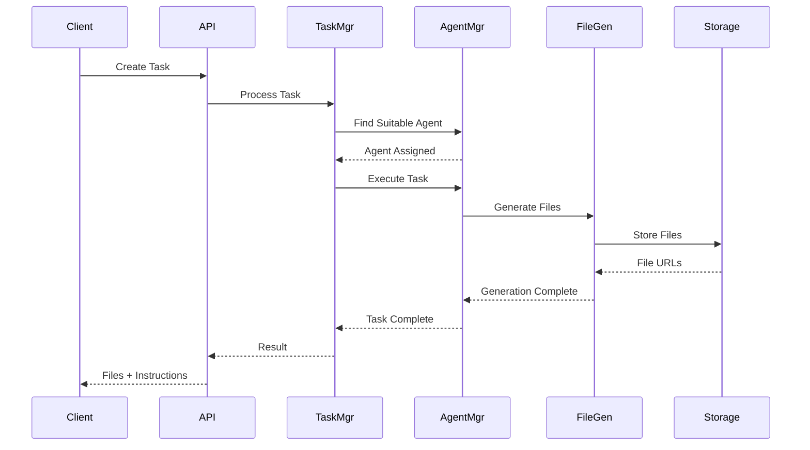
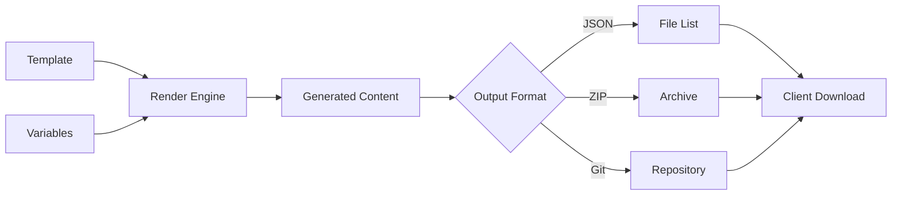

# Cloud MCP Platform - Architecture Overview

## System Architecture

The Cloud MCP Platform is built on a microservices architecture designed for scalability, reliability, and extensibility.

```
┌─────────────────────────────────────────────────────────────┐
│                        Client Layer                         │
├─────────────────────────────────────────────────────────────┤
│  Web UI  │  CLI Tool  │  MCP Clients  │  REST API Clients  │
└────┬─────────────┬──────────┬──────────────┬───────────────┘
     │             │          │              │
     ▼             ▼          ▼              ▼
┌─────────────────────────────────────────────────────────────┐
│                     API Gateway (nginx)                     │
│                    - Rate Limiting                          │
│                    - SSL Termination                        │
│                    - Load Balancing                         │
└────────────────────────┬────────────────────────────────────┘
                         │
     ┌───────────────────┼───────────────────┐
     ▼                   ▼                   ▼
┌──────────┐      ┌──────────┐      ┌──────────────┐
│   MCP    │      │   REST   │      │  WebSocket   │
│  Server  │      │    API   │      │   Server     │
└────┬─────┘      └────┬─────┘      └──────┬───────┘
     │                 │                    │
     └─────────────────┼────────────────────┘
                       ▼
┌─────────────────────────────────────────────────────────────┐
│                    Service Layer                            │
├─────────────────────────────────────────────────────────────┤
│  Task      │  Agent     │  File       │  Capacity          │
│  Manager   │  Manager   │  Generator  │  Manager           │
└─────────────────────────────────────────────────────────────┘
                       │
                       ▼
┌─────────────────────────────────────────────────────────────┐
│                    Data Layer                               │
├─────────────────────────────────────────────────────────────┤
│  PostgreSQL  │  Redis Cache  │  S3/GCS Storage  │  MongoDB  │
└─────────────────────────────────────────────────────────────┘
```

## Core Components

### 1. Task Management Service

**Purpose**: Orchestrates task creation, assignment, and execution.

**Key Features**:
- Task CRUD operations
- Task templates and automation
- Progress tracking and reporting
- Dependency management
- Priority scheduling

**Technology Stack**:
- Python FastAPI
- PostgreSQL for persistence
- Redis for task queues
- Celery for async processing

### 2. Agent Management Service

**Purpose**: Manages AI agent lifecycle and orchestration.

**Key Features**:
- Agent registration and discovery
- Capability matching
- Load balancing
- Performance monitoring
- Custom agent creation

**Data Model**:
```python
class Agent:
    id: UUID
    name: str
    capabilities: List[str]
    tools: List[str]
    status: AgentStatus
    performance_metrics: Dict
    owner_id: UUID
    sharing_level: SharingLevel
```

### 3. File Generation Service

**Purpose**: Handles template-based file generation in the cloud.

**Key Features**:
- Template management
- Variable substitution
- Multi-format output (JSON, ZIP, Git)
- Version control integration
- Template marketplace

**Workflow**:
```
Template + Variables → Rendering Engine → Generated Files → Output Format
```

### 4. Capacity Management Service

**Purpose**: Manages shared resources and marketplace.

**Key Features**:
- Resource pooling
- Usage tracking
- Credit system
- Marketplace operations
- Multi-tenant isolation

## Data Flow

### Task Execution Flow



### File Generation Flow



## Security Architecture

### Authentication & Authorization

```yaml
Authentication:
  - JWT tokens for API access
  - OAuth2 for third-party integrations
  - API keys for service-to-service

Authorization:
  - Role-Based Access Control (RBAC)
  - Resource-level permissions
  - Multi-tenant isolation
```

### Data Protection

- **Encryption at Rest**: AES-256 for database and storage
- **Encryption in Transit**: TLS 1.3 for all communications
- **Key Management**: AWS KMS or HashiCorp Vault
- **Data Isolation**: Tenant-specific encryption keys

## Scalability Design

### Horizontal Scaling

```yaml
Components:
  API Gateway:
    - Multiple nginx instances
    - Round-robin load balancing
    
  Services:
    - Kubernetes deployment
    - Auto-scaling based on CPU/memory
    - Service mesh (Istio) for communication
    
  Database:
    - Read replicas for queries
    - Write master with failover
    - Connection pooling
```

### Caching Strategy

```python
# Multi-level caching
cache_layers = {
    "L1": "In-memory (application)",
    "L2": "Redis (distributed)",
    "L3": "CDN (static assets)"
}

# Cache invalidation
invalidation_strategy = {
    "TTL": "Time-based expiration",
    "Event": "Change-triggered invalidation",
    "Manual": "API-based cache clear"
}
```

## Database Design

### Core Tables

```sql
-- Organizations
CREATE TABLE organizations (
    id UUID PRIMARY KEY,
    name VARCHAR(255),
    plan VARCHAR(50),
    created_at TIMESTAMP
);

-- Users
CREATE TABLE users (
    id UUID PRIMARY KEY,
    email VARCHAR(255) UNIQUE,
    organization_id UUID REFERENCES organizations(id),
    role VARCHAR(50)
);

-- Tasks
CREATE TABLE tasks (
    id UUID PRIMARY KEY,
    title VARCHAR(255),
    description TEXT,
    status VARCHAR(50),
    assigned_agent_id UUID,
    organization_id UUID REFERENCES organizations(id),
    created_by UUID REFERENCES users(id),
    created_at TIMESTAMP
);

-- Agents
CREATE TABLE agents (
    id UUID PRIMARY KEY,
    name VARCHAR(255),
    type VARCHAR(50),
    capabilities JSONB,
    configuration JSONB,
    owner_id UUID REFERENCES users(id),
    sharing_level VARCHAR(50),
    performance_stats JSONB
);

-- File Templates
CREATE TABLE file_templates (
    id UUID PRIMARY KEY,
    name VARCHAR(255),
    description TEXT,
    template_content JSONB,
    variables JSONB,
    owner_id UUID REFERENCES users(id),
    is_public BOOLEAN,
    usage_count INTEGER
);
```

## Deployment Architecture

### Kubernetes Deployment

```yaml
apiVersion: apps/v1
kind: Deployment
metadata:
  name: cloud-mcp-platform
spec:
  replicas: 3
  selector:
    matchLabels:
      app: cloud-mcp
  template:
    metadata:
      labels:
        app: cloud-mcp
    spec:
      containers:
      - name: mcp-server
        image: cloud-mcp:latest
        ports:
        - containerPort: 8000
        env:
        - name: DATABASE_URL
          valueFrom:
            secretKeyRef:
              name: db-secret
              key: url
```

### Infrastructure as Code

```hcl
# Terraform configuration
resource "aws_ecs_service" "cloud_mcp" {
  name            = "cloud-mcp-platform"
  cluster         = aws_ecs_cluster.main.id
  task_definition = aws_ecs_task_definition.cloud_mcp.arn
  desired_count   = 3

  deployment_configuration {
    maximum_percent         = 200
    minimum_healthy_percent = 100
  }
}
```

## Monitoring & Observability

### Metrics Collection

```yaml
Metrics:
  Application:
    - Request rate
    - Response time
    - Error rate
    - Task completion rate
    
  Infrastructure:
    - CPU utilization
    - Memory usage
    - Disk I/O
    - Network throughput
    
  Business:
    - Active users
    - Tasks processed
    - Agents utilized
    - Files generated
```

### Logging Architecture

```python
# Structured logging
log_format = {
    "timestamp": "ISO8601",
    "level": "INFO|WARN|ERROR",
    "service": "service_name",
    "trace_id": "uuid",
    "user_id": "uuid",
    "message": "log_message",
    "context": {}
}

# Log aggregation
log_pipeline = [
    "Application → Fluentd → Elasticsearch → Kibana"
]
```

## Performance Considerations

### Optimization Strategies

1. **Database Optimization**
   - Index frequently queried columns
   - Partition large tables by date/tenant
   - Use materialized views for reports

2. **Caching**
   - Cache task templates
   - Cache agent capabilities
   - Cache file generation results

3. **Async Processing**
   - Queue long-running tasks
   - Batch file operations
   - Background job processing

### SLA Targets

| Metric | Target | Measurement |
|--------|--------|-------------|
| Uptime | 99.9% | Monthly |
| API Response Time | < 200ms | P95 |
| Task Processing | < 5s | P90 |
| File Generation | < 10s | P90 |

## Disaster Recovery

### Backup Strategy

```yaml
Backup Schedule:
  Database:
    - Full: Daily at 2 AM UTC
    - Incremental: Every 6 hours
    
  File Storage:
    - Continuous replication to secondary region
    
  Configuration:
    - Version controlled in Git
    - Automated backups before deployments
```

### Recovery Procedures

1. **RTO (Recovery Time Objective)**: 1 hour
2. **RPO (Recovery Point Objective)**: 6 hours
3. **Failover Process**: Automated with manual approval
4. **Testing**: Monthly DR drills

## Future Enhancements

### Roadmap

- **Phase 1**: Core platform (Current)
- **Phase 2**: Advanced agent capabilities
- **Phase 3**: AI-powered optimization
- **Phase 4**: Enterprise features
- **Phase 5**: Global distribution

### Planned Features

1. Real-time collaboration
2. Visual workflow designer
3. Advanced analytics dashboard
4. Plugin marketplace
5. Mobile applications