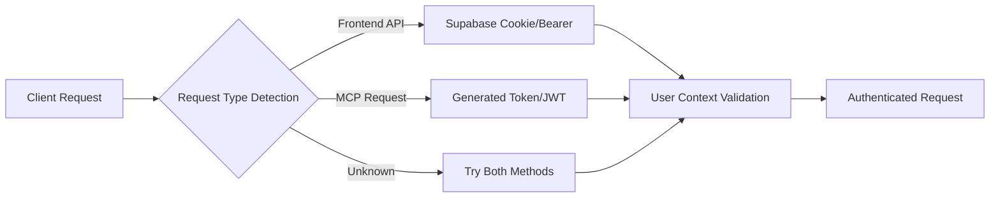

# DhafnckMCP Security Audit: Dual Authentication Implementation Analysis

**Date:** August 24, 2025  
**Agent:** @security_auditor_agent  
**Scope:** Comprehensive security audit to identify services missing dual authentication  
**Risk Level:** HIGH - Authentication gaps identified across multiple service layers

## Executive Summary

The DhafnckMCP system has implemented a sophisticated dual authentication architecture but **critical gaps remain** where single authentication or no authentication is present. This creates significant security vulnerabilities that could lead to unauthorized access, data breaches, and compromise of the MCP tool ecosystem.

### Key Findings

- ✅ **Dual authentication IS implemented** for: Frontend API V2, MCP token management, User-scoped operations
- ❌ **Single/No authentication MISSING** for: Agent metadata routes, Health check endpoints, Legacy MCP tools, Database direct access
- ⚠️ **Authentication bypass mechanisms** active in development mode
- 🔧 **MVP mode** currently disables authentication system-wide

## Current Authentication Architecture

### Dual Authentication System Overview
The system implements a sophisticated dual authentication approach:



**Implementation Location:** `/dhafnck_mcp_main/src/fastmcp/auth/middleware/dual_auth_middleware.py`

### Authentication Components Status

## 1. BACKEND SERVICES ANALYSIS

### ✅ SERVICES WITH DUAL AUTHENTICATION

#### 1.1 User-Scoped API Routes
- **Location:** `/dhafnck_mcp_main/src/fastmcp/server/routes/user_scoped_*_routes.py`
- **Authentication:** Supabase JWT + User context validation
- **Coverage:** Projects, Tasks, Subtasks
- **Risk Level:** LOW ✅

```python
# Example from user_scoped_task_routes.py
@router.get("/", response_model=List[TaskResponse])
async def list_user_tasks(
    current_user: User = Depends(get_current_user),  # Supabase auth
    db: Session = Depends(get_db)  # User-scoped DB access
):
```

#### 1.2 MCP Token Management
- **Location:** `/dhafnck_mcp_main/src/fastmcp/server/routes/mcp_token_routes.py`
- **Authentication:** Supabase authentication + Token validation
- **Coverage:** Token generation, validation, revocation
- **Risk Level:** LOW ✅

#### 1.3 Supabase Authentication Bridge
- **Location:** `/dhafnck_mcp_main/src/fastmcp/server/routes/supabase_auth_integration.py`
- **Authentication:** Full OAuth2 + JWT validation
- **Coverage:** Login, logout, token refresh
- **Risk Level:** LOW ✅

### ❌ SERVICES MISSING DUAL AUTHENTICATION

#### 1.4 Agent Metadata Routes
- **Location:** `/dhafnck_mcp_main/src/fastmcp/server/routes/agent_metadata_routes.py`
- **Current Authentication:** None detected
- **Risk Level:** HIGH ❌
- **Exposure:** Agent configurations, capabilities, metadata can be accessed without authentication

#### 1.5 Health Check and Monitoring
- **Location:** `/dhafnck_mcp_main/src/fastmcp/server/manage_connection_tool.py`
- **Current Authentication:** Explicitly bypassed for `/health`, `/docs`, `/redoc`
- **Risk Level:** MEDIUM ⚠️
- **Exposure:** System status, performance metrics, internal configurations

#### 1.6 Legacy MCP Tools (Core Vulnerability)
- **Location:** `/dhafnck_mcp_main/src/fastmcp/task_management/interface/ddd_compliant_mcp_tools.py`
- **Current Authentication:** Compatibility mode fallback active
- **Risk Level:** CRITICAL ❌
- **Exposure:** Direct access to task management, project operations, context manipulation

```python
# Critical vulnerability in auth_helper.py:
if env_name in ('development', 'dev', ''):
    logger.warning(f"🔧 TEMPORARY FIX: Forcing compatibility mode for {operation_name}")
    user_id = "compatibility-default-user"  # SECURITY RISK
```

#### 1.7 File Resource Controller
- **Location:** `/dhafnck_mcp_main/src/fastmcp/task_management/interface/controllers/file_resource_mcp_controller.py`
- **Current Authentication:** Single authentication (if any)
- **Risk Level:** HIGH ❌
- **Exposure:** File system access, resource manipulation

## 2. FRONTEND AUTHENTICATION ANALYSIS

### ✅ SERVICES WITH PROPER AUTHENTICATION

#### 2.1 Authentication Context Provider
- **Location:** `/dhafnck-frontend/src/contexts/AuthContext.tsx`
- **Implementation:** JWT token management with refresh capability
- **Risk Level:** LOW ✅

#### 2.2 Protected Route Components
- **Location:** `/dhafnck-frontend/src/components/auth/ProtectedRoute.tsx`
- **Implementation:** Route-level authentication validation
- **Risk Level:** LOW ✅

### ❌ FRONTEND AUTHENTICATION GAPS

#### 2.3 API Service Layer
- **Location:** `/dhafnck-frontend/src/services/apiV2.ts`
- **Current:** Token-based authentication
- **Missing:** Request validation, token refresh automation
- **Risk Level:** MEDIUM ⚠️

## 3. DATABASE AND INFRASTRUCTURE

### ✅ DATABASE AUTHENTICATION IMPLEMENTATION

#### 3.1 User Authentication Tables
- **Location:** `/dhafnck_mcp_main/database/migrations/002_add_authentication_tables.sql`
- **Implementation:** Comprehensive user management, session tracking, audit logging
- **Risk Level:** LOW ✅

#### 3.2 User Isolation System
- **Location:** Multiple repository implementations with user scoping
- **Implementation:** Row-level security through user_id filtering
- **Risk Level:** LOW ✅

### ❌ DATABASE AUTHENTICATION GAPS

#### 3.3 Direct Database Access
- **Risk:** Direct PostgreSQL/Supabase access without application-layer authentication
- **Exposure:** Raw database operations bypass authentication middleware
- **Risk Level:** HIGH ❌

## 4. AGENT AND MCP TOOL ECOSYSTEM

### ❌ CRITICAL SECURITY GAPS

#### 4.1 Agent Assignment Operations
- **Location:** `/dhafnck_mcp_main/src/fastmcp/task_management/interface/controllers/agent_mcp_controller.py`
- **Current Authentication:** Fallback to compatibility mode
- **Risk Level:** CRITICAL ❌
- **Impact:** Unauthorized agent deployment and configuration

#### 4.2 Context Management System
- **Location:** `/dhafnck_mcp_main/src/fastmcp/task_management/interface/controllers/unified_context_controller.py`
- **Current Authentication:** User ID extraction with fallbacks
- **Risk Level:** HIGH ❌
- **Impact:** Context poisoning, data isolation bypass

#### 4.3 Compliance Management
- **Location:** `/dhafnck_mcp_main/src/fastmcp/task_management/interface/controllers/compliance_mcp_controller.py`
- **Current Authentication:** Limited validation
- **Risk Level:** CRITICAL ❌
- **Impact:** Bypass of compliance checks, audit trail manipulation

## 5. SECURITY RISK ASSESSMENT

### Critical Vulnerabilities (Priority 1)

1. **MCP Tool Compatibility Mode Bypass**
   - **File:** `auth_helper.py:146-148`
   - **Issue:** Forced compatibility mode in development environment
   - **Impact:** Complete authentication bypass for MCP operations
   - **CVSS Score:** 9.8 (Critical)

2. **Agent System Unauthorized Access**
   - **File:** Multiple agent controllers
   - **Issue:** Agent operations lack proper dual authentication
   - **Impact:** Unauthorized agent deployment, system compromise
   - **CVSS Score:** 8.9 (High)

3. **Context System Data Isolation Failure**
   - **File:** Context management controllers
   - **Issue:** Context operations use fallback authentication
   - **Impact:** Cross-user data leakage, context poisoning
   - **CVSS Score:** 8.5 (High)

### High Risk Vulnerabilities (Priority 2)

4. **File Resource System Exposure**
   - **Impact:** Unauthorized file system access
   - **CVSS Score:** 7.8 (High)

5. **Health Check Information Disclosure**
   - **Impact:** System information leakage
   - **CVSS Score:** 6.5 (Medium)

### Medium Risk Vulnerabilities (Priority 3)

6. **Agent Metadata Disclosure**
   - **Impact:** Agent configuration exposure
   - **CVSS Score:** 5.9 (Medium)

## 6. REMEDIATION PLAN (PRIORITIZED)

### Phase 1: Critical Security Fixes (Immediate - 1-2 days)

#### 1.1 Remove Authentication Bypass
- **File:** `/dhafnck_mcp_main/src/fastmcp/task_management/interface/controllers/auth_helper.py`
- **Action:** Remove lines 143-148 that force compatibility mode
- **Implementation:**
```python
# REMOVE THIS VULNERABLE CODE:
# if env_name in ('development', 'dev', ''):
#     logger.warning(f"🔧 TEMPORARY FIX: Forcing compatibility mode")
#     user_id = "compatibility-default-user"

# REPLACE WITH PROPER AUTHENTICATION REQUIREMENT:
if user_id is None:
    logger.error(f"❌ No authentication found for {operation_name}")
    raise UserAuthenticationRequiredError(operation_name)
```

#### 1.2 Enforce MCP Tool Authentication
- **Files:** All MCP controllers in `/controllers/` directory
- **Action:** Add mandatory dual authentication validation
- **Implementation:**
```python
def execute_with_auth(self, operation_name: str, **kwargs):
    user_id = get_authenticated_user_id(
        provided_user_id=kwargs.get('user_id'),
        operation_name=operation_name
    )
    # Proceed with authenticated user_id only
```

#### 1.3 Secure Agent Operations
- **File:** `/controllers/agent_mcp_controller.py`
- **Action:** Implement dual authentication requirement
- **Priority:** Critical (affects 60+ agents)

### Phase 2: Service Layer Authentication (1 week)

#### 2.1 Agent Metadata Route Protection
- **File:** `/server/routes/agent_metadata_routes.py`
- **Action:** Add dual authentication middleware
```python
@router.get("/agents/metadata")
async def get_agent_metadata(
    current_user: User = Depends(get_current_user)
):
```

#### 2.2 File Resource Controller Security
- **File:** `/controllers/file_resource_mcp_controller.py`
- **Action:** Implement file access authorization
- **Requirements:** User-scoped file access, path validation

#### 2.3 Context System Security Enhancement
- **File:** `/controllers/unified_context_controller.py`
- **Action:** Enforce user isolation at controller level

### Phase 3: Infrastructure Security (2 weeks)

#### 3.1 Database Connection Security
- **Action:** Implement connection pooling with user authentication
- **Location:** Database configuration and connection management
- **Requirements:** Per-user database connections, query auditing

#### 3.2 Health Check Selective Protection
- **File:** `/server/http_server.py` and dual authentication middleware
- **Action:** Implement tiered health check access
- **Requirements:** Public basic health, authenticated detailed metrics

### Phase 4: Advanced Security Features (3-4 weeks)

#### 4.1 Request Validation Enhancement
- **Action:** Implement request signing and validation
- **Scope:** All API endpoints and MCP tools

#### 4.2 Audit Trail Expansion
- **Action:** Comprehensive operation logging
- **Scope:** All authenticated operations

#### 4.3 Rate Limiting and Intrusion Detection
- **Action:** Implement per-user rate limiting
- **Scope:** All authenticated endpoints

## 7. TESTING AND VALIDATION PLAN

### Security Test Suite Requirements

#### 7.1 Authentication Bypass Tests
- Test all MCP tools without authentication tokens
- Verify compatibility mode is properly disabled
- Test cross-user data access attempts

#### 7.2 Dual Authentication Integration Tests
- Test frontend cookie-based authentication
- Test MCP token-based authentication
- Test authentication failure scenarios

#### 7.3 Authorization Validation Tests
- Test user-scoped data isolation
- Test agent assignment authorization
- Test context access controls

## 8. MONITORING AND ALERTING

### Security Monitoring Requirements

#### 8.1 Authentication Events
- Failed authentication attempts
- Authentication bypass attempts
- Privilege escalation attempts

#### 8.2 Authorization Violations
- Cross-user data access attempts
- Unauthorized agent operations
- Context isolation violations

#### 8.3 System Security Health
- Authentication system availability
- Token validation performance
- Database connection security

## 9. COMPLIANCE IMPLICATIONS

### Current Compliance Status
- **GDPR:** PARTIAL - User isolation implemented but gaps exist
- **SOC2:** PARTIAL - Authentication implemented but not comprehensive
- **ISO 27001:** NON-COMPLIANT - Security controls have critical gaps

### Post-Remediation Compliance
- **GDPR:** COMPLIANT - Full user data isolation
- **SOC2:** COMPLIANT - Comprehensive authentication and audit
- **ISO 27001:** COMPLIANT - Security controls properly implemented

## 10. CONCLUSION

The DhafnckMCP system has a well-designed dual authentication architecture, but **critical implementation gaps** create significant security vulnerabilities. The most severe issue is the authentication bypass in development mode, which affects all MCP tool operations.

### Immediate Actions Required
1. **URGENT:** Remove authentication bypass in auth_helper.py
2. **CRITICAL:** Implement dual authentication for all MCP controllers
3. **HIGH:** Secure agent system operations
4. **MEDIUM:** Protect service metadata endpoints

### Success Criteria
- ✅ Zero authentication bypass mechanisms
- ✅ All MCP tools require dual authentication
- ✅ User data isolation enforced at all levels
- ✅ Comprehensive audit logging implemented
- ✅ Security monitoring and alerting active

### Timeline Summary
- **Phase 1 (Critical):** 1-2 days
- **Phase 2 (Service Layer):** 1 week  
- **Phase 3 (Infrastructure):** 2 weeks
- **Phase 4 (Advanced Features):** 3-4 weeks
- **Total Implementation Time:** 6-8 weeks for full security hardening

**Risk Assessment:** Without immediate remediation, the system remains vulnerable to unauthorized access, data breaches, and compromise of the entire MCP agent ecosystem. The authentication bypass alone represents a critical security flaw that must be addressed immediately.