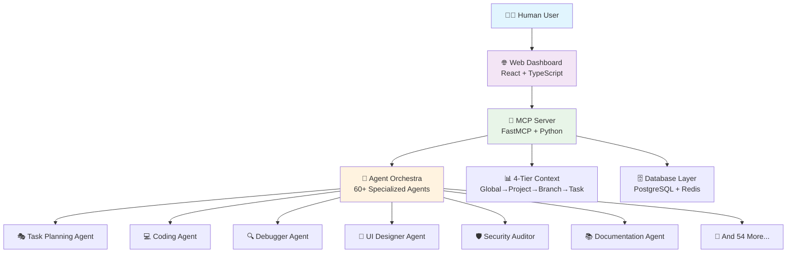

# 🚀 DhafnckMCP - AI-Human Collaboration Platform
Dai Hung PHAM
<div align="center">

[](https://github.com/dhafnck/dhafnck_mcp)
[](https://modelcontextprotocol.io)
[](https://docker.com)
[](https://github.com/dhafnck/dhafnck_mcp)

**The Future of Human-AI Collaboration in Software Development**

*Orchestrate 43 specialized AI agents through an intuitive web interface designed for humans who want to harness the power of AI without complexity. Recently optimized from 69 agents to 43 core agents for better maintainability and clearer specialization.*

[🎯 Quick Start](#-quick-start) • [🌟 Live Demo](#-live-demo) • [🤖 Agent Gallery](#-agent-gallery) • [📚 Documentation](#-documentation) • [💬 Community](#-community)

</div>

---

## ✨ **What Makes DhafnckMCP Special?**

🎭 **Human-First AI Orchestration** — Control 43 specialized AI agents through a beautiful web interface  
🧠 **Intelligent Context Management** — 4-tier hierarchy ensures AI agents never lose context between sessions  
🔗 **MCP Protocol Native** — Built on the Model Context Protocol for seamless AI integration  
🎯 **Visual Task Management** — See your AI agents working in real-time through our React dashboard  
🚀 **Multi-Agent Workflows** — Chain specialized agents for complex development workflows  
🌐 **Web-First Experience** — Designed for humans who prefer web interfaces over command lines  
🧹 **Optimized Agent Library** — Streamlined from 69 to 43 agents for better maintainability and clearer specialization

## 🎯 **Perfect For Teams Who Want To...**

- 🤝 **Collaborate with AI agents** like they're team members
- 📊 **Visualize AI workflows** through an intuitive web dashboard  
- 🔄 **Maintain context** across multiple AI sessions and agents
- 🎭 **Specialize AI agents** for different development roles
- 🌟 **Scale development** without losing quality or oversight
- 📈 **Track progress** of both human and AI contributions

---

## 🌟 **Live Demo - See It In Action**

<table>
<tr>
<td width="50%">

### 📱 **Web Dashboard**
```
http://localhost:3800
```
- 🎯 **Real-time agent activity**
- 📊 **Visual task management** 
- 🔄 **Context flow visualization**
- 👥 **Multi-agent coordination**
- 📈 **Progress tracking**

</td>
<td width="50%">

### 🔧 **MCP Server**
```
http://localhost:8000
```
- 🤖 **43 specialized AI agents**
- 🛠️ **15+ MCP tool categories**
- 📋 **4-tier context hierarchy**
- 🔌 **RESTful API endpoints**
- 🔍 **Health monitoring**

</td>
</tr>
</table>

### 🎬 **Experience Highlights**

🎭 **Agent Theater** — Watch AI agents collaborate on your tasks in real-time  
📊 **Smart Dashboards** — Beautiful visualizations of project progress and agent activity  
🧠 **Context Streams** — See how context flows between agents and sessions  
🎯 **One-Click Orchestration** — Deploy complex multi-agent workflows with simple clicks  
⚡ **Instant Feedback** — Real-time updates as agents complete tasks and make decisions

---

## 🏗️ **Platform Architecture**

<div align="center">



</div>

### 🧩 **Core Components**

- 🔗 **MCP Server**: FastMCP-based server with streamable HTTP transport and RESTful APIs
- 🎯 **Task Management**: Comprehensive DDD-compliant lifecycle management with visual tracking
- 🤖 **Agent Orchestration**: Multi-agent coordination with intelligent role-based switching  
- 📋 **Project Management**: Hierarchical organization with automatic context inheritance
- 🌐 **Web Dashboard**: React-based interface optimized for human-AI collaboration
- 🐳 **Docker Infrastructure**: Multi-mode containerized deployment with one-click setup

## 🤖 **Agent Gallery - Meet Your Optimized AI Team**

> **✨ Recently optimized from 69 to 43 agents** for better maintainability and clearer specialization. [View cleanup analysis →](ai_docs/architecture-design/agent-library-cleanup-recommendations.md)

<table>
<tr>
<td width="33%">

### 🎭 **Creative & Design** (2 agents)
- `@ui_designer_expert_shadcn_agent` - UI/UX with shadcn/ui
- `@design_system_agent` - Design systems & consistency
- `@branding_agent` - Brand strategy
- ~~`@graphic_design_agent`~~ - *Merged into branding*

</td>
<td width="33%">

### 💻 **Development & Engineering** (8 agents)
- `@coding_agent` - Implementation
- `@debugger_agent` - Bug hunting
- `@system_architect_agent` - System design
- `@devops_agent` - Infrastructure
- `@code_reviewer_agent` - Code quality
- `@tech_spec_agent` - Technical specifications
- `@technology_advisor_agent` - Tech stack decisions
- `@prototyping_agent` - Interactive prototypes

</td>
<td width="33%">

### 🔍 **Analysis & Planning** (7 agents)
- `@task_planning_agent` - Project planning  
- `@deep_research_agent` - Investigation
- `@root_cause_analysis_agent` - Problem solving
- `master-orchestrator-agent` - Coordination
- `@project_initiator_agent` - Project setup
- `@elicitation_agent` - Requirements gathering
- `@prd_architect_agent` - Product requirements

</td>
</tr>
<tr>
<td width="33%">

### 🛡️ **Security & Compliance** (2 agents)
- `@security_auditor_agent` - Security review
- `@compliance_scope_agent` - Regulatory compliance
- ~~`@security_penetration_tester_agent`~~ - *Merged into security_auditor*

</td>
<td width="33%">

### 🧪 **Quality & Testing** (2 agents)
- `@test_orchestrator_agent` - Comprehensive QA coordination
- `@performance_load_tester_agent` - Performance testing
- ~~`@lead_testing_agent`~~ - *Merged into test_orchestrator*
- ~~`@functional_tester_agent`~~ - *Merged into test_orchestrator*

</td>
<td width="33%">

### 📈 **Business & Marketing** (2 agents)
- `@marketing_strategy_orchestrator_agent` - Marketing strategy
- `@content_strategy_agent` - Content planning
- ~~`@campaign_manager_agent`~~ - *Merged into marketing_strategy*
- ~~`@market_research_agent`~~ - *Merged into deep_research*

</td>
</tr>
</table>

**🎯 Agent Highlights:**
- **Smart Context Sharing** — Agents inherit knowledge from previous work
- **Role Specialization** — Each agent excels in their specific domain
- **Collaborative Workflows** — Agents work together seamlessly on complex tasks
- **Dynamic Assignment** — System automatically selects the best agent for each task

---

## 🚀 **Quick Start - Get Running in 3 Minutes**

### 🎯 **One-Line Setup**

```bash
# Clone → Setup → Run (that's it!)
git clone <repository-url> && cd agentic-project && ./docker-system/docker-menu.sh
```

### 📋 **Prerequisites** 
🐳 **Docker & Docker Compose** (that's all you need!)  
Optional: Python 3.8+, Node.js 18+, WSL2 (Windows)

### 🎬 **Interactive Docker Menu**

<div align="center">

```
╔════════════════════════════════════════════════════════╗
║             DhafnckMCP Docker Management               ║
║                  Build System v3.0                    ║
╚════════════════════════════════════════════════════════╝

🚀 Quick Start Options
────────────────────────────────────────────────────────
  1) 🐘 PostgreSQL Local (Recommended for beginners)
  2) ☁️  Supabase Cloud (Best for teams)  
  3) ☁️🔴 Supabase + Redis (Enterprise mode)
  P) ⚡ Performance Mode (Low-resource PCs)

🛠️  Management
────────────────────────────────────────────────────────
  4) 📊 Show Status     5) 🛑 Stop Services
  6) 📜 View Logs       7) 🗄️  Database Shell
  8) 🧹 Clean System    9) 🔄 Force Rebuild
```

</div>

### ⚡ **2-Minute Setup Guide**

1️⃣ **Launch the menu**: `./docker-system/docker-menu.sh`  
2️⃣ **Pick your setup**: Choose option `1` for local development  
3️⃣ **Access your dashboard**: Open http://localhost:3800  
4️⃣ **Start collaborating**: Your AI agents are ready to work!

---

## 🎯 **Your First AI Collaboration - A 5-Minute Journey**

### 🎬 **Scenario**: Build a Login System with AI Agents

<table>
<tr>
<td width="60%">

#### 👨‍💻 **What You Do** (Web Dashboard)
1. **Open dashboard** → http://localhost:3800
2. **Create project** → "User Authentication"
3. **Click "New Task"** → "Implement login system"
4. **Assign agents** → Select `@task_planning_agent`
5. **Watch magic happen** → Agents collaborate automatically

</td>
<td width="40%">

#### 🤖 **What AI Agents Do** (Behind the Scenes)
1. `@task_planning_agent` → Breaks down requirements
2. `@system_architect_agent` → Designs architecture  
3. `@coding_agent` → Implements code
4. `@test_orchestrator_agent` → Creates tests
5. `@documentation_agent` → Writes ai_docs

</td>
</tr>
</table>

### 💡 **Power User: MCP Protocol Integration**

Transform any AI tool into a collaborative agent with our MCP protocol:

```python
# 🎭 1. Orchestrate agents through MCP
agent = mcp__dhafnck_mcp_http__call_agent(name_agent="@task_planning_agent")

# 📋 2. Create collaborative workspace  
project = mcp__dhafnck_mcp_http__manage_project(
    action="create",
    name="user-authentication-system",
    description="Complete JWT-based authentication with React frontend"
)

# 🌿 3. Set up development branch
branch = mcp__dhafnck_mcp_http__manage_git_branch(
    action="create",
    project_id=project["project"]["id"],
    git_branch_name="feature/auth-system",
    git_branch_description="Authentication system implementation"
)

# 🎯 4. Define AI-human collaborative task
task = mcp__dhafnck_mcp_http__manage_task(
    action="create",
    git_branch_id=branch["git_branch"]["id"],
    title="Build complete authentication system",
    description="JWT backend + React frontend + tests + ai_docs",
    priority="high"
)

# 🧠 5. Share context across AI sessions (the magic!)
mcp__dhafnck_mcp_http__manage_context(
    action="create",
    level="task",
    context_id=task["task"]["id"],
    git_branch_id=branch["git_branch"]["id"],
    data={
        "requirements": {
            "backend": "Node.js with JWT and bcrypt",
            "frontend": "React with auth context",
            "database": "User profiles and sessions",
            "testing": "Unit + integration tests"
        },
        "human_preferences": {
            "ui_framework": "Material-UI",
            "validation": "Yup schema validation",
            "state_management": "React Context API"
        }
    }
)

# 🎊 Result: Agents now know your preferences and work together!
```

### 🌟 **The Context Magic**

**🧠 Context Inheritance**: Every agent automatically knows what previous agents discovered  
**📈 Progress Tracking**: Watch tasks evolve from idea to completion  
**🔄 Session Continuity**: Stop and resume work - agents remember everything  
**👥 Team Collaboration**: Multiple humans can collaborate with the same agent team

---

## 📚 **Documentation**

| Resource | Description | Link |
|----------|-------------|------|
| 🏗️ **Architecture Guide** | Deep dive into system design | `ai_docs/CORE_ARCHITECTURE/` |
| 🔧 **Development Guide** | Setup and contribution guide | `ai_docs/DEVELOPMENT_GUIDES/` |
| 🛠️ **Operations Manual** | Deployment and maintenance | `ai_docs/OPERATIONS/` |
| 🔍 **Troubleshooting** | Common issues and solutions | `ai_docs/TROUBLESHOOTING/` |
| ✨ **Vision System** | AI enhancement documentation | `ai_docs/vision/` |

---

## 🌈 **Human-AI Collaboration Patterns**

### 🔄 **Collaborative Workflows**

<table>
<tr>
<td width="50%">

#### 🎯 **Feature Development**
```
Human: Define requirements
  ↓
@task_planning_agent: Break down tasks
  ↓  
@system_architect_agent: Design system
  ↓
@coding_agent: Implement code
  ↓
@test_orchestrator_agent: Create tests
  ↓
Human: Review and approve
```

</td>
<td width="50%">

#### 🐛 **Bug Resolution**
```
Human: Report issue
  ↓
@debugger_agent: Investigate problem
  ↓
@root_cause_analysis_agent: Find cause
  ↓
@coding_agent: Implement fix
  ↓
@test_orchestrator_agent: Verify fix
  ↓
Human: Validate solution
```

</td>
</tr>
</table>

### 🧠 **Context Intelligence**

**🌐 Global Context** → Organization-wide patterns and standards  
**📋 Project Context** → Project-specific decisions and architecture  
**🌿 Branch Context** → Feature-specific implementation details  
**🎯 Task Context** → Granular work progress and discoveries

**The Magic**: Every AI agent automatically inherits relevant context, ensuring consistency and eliminating repetitive explanations.

---

## 🛠️ **MCP Tools & Capabilities**

<div align="center">

### **15+ Tool Categories • 50+ Individual Tools • Endless Possibilities**

</div>

<table>
<tr>
<td width="33%">

#### 🎯 **Task & Project Management**
- Task lifecycle orchestration
- Subtask creation & tracking  
- Project hierarchy management
- Git branch coordination
- Dependency management

</td>
<td width="33%">

#### 🤖 **Agent Orchestration** 
- Dynamic agent role switching
- Multi-agent collaboration
- Agent registration & management
- Workflow coordination
- Context sharing between agents

</td>
<td width="33%">

#### 🧠 **Context Intelligence**
- 4-tier context hierarchy
- Automatic inheritance  
- Cross-session persistence
- Real-time synchronization
- Context validation

</td>
</tr>
<tr>
<td width="33%">

#### 🛡️ **Security & Compliance**
- Authentication & authorization
- Compliance tracking
- Security validation
- Connection management
- Audit logging

</td>
<td width="33%">

#### 📊 **Analytics & Monitoring**
- Performance metrics
- Health monitoring  
- Usage analytics
- Progress tracking
- System diagnostics

</td>
<td width="33%">

#### 🔧 **Developer Tools**
- Rule management
- Configuration handling
- Debugging utilities
- Testing frameworks
- Documentation generation

</td>
</tr>
</table>

---

## 🚀 **Performance & Scale**

<table>
<tr>
<td width="50%">

### ⚡ **Current Performance**
- **Response Time**: <200ms average
- **Concurrent Users**: 10-50 users  
- **Agent Coordination**: Real-time
- **Context Sync**: <5ms overhead
- **Database**: PostgreSQL + Redis

</td>
<td width="50%">

### 📈 **Scaling Roadmap**
- **MVP** (Current): 100 RPS
- **Tier 1** (Q2 2025): 1K RPS + Microservices
- **Tier 2** (Q3 2025): 10K RPS + Service Mesh
- **Enterprise** (Q4 2025): 1M+ RPS + Global Edge

</td>
</tr>
</table>

---

## 💬 **Community**

<div align="center">

### **Join the Human-AI Collaboration Revolution**

🌟 **Star us on GitHub** • 🐛 **Report Issues** • 💡 **Suggest Features** • 📚 **Contribute Docs**

[**GitHub Issues**](https://github.com/dhafnck/dhafnck_mcp/issues) • [**Discussions**](https://github.com/dhafnck/dhafnck_mcp/discussions) • [**Contributing Guide**](CONTRIBUTING.md)

</div>

---

## 🎉 **Why DhafnckMCP Will Transform Your Development**

<div align="center">

### **Stop Fighting AI Tools. Start Collaborating With Them.**

</div>

<table>
<tr>
<td width="50%">

#### 😫 **Before DhafnckMCP**
- Switching between multiple AI tools
- Losing context between sessions  
- Repeating the same explanations
- Managing complex prompts manually
- No visibility into AI work progress
- Isolated AI interactions

</td>
<td width="50%">

#### 🚀 **With DhafnckMCP**
- One platform, 60+ specialized agents
- Persistent context across all sessions
- Agents remember your preferences  
- Visual dashboard shows everything
- Track AI work like team members
- Collaborative AI workflows

</td>
</tr>
</table>

### 🎯 **The DhafnckMCP Promise**

> **"What if working with AI felt as natural as working with your best teammate?"**

✅ **Context that Never Dies** — Agents remember everything, forever  
✅ **Visual AI Collaboration** — See your AI team working in real-time  
✅ **Specialized AI Experts** — 60+ agents, each mastering their craft  
✅ **Human-First Design** — Built for people who love web interfaces  
✅ **Enterprise Ready** — Scales from solo dev to global teams

---

<div align="center">

## 🌟 **Ready to Experience the Future?**

### Get started in 3 minutes and transform how you collaborate with AI

```bash
git clone <repository-url> && cd agentic-project && ./docker-system/docker-menu.sh
```

**Then visit:** http://localhost:3800 **and watch the magic happen** ✨

</div>

---

<div align="center">

**DhafnckMCP v0.0.2** • **Production NOT Ready** • **Built with ❤️ for Human-AI Collaboration**

</div>