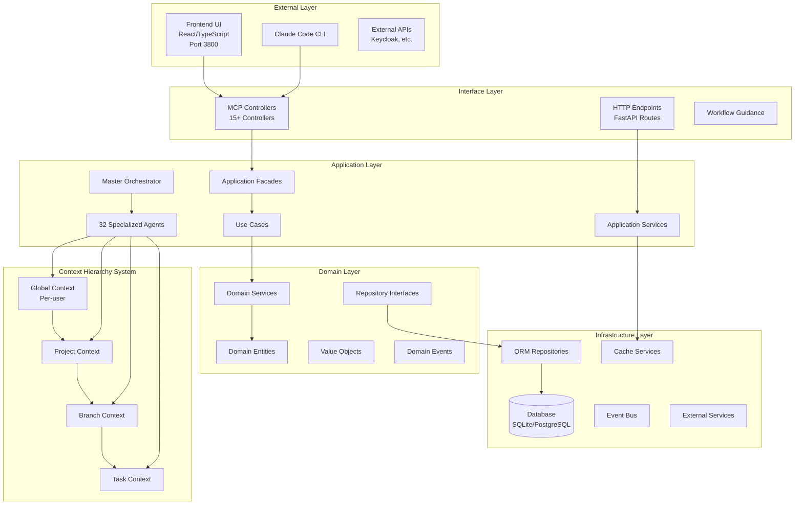
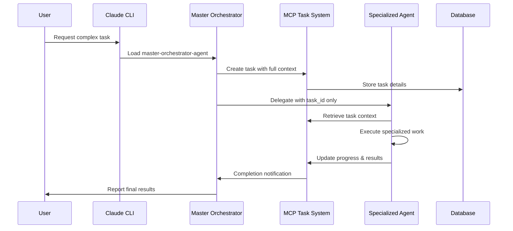
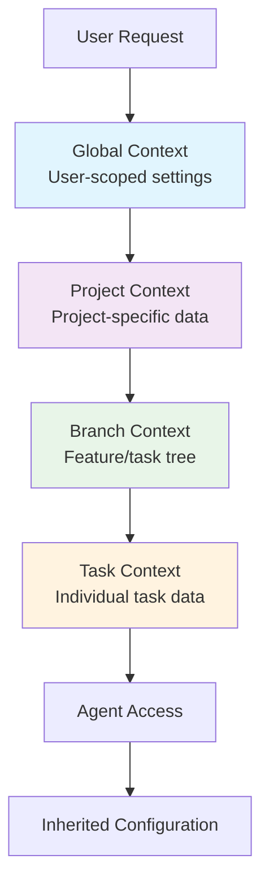
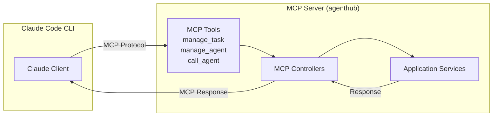

# agenthub System Architecture Overview

**Document Version:** 2.0
**Last Updated:** 2025-10-11
**Status:** Active

## Executive Summary

The agenthub system is a sophisticated multi-agent project management platform built on **pure Domain-Driven Design (DDD) principles** with a 4-tier context hierarchy. The system orchestrates 32 specialized agents through MCP (Model Context Protocol) integration, providing intelligent task management, automated workflows, and comprehensive project coordination capabilities.

**Major Update (v2.0 - 2025-10-11)**: The system has completed a comprehensive 8-phase DDD refactoring initiative, achieving 100% DDD compliance with clean architecture, rich domain models, immutable value objects, domain events, and no legacy code. All feature flags have been removed, resulting in a single, clean, production-ready code path.

## Quick Navigation

- [High-Level Architecture](#high-level-architecture)
- [System Layers](#system-layers)
- [Technology Stack](#technology-stack)
- [Component Interactions](#component-interactions)
- [Data Flow](#data-flow)
- [Deployment Architecture](#deployment-architecture)
- [Related Documentation](#related-documentation)

## High-Level Architecture



## System Layers

### 1. Interface Layer
**Purpose:** Handle external interactions and protocol communications
- **MCP Controllers:** 15+ controllers for specialized operations
- **HTTP Endpoints:** REST API endpoints for web interface
- **Workflow Guidance:** AI-driven workflow recommendations
- **Response Formatting:** Consistent response structures

### 2. Application Layer  
**Purpose:** Orchestrate business use cases and coordinate agents
- **Master Orchestrator:** Central coordination agent
- **Specialized Agents:** 32 agents with domain expertise
- **Application Facades:** Simplified interfaces for complex operations  
- **Application Services:** Cross-cutting concerns and coordination
- **Use Cases:** Business operation implementations

### 3. Domain Layer
**Purpose:** Core business logic and rules (100% DDD Compliant as of 2025-10-11)
- **Rich Domain Entities:** Task, Project, Agent, Context with embedded business logic
- **Immutable Value Objects:** Type-safe identifiers (TaskId, ProjectId, etc.) and domain concepts
- **Domain Services:** Pure business logic without infrastructure dependencies
- **Domain Events:** 30+ business event notifications for loose coupling
- **Repository Interfaces:** Pure abstractions without concrete implementations

### 4. Infrastructure Layer
**Purpose:** Technical implementation details
- **ORM Repositories:** SQLAlchemy-based data persistence
- **Database:** SQLite (dev) / PostgreSQL (prod) with migrations
- **Cache Services:** Performance optimization
- **Event Bus:** Event-driven architecture support
- **External Services:** Third-party integrations

## Technology Stack

### Backend Technologies
```
Language:         Python 3.14.0
Framework:        FastMCP (custom MCP server framework)
ORM:              SQLAlchemy 2.0+
Database:         PostgreSQL 18 (Docker dev / Supabase prod)
Cache:            Redis (optional)
Authentication:   Keycloak + JWT
Event System:     Custom Event Bus (EventQueue, EventBus (with EventQueue and EventWorker), EventWorker)
Testing:          pytest, unittest
Documentation:    Markdown + Mermaid
```

### Frontend Technologies
```
Language:         TypeScript 4.x
Framework:        React 19.x
Styling:          Tailwind CSS
State Management: React Context + Custom Hooks
Build Tool:       Vite 7.x
HTTP Client:      Fetch API
Port:             3800
```

### Infrastructure
```
Containerization: Docker + docker-compose
Database Volume:  /data/agenthub.db
Backend Port:     8000
Environment:      .env configuration
Orchestration:    docker-system/docker-menu.sh
```

### Agent System
```
Total Agents:     32 specialized agents
Categories:       15+ (Development, Testing, Architecture, etc.)
Protocol:         MCP (Model Context Protocol)
Orchestration:    Master Orchestrator Agent
Task Management:  MCP Task/Subtask system
Context:          4-tier hierarchy with inheritance
```

## Component Interactions

### Agent Orchestration Flow


### Context Inheritance Flow


### MCP Protocol Communication


## Data Flow

### Task Management Data Flow
1. **Task Creation:** User → Master Orchestrator → MCP Task System → Database
2. **Task Assignment:** Master Orchestrator → Specialized Agent (via task_id)
3. **Context Retrieval:** Agent → MCP System → Context Hierarchy → Merged Context
4. **Progress Updates:** Agent → MCP System → Database → User Visibility
5. **Task Completion:** Agent → MCP System → Master Orchestrator → User

### Context Data Flow
- **Global Context:** Persistent user preferences and system defaults
- **Project Context:** Inherits from Global + project-specific settings
- **Branch Context:** Inherits from Project + branch/feature-specific data  
- **Task Context:** Inherits from Branch + task-specific details

### Event-Driven Data Flow
1. **Domain Events:** Generated by entity state changes
2. **Event Bus:** Routes events to registered handlers
3. **Event Handlers:** Update related systems (cache, search, etc.)
4. **Integration Events:** Communicate with external systems

## Key Architectural Principles

### Domain-Driven Design (DDD) - 100% Compliant (2025-10-11)
- **Clear layer separation** with defined responsibilities and enforced boundaries
- **Rich domain models** with embedded business logic (no anemic entities)
- **Immutable value objects** for type safety (TaskId, ProjectId, AgentId, etc.)
- **Domain events** for loose coupling (30+ event types)
- **Clean repositories** with no business logic
- **Thin application layer** that coordinates but doesn't decide
- **Interface layer** with no business logic (HTTP/MCP concerns only)
- **Ubiquitous language** consistent across code and documentation
- **Bounded contexts** for different business domains

**DDD Refactoring Achievement**: Completed 8-phase initiative (2025-10-09 to 2025-10-11) transforming the entire codebase to pure DDD compliance. All feature flags removed, no legacy code remaining.

### 4-Tier Context Hierarchy
- **Inheritance-based** configuration and data flow
- **UUID-based identification** for all entities
- **Auto-creation** of contexts when needed
- **Multi-tenant isolation** at the user level

### Agent-Centric Architecture  
- **Master Orchestrator** coordinates all complex workflows
- **Specialized Agents** with domain expertise (32 agents)
- **Token-efficient delegation** using task IDs instead of full context
- **Transparent progress tracking** through MCP task system

### Event-Driven Architecture
- **Domain events** for business state changes
- **Event sourcing** for audit trails and debugging
- **Asynchronous processing** for non-blocking operations
- **Integration events** for external system communication

## Performance Characteristics

### Scalability Patterns
- **Repository caching** for frequently accessed data
- **Context inheritance caching** for performance optimization
- **Agent connection pooling** for efficient resource usage
- **Database connection management** with SQLAlchemy

### Token Economy (AI Efficiency)
- **Token savings** through task_id-based delegation
- **Context reuse** via inheritance hierarchy
- **Compressed responses** from MCP tools
- **Efficient agent handoffs** without context duplication

## Security Architecture

### Authentication & Authorization
- **Keycloak** as the single source of truth for user identity
- **JWT tokens** with automatic refresh
- **Multi-tenant isolation** with user-scoped data
- **Role-based access control** for different agent capabilities

### Data Protection
- **Environment variable security** for all secrets
- **Database encryption** for sensitive data
- **API rate limiting** to prevent abuse
- **Audit trails** for all operations

## Deployment Architecture

### Development Environment
```
Docker Containers:
├── agenthub-backend (Python/FastMCP)
├── agenthub-frontend (React/TypeScript) 
├── postgresql (Database)
├── keycloak (Authentication)
└── redis (Optional caching)

Ports:
- Backend: 8000
- Frontend: 3800
- Database: 5432
- Keycloak: 8080
```

### Production Considerations
- **Container orchestration** with Docker Compose
- **Database migration** management with SQLAlchemy
- **Environment-specific** configuration via .env files
- **Health checks** and monitoring for all services

## Quality Attributes

### Maintainability
- **Clean Architecture** with clear separation of concerns
- **SOLID principles** applied throughout the codebase
- **Design patterns** consistently implemented
- **Comprehensive documentation** for all components

### Testability
- **Dependency injection** for easy mocking
- **Repository pattern** for data access abstraction  
- **Event-driven architecture** for integration testing
- **Factory patterns** for test data creation

### Extensibility
- **Plugin architecture** for new agents
- **Factory pattern** for dynamic object creation
- **Strategy pattern** for varying algorithms
- **Observer pattern** for event handling

## System Boundaries

### Internal Boundaries
- **Layer boundaries** enforced through dependency direction
- **Context boundaries** defined by business domains
- **Agent boundaries** with specialized responsibilities
- **Data boundaries** with repository abstractions

### External Boundaries
- **MCP protocol** for Claude Code integration
- **HTTP/REST** for web client communication  
- **Database protocol** for data persistence
- **Authentication protocol** with Keycloak

## DDD Architecture Deep Dive (2025-10-11 Update)

### Layer Responsibilities - Clean Separation

#### Domain Layer (Core Business Logic)
**What It Contains:**
- Rich entities with business methods
- Immutable value objects with validation
- Domain services for multi-entity logic
- Domain events for state changes
- Repository interfaces (pure abstractions)

**What It Does NOT Contain:**
- ❌ No infrastructure dependencies
- ❌ No persistence logic
- ❌ No HTTP/API concerns
- ❌ No external service calls

**Examples:**
- `Task.validate_assignment()` - Business rule enforcement
- `TaskId(uuid)` - Type-safe value object
- `TaskCreatedEvent` - Domain event
- `ITaskRepository` - Pure interface

#### Application Layer (Coordination)
**What It Contains:**
- Thin facades that coordinate
- Event handlers for workflows
- Authorization services
- Parameter transformation services
- Use case orchestration

**What It Does NOT Contain:**
- ❌ No business decisions
- ❌ No domain validation
- ❌ No data transformation logic

**Examples:**
- `TaskApplicationFacade.create_task()` - Coordinates repository + events
- `TaskEventHandlers.handle_task_created()` - Workflow trigger
- `TaskAuthorizationService.check_permission()` - Cross-cutting concern

#### Infrastructure Layer (Technical Details)
**What It Contains:**
- ORM repository implementations
- Database adapters
- External service clients
- Event bus implementation
- Cache services

**What It Does NOT Contain:**
- ❌ No business logic
- ❌ No validation rules

**Examples:**
- `ORMTaskRepository._entity_to_model_dict()` - ORM mapping
- `EventBus (with EventQueue and EventWorker).publish()` - Event delivery
- `SQLAlchemySessionAdapter` - Database session management

#### Interface Layer (External Communication)
**What It Contains:**
- MCP controllers (protocol handling)
- HTTP endpoints (REST API)
- Response factories (error formatting)
- Request validation (format only)

**What It Does NOT Contain:**
- ❌ No business logic
- ❌ No business validation
- ❌ No decision making

**Examples:**
- `TaskMCPController.create_task()` - Parse MCP request → call facade
- `ResponseFactory.error()` - Format error for MCP response

### Architecture Benefits Achieved

**Maintainability**:
- Clear boundaries make code easy to understand
- Single Responsibility Principle applied throughout
- Easy to locate and modify business logic

**Testability**:
- Domain logic testable without database
- Application layer testable with mock repositories
- Infrastructure testable with integration tests

**Flexibility**:
- Can swap databases without changing domain
- Can add new UI/API without changing business logic
- Can change workflows without breaking domain rules

**Type Safety**:
- Value objects prevent primitive obsession
- Can't accidentally pass TaskId where ProjectId expected
- Compiler catches type mismatches

**Loose Coupling**:
- Domain events decouple aggregates
- Repository interfaces decouple domain from infrastructure
- Application layer decouples interface from domain

## Related Documentation

### DDD Refactoring Documentation
- **[DDD Refactoring Roadmap](../development-guides/ddd-refactoring-task-roadmap.md)** - Complete 8-phase journey
- **[DDD Compliance Review](../reports-status/ddd-compliance-review-2025-10-09.md)** - Initial assessment
- **[Phase 6 Audit Report](../reports-status/phase-6-task-application-service-audit.md)** - Application service audit

### Architecture Details
- [Domain-Driven Design Layers](./domain-driven-design-layers.md)
- [Context Hierarchy System](./context-hierarchy-system.md)
- [Agent Orchestration Architecture](./agent-orchestration-architecture.md)
- [Design Patterns in Architecture](./design-patterns-in-architecture.md)

### Analysis Reports
- [Design Patterns Analysis](../reports-status/design-patterns-analysis.md)
- [DDD Architecture Audit](../code-quality/ddd-architecture-audit-2025-10-08.md)
- [Factory Check Status](../reports-status/factory-check-status.md)

### Implementation Guides
- [MCP Task Creation Guide](../development-guides/mcp-task-creation-guide.md)
- [AI Task Planning Prompt](../development-guides/ai-task-planning-prompt.md)
- [Setup Guides](../setup-guides/)

## Architectural Decision Records (ADRs)

### Major Decisions
1. **Domain-Driven Design:** Chosen for clear business logic separation
2. **4-Tier Context Hierarchy:** Enables configuration inheritance and isolation
3. **Agent-Centric Architecture:** Provides specialized expertise and scalability
4. **MCP Protocol Integration:** Enables seamless Claude Code integration
5. **Event-Driven Architecture:** Supports loose coupling and extensibility

### Trade-offs Made
- **Complexity vs. Maintainability:** DDD adds complexity but improves long-term maintainability
- **Performance vs. Flexibility:** Context hierarchy adds overhead but enables powerful inheritance
- **Token Usage vs. Transparency:** Task-based delegation saves tokens while maintaining visibility

## Future Evolution

### Planned Enhancements
- **Advanced caching strategies** for improved performance
- **Machine learning integration** for intelligent task assignment
- **Real-time collaboration** features for multi-user workflows
- **Advanced analytics** and reporting capabilities

### Extensibility Points
- **New agent types** can be added through the agent registration system
- **Custom contexts** can be added to the hierarchy system
- **New event types** can be integrated into the event bus
- **External integrations** can be added through adapter patterns

---

## Version History

### v2.0 (2025-10-11) - DDD Refactoring Complete
- Updated entire document to reflect 100% DDD compliance
- Added DDD Architecture Deep Dive section
- Updated layer descriptions with clean architecture details
- Added links to DDD refactoring documentation
- Removed all references to feature flags (clean code path only)

### v1.0 (2025-09-12) - Initial Version
- Initial architecture documentation
- DDD principles documented
- 4-tier context hierarchy explained

---

**Last Updated:** 2025-10-11
**Document Version:** 2.0
**Document Owner:** agenthub Architecture Team
**Review Schedule:** Monthly
**Status:** Living Document - Reflects completed DDD refactoring initiative
