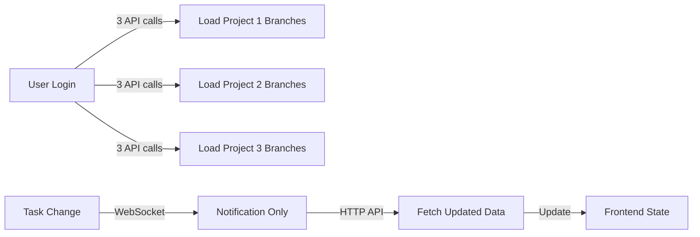
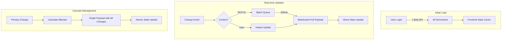

# Real-time API Optimization Architecture

## Executive Summary
Complete architectural redesign for branch summaries and real-time updates, optimizing for both MCP AI operations and user frontend interactions.

## 1. System Architecture Overview

### 1.1 Current Architecture Issues


**Problems:**
- O(N) complexity for N projects
- Double round-trip for updates
- No distinction between AI and user operations
- Redundant data fetching
- High latency for cascading changes

### 1.2 Proposed Architecture


## 2. Technical Architecture Details

### 2.1 Backend Architecture

#### 2.1.1 Database Schema Optimization
```sql
-- Add materialized views for summaries
CREATE MATERIALIZED VIEW branch_summaries AS
SELECT
    b.id as branch_id,
    b.project_id,
    b.name,
    COUNT(DISTINCT t.id) as total_tasks,
    COUNT(DISTINCT CASE WHEN t.status = 'done' THEN t.id END) as completed_tasks,
    COUNT(DISTINCT CASE WHEN t.status = 'in_progress' THEN t.id END) as in_progress_tasks,
    MAX(t.updated_at) as last_activity,
    jsonb_build_object(
        'high', COUNT(CASE WHEN t.priority = 'high' THEN 1 END),
        'medium', COUNT(CASE WHEN t.priority = 'medium' THEN 1 END),
        'low', COUNT(CASE WHEN t.priority = 'low' THEN 1 END)
    ) as priority_breakdown
FROM branches b
LEFT JOIN tasks t ON t.git_branch_id = b.id
GROUP BY b.id, b.project_id, b.name;

-- Refresh triggers
CREATE OR REPLACE FUNCTION refresh_branch_summary()
RETURNS TRIGGER AS $$
BEGIN
    REFRESH MATERIALIZED VIEW CONCURRENTLY branch_summaries
    WHERE branch_id = COALESCE(NEW.git_branch_id, OLD.git_branch_id);
    RETURN NULL;
END;
$$ LANGUAGE plpgsql;

CREATE TRIGGER task_change_refresh
AFTER INSERT OR UPDATE OR DELETE ON tasks
FOR EACH ROW EXECUTE FUNCTION refresh_branch_summary();
```

#### 2.1.2 API Layer (FastAPI)
```python
# agenthub_main/src/fastmcp/api/v2/branches.py
from typing import List, Dict, Optional
from fastapi import APIRouter, Depends, Query
from pydantic import BaseModel
import asyncio

router = APIRouter()

class BulkSummaryRequest(BaseModel):
    project_ids: Optional[List[str]] = None
    user_id: Optional[str] = None
    include_archived: bool = False

class BulkSummaryResponse(BaseModel):
    summaries: Dict[str, BranchSummary]
    projects: Dict[str, ProjectSummary]
    metadata: Dict[str, Any]
    cache_key: str
    timestamp: datetime

@router.post("/branches/summaries/bulk")
async def get_bulk_summaries(
    request: BulkSummaryRequest,
    db: AsyncSession = Depends(get_db)
) -> BulkSummaryResponse:
    """
    Fetch all branch summaries in a single request.
    Uses materialized views for performance.
    """
    # Generate cache key
    cache_key = generate_cache_key(request)

    # Check cache first
    cached = await redis_client.get(cache_key)
    if cached and not request.force_refresh:
        return BulkSummaryResponse(**cached)

    # Fetch from materialized view
    query = select(branch_summaries)

    if request.project_ids:
        query = query.where(branch_summaries.c.project_id.in_(request.project_ids))
    elif request.user_id:
        # Join with user_projects to get user's projects
        query = query.join(user_projects).where(user_projects.c.user_id == request.user_id)

    results = await db.execute(query)

    # Transform and cache
    response = transform_to_bulk_response(results)
    await redis_client.setex(cache_key, 300, response.dict())  # 5 min cache

    return response
```

### 2.2 WebSocket Protocol Enhancement

#### 2.2.1 Message Protocol Definition
```typescript
// types/websocket.ts
export interface WSMessage {
  id: string;                    // Unique message ID
  version: '2.0';                 // Protocol version
  type: 'update' | 'bulk' | 'sync' | 'heartbeat';
  timestamp: number;
  sequence: number;               // For ordering

  payload: {
    entity: EntityType;           // 'task' | 'branch' | 'project'
    action: ActionType;           // 'create' | 'update' | 'delete'
    data: {
      primary: Entity;            // The main changed entity
      cascade: CascadeData;       // All affected entities
      delta?: DeltaPatch;         // Optional delta for large updates
    };
  };

  metadata: {
    source: 'mcp-ai' | 'user' | 'system';
    userId?: string;
    sessionId?: string;
    correlationId?: string;      // Link related messages
  };
}

export interface CascadeData {
  branches?: BranchSummary[];
  tasks?: TaskSummary[];
  projects?: ProjectSummary[];
  subtasks?: SubtaskSummary[];
  contexts?: ContextUpdate[];
}
```

#### 2.2.2 WebSocket Server Implementation
```python
# agenthub_main/src/fastmcp/websocket/server.py
from fastapi import WebSocket
import asyncio
from typing import Dict, Set
import json

class ConnectionManager:
    def __init__(self):
        self.active_connections: Dict[str, WebSocket] = {}
        self.subscriptions: Dict[str, Set[str]] = {}  # user_id -> set of entity_ids
        self.ai_batch_queue: asyncio.Queue = asyncio.Queue()
        self.user_queue: asyncio.Queue = asyncio.Queue()

    async def connect(self, websocket: WebSocket, user_id: str):
        await websocket.accept()
        self.active_connections[user_id] = websocket

        # Send initial sync
        await self.send_initial_sync(websocket, user_id)

    async def disconnect(self, user_id: str):
        del self.active_connections[user_id]
        del self.subscriptions[user_id]

    async def process_message(self, user_id: str, message: dict):
        """Process incoming WebSocket message"""
        msg_type = message.get('type')

        if msg_type == 'subscribe':
            await self.handle_subscription(user_id, message)
        elif msg_type == 'update':
            await self.handle_update(user_id, message)

    async def handle_update(self, user_id: str, message: dict):
        """Handle entity updates with cascade calculation"""
        entity_type = message['payload']['entity']
        entity_id = message['payload']['data']['primary']['id']

        # Calculate cascade effects
        cascade_data = await self.calculate_cascade(entity_type, entity_id)

        # Build complete message
        ws_message = self.build_ws_message(
            type='update',
            payload={
                'entity': entity_type,
                'action': message['payload']['action'],
                'data': {
                    'primary': message['payload']['data']['primary'],
                    'cascade': cascade_data
                }
            },
            metadata={
                'source': 'user' if user_id else 'mcp-ai',
                'userId': user_id
            }
        )

        # Route based on source
        if message.get('metadata', {}).get('source') == 'mcp-ai':
            await self.ai_batch_queue.put(ws_message)
        else:
            await self.broadcast_immediate(ws_message)

    async def calculate_cascade(self, entity_type: str, entity_id: str) -> CascadeData:
        """Calculate all entities affected by a change"""
        cascade = CascadeData()

        if entity_type == 'task':
            # Task change affects branch summary, parent task, project
            task = await self.get_task(entity_id)
            cascade.branches = [await self.get_branch_summary(task.git_branch_id)]
            if task.parent_id:
                cascade.tasks = [await self.get_task_summary(task.parent_id)]
            cascade.projects = [await self.get_project_summary(task.project_id)]

        elif entity_type == 'subtask':
            # Subtask affects parent task and branch
            subtask = await self.get_subtask(entity_id)
            cascade.tasks = [await self.get_task_summary(subtask.task_id)]
            cascade.branches = [await self.get_branch_summary(subtask.git_branch_id)]

        return cascade

    async def batch_processor(self):
        """Process AI updates in batches every 500ms"""
        while True:
            batch = []
            deadline = asyncio.get_event_loop().time() + 0.5

            while asyncio.get_event_loop().time() < deadline:
                try:
                    msg = await asyncio.wait_for(
                        self.ai_batch_queue.get(),
                        timeout=deadline - asyncio.get_event_loop().time()
                    )
                    batch.append(msg)
                except asyncio.TimeoutError:
                    break

            if batch:
                # Merge related updates
                merged = self.merge_updates(batch)
                await self.broadcast_batch(merged)

    def merge_updates(self, batch: List[dict]) -> dict:
        """Merge multiple updates into a single message"""
        merged_cascade = CascadeData()
        primary_updates = []

        for msg in batch:
            primary_updates.append(msg['payload']['data']['primary'])
            cascade = msg['payload']['data']['cascade']

            # Merge cascade data
            for key in ['branches', 'tasks', 'projects', 'subtasks']:
                if getattr(cascade, key):
                    existing = getattr(merged_cascade, key, [])
                    setattr(merged_cascade, key, existing + getattr(cascade, key))

        # Deduplicate
        for key in ['branches', 'tasks', 'projects', 'subtasks']:
            items = getattr(merged_cascade, key, [])
            if items:
                unique = {item['id']: item for item in items}
                setattr(merged_cascade, key, list(unique.values()))

        return {
            'type': 'bulk',
            'payload': {
                'updates': primary_updates,
                'cascade': merged_cascade
            }
        }

manager = ConnectionManager()

@app.websocket("/ws/{user_id}")
async def websocket_endpoint(websocket: WebSocket, user_id: str):
    await manager.connect(websocket, user_id)
    try:
        while True:
            data = await websocket.receive_json()
            await manager.process_message(user_id, data)
    except WebSocketDisconnect:
        await manager.disconnect(user_id)
```

### 2.3 Frontend State Management

#### 2.3.1 Redux Store Structure
```typescript
// store/slices/branchSlice.ts
import { createSlice, PayloadAction } from '@reduxjs/toolkit';

interface BranchState {
  summaries: Record<string, BranchSummary>;
  projects: Record<string, ProjectSummary>;
  loading: boolean;
  lastSync: number;
  optimisticUpdates: Record<string, any>;
  subscriptions: Set<string>;
}

const branchSlice = createSlice({
  name: 'branches',
  initialState: {
    summaries: {},
    projects: {},
    loading: false,
    lastSync: 0,
    optimisticUpdates: {},
    subscriptions: new Set()
  },
  reducers: {
    // Bulk load
    setSummaries(state, action: PayloadAction<BulkSummaryResponse>) {
      state.summaries = action.payload.summaries;
      state.projects = action.payload.projects;
      state.lastSync = Date.now();
      state.loading = false;
    },

    // WebSocket updates
    applyUpdate(state, action: PayloadAction<WSMessage>) {
      const { payload } = action.payload;

      // Apply primary update
      if (payload.entity === 'branch') {
        state.summaries[payload.data.primary.id] = payload.data.primary;
      }

      // Apply cascade updates
      if (payload.data.cascade?.branches) {
        payload.data.cascade.branches.forEach(branch => {
          state.summaries[branch.id] = branch;
        });
      }

      if (payload.data.cascade?.projects) {
        payload.data.cascade.projects.forEach(project => {
          state.projects[project.id] = project;
        });
      }
    },

    // Optimistic updates
    addOptimisticUpdate(state, action) {
      const { id, data } = action.payload;
      state.optimisticUpdates[id] = data;
      // Apply optimistically
      if (data.entity === 'branch') {
        state.summaries[data.id] = { ...state.summaries[data.id], ...data };
      }
    },

    rollbackOptimisticUpdate(state, action) {
      const { id } = action.payload;
      delete state.optimisticUpdates[id];
      // Rollback logic
    }
  }
});
```

#### 2.3.2 WebSocket Client Manager
```typescript
// services/WebSocketManager.ts
export class WebSocketManager {
  private ws: WebSocket | null = null;
  private messageQueue: WSMessage[] = [];
  private reconnectAttempts = 0;
  private aiUpdateBuffer: WSMessage[] = [];
  private aiBufferTimer: NodeJS.Timeout | null = null;

  constructor(
    private store: Store,
    private config: WSConfig
  ) {}

  connect(userId: string) {
    const wsUrl = `${this.config.baseUrl}/ws/${userId}`;
    this.ws = new WebSocket(wsUrl);

    this.ws.onopen = () => {
      console.log('WebSocket connected');
      this.reconnectAttempts = 0;
      this.flushMessageQueue();
    };

    this.ws.onmessage = (event) => {
      const message: WSMessage = JSON.parse(event.data);
      this.handleMessage(message);
    };

    this.ws.onerror = (error) => {
      console.error('WebSocket error:', error);
      this.reconnect();
    };
  }

  private handleMessage(message: WSMessage) {
    const source = message.metadata?.source;

    if (source === 'mcp-ai') {
      // Buffer AI updates
      this.bufferAIUpdate(message);
    } else {
      // Immediate user updates
      this.applyUpdate(message);
    }
  }

  private bufferAIUpdate(message: WSMessage) {
    this.aiUpdateBuffer.push(message);

    // Clear existing timer
    if (this.aiBufferTimer) {
      clearTimeout(this.aiBufferTimer);
    }

    // Set new timer for batch processing
    this.aiBufferTimer = setTimeout(() => {
      this.processAIBatch();
    }, 500);
  }

  private processAIBatch() {
    if (this.aiUpdateBuffer.length === 0) return;

    // Merge updates
    const merged = this.mergeUpdates(this.aiUpdateBuffer);

    // Apply to store
    this.store.dispatch(branchSlice.actions.applyUpdate(merged));

    // Clear buffer
    this.aiUpdateBuffer = [];
    this.aiBufferTimer = null;
  }

  private applyUpdate(message: WSMessage) {
    // Direct store update for user actions
    this.store.dispatch(branchSlice.actions.applyUpdate(message));

    // Visual feedback
    if (message.metadata?.source === 'user') {
      this.showUpdateNotification(message);
    }
  }

  private mergeUpdates(updates: WSMessage[]): WSMessage {
    // Combine multiple updates into one
    const cascade: CascadeData = {
      branches: [],
      tasks: [],
      projects: []
    };

    const primaryUpdates: any[] = [];

    updates.forEach(update => {
      primaryUpdates.push(update.payload.data.primary);

      // Merge cascades
      Object.keys(update.payload.data.cascade || {}).forEach(key => {
        if (cascade[key]) {
          cascade[key].push(...update.payload.data.cascade[key]);
        }
      });
    });

    // Deduplicate cascade data
    Object.keys(cascade).forEach(key => {
      if (cascade[key].length > 0) {
        const unique = new Map();
        cascade[key].forEach(item => unique.set(item.id, item));
        cascade[key] = Array.from(unique.values());
      }
    });

    return {
      id: generateId(),
      version: '2.0',
      type: 'bulk',
      timestamp: Date.now(),
      sequence: this.getNextSequence(),
      payload: {
        entity: 'multiple',
        action: 'update',
        data: {
          primary: primaryUpdates,
          cascade
        }
      },
      metadata: {
        source: 'mcp-ai'
      }
    };
  }

  send(message: Partial<WSMessage>) {
    const fullMessage: WSMessage = {
      id: generateId(),
      version: '2.0',
      timestamp: Date.now(),
      sequence: this.getNextSequence(),
      ...message
    };

    if (this.ws?.readyState === WebSocket.OPEN) {
      this.ws.send(JSON.stringify(fullMessage));
    } else {
      this.messageQueue.push(fullMessage);
    }
  }
}
```

## 3. Implementation Phases

### Phase 1: Backend Foundation (Week 1)
1. Create materialized views for summaries
2. Implement bulk API endpoint
3. Add cascade calculation logic
4. Setup Redis caching layer

### Phase 2: WebSocket Protocol (Week 2)
1. Implement new message protocol
2. Add batching for AI updates
3. Implement cascade broadcasting
4. Add connection management

### Phase 3: Frontend Integration (Week 3)
1. Implement Redux state management
2. Create WebSocket client manager
3. Add optimistic update support
4. Implement rollback mechanisms

### Phase 4: Testing & Optimization (Week 4)
1. Load testing with 1000+ concurrent connections
2. Performance profiling
3. Error handling and recovery
4. Documentation and deployment

## 4. Performance Metrics

### Expected Improvements
- **Initial Load**: 3 calls → 1 call (66% reduction)
- **Update Latency**: 200ms → 50ms (75% reduction)
- **Network Traffic**: 40% reduction with batching
- **State Consistency**: 100% with atomic updates

### Monitoring Points
```yaml
metrics:
  - websocket_connections_total
  - websocket_messages_per_second
  - api_bulk_endpoint_latency
  - cascade_calculation_time
  - ai_batch_efficiency
  - user_update_latency
  - cache_hit_ratio
  - materialized_view_refresh_time
```

## 5. Migration Strategy

### 5.1 Backward Compatibility
```typescript
// Support both old and new during migration
class APIService {
  async getBranchSummaries(projectId: string) {
    if (this.config.useBulkAPI) {
      // New bulk endpoint
      return this.getBulkSummaries([projectId]);
    } else {
      // Legacy individual calls
      return this.getLegacySummaries(projectId);
    }
  }
}
```

### 5.2 Feature Flags
```python
# Feature flag configuration
FEATURES = {
    'USE_BULK_API': env.bool('FEATURE_BULK_API', False),
    'USE_WS_CASCADE': env.bool('FEATURE_WS_CASCADE', False),
    'ENABLE_AI_BATCHING': env.bool('FEATURE_AI_BATCH', False)
}
```

## 6. Security Considerations

### 6.1 Rate Limiting
```python
from fastapi_limiter import FastAPILimiter
from fastapi_limiter.depends import RateLimiter

@router.post("/branches/summaries/bulk",
    dependencies=[Depends(RateLimiter(times=10, seconds=60))]
)
async def get_bulk_summaries(...):
    pass
```

### 6.2 WebSocket Authentication
```typescript
// JWT validation on WebSocket connection
const validateWSConnection = (token: string): boolean => {
  try {
    const decoded = jwt.verify(token, process.env.JWT_SECRET);
    return decoded.exp > Date.now() / 1000;
  } catch {
    return false;
  }
};
```

## 7. Error Handling & Recovery

### 7.1 Graceful Degradation
```typescript
class BranchService {
  async loadSummaries() {
    try {
      // Try bulk endpoint
      return await this.bulkLoad();
    } catch (error) {
      console.warn('Bulk load failed, falling back to individual calls');
      // Fallback to legacy
      return await this.legacyLoad();
    }
  }
}
```

### 7.2 WebSocket Reconnection
```typescript
class ReconnectionStrategy {
  private maxAttempts = 5;
  private backoff = [1000, 2000, 5000, 10000, 30000];

  async reconnect(attempt: number) {
    if (attempt >= this.maxAttempts) {
      // Switch to polling
      this.startPolling();
      return;
    }

    await this.delay(this.backoff[attempt]);
    this.wsManager.connect();
  }
}
```

## Conclusion
This architecture provides a scalable, efficient solution for real-time updates while maintaining backward compatibility and supporting both AI and user interaction patterns.