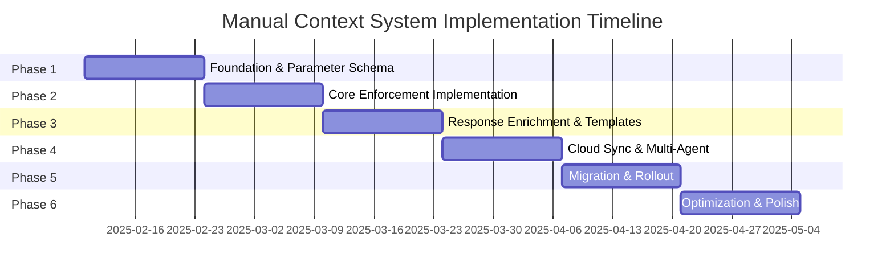

# Manual Context System Implementation Phases
**Version**: 1.0  
**Date**: February 3, 2025  
**Duration**: 12 weeks (3 months)  
**Status**: Implementation Roadmap

## Executive Summary

This document outlines a phased approach to implementing the Manual Context System, transitioning from the current state to a fully parameter-driven context management system with enforcement mechanisms and cloud synchronization.

## Timeline Overview



## Phase 1: Foundation & Parameter Schema (Weeks 1-2)

### 1.1 Objectives
- Define comprehensive parameter schemas
- Implement parameter validation framework
- Create backward compatibility layer
- Set up development environment

### 1.2 Deliverables

#### Parameter Schema Definition
```python
# File: src/context/schemas/parameter_schemas.py
from pydantic import BaseModel, Field
from typing import Optional, List, Dict, Any

class ContextUpdateParams(BaseModel):
    """Parameters for context updates"""
    work_notes: Optional[str] = Field(None, description="Description of work performed")
    progress_made: Optional[str] = Field(None, description="Specific progress achieved")
    files_modified: Optional[List[str]] = Field(default_factory=list)
    decisions_made: Optional[List[str]] = Field(default_factory=list)
    blockers: Optional[List[str]] = Field(default_factory=list)
    discoveries: Optional[Dict[str, Any]] = Field(default_factory=dict)

class TaskCompletionParams(BaseModel):
    """Required parameters for task completion"""
    completion_summary: str = Field(..., min_length=10, description="Detailed summary of completed work")
    testing_notes: Optional[str] = Field(None, description="Testing performed and results")
    files_created: Optional[List[str]] = Field(default_factory=list)
    patterns_identified: Optional[Dict[str, Any]] = Field(default_factory=dict)
```

#### Parameter Validator
```python
# File: src/context/validators/parameter_validator.py
class ParameterValidator:
    def __init__(self):
        self.schemas = {
            "update": ContextUpdateParams,
            "complete": TaskCompletionParams,
            # ... other schemas
        }
    
    def validate(self, action: str, params: Dict) -> ValidationResult:
        schema = self.schemas.get(action)
        if not schema:
            return ValidationResult(success=True)  # No schema = no validation
        
        try:
            validated = schema(**params)
            return ValidationResult(success=True, data=validated.dict())
        except ValidationError as e:
            return ValidationResult(
                success=False,
                errors=e.errors(),
                hint=self._generate_hint(action, e)
            )
```

### 1.3 Technical Tasks

1. **Schema Development** (3 days)
   - Create Pydantic models for all parameter types
   - Define validation rules and constraints
   - Document each parameter's purpose

2. **Validation Framework** (3 days)
   - Implement ParameterValidator class
   - Create validation middleware
   - Add comprehensive error messages

3. **Backward Compatibility** (2 days)
   - Create adapter for existing code
   - Ensure zero breaking changes
   - Add deprecation warnings

4. **Testing Infrastructure** (2 days)
   - Unit tests for all schemas
   - Integration tests for validators
   - Performance benchmarks

### 1.4 Success Criteria
- [ ] All parameter schemas defined and documented
- [ ] Validation framework passes 100% of tests
- [ ] Existing code continues to work unchanged
- [ ] Performance impact < 5ms per validation

## Phase 2: Core Enforcement Implementation (Weeks 3-4)

### 2.1 Objectives
- Implement parameter enforcement for MCP tools
- Create enforcement policies and rules
- Build progressive enforcement system
- Integrate with existing task management

### 2.2 Deliverables

#### Parameter Enforcer
```python
# File: src/context/enforcement/parameter_enforcer.py
class ParameterEnforcer:
    def __init__(self, config: EnforcementConfig):
        self.config = config
        self.enforcement_rules = self._load_rules()
        self.warning_tracker = WarningTracker()
    
    def enforce(self, tool: str, action: str, params: Dict) -> EnforcementResult:
        # Check if enforcement is enabled for this tool/action
        if not self._should_enforce(tool, action):
            return EnforcementResult(allow=True)
        
        # Get required parameters
        required = self._get_required_params(tool, action)
        missing = self._check_missing(required, params)
        
        if not missing:
            return EnforcementResult(allow=True)
        
        # Progressive enforcement
        return self._progressive_enforce(tool, action, missing)
```

#### MCP Tool Integration
```python
# File: src/mcp/tools/enhanced_task_tool.py
@mcp_tool
async def manage_task_enhanced(
    action: str,
    task_id: str,
    **kwargs
) -> Dict:
    # Parameter enforcement
    enforcement = enforcer.enforce("manage_task", action, kwargs)
    if not enforcement.allow:
        return create_error_response(
            enforcement.error,
            hint=enforcement.hint,
            required_params=enforcement.required_params
        )
    
    # Extract context parameters
    context_params = extract_context_params(kwargs)
    
    # Original task operation
    result = await task_manager.execute(action, task_id, **kwargs)
    
    # Update context if parameters provided
    if context_params:
        await context_manager.update_from_params(task_id, context_params)
    
    return result
```

### 2.3 Technical Tasks

1. **Enforcement Engine** (3 days)
   - Build ParameterEnforcer class
   - Implement enforcement rules engine
   - Create configuration system

2. **Progressive Enforcement** (2 days)
   - Warning threshold system
   - Agent-specific tracking
   - Gradual enforcement rollout

3. **MCP Tool Updates** (3 days)
   - Integrate enforcement into manage_task
   - Update manage_context tool
   - Enhance manage_subtask tool

4. **Error Handling** (2 days)
   - Comprehensive error responses
   - Helpful hints generation
   - Recovery suggestions

### 2.4 Success Criteria
- [ ] Enforcement works for all major MCP tools
- [ ] Progressive warnings before hard enforcement
- [ ] Clear, actionable error messages
- [ ] No disruption to existing workflows

## Phase 3: Response Enrichment & Templates (Weeks 5-6)

### 3.1 Objectives
- Build response enrichment system
- Create context update templates
- Implement staleness detection
- Add visual status indicators

### 3.2 Deliverables

#### Response Enricher
```python
# File: src/context/enrichment/response_enricher.py
class ResponseEnricher:
    def __init__(self):
        self.template_generator = TemplateGenerator()
        self.staleness_detector = StalenessDetector()
        self.status_formatter = StatusFormatter()
    
    def enrich(self, response: Dict, context_id: str) -> Dict:
        # Get context state
        state = self.get_context_state(context_id)
        
        # Add enrichments
        enriched = response.copy()
        
        # Staleness reminder
        if state.is_stale:
            enriched["context_reminder"] = self.format_staleness_reminder(state)
        
        # Update template
        if state.needs_update:
            enriched["suggested_update"] = self.template_generator.generate(state)
        
        # Visual status
        enriched["context_status"] = self.status_formatter.format(state)
        
        # Next action hint
        enriched["next_action"] = self.suggest_next_action(state)
        
        return enriched
```

#### Template Generator
```python
# File: src/context/templates/template_generator.py
class TemplateGenerator:
    def generate(self, context_state: ContextState) -> Dict:
        # Analyze current state
        missing_updates = self.analyze_missing_updates(context_state)
        
        # Generate appropriate template
        if context_state.action == "development":
            return self.development_template(missing_updates)
        elif context_state.action == "debugging":
            return self.debugging_template(missing_updates)
        elif context_state.action == "review":
            return self.review_template(missing_updates)
        
        return self.generic_template(missing_updates)
    
    def development_template(self, missing: List[str]) -> Dict:
        return {
            "quick_update": """manage_task(
    action="update",
    task_id="{task_id}",
    work_notes="Implemented {feature}",
    progress_made="Added {specific_progress}",
    files_modified=["file1.py", "file2.js"]
)""",
            "detailed_update": """manage_context(
    action="update",
    level="task",
    context_id="{task_id}",
    data={
        "implementation": {
            "completed": ["Feature X", "Feature Y"],
            "in_progress": ["Feature Z"],
            "blockers": ["Waiting for API ai_docs"]
        },
        "technical_decisions": [
            "Chose React for UI components",
            "Using PostgreSQL for persistence"
        ],
        "next_steps": ["Write tests", "Code review"]
    }
)"""
        }
```

### 3.3 Technical Tasks

1. **Enrichment Framework** (3 days)
   - ResponseEnricher implementation
   - Integration with MCP responses
   - Configuration system

2. **Template System** (3 days)
   - Template generator engine
   - Context-aware templates
   - Template customization

3. **Staleness Detection** (2 days)
   - Time-based staleness
   - Activity-based staleness
   - Configurable thresholds

4. **Visual Indicators** (2 days)
   - Status formatting
   - Unicode indicators
   - Color coding (where supported)

### 3.4 Success Criteria
- [ ] All responses include appropriate enrichments
- [ ] Templates are helpful and context-aware
- [ ] Staleness detection accuracy > 95%
- [ ] Visual indicators improve UX

## Phase 4: Cloud Sync & Multi-Agent (Weeks 7-8)

### 4.1 Objectives
- Implement cloud synchronization service
- Build WebSocket notification system
- Create conflict resolution mechanisms
- Enable multi-agent awareness

### 4.2 Deliverables

#### Cloud Sync Service
```python
# File: src/context/sync/cloud_sync_service.py
class CloudSyncService:
    def __init__(self, config: CloudConfig):
        self.client = CloudClient(config)
        self.queue = PersistentQueue()
        self.journal = LocalJournal()
        self.websocket_manager = WebSocketManager()
    
    async def sync_update(self, update: ContextUpdate):
        # Queue for reliability
        self.queue.enqueue(update)
        
        try:
            # Attempt sync
            result = await self.client.push(update)
            
            # Notify other agents
            await self.websocket_manager.broadcast({
                "type": "context_updated",
                "context_id": update.context_id,
                "agent_id": update.agent_id,
                "timestamp": update.timestamp
            })
            
            # Mark complete
            self.queue.mark_complete(update.id)
            
        except SyncError as e:
            # Will retry from queue
            self.journal.write_entry(update)
            raise
```

#### WebSocket Manager
```python
# File: src/context/realtime/websocket_manager.py
class WebSocketManager:
    def __init__(self):
        self.connections = {}
        self.subscriptions = defaultdict(set)
    
    async def handle_connection(self, websocket, path):
        agent_id = await self.authenticate(websocket)
        self.connections[agent_id] = websocket
        
        try:
            async for message in websocket:
                await self.handle_message(agent_id, message)
        finally:
            del self.connections[agent_id]
            self.cleanup_subscriptions(agent_id)
    
    async def broadcast(self, update: Dict):
        # Find interested agents
        context_id = update["context_id"]
        interested = self.subscriptions[context_id]
        
        # Send to each
        for agent_id in interested:
            if ws := self.connections.get(agent_id):
                await ws.send(json.dumps(update))
```

### 4.3 Technical Tasks

1. **Cloud Client** (2 days)
   - HTTP/HTTPS client implementation
   - Authentication handling
   - Retry logic

2. **Sync Queue** (2 days)
   - Persistent queue implementation
   - Retry mechanism
   - Exponential backoff

3. **WebSocket Server** (3 days)
   - WebSocket endpoint
   - Connection management
   - Subscription system

4. **Conflict Resolution** (3 days)
   - Conflict detection
   - Resolution strategies
   - Manual conflict handling

### 4.4 Success Criteria
- [ ] 99.9% sync success rate
- [ ] < 100ms sync latency (p50)
- [ ] WebSocket reliability > 99%
- [ ] Conflict resolution accuracy > 95%

## Phase 5: Migration & Rollout (Weeks 9-10)

### 5.1 Objectives
- Create migration tools and scripts
- Implement feature flags for gradual rollout
- Train AI agents on new system
- Monitor adoption and issues

### 5.2 Deliverables

#### Migration Manager
```python
# File: src/migration/migration_manager.py
class MigrationManager:
    def __init__(self):
        self.feature_flags = FeatureFlags()
        self.metrics = MigrationMetrics()
        self.rollback_manager = RollbackManager()
    
    def get_enforcement_level(self, agent_id: str) -> EnforcementLevel:
        # Check feature flags
        if self.feature_flags.is_enabled("full_enforcement", agent_id):
            return EnforcementLevel.REQUIRED
        elif self.feature_flags.is_enabled("soft_enforcement", agent_id):
            return EnforcementLevel.WARNING
        else:
            return EnforcementLevel.DISABLED
    
    def track_adoption(self, agent_id: str, used_params: bool):
        self.metrics.record_usage(agent_id, used_params)
        
        # Auto-promotion logic
        if self.metrics.get_compliance_rate(agent_id) > 0.8:
            self.feature_flags.enable("full_enforcement", agent_id)
```

#### Training Materials
```markdown
# File: ai_docs/migration/ai-agent-training.md

## Manual Context System Training Guide

### Quick Start
The system now requires you to explicitly provide context through parameters:

```python
# ❌ Old way (no longer works)
edit_file("src/feature.py", new_code)
# Context was supposedly captured automatically

# ✅ New way (required)
edit_file("src/feature.py", new_code)
manage_task(
    action="update",
    task_id=current_task_id,
    work_notes="Implemented new feature",
    files_modified=["src/feature.py"]
)
```

### Required Parameters by Action
- **Task Update**: work_notes, progress_made
- **Task Completion**: completion_summary (mandatory)
- **Context Update**: data with relevant information
```

### 5.3 Technical Tasks

1. **Feature Flag System** (2 days)
   - Flag configuration
   - Agent-specific flags
   - A/B testing support

2. **Migration Tools** (3 days)
   - Data migration scripts
   - Rollback procedures
   - Health checks

3. **Training Materials** (2 days)
   - AI agent guides
   - Example templates
   - Common patterns

4. **Monitoring** (3 days)
   - Adoption metrics
   - Error tracking
   - Performance monitoring

### 5.4 Success Criteria
- [ ] 0% data loss during migration
- [ ] Rollback possible within 5 minutes
- [ ] 80% adoption within 2 weeks
- [ ] < 5% increase in error rates

## Phase 6: Optimization & Polish (Weeks 11-12)

### 6.1 Objectives
- Optimize performance bottlenecks
- Enhance user experience
- Implement advanced features
- Complete documentation

### 6.2 Deliverables

#### Performance Optimizations
```python
# File: src/context/optimization/performance_optimizer.py
class PerformanceOptimizer:
    def __init__(self):
        self.cache = ContextCache()
        self.batcher = UpdateBatcher()
        self.compressor = PayloadCompressor()
    
    def optimize_validation(self, validator: ParameterValidator):
        # Cache compiled schemas
        validator.enable_schema_cache()
        
        # Pre-warm cache
        for action in ["update", "complete", "create"]:
            validator.warm_cache(action)
    
    def optimize_sync(self, sync_service: CloudSyncService):
        # Enable batching
        sync_service.enable_batching(
            max_batch_size=50,
            max_wait_time=5.0
        )
        
        # Enable compression
        sync_service.enable_compression(
            threshold=1024,  # bytes
            algorithm="gzip"
        )
```

#### Advanced Features
```python
# File: src/context/features/smart_templates.py
class SmartTemplateEngine:
    """ML-powered template generation"""
    
    def __init__(self):
        self.pattern_analyzer = PatternAnalyzer()
        self.template_learner = TemplateLearner()
    
    def generate_smart_template(self, context: Context) -> str:
        # Analyze historical patterns
        patterns = self.pattern_analyzer.analyze(
            agent_id=context.agent_id,
            task_type=context.task_type
        )
        
        # Generate personalized template
        return self.template_learner.generate(patterns, context)
```

### 6.3 Technical Tasks

1. **Performance Tuning** (3 days)
   - Profile critical paths
   - Implement caching
   - Optimize database queries

2. **UX Enhancements** (3 days)
   - Improve error messages
   - Enhance templates
   - Better visual indicators

3. **Advanced Features** (2 days)
   - Smart templates
   - Predictive reminders
   - Analytics dashboard

4. **Documentation** (2 days)
   - Complete API ai_docs
   - Migration guide
   - Best practices

### 6.4 Success Criteria
- [ ] < 10ms p95 latency for validations
- [ ] 95% user satisfaction score
- [ ] All features documented
- [ ] Ready for production

## Implementation Timeline

### Week-by-Week Breakdown

**Weeks 1-2: Foundation**
- Mon-Wed: Schema development
- Thu-Fri: Validation framework
- Mon-Tue: Backward compatibility
- Wed-Fri: Testing infrastructure

**Weeks 3-4: Enforcement**
- Mon-Wed: Enforcement engine
- Thu-Fri: Progressive enforcement
- Mon-Wed: MCP tool updates
- Thu-Fri: Error handling

**Weeks 5-6: Enrichment**
- Mon-Wed: Enrichment framework
- Thu-Fri: Template system
- Mon-Tue: Staleness detection
- Wed-Fri: Visual indicators

**Weeks 7-8: Cloud Sync**
- Mon-Tue: Cloud client
- Wed-Thu: Sync queue
- Fri-Tue: WebSocket server
- Wed-Fri: Conflict resolution

**Weeks 9-10: Migration**
- Mon-Tue: Feature flags
- Wed-Fri: Migration tools
- Mon-Tue: Training materials
- Wed-Fri: Monitoring

**Weeks 11-12: Polish**
- Mon-Wed: Performance tuning
- Thu-Fri: UX enhancements
- Mon-Tue: Advanced features
- Wed-Fri: Documentation

## Risk Management

### Technical Risks

1. **Performance Impact**
   - Risk: Validation overhead slows operations
   - Mitigation: Extensive caching, fast-path optimizations
   - Contingency: Disable for performance-critical paths

2. **Adoption Resistance**
   - Risk: AI agents don't adopt manual updates
   - Mitigation: Progressive enforcement, helpful templates
   - Contingency: Extend soft enforcement period

3. **Sync Failures**
   - Risk: Network issues prevent cloud sync
   - Mitigation: Local journal, retry mechanisms
   - Contingency: Offline mode with batch sync

### Mitigation Strategies

1. **Phased Rollout**
   - Start with opt-in beta
   - Gradual enforcement increase
   - Quick rollback capability

2. **Comprehensive Monitoring**
   - Real-time metrics dashboard
   - Alert on anomalies
   - User feedback collection

3. **Fallback Mechanisms**
   - Local-first operation
   - Graceful degradation
   - Manual override options

## Success Metrics

### Phase Metrics

| Phase | Key Metric | Target |
|-------|-----------|--------|
| 1 | Schema Coverage | 100% |
| 2 | Enforcement Accuracy | > 95% |
| 3 | Template Usefulness | > 80% satisfaction |
| 4 | Sync Success Rate | > 99.9% |
| 5 | Migration Smoothness | < 5% issues |
| 6 | Performance Impact | < 5% overhead |

### Overall Success Criteria

1. **Context Completeness**: 90% of operations include context
2. **User Satisfaction**: 85% positive feedback
3. **System Reliability**: 99.9% uptime
4. **Performance**: < 20ms added latency (p95)
5. **Adoption**: 95% of agents using system

## Conclusion

This phased implementation plan provides a structured approach to transitioning from automatic context capture (which doesn't exist) to a robust manual context system with proper enforcement and cloud synchronization. The 12-week timeline allows for careful implementation, testing, and rollout while maintaining system stability and user satisfaction.

---
*Implementation Plan v1.0 - February 2025*