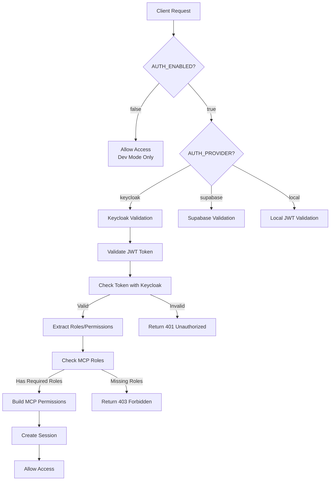

# agenthub Authentication System Architecture

## Overview

The agenthub platform uses a comprehensive authentication system that supports multiple providers with Keycloak as the primary production authentication service. The system is designed for security, scalability, and multi-tenant isolation.

## Current Implementation (as of 2025-09-05)

### Configuration Variables

The authentication system uses the following environment variables:

#### Core Authentication Settings
```bash
# Main Authentication Control
AUTH_ENABLED=true              # Enable/disable authentication globally
AUTH_PROVIDER=keycloak         # Authentication provider: keycloak, supabase, or local
```

#### Keycloak Configuration (when AUTH_PROVIDER=keycloak)
```bash
# Keycloak Server Settings
KEYCLOAK_URL=https://keycloak.example.com     # Your Keycloak instance URL
KEYCLOAK_REALM=mcp                            # Keycloak realm name
KEYCLOAK_CLIENT_ID=mcp-backend                # Client ID for backend
KEYCLOAK_CLIENT_SECRET=your-secret-here       # Client secret

# Keycloak Validation Settings
KEYCLOAK_VERIFY_TOKEN_AUDIENCE=true           # Verify token audience claim
KEYCLOAK_TOKEN_CACHE_TTL=300                  # Token cache TTL (5 minutes)
KEYCLOAK_PUBLIC_KEY_CACHE_TTL=3600           # JWKS cache TTL (1 hour)
KEYCLOAK_SSL_VERIFY=true                      # Verify SSL certificates
```

#### JWT Configuration
```bash
# JWT Settings (used with all providers)
JWT_SECRET_KEY=your-secret-key                # Secret for local JWT signing
JWT_ALGORITHM=RS256                           # Algorithm (RS256 for Keycloak)
JWT_ACCESS_TOKEN_EXPIRE_MINUTES=30            # Access token expiry
JWT_REFRESH_TOKEN_EXPIRE_DAYS=7               # Refresh token expiry
```

### Authentication Flow



### Role-Based Access Control (RBAC)

The system implements hierarchical role-based access control:

#### MCP Roles
- **mcp-admin**: Full system access
- **mcp-developer**: Development tools and project management
- **mcp-tools**: Execute MCP tools with restrictions
- **mcp-user**: Basic read-only access

#### Permission Mapping
```python
role_permissions = {
    "mcp-admin": ["*"],  # Full access
    "mcp-developer": [
        "tools:*",
        "context:*",
        "agents:*",
        "projects:*"
    ],
    "mcp-tools": [
        "tools:execute",
        "tools:list",
        "tools:describe",
        "context:read",
        "context:write"
    ],
    "mcp-user": [
        "tools:list",
        "tools:describe",
        "context:read"
    ]
}
```

### Tool Access Control

Tools are categorized and access is controlled by role:

```python
allowed_tools = {
    "mcp-admin": {
        "all": ["*"]  # Access to all tools
    },
    "mcp-developer": {
        "project": ["manage_project", "manage_git_branch"],
        "task": ["manage_task", "manage_subtask"],
        "context": ["manage_context"],
        "agent": ["call_agent", "manage_agent"],
        "development": ["*"]
    },
    "mcp-tools": {
        "task": ["manage_task", "search_task"],
        "context": ["manage_context"],
        "agent": ["call_agent"]
    },
    "mcp-user": {
        "task": ["search_task"],
        "context": ["get_context"]
    }
}
```

## Authentication Components

### 1. MCPKeycloakAuth (`mcp_keycloak_auth.py`)
- Main authentication handler for MCP tools
- Validates tokens with Keycloak
- Manages role-based permissions
- Creates MCP sessions

### 2. KeycloakAuth (`keycloak_auth.py`)
- Core Keycloak integration service
- Handles login, logout, token refresh
- Manages JWKS caching
- Token introspection and validation

### 3. AuthConfig (`auth_config.py`)
- Central authentication configuration
- Enforces mandatory authentication
- Validates security requirements

### 4. MCP Auth Config (`mcp_auth_config.py`)
- MCP server authentication setup
- JWT Bearer provider configuration
- Auto-detection of authentication type

## Security Features

### Token Management
- **Token Caching**: 5-minute cache for validated tokens
- **JWKS Caching**: 1-hour cache for public keys
- **Token Refresh**: Automatic refresh before expiry
- **Session Management**: MCP sessions with 24-hour expiry

### Security Validations
- **Audience Verification**: Ensures tokens are for correct client
- **SSL Verification**: Validates Keycloak server certificates
- **Role Validation**: Checks required roles for each operation
- **Permission Checks**: Granular permission validation

## Development Mode

When `AUTH_ENABLED=false` (development only):
- Returns mock user with admin permissions
- Bypasses all authentication checks
- **WARNING**: Never use in production

## API Endpoints

### Authentication Endpoints
- `POST /auth/login` - User login
- `POST /auth/logout` - User logout
- `POST /auth/refresh` - Refresh access token
- `GET /auth/user` - Get current user info
- `GET /auth/validate` - Validate token

### Protected MCP Tools
All MCP tools require authentication and appropriate permissions:
- `manage_project` - Requires mcp-developer or mcp-admin
- `manage_task` - Requires mcp-tools or higher
- `manage_context` - Requires mcp-tools or higher
- `call_agent` - Requires mcp-tools or higher

## Migration from Legacy Systems

### Deprecated Variables (Removed)
- `MCP_AUTH_ENABLED` - Use `AUTH_ENABLED` instead
- `ALLOW_DEFAULT_USER` - No longer supported
- `MCP_BEARER_TOKEN` - Use Keycloak tokens

### Migration Steps
1. Update `.env` file with new variables
2. Configure Keycloak instance
3. Create required roles in Keycloak
4. Update client applications to use Keycloak tokens

## Best Practices

1. **Always use HTTPS** in production for Keycloak
2. **Rotate secrets regularly** (client secrets, JWT keys)
3. **Use short token expiry** (30 minutes for access tokens)
4. **Enable SSL verification** for Keycloak connections
5. **Monitor authentication logs** for suspicious activity
6. **Use role-based access** instead of individual permissions
7. **Cache tokens appropriately** to reduce Keycloak load

## Troubleshooting

### Common Issues

1. **401 Unauthorized**
   - Check if token is expired
   - Verify Keycloak is accessible
   - Ensure client credentials are correct

2. **403 Forbidden**
   - User lacks required roles
   - Check role mappings in Keycloak
   - Verify permission configuration

3. **500 Authentication Service Error**
   - Keycloak server is down
   - Network connectivity issues
   - Invalid Keycloak configuration

### Debug Commands
```bash
# Test Keycloak connectivity
curl https://your-keycloak/realms/mcp/.well-known/openid-configuration

# Validate token manually
python agenthub_main/scripts/test/test-keycloak-mcp-clean.py

# Check authentication status
curl http://localhost:8001/auth/status
```

## Future Enhancements

- [ ] Support for multiple authentication providers simultaneously
- [ ] Fine-grained permission system
- [ ] API key authentication for service accounts
- [ ] OAuth2 device flow for CLI tools
- [ ] WebAuthn/FIDO2 support
- [ ] Session recording and audit logs