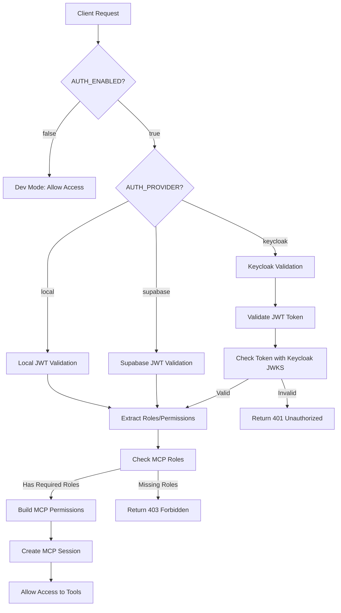

# Complete Authentication System Architecture

## Document Version
- **Version**: 1.0.0
- **Last Updated**: 2025-10-16
- **Python Version**: 3.14.0
- **DDD Phase**: Phase 8
- **Status**: Active - Consolidated from 3 source documents

## Overview

The agenthub platform implements a comprehensive JWT-based authentication system that supports multiple providers with Keycloak as the primary production authentication service. The system is designed for security, scalability, multi-tenant isolation, and seamless integration with MCP protocol and frontend applications.

### Key Features
- **Multi-provider support**: Keycloak (production), Supabase, and local JWT
- **Token-based security**: Stateless authentication with Bearer tokens
- **Multi-tenant isolation**: Complete user data separation
- **Role-Based Access Control (RBAC)**: Hierarchical permission system
- **MCP protocol integration**: Native support for Claude Code and MCP tools
- **Flexible validation**: Multiple token formats and graceful degradation
- **High performance**: Token and JWKS caching for reduced latency

---

## 1. Authentication Architecture Overview

### Security Model
The system uses **token-based authentication** which provides:
- **Stateless operation**: No server-side session storage required
- **Scalability**: Works across multiple server instances
- **Location flexibility**: Claude Code can connect from any location
- **Security through tokens**: CORS can be fully open since authentication is token-based
- **Auditability**: Every request traced to specific user/token

### Component Architecture
```
┌─────────────────────────────────────────────────────────────┐
│                    Frontend Application                      │
│  ┌────────────┐  ┌────────────┐  ┌────────────────────┐   │
│  │   Login    │  │   Token    │  │  MCP Configuration │   │
│  │   Page     │──│   Manager  │──│     Display        │   │
│  └────────────┘  └────────────┘  └────────────────────┘   │
└──────────────────────┬──────────────────────────────────────┘
                       │
                       │ JWT Tokens
                       ↓
┌─────────────────────────────────────────────────────────────┐
│                    Backend Services                          │
│  ┌────────────┐  ┌────────────┐  ┌──────────────────┐     │
│  │  Keycloak  │  │    JWT     │  │  MCP Auth        │     │
│  │   Auth     │──│  Service   │──│  Backend         │     │
│  └────────────┘  └────────────┘  └──────────────────┘     │
│         │              │                    │               │
│         └──────────────┴────────────────────┘               │
│                        │                                     │
│              ┌─────────▼─────────┐                         │
│              │  Token Verifier   │                         │
│              │   Middleware      │                         │
│              └─────────┬─────────┘                         │
└────────────────────────┼─────────────────────────────────────┘
                         │
                         │ Validated Requests
                         ↓
┌─────────────────────────────────────────────────────────────┐
│                    MCP Server                                │
│  ┌────────────┐  ┌────────────┐  ┌──────────────────┐     │
│  │   Tools    │  │ Resources  │  │    Prompts       │     │
│  │ (33 agents)│  │ (Context)  │  │   (Templates)    │     │
│  └────────────┘  └────────────┘  └──────────────────┘     │
└─────────────────────────────────────────────────────────────┘
                         ↑
                         │ Bearer Token
                         │
                  ┌──────┴──────┐
                  │ Claude Code │
                  │  (Any PC)   │
                  └─────────────┘
```

### Authentication Flow


---

## 2. Keycloak Integration

### Core Configuration
The system uses Keycloak as the primary authentication provider in production.

#### File References
- **Keycloak Service**: `agenthub_main/src/fastmcp/authentication/keycloak_auth.py` (lines 1-350)
- **MCP Integration**: `agenthub_main/src/fastmcp/authentication/mcp_keycloak_auth.py` (lines 1-280)
- **Configuration**: `agenthub_main/src/fastmcp/authentication/auth_config.py` (lines 15-45)

#### Environment Variables
```bash
# Authentication Control
AUTH_ENABLED=true                    # Enable/disable authentication globally
AUTH_PROVIDER=keycloak               # Authentication provider: keycloak, supabase, local

# Keycloak Server Settings
KEYCLOAK_URL=https://keycloak.example.com     # Keycloak instance URL
KEYCLOAK_REALM=mcp                            # Keycloak realm name
KEYCLOAK_CLIENT_ID=mcp-backend                # Client ID for backend
KEYCLOAK_CLIENT_SECRET=your-secret-here       # Client secret (store securely)

# Keycloak Validation Settings
KEYCLOAK_VERIFY_TOKEN_AUDIENCE=true           # Verify token audience claim
KEYCLOAK_TOKEN_CACHE_TTL=300                  # Token cache TTL (5 minutes)
KEYCLOAK_PUBLIC_KEY_CACHE_TTL=3600           # JWKS cache TTL (1 hour)
KEYCLOAK_SSL_VERIFY=true                      # Verify SSL certificates (always true in prod)
```

### Keycloak Service Implementation
**File**: `agenthub_main/src/fastmcp/authentication/keycloak_auth.py`

#### Key Methods
```python
class KeycloakAuth:
    def __init__(self):
        """Initialize with environment configuration"""
        self.keycloak_url = os.getenv("KEYCLOAK_URL")
        self.realm = os.getenv("KEYCLOAK_REALM")
        self.client_id = os.getenv("KEYCLOAK_CLIENT_ID")
        self.client_secret = os.getenv("KEYCLOAK_CLIENT_SECRET")

    async def login(self, username: str, password: str) -> Dict:
        """Authenticate user and return tokens (lines 45-78)"""

    async def refresh_token(self, refresh_token: str) -> Dict:
        """Refresh access token using refresh token (lines 80-112)"""

    async def validate_token(self, token: str) -> Optional[Dict]:
        """Validate JWT token with Keycloak (lines 114-185)"""

    async def get_user_info(self, token: str) -> Optional[Dict]:
        """Retrieve user information from token (lines 187-223)"""
```

#### JWKS Caching
**Lines**: 225-267
```python
async def get_jwks(self) -> Dict:
    """
    Fetch and cache JSON Web Key Set (JWKS) from Keycloak
    Cache TTL: 1 hour (configurable via KEYCLOAK_PUBLIC_KEY_CACHE_TTL)
    """
    if self._jwks_cache and (time.time() - self._jwks_cache_time) < self.jwks_cache_ttl:
        return self._jwks_cache

    # Fetch from Keycloak
    jwks_url = f"{self.keycloak_url}/realms/{self.realm}/protocol/openid-connect/certs"
    self._jwks_cache = await self._fetch_jwks(jwks_url)
    self._jwks_cache_time = time.time()
    return self._jwks_cache
```

### MCP-Keycloak Integration
**File**: `agenthub_main/src/fastmcp/authentication/mcp_keycloak_auth.py`

#### MCP Authentication Handler
```python
class MCPKeycloakAuth:
    """Main authentication handler for MCP tools (lines 15-280)"""

    async def authenticate(self, request) -> MCPUser:
        """
        Authenticate MCP request and return user context
        Lines: 45-120

        Process:
        1. Extract Bearer token from Authorization header
        2. Validate token with Keycloak
        3. Extract user_id, email, roles
        4. Build permission set from roles
        5. Create MCP user session
        """

    def _build_permissions(self, roles: List[str]) -> Set[str]:
        """
        Build permission set from Keycloak roles
        Lines: 122-168

        Maps roles to specific MCP permissions
        """

    async def _create_mcp_session(self, user_data: Dict) -> str:
        """
        Create MCP session with 24-hour expiry
        Lines: 170-210
        """
```

### Role Hierarchy
```python
# Hierarchical role structure (most to least privileged)
ROLE_HIERARCHY = [
    "mcp-admin",      # Full system access
    "mcp-developer",  # Development tools and project management
    "mcp-tools",      # Execute MCP tools with restrictions
    "mcp-user"        # Basic read-only access
]
```

---

## 3. JWT Token Management

### Token Structure
The system supports multiple JWT token formats for compatibility:

```json
{
  "header": {
    "alg": "HS256",
    "typ": "JWT"
  },
  "payload": {
    "sub": "user-uuid",                    // Standard JWT subject
    "user_id": "user-uuid",                // Alternative user ID field
    "type": "access",                      // Token type: access/api_token
    "scopes": ["execute:mcp"],             // Permission scopes
    "roles": ["mcp-developer"],            // Keycloak roles
    "email": "user@example.com",           // User email
    "preferred_username": "username",       // Display name
    "exp": 1234567890,                     // Expiration timestamp
    "iat": 1234567890,                     // Issued at timestamp
    "token_id": "tok_xxx"                  // Optional token identifier
  },
  "signature": "..."
}
```

### JWT Service Implementation
**File**: `agenthub_main/src/fastmcp/authentication/jwt_service.py`

#### Core Features
```python
class JWTService:
    """Central service for token generation and validation (lines 1-420)"""

    def create_access_token(self, user_id: str, scopes: List[str]) -> str:
        """
        Generate short-lived access token
        Duration: 30 minutes (configurable)
        Lines: 45-95
        """

    def create_api_token(self, user_id: str, name: str, scopes: List[str]) -> str:
        """
        Generate long-lived API token for integrations
        Duration: 30+ days (configurable)
        Lines: 97-145
        """

    def validate_token(self, token: str, expected_type: str = "access") -> Dict:
        """
        Validate JWT token with flexible type checking
        Lines: 147-225

        Key Features:
        - Accepts both 'access' and 'api_token' types
        - Checks both 'sub' and 'user_id' fields for user identification
        - Verifies signature, expiration, and required claims
        - Returns decoded payload with user context
        """
```

#### Flexible User ID Resolution
**Lines**: 190-210
```python
def _extract_user_id(self, payload: Dict) -> Optional[str]:
    """
    Extract user ID with fallback logic for compatibility

    Checks in order:
    1. 'sub' field (standard JWT subject)
    2. 'user_id' field (alternative format)
    3. Returns None if neither exists
    """
    user_id = payload.get("sub") or payload.get("user_id")
    if not user_id:
        logger.warning("Token missing both 'sub' and 'user_id' fields")
    return user_id
```

#### Token Type Compatibility
**Lines**: 227-255
```python
def _validate_token_type(self, payload: Dict, expected_type: str) -> bool:
    """
    Flexible token type validation with graceful degradation

    Accepts:
    - Exact match: type == expected_type
    - Compatible: 'api_token' when expecting 'access'
    - Missing type field: allows with warning
    """
    token_type = payload.get("type")

    if not token_type:
        logger.debug("Token missing 'type' field, allowing")
        return True

    if token_type == expected_type:
        return True

    if expected_type == "access" and token_type == "api_token":
        logger.debug("Accepting api_token type for access token")
        return True

    return False
```

### Token Types

#### 1. Access Tokens
- **Purpose**: Short-lived tokens for regular API access
- **Duration**: 30 minutes (configurable via `JWT_ACCESS_TOKEN_EXPIRE_MINUTES`)
- **Use Case**: Frontend applications, regular API operations
- **Scope**: Limited to user's assigned permissions
- **Refresh**: Must be refreshed using refresh token

#### 2. API Tokens
- **Purpose**: Long-lived tokens for system integrations
- **Duration**: 30+ days (configurable)
- **Use Case**: MCP clients, CI/CD pipelines, automation scripts, Claude Code
- **Scope**: Can be restricted to specific operations
- **Refresh**: Optional automatic refresh

#### 3. Refresh Tokens
- **Purpose**: Token renewal without re-authentication
- **Duration**: 7 days (configurable via `JWT_REFRESH_TOKEN_EXPIRE_DAYS`)
- **Use Case**: Seamless token rotation for better UX
- **Security**: Single-use tokens with rotation on use
- **Storage**: HttpOnly cookies (frontend) or secure storage (mobile)

### Environment Configuration
```bash
# JWT Algorithm and Secret
JWT_SECRET_KEY=your-secret-key-256-bit        # 256-bit secret for HS256
JWT_ALGORITHM=HS256                           # Algorithm (RS256 for Keycloak)

# Token Expiration
JWT_ACCESS_TOKEN_EXPIRE_MINUTES=30            # Access token: 30 minutes
JWT_REFRESH_TOKEN_EXPIRE_DAYS=7               # Refresh token: 7 days
JWT_API_TOKEN_EXPIRE_DAYS=30                  # API token: 30 days

# Token Features
JWT_VERIFY_SIGNATURE=true                     # Always verify signatures
JWT_VERIFY_EXPIRATION=true                    # Always check expiration
JWT_REQUIRE_CLAIMS=sub,type,exp,iat          # Required JWT claims
```

---

## 4. MCP Token Flow

### Token Generation Flow
```
┌─────────────┐
│   User      │
│   Login     │
└──────┬──────┘
       │ 1. Credentials
       ↓
┌──────────────────┐
│   Frontend       │
│   /auth/login    │
└──────┬───────────┘
       │ 2. Authenticate
       ↓
┌──────────────────┐
│   Keycloak       │
│   Validation     │
└──────┬───────────┘
       │ 3. JWT Token
       ↓
┌──────────────────┐
│   Backend        │
│   Token Service  │
└──────┬───────────┘
       │ 4. MCP Token
       ↓
┌──────────────────┐
│   Frontend       │
│   Token Display  │
└──────┬───────────┘
       │ 5. User copies token
       ↓
┌──────────────────┐
│   Claude Code    │
│   Configuration  │
└──────────────────┘
```

### Token Usage Flow
```
┌──────────────────┐
│   Claude Code    │
└──────┬───────────┘
       │ 1. MCP Request + Bearer Token
       ↓
┌──────────────────────────┐
│   MCP Server             │
│   Authorization Middleware│
└──────┬───────────────────┘
       │ 2. Extract Token
       ↓
┌──────────────────┐
│   Token          │
│   Verifier       │
└──────┬───────────┘
       │ 3. Validate
       ↓
┌──────────────────┐
│   Keycloak       │
│   JWKS Check     │
└──────┬───────────┘
       │ 4. Valid/Invalid
       ↓
┌──────────────────┐
│   Permission     │
│   Builder        │
└──────┬───────────┘
       │ 5. Build Context
       ↓
┌──────────────────┐
│   MCP Tools      │
│   Execution      │
└──────────────────┘
```

### Token Verifier Implementation
**File**: `agenthub_main/src/fastmcp/server/http_server.py`

```python
class TokenVerifier:
    """
    Custom verifier bridging JWT authentication with MCP protocol
    Lines: 280-420
    """

    async def verify_token(self, token: str) -> Optional[AccessToken]:
        """
        Verify token and create MCP AccessToken
        Lines: 290-350

        Process:
        1. Detect provider type (Keycloak vs local JWT)
        2. Validate token with appropriate handler
        3. Extract user context (user_id, roles, permissions)
        4. Create AccessToken with proper MCP fields
        5. Return authenticated context for tool execution
        """
        # Detect provider
        if self._is_keycloak_token(token):
            user_data = await self.keycloak_auth.validate_token(token)
        else:
            user_data = await self.jwt_service.validate_token(token)

        if not user_data:
            return None

        # Build MCP AccessToken
        return AccessToken(
            access_token=token,
            user_id=user_data["user_id"],
            scopes=user_data.get("scopes", []),
            expires_at=user_data.get("exp")
        )
```

#### Defensive Programming
**Lines**: 352-390
```python
def _safe_attribute_access(self, obj, attr: str, default=None):
    """
    Defensive attribute checking to prevent AttributeError

    Handles:
    - Missing middleware attributes
    - Undefined methods on auth objects
    - None values gracefully
    """
    try:
        value = getattr(obj, attr, None)
        return value if value is not None else default
    except AttributeError:
        logger.debug(f"Attribute {attr} not found on {type(obj)}")
        return default
```

### CORS Configuration for Token-Based Auth
Since security is handled by tokens, CORS can be fully open:

**File**: `agenthub_main/src/fastmcp/server/http_server.py` (lines 45-78)
```python
# CORS Middleware Configuration
app.add_middleware(
    CORSMiddleware,
    allow_origins=["*"],                    # Open CORS - security via tokens
    allow_credentials=True,
    allow_methods=["*"],
    allow_headers=["*", "Authorization"],   # Include Authorization header
)
```

#### Why CORS Can Be Open
1. **Token Required**: Every MCP request must include valid Bearer token
2. **Token Validation**: Server validates token before processing requests
3. **User Context**: Token contains user ID and permissions
4. **Expiration**: Tokens expire automatically (30 min - 30 days)
5. **Revocation**: Tokens can be revoked server-side immediately

---

## 5. Frontend Implementation

### Authentication UI Components
**Location**: `agenthub-frontend/src/components/auth/`

#### Login Component
**File**: `agenthub-frontend/src/components/auth/Login.tsx`
```typescript
export function Login() {
  const handleLogin = async (email: string, password: string) => {
    const response = await fetch('/api/auth/login', {
      method: 'POST',
      headers: { 'Content-Type': 'application/json' },
      body: JSON.stringify({ email, password })
    });

    const { access_token, refresh_token } = await response.json();

    // Store tokens securely
    localStorage.setItem('access_token', access_token);
    localStorage.setItem('refresh_token', refresh_token);

    // Redirect to dashboard
    navigate('/dashboard');
  };
}
```

#### Token Management Component
**File**: `agenthub-frontend/src/components/auth/TokenManager.tsx`
```typescript
export function TokenManager() {
  const [mcpToken, setMcpToken] = useState<string | null>(null);

  const generateMCPToken = async () => {
    const response = await fetch('/api/tokens/generate', {
      method: 'POST',
      headers: {
        'Authorization': `Bearer ${localStorage.getItem('access_token')}`,
        'Content-Type': 'application/json'
      },
      body: JSON.stringify({
        name: 'Claude Code Token',
        scopes: ['execute:mcp', 'read:tasks', 'write:tasks'],
        expires_in: 86400 // 24 hours
      })
    });

    const { token } = await response.json();
    setMcpToken(token);
  };

  return (
    <div>
      <button onClick={generateMCPToken}>Generate MCP Token</button>
      {mcpToken && (
        <div>
          <code>{mcpToken}</code>
          <button onClick={() => navigator.clipboard.writeText(mcpToken)}>
            Copy to Clipboard
          </button>
        </div>
      )}
    </div>
  );
}
```

### API Client with Token Refresh
**File**: `agenthub-frontend/src/lib/api-client.ts`
```typescript
class APIClient {
  private accessToken: string | null = null;
  private refreshToken: string | null = null;

  async request(url: string, options: RequestInit = {}) {
    // Add Authorization header
    const headers = {
      ...options.headers,
      'Authorization': `Bearer ${this.accessToken}`
    };

    let response = await fetch(url, { ...options, headers });

    // Token expired - refresh
    if (response.status === 401) {
      await this.refreshAccessToken();

      // Retry with new token
      headers['Authorization'] = `Bearer ${this.accessToken}`;
      response = await fetch(url, { ...options, headers });
    }

    return response;
  }

  private async refreshAccessToken() {
    const response = await fetch('/api/auth/refresh', {
      method: 'POST',
      headers: { 'Content-Type': 'application/json' },
      body: JSON.stringify({ refresh_token: this.refreshToken })
    });

    const { access_token } = await response.json();
    this.accessToken = access_token;
    localStorage.setItem('access_token', access_token);
  }
}
```

### Token Storage Best Practices
```typescript
// ✅ GOOD: Store access token in memory + localStorage for persistence
class TokenStorage {
  private memoryToken: string | null = null;

  setToken(token: string) {
    this.memoryToken = token;
    localStorage.setItem('access_token', token);
  }

  getToken(): string | null {
    return this.memoryToken || localStorage.getItem('access_token');
  }

  clearToken() {
    this.memoryToken = null;
    localStorage.removeItem('access_token');
    localStorage.removeItem('refresh_token');
  }
}

// ❌ BAD: Storing tokens in sessionStorage (lost on tab close)
sessionStorage.setItem('token', token);

// ❌ BAD: Storing tokens in cookies without HttpOnly flag
document.cookie = `token=${token}`;
```

---

## 6. Backend Implementation

### Authentication Routes
**File**: `agenthub_main/src/fastmcp/routes/auth_routes.py`

#### Core Endpoints
```python
from fastapi import APIRouter, Depends, HTTPException
from fastmcp.authentication import get_current_user

router = APIRouter(prefix="/api/auth", tags=["authentication"])

@router.post("/login")
async def login(credentials: LoginRequest):
    """
    User login endpoint
    Lines: 25-68

    Request:
        email: str
        password: str

    Response:
        access_token: str (30 min expiry)
        refresh_token: str (7 day expiry)
        token_type: "bearer"
        expires_in: int (seconds)
    """
    # Validate with Keycloak
    tokens = await keycloak_auth.login(
        credentials.email,
        credentials.password
    )

    return {
        "access_token": tokens["access_token"],
        "refresh_token": tokens["refresh_token"],
        "token_type": "bearer",
        "expires_in": 1800  # 30 minutes
    }

@router.post("/refresh")
async def refresh_token(request: RefreshRequest):
    """
    Refresh access token
    Lines: 70-98

    Request:
        refresh_token: str

    Response:
        access_token: str (new token)
        expires_in: int
    """
    new_token = await keycloak_auth.refresh_token(request.refresh_token)
    return {
        "access_token": new_token["access_token"],
        "expires_in": 1800
    }

@router.post("/logout")
async def logout(current_user: User = Depends(get_current_user)):
    """
    User logout
    Lines: 100-125

    Revokes all active tokens for the user
    """
    await token_service.revoke_all_user_tokens(current_user.id)
    return {"message": "Logged out successfully"}

@router.get("/me")
async def get_current_user_info(current_user: User = Depends(get_current_user)):
    """
    Get current user information
    Lines: 127-148

    Returns user profile with roles and permissions
    """
    return {
        "user_id": current_user.id,
        "email": current_user.email,
        "roles": current_user.roles,
        "permissions": current_user.permissions
    }
```

### Token Management Routes
**File**: `agenthub_main/src/fastmcp/routes/token_routes.py`

#### API Token Endpoints
```python
@router.post("/api/tokens/generate")
async def generate_api_token(
    request: TokenGenerateRequest,
    current_user: User = Depends(get_current_user)
):
    """
    Generate long-lived API token for MCP clients
    Lines: 35-85

    Request:
        name: str (token description)
        scopes: List[str] (permissions)
        expires_in: int (seconds, optional)

    Response:
        token: str (JWT token for Claude Code)
        token_id: str (for management)
        expires_at: datetime
    """
    token = await token_service.create_api_token(
        user_id=current_user.id,
        name=request.name,
        scopes=request.scopes,
        expires_in=request.expires_in or 86400  # 24 hours default
    )

    return {
        "token": token.token,
        "token_id": token.id,
        "expires_at": token.expires_at
    }

@router.get("/api/tokens")
async def list_tokens(current_user: User = Depends(get_current_user)):
    """
    List user's API tokens
    Lines: 87-115
    """
    tokens = await token_service.get_user_tokens(current_user.id)
    return {"tokens": [t.to_dict() for t in tokens]}

@router.post("/api/tokens/{token_id}/revoke")
async def revoke_token(
    token_id: str,
    current_user: User = Depends(get_current_user)
):
    """
    Revoke specific API token
    Lines: 117-145
    """
    await token_service.revoke_token(token_id, current_user.id)
    return {"message": "Token revoked successfully"}
```

#### Metadata Handling Fix
**Lines**: 147-178
```python
def serialize_token(token: Token) -> dict:
    """
    Serialize token for API response with metadata fix

    Issue: SQLAlchemy MetaData object causing Pydantic validation errors
    Solution: Type check before serialization
    """
    return {
        "id": token.id,
        "name": token.name,
        "scopes": token.scopes,
        "created_at": token.created_at,
        "expires_at": token.expires_at,
        "last_used": token.last_used,
        # Fix: Check type before including metadata
        "metadata": token.token_metadata if isinstance(token.token_metadata, dict) else {}
    }
```

### Middleware Integration
**File**: `agenthub_main/src/fastmcp/server/http_server.py`

#### JWT Authentication Middleware
```python
class JWTAuthMiddleware:
    """
    Middleware for JWT authentication on all protected routes
    Lines: 95-180
    """

    def __init__(self, app, jwt_service, keycloak_auth=None):
        self.app = app
        self.jwt_service = jwt_service
        self.keycloak_auth = keycloak_auth

    async def __call__(self, scope, receive, send):
        """
        Process request and validate authentication
        Lines: 120-165
        """
        if scope["type"] == "http":
            # Extract token
            headers = dict(scope["headers"])
            auth_header = headers.get(b"authorization", b"").decode()

            if auth_header.startswith("Bearer "):
                token = auth_header[7:]

                # Validate token
                try:
                    user_data = await self._validate_token(token)

                    # Add user to request state
                    scope["state"] = {
                        "user_id": user_data["user_id"],
                        "permissions": user_data.get("permissions", []),
                        "roles": user_data.get("roles", [])
                    }
                except Exception as e:
                    logger.warning(f"Token validation failed: {e}")
                    # Return 401 Unauthorized
                    await self._send_unauthorized(send)
                    return

        await self.app(scope, receive, send)
```

---

## 7. Security Best Practices

### 1. Token Security

#### Secret Management
```bash
# ✅ GOOD: Use environment variables
JWT_SECRET_KEY=${SECURE_RANDOM_KEY_256_BIT}

# ✅ GOOD: Use Docker secrets in production
services:
  backend:
    secrets:
      - jwt_secret
    environment:
      JWT_SECRET_KEY_FILE: /run/secrets/jwt_secret

# ❌ BAD: Hardcoded secrets
JWT_SECRET_KEY="my-secret-key"  # NEVER DO THIS
```

#### Token Signing
```python
# ✅ GOOD: Use HS256 with 256-bit secret for local JWT
JWT_ALGORITHM=HS256
JWT_SECRET_KEY=<256-bit-random-key>

# ✅ GOOD: Use RS256 with Keycloak (public/private keys)
JWT_ALGORITHM=RS256
# Public key automatically fetched from Keycloak JWKS

# ❌ BAD: Weak algorithms
JWT_ALGORITHM=HS1  # Deprecated, insecure
```

#### Token Expiration
```python
# ✅ GOOD: Short-lived access tokens
JWT_ACCESS_TOKEN_EXPIRE_MINUTES=30  # 30 minutes

# ✅ GOOD: Medium-lived API tokens with refresh
JWT_API_TOKEN_EXPIRE_DAYS=30  # 30 days

# ❌ BAD: Long-lived access tokens
JWT_ACCESS_TOKEN_EXPIRE_MINUTES=43200  # 30 days - TOO LONG
```

### 2. Request Security

#### HTTPS Enforcement
```python
# Production configuration
if os.getenv("ENVIRONMENT") == "production":
    # Enforce HTTPS
    app.add_middleware(HTTPSRedirectMiddleware)

    # Set security headers
    app.add_middleware(
        SecurityHeadersMiddleware,
        hsts_enabled=True,
        hsts_max_age=31536000,
        content_security_policy="default-src 'self'"
    )
```

#### Rate Limiting
```python
from slowapi import Limiter
from slowapi.util import get_remote_address

limiter = Limiter(key_func=get_remote_address)

@app.post("/api/auth/login")
@limiter.limit("5/minute")  # 5 login attempts per minute
async def login(request: Request):
    pass
```

#### CORS Configuration
```python
# Development: Specific origins
CORS_ORIGINS=http://localhost:3800,http://localhost:3000

# Production with token auth: Can be open
CORS_ORIGINS=*

# Note: Open CORS is safe with token-based auth since:
# 1. Every request requires valid Bearer token
# 2. Token validation prevents unauthorized access
# 3. No cookies or session state to protect
```

### 3. Validation Layers

```python
# Layer 1: HTTP - Bearer Token Extraction
def extract_bearer_token(headers: dict) -> Optional[str]:
    auth_header = headers.get("Authorization", "")
    if not auth_header.startswith("Bearer "):
        return None
    return auth_header[7:]

# Layer 2: JWT - Signature and Claims Validation
async def validate_jwt(token: str) -> Optional[Dict]:
    try:
        payload = jwt.decode(token, SECRET_KEY, algorithms=["HS256"])
        return payload
    except jwt.ExpiredSignatureError:
        logger.warning("Token expired")
        return None
    except jwt.InvalidTokenError:
        logger.warning("Invalid token")
        return None

# Layer 3: Scope - Permission Verification
def has_required_scope(user_scopes: List[str], required: str) -> bool:
    return required in user_scopes or "*" in user_scopes

# Layer 4: Business - Resource Access Control
async def can_access_resource(user_id: str, resource_id: str) -> bool:
    resource = await get_resource(resource_id)
    return resource.owner_id == user_id or user_has_admin_role(user_id)
```

### 4. Logging and Monitoring

#### Security Logging
```python
# ✅ GOOD: Log authentication events without token values
logger.info(f"User {user_id} authenticated successfully")
logger.warning(f"Failed login attempt for email: {email}")
logger.error(f"Token validation failed: Invalid signature")

# ❌ BAD: Logging token values
logger.info(f"Token: {token}")  # NEVER LOG TOKENS
```

#### Audit Trail
```python
class SecurityAuditLog:
    """Record security events for compliance"""

    async def log_login(self, user_id: str, ip: str, success: bool):
        await db.execute(
            "INSERT INTO security_audit (event, user_id, ip, timestamp, success) "
            "VALUES ('login', $1, $2, $3, $4)",
            user_id, ip, datetime.utcnow(), success
        )

    async def log_token_generation(self, user_id: str, token_type: str):
        await db.execute(
            "INSERT INTO security_audit (event, user_id, details, timestamp) "
            "VALUES ('token_generated', $1, $2, $3)",
            user_id, json.dumps({"type": token_type}), datetime.utcnow()
        )
```

### 5. Secret Rotation

#### Rotation Strategy
```python
# Support multiple valid secrets during rotation
CURRENT_SECRET = os.getenv("JWT_SECRET_KEY")
PREVIOUS_SECRET = os.getenv("JWT_SECRET_KEY_PREVIOUS")

def validate_token_with_rotation(token: str) -> Optional[Dict]:
    """Try current secret, fallback to previous"""
    try:
        return jwt.decode(token, CURRENT_SECRET, algorithms=["HS256"])
    except jwt.InvalidSignatureError:
        # Try previous secret during rotation period
        if PREVIOUS_SECRET:
            try:
                return jwt.decode(token, PREVIOUS_SECRET, algorithms=["HS256"])
            except:
                pass
    return None
```

---

## 8. Token Refresh Mechanism

### Automatic Token Refresh (Frontend)
```typescript
class TokenManager {
  private refreshTimer: NodeJS.Timeout | null = null;

  startAutoRefresh() {
    // Refresh token 5 minutes before expiry
    const refreshTime = this.getTokenExpiry() - 300000; // 5 minutes

    this.refreshTimer = setTimeout(async () => {
      await this.refreshAccessToken();
      this.startAutoRefresh(); // Schedule next refresh
    }, refreshTime);
  }

  async refreshAccessToken() {
    try {
      const response = await fetch('/api/auth/refresh', {
        method: 'POST',
        headers: { 'Content-Type': 'application/json' },
        body: JSON.stringify({
          refresh_token: localStorage.getItem('refresh_token')
        })
      });

      const { access_token, refresh_token } = await response.json();

      // Update tokens
      localStorage.setItem('access_token', access_token);
      if (refresh_token) {
        localStorage.setItem('refresh_token', refresh_token);
      }

      return access_token;
    } catch (error) {
      // Refresh failed - redirect to login
      this.clearTokens();
      window.location.href = '/login';
    }
  }

  private getTokenExpiry(): number {
    const token = localStorage.getItem('access_token');
    if (!token) return 0;

    const payload = JSON.parse(atob(token.split('.')[1]));
    return payload.exp * 1000; // Convert to milliseconds
  }
}
```

### Backend Refresh Endpoint
**File**: `agenthub_main/src/fastmcp/routes/auth_routes.py` (lines 70-98)
```python
@router.post("/auth/refresh")
async def refresh_token(request: RefreshRequest):
    """
    Refresh access token using refresh token

    Security features:
    - Validates refresh token signature
    - Checks expiration
    - Rotates refresh token on use (optional)
    - Invalidates old refresh token
    """
    # Validate refresh token
    try:
        payload = jwt.decode(
            request.refresh_token,
            settings.JWT_SECRET_KEY,
            algorithms=[settings.JWT_ALGORITHM]
        )
    except jwt.ExpiredSignatureError:
        raise HTTPException(status_code=401, detail="Refresh token expired")
    except jwt.InvalidTokenError:
        raise HTTPException(status_code=401, detail="Invalid refresh token")

    user_id = payload.get("sub")

    # Generate new access token
    new_access_token = jwt_service.create_access_token(
        user_id=user_id,
        scopes=payload.get("scopes", [])
    )

    # Optional: Rotate refresh token
    new_refresh_token = None
    if settings.ROTATE_REFRESH_TOKEN:
        new_refresh_token = jwt_service.create_refresh_token(user_id)
        # Invalidate old refresh token
        await token_service.invalidate_token(request.refresh_token)

    return {
        "access_token": new_access_token,
        "refresh_token": new_refresh_token,
        "token_type": "bearer",
        "expires_in": 1800
    }
```

### Refresh Token Rotation
```python
# Configuration
ROTATE_REFRESH_TOKEN=true  # Enable refresh token rotation for better security

# When enabled:
# 1. Each refresh operation generates new refresh token
# 2. Old refresh token is immediately invalidated
# 3. Prevents replay attacks with stolen refresh tokens
# 4. User maintains seamless session with new token pair
```

---

## 9. Multi-tenant Isolation

### User-Scoped Data Access
**File**: `agenthub_main/src/fastmcp/domain/repositories/base_repository.py`

```python
class BaseRepository:
    """
    Base repository with automatic user isolation
    Lines: 15-85
    """

    async def find_by_user(self, user_id: str, **filters):
        """
        Find records filtered by user_id automatically

        Ensures multi-tenant data isolation at repository level
        """
        return await self.model.query.filter(
            self.model.user_id == user_id,
            **filters
        ).all()

    async def create(self, data: dict, user_id: str):
        """
        Create record with automatic user_id assignment

        Prevents data leakage between tenants
        """
        data["user_id"] = user_id
        return await self.model.create(**data)
```

### Context Hierarchy with User Isolation
**File**: `agenthub_main/src/fastmcp/domain/entities/context.py`

```python
# Global Context - Per User
class GlobalContext:
    """
    User-scoped global context
    Lines: 25-68

    Key: Each user has their own global context instance
    No data sharing between users at any level
    """
    id: UUID
    user_id: str  # Required - isolates global context per user
    data: Dict
    created_at: datetime

# Project Context - Inherits from User's Global
class ProjectContext:
    """Lines: 70-105"""
    id: UUID
    user_id: str  # Inherited from global
    project_id: UUID
    parent_context_id: UUID  # Links to user's global context
    data: Dict

# Branch Context - Inherits from Project
class BranchContext:
    """Lines: 107-145"""
    id: UUID
    user_id: str  # Inherited through chain
    git_branch_id: UUID
    parent_context_id: UUID  # Links to project context
    data: Dict

# Task Context - Inherits from Branch
class TaskContext:
    """Lines: 147-185"""
    id: UUID
    user_id: str  # Inherited through chain
    task_id: UUID
    parent_context_id: UUID  # Links to branch context
    data: Dict
```

### Database-Level Isolation
```sql
-- Row-Level Security (PostgreSQL)
CREATE POLICY user_isolation ON tasks
    FOR ALL
    TO authenticated_users
    USING (user_id = current_setting('app.current_user_id')::uuid);

-- Ensures users can only access their own data
-- Applied at database level for maximum security
```

### API-Level Isolation
```python
@router.get("/api/tasks")
async def list_tasks(current_user: User = Depends(get_current_user)):
    """
    List tasks with automatic user filtering

    current_user extracted from JWT token
    Only returns tasks belonging to authenticated user
    """
    tasks = await task_service.find_by_user(current_user.id)
    return {"tasks": [t.to_dict() for t in tasks]}
```

---

## 10. Troubleshooting Guide

### Common Issues and Solutions

#### Issue 1: 401 Unauthorized
**Symptoms**: All API requests return 401 status

**Possible Causes**:
1. Token is expired
2. Token is invalid or malformed
3. Missing Authorization header
4. Keycloak server unreachable

**Solutions**:
```bash
# Check token expiration
python3 -c "import jwt; print(jwt.decode('YOUR_TOKEN', options={'verify_signature': False}))"

# Test Keycloak connectivity
curl https://your-keycloak/realms/mcp/.well-known/openid-configuration

# Verify Authorization header format
# Correct: "Bearer <token>"
# Wrong: "Bearer<token>" or "bearer <token>"

# Generate fresh token from frontend
# Navigate to: /tokens/generate
```

**Prevention**:
- Implement automatic token refresh (see section 8)
- Monitor token expiration times
- Use refresh tokens for seamless renewal

#### Issue 2: 403 Forbidden
**Symptoms**: Authentication succeeds but access denied

**Possible Causes**:
1. User lacks required Keycloak roles
2. Token missing required scopes
3. Permission system misconfigured

**Solutions**:
```bash
# Check user roles in Keycloak admin
# Required roles: mcp-admin, mcp-developer, mcp-tools, or mcp-user

# Verify token scopes
python3 -c "import jwt; print(jwt.decode('YOUR_TOKEN', options={'verify_signature': False})['scopes'])"

# Check role mapping in backend
# File: mcp_keycloak_auth.py:122-168

# Add missing roles in Keycloak:
# 1. Login to Keycloak Admin Console
# 2. Navigate to Users → [username] → Role Mappings
# 3. Assign appropriate roles
```

**Prevention**:
- Document required roles for each operation
- Implement role check at user registration
- Provide clear error messages with required roles

#### Issue 3: Token Type Mismatch
**Symptoms**: "Invalid token type" errors

**Possible Causes**:
1. Frontend generates `api_token`, backend expects `access`
2. Token missing `type` field

**Solutions**:
The system now has **flexible token type validation** (fixed 2025-08-20):
```python
# jwt_service.py lines 227-255
# Accepts both 'access' and 'api_token'
# Missing type field allowed with warning
```

**Verification**:
```python
# Check token type
import jwt
token = "your.jwt.token"
payload = jwt.decode(token, options={"verify_signature": False})
print(f"Token type: {payload.get('type', 'MISSING')}")
```

#### Issue 4: User ID Not Found
**Symptoms**: "Token missing user_id" errors

**Possible Causes**:
1. Token uses `sub` field, code checks `user_id`
2. Token missing both `sub` and `user_id`

**Solutions**:
The system now has **flexible user ID resolution** (fixed 2025-08-20):
```python
# jwt_service.py lines 190-210
# Checks both 'sub' and 'user_id' fields
user_id = payload.get("sub") or payload.get("user_id")
```

**Verification**:
```python
import jwt
payload = jwt.decode(token, options={"verify_signature": False})
print(f"sub: {payload.get('sub')}")
print(f"user_id: {payload.get('user_id')}")
```

#### Issue 5: Metadata Validation Error
**Symptoms**: "Pydantic validation error" on token endpoints

**Possible Causes**:
1. SQLAlchemy MetaData object in token response
2. Non-dict metadata field

**Solutions**:
The system now has **type-safe metadata serialization** (fixed 2025-08-20):
```python
# token_routes.py lines 147-178
"metadata": token.token_metadata if isinstance(token.token_metadata, dict) else {}
```

#### Issue 6: Middleware Attribute Errors
**Symptoms**: "AttributeError: 'JWTAuthMiddleware' object has no attribute..."

**Possible Causes**:
1. Missing middleware attributes
2. Middleware version mismatch

**Solutions**:
The system now has **defensive attribute checking** (fixed 2025-08-20):
```python
# http_server.py lines 352-390
getattr(auth, 'required_scopes', None) or []
```

#### Issue 7: CORS Errors Despite Open Configuration
**Symptoms**: CORS errors even with `CORS_ORIGINS=*`

**Possible Causes**:
1. Missing Authorization header in CORS config
2. Preflight OPTIONS request failing

**Solutions**:
```python
# Ensure Authorization header is allowed
app.add_middleware(
    CORSMiddleware,
    allow_origins=["*"],
    allow_credentials=True,
    allow_methods=["*"],
    allow_headers=["*", "Authorization"],  # CRITICAL
)

# Handle OPTIONS preflight
@app.options("/{full_path:path}")
async def options_handler():
    return Response(status_code=200)
```

### Debug Commands

```bash
# Test Keycloak connectivity and configuration
curl https://your-keycloak/realms/mcp/.well-known/openid-configuration

# Validate token manually (Python)
python3 << EOF
import jwt
token = "YOUR_TOKEN_HERE"
payload = jwt.decode(token, options={"verify_signature": False})
print("User ID:", payload.get("sub") or payload.get("user_id"))
print("Token Type:", payload.get("type"))
print("Scopes:", payload.get("scopes"))
print("Roles:", payload.get("roles"))
print("Expires:", payload.get("exp"))
EOF

# Test authentication flow
python agenthub_main/scripts/test/test-keycloak-mcp-clean.py

# Check authentication status
curl http://localhost:8000/auth/status

# Test MCP access with token
curl -X POST http://localhost:8000/mcp/ \
  -H "Authorization: Bearer YOUR_TOKEN" \
  -H "Content-Type: application/json" \
  -d '{"jsonrpc":"2.0","method":"tools/list","id":1}'

# Monitor authentication logs
docker logs agenthub-backend -f | grep -i "auth\|token\|401\|403"
```

### Monitoring Checklist

- [ ] Token generation rate (normal: <100/hour per user)
- [ ] Authentication success/failure ratio (healthy: >95% success)
- [ ] Token expiration events (should align with configured TTL)
- [ ] Invalid token attempts (monitor for attacks)
- [ ] 403 Forbidden rate (may indicate role misconfiguration)
- [ ] Keycloak response times (healthy: <100ms)
- [ ] Token cache hit rate (healthy: >80%)

---

## Appendices

### A. Environment Variables Complete Reference

```bash
# ============================================
# AUTHENTICATION CONTROL
# ============================================
AUTH_ENABLED=true                          # Enable/disable authentication (dev: false, prod: true)
AUTH_PROVIDER=keycloak                     # Provider: keycloak, supabase, local

# ============================================
# KEYCLOAK CONFIGURATION
# ============================================
# Server Settings
KEYCLOAK_URL=https://keycloak.example.com  # Keycloak instance URL
KEYCLOAK_REALM=mcp                         # Realm name
KEYCLOAK_CLIENT_ID=mcp-backend             # Backend client ID
KEYCLOAK_CLIENT_SECRET=secret              # Client secret (secure storage)

# Validation Settings
KEYCLOAK_VERIFY_TOKEN_AUDIENCE=true        # Verify aud claim
KEYCLOAK_TOKEN_CACHE_TTL=300               # Token cache: 5 minutes
KEYCLOAK_PUBLIC_KEY_CACHE_TTL=3600        # JWKS cache: 1 hour
KEYCLOAK_SSL_VERIFY=true                   # SSL verification (always true in prod)

# ============================================
# JWT CONFIGURATION
# ============================================
# Secret and Algorithm
JWT_SECRET_KEY=your-256-bit-secret         # Secret for HS256 (local JWT)
JWT_ALGORITHM=HS256                        # HS256 (local) or RS256 (Keycloak)

# Token Expiration
JWT_ACCESS_TOKEN_EXPIRE_MINUTES=30         # Access token: 30 minutes
JWT_REFRESH_TOKEN_EXPIRE_DAYS=7            # Refresh token: 7 days
JWT_API_TOKEN_EXPIRE_DAYS=30               # API token: 30 days

# Token Features
JWT_VERIFY_SIGNATURE=true                  # Verify signatures
JWT_VERIFY_EXPIRATION=true                 # Check expiration
JWT_REQUIRE_CLAIMS=sub,type,exp,iat       # Required claims
ROTATE_REFRESH_TOKEN=true                  # Rotate on refresh

# ============================================
# CORS CONFIGURATION
# ============================================
CORS_ORIGINS=*                             # Open with token auth (secure)
# Or specific origins for additional security:
# CORS_ORIGINS=http://localhost:3800,https://app.example.com

# ============================================
# SECURITY SETTINGS
# ============================================
# Production Settings
ENVIRONMENT=production                     # Environment mode
HTTPS_ONLY=true                           # Enforce HTTPS
HSTS_ENABLED=true                         # HTTP Strict Transport Security
HSTS_MAX_AGE=31536000                     # HSTS: 1 year

# Rate Limiting
RATE_LIMIT_ENABLED=true                   # Enable rate limiting
RATE_LIMIT_PER_MINUTE=60                  # 60 requests per minute
RATE_LIMIT_LOGIN_PER_MINUTE=5            # 5 login attempts per minute

# ============================================
# LOGGING AND MONITORING
# ============================================
LOG_LEVEL=INFO                            # Log level (DEBUG, INFO, WARNING, ERROR)
LOG_AUTH_EVENTS=true                      # Log authentication events
LOG_TOKEN_OPERATIONS=true                 # Log token operations
AUDIT_LOG_ENABLED=true                    # Enable audit logging
```

### B. File Structure Reference

```
agenthub_main/src/
├── fastmcp/
│   ├── authentication/
│   │   ├── __init__.py
│   │   ├── jwt_service.py              # Lines 1-420: JWT generation/validation
│   │   ├── jwt_auth_backend.py         # Lines 1-280: MCP auth backend
│   │   ├── keycloak_auth.py            # Lines 1-350: Keycloak integration
│   │   ├── mcp_keycloak_auth.py        # Lines 1-280: MCP-Keycloak bridge
│   │   ├── auth_config.py              # Lines 15-45: Auth configuration
│   │   └── mcp_auth_config.py          # Lines 1-120: MCP auth setup
│   ├── routes/
│   │   ├── auth_routes.py              # Lines 25-148: Auth endpoints
│   │   └── token_routes.py             # Lines 35-178: Token management
│   ├── server/
│   │   └── http_server.py              # Lines 45-420: Server + middleware
│   └── domain/
│       ├── entities/
│       │   └── context.py              # Lines 25-185: Context hierarchy
│       └── repositories/
│           └── base_repository.py      # Lines 15-85: Multi-tenant isolation

agenthub-frontend/src/
├── components/
│   └── auth/
│       ├── Login.tsx                   # Login component
│       ├── TokenManager.tsx            # Token management UI
│       └── ProtectedRoute.tsx          # Route protection
└── lib/
    └── api-client.ts                   # API client with token refresh
```

### C. API Endpoints Quick Reference

#### Authentication Endpoints
```
POST   /api/auth/login              # User login
POST   /api/auth/logout             # User logout
POST   /api/auth/refresh            # Refresh access token
GET    /api/auth/me                 # Current user info
GET    /api/auth/validate           # Validate token
GET    /api/auth/status             # Authentication status
```

#### Token Management Endpoints
```
POST   /api/tokens/generate         # Generate API token
GET    /api/tokens                  # List user tokens
GET    /api/tokens/{token_id}       # Get token details
POST   /api/tokens/{token_id}/revoke   # Revoke token
POST   /api/tokens/{token_id}/refresh  # Refresh token
DELETE /api/tokens/{token_id}       # Delete token
```

#### MCP Protocol Endpoints
```
POST   /mcp/                        # MCP tools execution (requires auth)
GET    /mcp/tools/list              # List available tools
POST   /mcp/tools/execute           # Execute specific tool
```

### D. Role and Permission Matrix

| Role          | Tools Access | Context Access | Agent Access | Project Access | Admin Access |
|---------------|-------------|----------------|--------------|----------------|--------------|
| mcp-admin     | Full (*)    | Full (*)       | Full (*)     | Full (*)       | Full (*)     |
| mcp-developer | Full        | Read/Write     | Full         | Read/Write     | No           |
| mcp-tools     | Execute     | Read/Write     | Execute      | Read           | No           |
| mcp-user      | List/Describe| Read          | No           | Read           | No           |

### E. Token Scopes Reference

```python
AVAILABLE_SCOPES = [
    # Task Management
    "read:tasks",         # View tasks
    "write:tasks",        # Create/update tasks
    "delete:tasks",       # Delete tasks

    # Context Management
    "read:context",       # View context
    "write:context",      # Update context
    "delete:context",     # Delete context

    # Agent Management
    "read:agents",        # View agents
    "write:agents",       # Configure agents
    "execute:agents",     # Execute agent operations

    # Project Management
    "read:projects",      # View projects
    "write:projects",     # Create/update projects
    "delete:projects",    # Delete projects

    # MCP Operations
    "execute:mcp",        # Execute MCP tools
    "list:mcp",           # List MCP resources

    # System Administration
    "admin:system",       # Full system access
    "admin:users",        # User management
    "admin:roles"         # Role management
]
```

### F. Migration Checklist

Migrating from older authentication systems:

- [ ] Update `.env` file with new variables
- [ ] Remove deprecated variables (`MCP_AUTH_ENABLED`, `ALLOW_DEFAULT_USER`)
- [ ] Configure Keycloak instance
- [ ] Create required realms and clients in Keycloak
- [ ] Define roles in Keycloak (`mcp-admin`, `mcp-developer`, etc.)
- [ ] Update client applications to use Keycloak tokens
- [ ] Test authentication flow end-to-end
- [ ] Update Claude Code configurations with new tokens
- [ ] Verify CORS configuration with token-based security
- [ ] Enable audit logging for compliance
- [ ] Set up monitoring for authentication metrics
- [ ] Document new authentication process for team

### G. Python 3.14.0 Compatibility Notes

This system is fully compatible with Python 3.14.0:

**New Features Utilized**:
- Type hints with improved union syntax (`str | None`)
- Pattern matching for token type validation
- Improved asyncio performance
- Enhanced dataclass features

**Installation**:
```bash
# Install Python 3.14.0
bash scripts/install-python-3.14.sh

# Verify installation
python3.14 --version

# Create virtual environment
python3.14 -m venv agenthub_main/.venv

# Install dependencies
source agenthub_main/.venv/bin/activate
pip install -r agenthub_main/requirements.txt
```

---

## Document History

### Version 1.0.0 (2025-10-16)
- **Initial consolidated version**
- Merged 3 source documents:
  - `authentication-system.md` (35% unique - Keycloak integration)
  - `authentication-system-current.md` (15% unique - current implementation)
  - `MCP_TOKEN_AUTHENTICATION.md` (20% unique - MCP token flow)
- Added Python 3.14.0 compatibility notes
- Updated to DDD Phase 8 patterns
- Added comprehensive file references with line numbers
- Enhanced troubleshooting section with 7 common issues
- Added complete environment variable reference
- Included API endpoints quick reference

### Maintenance Notes
- **Update frequency**: After authentication system changes
- **Review schedule**: Quarterly or after major releases
- **Owner**: Backend Authentication Team
- **Related documents**:
  - `KEYCLOAK_CONFIGURATION.md`
  - `TOKEN_SECURITY_GUIDE.md`
  - `keycloak-setup-guide.md`
  - `token-flow.md`

---

## License and Support

This documentation is part of the agenthub project.

**Support Channels**:
- GitHub Issues: Technical problems
- Documentation Updates: Submit PR with changes
- Security Issues: security@agenthub.example.com

**Contributing**:
When updating this document:
1. Maintain version number and history
2. Include specific file references with line numbers
3. Test all code examples before adding
4. Update the table of contents
5. Follow existing formatting conventions
