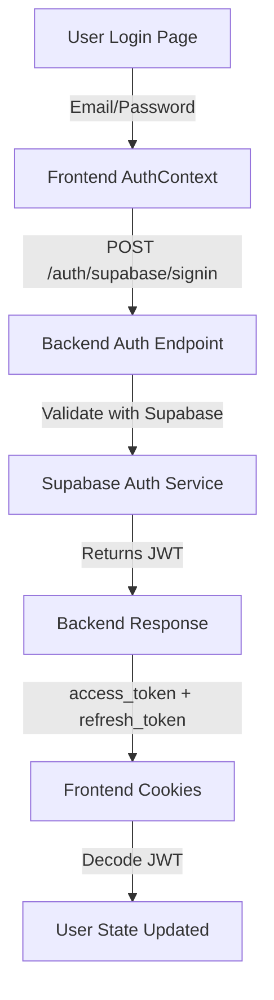
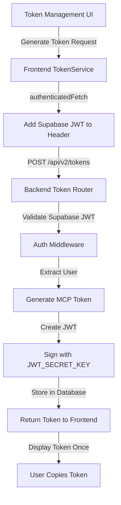
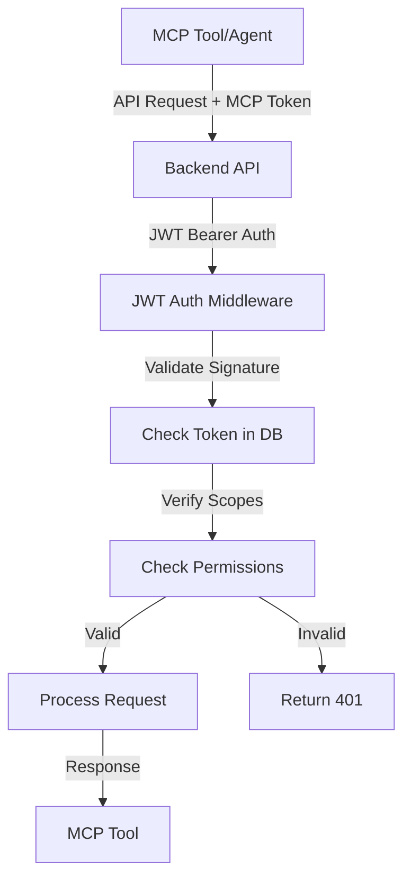

# Token Flow Documentation

## Overview

This document details the complete token flow in the 4genthub system, from user authentication to MCP tool authorization.

## Token Lifecycle

### 1. User Authentication Flow



**Step-by-step Process:**

1. **User enters credentials** on login page
2. **Frontend sends** credentials to `/auth/supabase/signin`
3. **Backend validates** with Supabase
4. **Supabase returns** JWT tokens if valid
5. **Frontend stores** tokens in secure cookies
6. **User context** is extracted from JWT

### 2. MCP Token Generation Flow



**Key Points:**
- Frontend must be authenticated (have Supabase token)
- Backend validates Supabase token before generating MCP token
- MCP token is shown ONCE (not stored in frontend)
- User must copy and save the token securely

### 3. MCP Tool Authentication Flow



**Validation Steps:**
1. Check JWT signature with `JWT_SECRET_KEY`
2. Verify token exists and is active in database
3. Check token hasn't expired
4. Validate required scopes for operation
5. Update usage statistics

## Token Types Comparison

| Aspect | Supabase Token | MCP Token |
|--------|---------------|-----------|
| **Purpose** | User authentication | Tool/API authorization |
| **Generated by** | Supabase service | Backend token service |
| **Signed with** | Supabase JWT secret | Backend JWT_SECRET_KEY |
| **Stored in** | Browser cookies | Database (hashed) |
| **Used by** | Frontend → Backend | MCP tools → Backend |
| **Lifespan** | 24h (access), 30d (refresh) | Configurable (1-365 days) |
| **Contains** | User info, email, roles | Token ID, scopes, rate limits |
| **Refresh** | Automatic via refresh token | Manual regeneration |

## Token Refresh Mechanisms

### Supabase Token Refresh

```typescript
// Frontend auto-refresh on 401
if (response.status === 401) {
  await refreshToken(); // Uses refresh_token
  retry request with new access_token
}
```

### MCP Token Refresh

MCP tokens do NOT auto-refresh. When expired:
1. User must generate a new token
2. Update MCP tool configuration with new token
3. Old token becomes invalid

## Security Considerations

### Token Storage

**Frontend (Supabase Tokens):**
```typescript
// Stored in secure cookies
Cookies.set('access_token', token, { 
  expires: 1, // 1 day
  sameSite: 'strict',
  secure: true // HTTPS only in production
});
```

**Backend (MCP Tokens):**
```python
# Stored hashed in database
token_hash = hashlib.sha256(raw_token.encode()).hexdigest()
db_token = APIToken(
    token_hash=token_hash,  # Never store raw token
    # ... other fields
)
```

### Token Transmission

**Supabase Token in Requests:**
```typescript
headers: {
  'Authorization': `Bearer ${supabase_access_token}`
}
```

**MCP Token in Requests:**
```typescript
headers: {
  'Authorization': `Bearer ${mcp_jwt_token}`
}
```

## Token Scopes and Permissions

### Scope Mapping

```python
# User roles → MCP scopes
if "admin" in user_roles:
    mcp_scopes = ["mcp:admin", "mcp:write", "mcp:read"]
elif "developer" in user_roles:
    mcp_scopes = ["mcp:write", "mcp:read"]
else:
    mcp_scopes = ["mcp:read"]
```

### Operation Requirements

| Operation | Required Scope | Example |
|-----------|---------------|---------|
| List tasks | `mcp:read` | GET /api/v2/tasks |
| Create task | `mcp:write` | POST /api/v2/tasks |
| Execute tool | `mcp:execute` | POST /mcp/execute |
| Manage users | `mcp:admin` | PUT /api/v2/users |

## Rate Limiting

### Per-Token Limits

```python
# Checked on each request
if token.usage_count >= token.rate_limit:
    raise HTTPException(429, "Rate limit exceeded")
```

### Global Limits

- Default: 1000 requests per token per day
- Configurable: 1-10,000 requests
- Reset: Daily at midnight UTC

## Token Management UI

### Frontend Components

```
TokenManagement.tsx
├── Generate Token Form
│   ├── Name input
│   ├── Scope checkboxes
│   ├── Expiry selector
│   └── Rate limit input
├── Token List
│   ├── Active tokens
│   ├── Usage statistics
│   └── Revoke action
└── Token Details Modal
    ├── Token info
    ├── Usage graph
    └── Copy token button
```

### Backend Endpoints

```python
# Token CRUD operations
POST   /api/v2/tokens          # Generate new token
GET    /api/v2/tokens          # List user's tokens
GET    /api/v2/tokens/{id}     # Get token details
DELETE /api/v2/tokens/{id}     # Revoke token
GET    /api/v2/tokens/{id}/usage # Usage statistics
```

## MCP Connection Authentication Issue (RESOLVED)

### Issue Description
MCP clients (like Claude Code) were receiving "User not found in scope" errors even after successful token validation. This occurred because:

1. **DualAuthMiddleware** validated tokens and set user info in `request.state`
2. **RequestContextMiddleware** captured context from `request.state`
3. **BUT** the MCP `handle_streamable_http` handler expected user in ASGI `scope` dictionary

### Root Cause
The middleware chain was correctly authenticating users but not propagating the authentication data to the ASGI scope where the MCP handler expected it.

### Solution Applied
Modified `RequestContextMiddleware` to bridge the gap:

```python
# In RequestContextMiddleware.dispatch()
if hasattr(request, 'state') and hasattr(request.state, 'user_id'):
    user_id = request.state.user_id
    if user_id and request.url.path.startswith('/mcp'):
        # Set user in ASGI scope for MCP streamable HTTP handler
        if hasattr(request, 'scope') and isinstance(request.scope, dict):
            request.scope['user'] = {
                'user_id': user_id,
                'email': getattr(request.state.auth_info, 'email', None),
                'auth_method': getattr(request.state, 'auth_type', 'unknown')
            }
```

### Middleware Execution Order
```
1. DualAuthMiddleware    → Validates token, sets request.state
2. RequestContextMiddleware → Captures context, sets ASGI scope for MCP
3. MCP Handler          → Reads user from ASGI scope
```

## Error Handling

### Common Token Errors

| Error | Status | Cause | Solution |
|-------|--------|-------|----------|
| "No authentication provided" | 401 | Missing token | Add Bearer token to request |
| "Token expired" | 401 | Token past expiry | Generate new token |
| "Invalid token" | 401 | Bad signature | Check token format |
| "Insufficient scopes" | 403 | Missing permissions | Request higher scopes |
| "Rate limit exceeded" | 429 | Too many requests | Wait or increase limit |

### Error Response Format

```json
{
  "error": "Token expired",
  "detail": "Token expired at 2025-01-01T00:00:00Z",
  "status_code": 401,
  "timestamp": "2025-01-02T12:00:00Z"
}
```

## Testing Tokens

### Development Tokens

```bash
# Environment variable for testing
TEST_JWT_TOKEN=eyJ...

# Generate test token via CLI
python scripts/generate_test_token.py --scopes mcp:read,mcp:write
```

### Token Validation Script

```python
# Validate token manually
from fastmcp.auth.token_validator import TokenValidator

validator = TokenValidator()
result = validator.validate(token)
print(f"Valid: {result.valid}")
print(f"Scopes: {result.scopes}")
```

## Migration from Old System

### Before (Single Token System)
```
User Token → All Operations
```

### After (Dual Token System)
```
Supabase Token → User Auth → Generate MCP Token → Tool Operations
```

### Migration Steps

1. **Update environment variables**
   ```bash
   # Add Supabase config
   SUPABASE_URL=...
   SUPABASE_ANON_KEY=...
   
   # Add JWT config
   JWT_SECRET_KEY=...
   ```

2. **Update frontend auth**
   ```typescript
   // Old: Direct token use
   const token = localStorage.getItem('token');
   
   // New: Auth context
   const { tokens } = useAuth();
   ```

3. **Update MCP tools**
   ```python
   # Old: User token
   headers = {"Authorization": f"Bearer {user_token}"}
   
   # New: MCP token
   headers = {"Authorization": f"Bearer {mcp_token}"}
   ```

## Performance Considerations

### Token Validation Cache

```python
# Tokens cached for 5 minutes
@lru_cache(maxsize=1000, ttl=300)
def validate_token_cached(token_hash):
    return db.query(APIToken).filter_by(token_hash=token_hash).first()
```

### Database Indexes

```sql
-- Optimize token lookups
CREATE INDEX idx_token_hash ON api_tokens(token_hash);
CREATE INDEX idx_user_tokens ON api_tokens(user_id, is_active);
CREATE INDEX idx_token_expiry ON api_tokens(expires_at);
```

## Monitoring and Analytics

### Token Metrics

- Total tokens generated
- Active tokens per user
- Token usage patterns
- Failed authentication attempts
- Rate limit violations

### Logging

```python
# Token generation logged
logger.info(f"Token generated: user={user_id}, scopes={scopes}")

# Token usage tracked
logger.debug(f"Token used: id={token_id}, endpoint={endpoint}")

# Failures logged
logger.warning(f"Token validation failed: reason={reason}")
```

## Future Enhancements

1. **OAuth2 Flow Support**
   - Authorization code flow
   - Client credentials flow
   - PKCE for mobile apps

2. **Token Rotation**
   - Automatic token rotation
   - Gradual migration support
   - Zero-downtime updates

3. **Enhanced Security**
   - Hardware token support
   - Biometric authentication
   - Multi-factor for token generation

## Related Documentation

- [Authentication Architecture](./authentication-architecture.md)
- [Security Best Practices](../security/best-practices.md)
- [API Reference](../api/token-api.md)
- [Frontend Integration](../frontend/auth-integration.md)