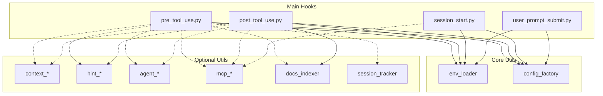

# Hooks System Dependency Map

## Main Hooks Import Analysis

### pre_tool_use.py (845+ lines)
**Direct imports:**
- Standard library: `json`, `sys`, `re`, `datetime`, `pathlib.Path`
- Utils dependencies (required):
  - `utils.env_loader`: `get_ai_data_path`, `is_claude_edit_enabled`
  - `utils.config_factory`: `get_error_message`, `get_warning_message`, `get_info_message`
- Utils dependencies (optional - in try/except):
  - `utils.docs_indexer`: `check_documentation_requirement`
  - `utils.session_tracker`: `is_file_in_session`, `is_folder_in_session`, `add_modified_file`, `add_modified_folder`
  - `utils.context_injector`: `inject_context_sync`
  - `utils.hint_analyzer`: `analyze_and_hint`
  - `utils.role_enforcer`: `check_tool_permission`
  - `utils.mcp_task_interceptor`: `get_mcp_interceptor`
  - `utils.hint_bridge`: `get_pending_hints`
  - `utils.agent_delegator`: `check_delegation_pattern`

### post_tool_use.py (345 lines)
**Direct imports:**
- Standard library: `json`, `os`, `sys`, `pathlib.Path`, `datetime`
- Utils dependencies (required):
  - `utils.env_loader`: `get_ai_data_path`
  - `utils.docs_indexer`: `update_index`, `check_documentation_requirement`, `move_to_obsolete`
  - `utils.config_factory`: `get_warning_message`, `get_info_message`
- Utils dependencies (optional - in try/except):
  - `utils.context_updater`: `update_context_sync`
  - `utils.agent_context_manager`: `switch_to_agent`
  - `utils.agent_state_manager`: `update_agent_state_from_call_agent`
  - `utils.mcp_post_action_hints`: `generate_post_action_hints`
  - `utils.hint_bridge`: `store_hint`
  - `utils.post_action_display`: `format_for_claude_display`

### session_start.py (23K lines)
**Direct imports:**
- Standard library: `json`, `sys`, `os`, `subprocess`, `socket`, `platform`, etc.
- Utils dependencies (required):
  - `utils.env_loader`: `get_ai_data_path`
  - `utils.cache_manager`: `get_session_cache`
  - `utils.config_factory`: Multiple message getters
- Utils dependencies (optional):
  - `utils.mcp_client`: `get_default_client`, `ResilientMCPClient`

### user_prompt_submit.py
**Direct imports:**
- Standard library: `json`, `sys`, `pathlib.Path`
- Utils dependencies:
  - Similar pattern to other hooks

### post_tool_use_refactored.py (Our new refactored version)
**Direct imports:**
- Standard library: `json`, `sys`, `pathlib.Path`, `datetime`, `typing`
- Utils dependencies (minimal):
  - `utils.env_loader`: `get_ai_data_path`
  - Dynamic imports for specific components

## Utils Module Cross-Dependencies

### Critical Circular Dependencies Found
1. **None identified** - Utils modules generally don't import each other

### Utils Module Categories

#### Core Infrastructure (No dependencies)
- `env_loader.py` - Environment variable loading
- `config_factory.py` - Configuration management

#### Context Management (Depends on core)
- `context_injector.py`
- `context_synchronizer.py`
- `context_updater.py`

#### Hint System (Depends on core)
- `hint_analyzer.py`
- `hint_bridge.py`
- `mcp_hint_matrix.py`
- `mcp_post_action_hints.py`
- `post_action_display.py`

#### Agent Management (Depends on core)
- `agent_context_manager.py`
- `agent_delegator.py`
- `agent_helpers.py`
- `agent_state_manager.py`

#### MCP Integration (Depends on core)
- `mcp_client.py`
- `mcp_task_interceptor.py`
- `mcp_task_validator.py`

#### Session & Cache (Depends on core)
- `cache_manager.py`
- `session_tracker.py`

#### Documentation (Depends on core)
- `docs_indexer.py`

#### Security & Validation (Depends on core)
- `role_enforcer.py`
- `task_tracker.py`

## External Package Requirements

### Python Standard Library
- `json`, `os`, `sys`, `re`, `pathlib`
- `datetime`, `time`, `socket`, `platform`
- `subprocess`, `shutil`, `argparse`
- `logging`, `hashlib`, `uuid`
- `typing`, `abc`, `collections`

### Third-Party Packages
- `yaml` - For YAML configuration loading
- `requests` (optional) - For MCP client connections

### Python Version
- Requires Python >= 3.8 (based on script headers)

## Dependency Graph

## Key Findings

### 1. No Circular Dependencies
- Utils modules don't import each other
- Clean dependency hierarchy from hooks → utils

### 2. Heavy Use of Optional Imports
- Most advanced features use try/except imports
- Allows hooks to work with missing components
- Makes system fragile and hard to test

### 3. Two Core Dependencies
- `env_loader.py` - Used by all hooks
- `config_factory.py` - Used by all hooks
- These are the critical infrastructure components

### 4. Module Proliferation
- 23 utils modules with overlapping responsibilities
- Many modules have similar names (hint_*, context_*, mcp_*)
- Clear opportunity for consolidation

## Recommendations for Refactoring

1. **Keep Core Infrastructure**
   - `env_loader.py` and `config_factory.py` are well-designed
   - These should remain as foundation

2. **Consolidate Related Modules**
   - Merge 3 hint modules → 1 `hint_manager.py`
   - Merge 3 context modules → 1 `context_manager.py`
   - Merge 4 MCP modules → 1 `mcp_manager.py`
   - Merge 4 agent modules → 1 `agent_manager.py`

3. **Eliminate Optional Imports**
   - Use factory pattern for component creation
   - Make all dependencies explicit
   - Use feature flags instead of try/except

4. **Create Clear Interfaces**
   - Define abstract base classes
   - Use dependency injection
   - Implement proper error handling