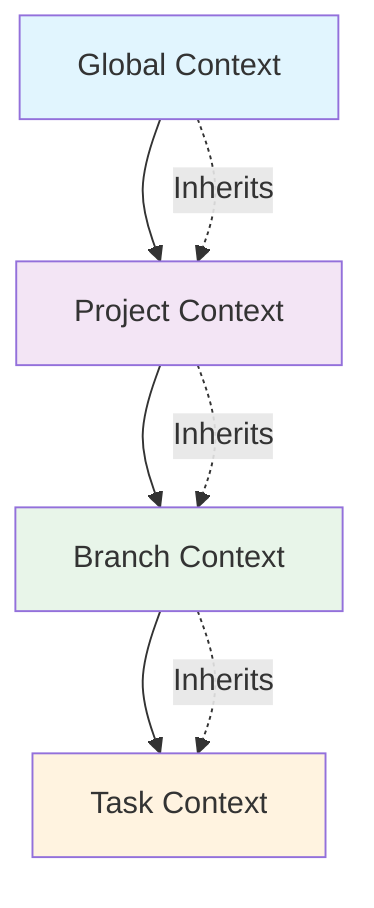

# Context Data Models - 4-Tier Hierarchy System

## Overview

The DhafnckMCP Context System operates on a 4-tier hierarchical structure: **Global → Project → Branch → Task**. Each tier has specific data models, update patterns, and inheritance behaviors designed to optimize multi-agent collaboration and session persistence.

This document provides the definitive guide to:
- **Data Models**: Exact structure for each context level
- **Update Patterns**: When and how agents should update contexts
- **Usage Examples**: Real-world scenarios with concrete data
- **Inheritance Flow**: How data flows between hierarchy levels

## 🏗️ Context Hierarchy Architecture



### Inheritance Principles
- **Downward Flow**: Information flows from Global → Project → Branch → Task
- **Override Capability**: Lower levels can override higher level settings
- **Automatic Resolution**: Child contexts automatically inherit parent data
- **User Isolation**: Each user has completely isolated context instances

---

## 🌐 Global Context Data Model

### Purpose
Organization-wide or user-specific standards that apply across all projects and work.

### Data Structure
```json
{
  "autonomous_rules": {
    "auto_fix_enabled": true,
    "max_retries": 3,
    "escalation_threshold": 5,
    "auto_delegate_to_specialists": true
  },
  "security_policies": {
    "require_2fa": true,
    "session_timeout_minutes": 60,
    "password_policy": "strong",
    "audit_all_actions": true,
    "encryption_required": ["passwords", "tokens", "secrets"]
  },
  "coding_standards": {
    "primary_language": "python",
    "style_guide": "pep8",
    "documentation_required": true,
    "test_coverage_minimum": 80,
    "code_review_required": true,
    "formatting_tools": ["black", "isort", "flake8"]
  },
  "workflow_templates": {
    "pull_request_template": "## Changes\n\n## Testing\n\n## Checklist",
    "issue_template": "## Problem\n\n## Expected Behavior\n\n## Steps to Reproduce",
    "commit_message_format": "type(scope): description",
    "branch_naming": "type/short-description",
    "release_process": ["create-branch", "test", "review", "merge", "deploy"]
  },
  "delegation_rules": {
    "auto_delegate_threshold": 0.8,
    "preferred_agents": {
      "coding": "coding-agent",
      "testing": "test-orchestrator-agent", 
      "documentation": "documentation-agent",
      "security": "security-auditor-agent"
    },
    "escalation_chain": ["peer_review", "senior_developer", "tech_lead"]
  }
}
```

### When to Update Global Context

| Scenario | Update Trigger | Data to Add |
|----------|---------------|-------------|
| **Organization Standards Change** | Policy updates | Security policies, coding standards |
| **New Tool Adoption** | Tool implementation | Workflow templates, coding standards |
| **Process Improvements** | Process refinement | Delegation rules, workflow templates |
| **Security Incidents** | Security review | Security policies, autonomous rules |
| **Team Scaling** | Team growth | Delegation rules, workflow templates |

### Global Context Update Example
```python
# Scenario: Implementing new security policy after audit
manage_context(
    action="update",
    level="global", 
    context_id=f"global-{user_id}",
    data={
        "security_policies": {
            "require_2fa": True,
            "session_timeout_minutes": 30,  # Reduced from 60
            "audit_all_actions": True,
            "mandatory_security_headers": ["X-Frame-Options", "X-XSS-Protection"],
            "vulnerability_scanning": "weekly"
        },
        "autonomous_rules": {
            "security_fix_auto_apply": False,  # New: require manual review
            "escalate_security_issues": True
        }
    }
)
```

---

## 🏢 Project Context Data Model

### Purpose
Project-specific configuration, team preferences, and technology choices that apply to all branches within a project.

### Data Structure
```json
{
  "team_preferences": {
    "working_hours": "9:00-17:00 EST",
    "timezone": "America/New_York", 
    "code_review_required": true,
    "min_reviewers": 2,
    "review_assignment": "round_robin",
    "notification_channels": ["slack", "email"],
    "meeting_schedule": {
      "standups": "daily_9am",
      "planning": "monday_10am",
      "retrospective": "friday_3pm"
    }
  },
  "technology_stack": {
    "frontend": ["React", "TypeScript", "Tailwind CSS", "Vite"],
    "backend": ["Python", "FastAPI", "SQLAlchemy", "Pydantic"],
    "database": ["PostgreSQL", "Redis"],
    "testing": ["pytest", "jest", "playwright"],
    "infrastructure": ["Docker", "Kubernetes", "AWS"],
    "monitoring": ["Prometheus", "Grafana", "Sentry"],
    "ci_cd": ["GitHub Actions", "Docker Registry"]
  },
  "project_workflow": {
    "branch_strategy": "GitFlow",
    "main_branch": "main",
    "development_branch": "develop", 
    "feature_branch_prefix": "feature/",
    "release_branch_prefix": "release/",
    "hotfix_branch_prefix": "hotfix/",
    "merge_strategy": "squash_and_merge",
    "deployment_stages": ["development", "staging", "production"],
    "release_frequency": "bi_weekly",
    "hotfix_process": "immediate_review_and_deploy"
  },
  "local_standards": {
    "naming_conventions": {
      "variables": "snake_case",
      "functions": "snake_case", 
      "classes": "PascalCase",
      "files": "snake_case",
      "directories": "kebab-case"
    },
    "documentation_standards": {
      "docstring_style": "google",
      "api_documentation": "openapi",
      "readme_sections": ["install", "usage", "api", "contributing"],
      "changelog_format": "keepachangelog"
    },
    "test_requirements": {
      "unit_test_coverage": 85,
      "integration_test_required": true,
      "e2e_test_critical_paths": true,
      "performance_test_threshold": "2s_response_time"
    },
    "code_quality": {
      "linter_rules": "strict",
      "complexity_threshold": 10,
      "line_length_limit": 88,
      "import_sorting": true
    }
  }
}
```

### When to Update Project Context

| Scenario | Update Trigger | Data to Add |
|----------|---------------|-------------|
| **New Team Member** | Onboarding | Team preferences, workflow processes |
| **Technology Change** | Stack decision | Technology stack, local standards |
| **Process Improvement** | Retrospective feedback | Project workflow, team preferences |
| **Quality Issues** | Code review findings | Local standards, test requirements |
| **Scaling Needs** | Team/project growth | Team preferences, project workflow |

### Project Context Evolution Examples

#### Empty Initial Context (New Project)
```python
# When project is first created
manage_context(
    action="create",
    level="project",
    context_id=project_id,
    data={
        "team_preferences": {},
        "technology_stack": {},
        "project_workflow": {},
        "local_standards": {}
    }
)
```

#### Partially Filled During Setup
```python
# After initial technology decisions
manage_context(
    action="update", 
    level="project",
    context_id=project_id,
    data={
        "technology_stack": {
            "frontend": ["React", "TypeScript"],
            "backend": ["Python", "FastAPI"],
            "database": ["PostgreSQL"]
        },
        "project_workflow": {
            "main_branch": "main",
            "merge_strategy": "squash_and_merge"
        }
    }
)
```

#### Complete Context After Team Formation
```python
# After team processes are established
manage_context(
    action="update",
    level="project", 
    context_id=project_id,
    data={
        "team_preferences": {
            "working_hours": "9:00-17:00 EST",
            "code_review_required": True,
            "min_reviewers": 2,
            "notification_channels": ["slack"]
        },
        "technology_stack": {
            "frontend": ["React", "TypeScript", "Tailwind CSS"],
            "backend": ["Python", "FastAPI", "SQLAlchemy"],
            "database": ["PostgreSQL", "Redis"],
            "testing": ["pytest", "jest"],
            "infrastructure": ["Docker", "AWS"]
        },
        "project_workflow": {
            "branch_strategy": "GitFlow",
            "main_branch": "main",
            "feature_branch_prefix": "feature/",
            "merge_strategy": "squash_and_merge",
            "deployment_stages": ["development", "staging", "production"]
        },
        "local_standards": {
            "naming_conventions": {
                "variables": "snake_case",
                "classes": "PascalCase"
            },
            "test_requirements": {
                "unit_test_coverage": 85
            }
        }
    }
)
```

---

## 🌿 Branch Context Data Model

### Purpose
Feature or branch-specific settings, flags, and patterns that apply to all tasks within a branch.

### Data Structure
```json
{
  "branch_workflow": {
    "branch_name": "feature/user-authentication",
    "branch_type": "feature",
    "base_branch": "develop",
    "merge_strategy": "squash",
    "requires_ci_pass": true,
    "auto_delete_after_merge": true,
    "review_requirements": {
      "min_reviewers": 2,
      "require_owner_review": true,
      "dismiss_stale_reviews": true
    },
    "deployment_strategy": {
      "auto_deploy_to_dev": true,
      "manual_deploy_to_staging": true
    }
  },
  "feature_flags": {
    "enable_new_auth_ui": true,
    "use_experimental_jwt": false,
    "bypass_rate_limiting": true,
    "debug_auth_flow": true,
    "mock_external_services": true,
    "enable_auth_logging": true,
    "skip_email_verification": false
  },
  "active_patterns": {
    "authentication_patterns": {
      "jwt_implementation": true,
      "refresh_token_rotation": true,
      "oauth2_integration": false
    },
    "data_patterns": {
      "repository_pattern": true,
      "unit_of_work": true,
      "cqrs": false
    },
    "security_patterns": {
      "rate_limiting": true,
      "input_validation": true,
      "output_sanitization": true
    }
  },
  "local_overrides": {
    "bypass_standard_review": false,
    "allow_direct_push": false,
    "custom_ci_config": "auth-feature-ci.yml",
    "extended_test_timeout": true,
    "debug_mode_enabled": true
  }
}
```

### When to Update Branch Context

| Scenario | Update Trigger | Data to Add |
|----------|---------------|-------------|
| **Feature Development Start** | Branch creation | Branch workflow, feature flags |
| **Pattern Discovery** | Implementation decisions | Active patterns, local overrides |
| **Testing Needs** | QA requirements | Feature flags, local overrides |
| **Integration Issues** | External service problems | Feature flags, active patterns |
| **Performance Optimization** | Performance testing | Active patterns, local overrides |

### Branch Context Evolution Examples

#### Initial Branch Setup
```python
# When feature branch is created
manage_context(
    action="create",
    level="branch",
    context_id=branch_id,
    git_branch_id=branch_id,
    data={
        "branch_workflow": {
            "branch_name": "feature/user-authentication",
            "branch_type": "feature",
            "base_branch": "develop"
        },
        "feature_flags": {
            "debug_auth_flow": True,
            "mock_external_services": True
        },
        "active_patterns": {},
        "local_overrides": {}
    }
)
```

#### During Development
```python
# After implementing JWT authentication
manage_context(
    action="update",
    level="branch",
    context_id=branch_id,
    data={
        "active_patterns": {
            "authentication_patterns": {
                "jwt_implementation": True,
                "refresh_token_rotation": True
            },
            "security_patterns": {
                "rate_limiting": True,
                "input_validation": True
            }
        },
        "feature_flags": {
            "enable_new_auth_ui": True,
            "debug_auth_flow": True,
            "enable_auth_logging": True
        }
    }
)
```

#### Ready for Review
```python
# Before creating pull request
manage_context(
    action="update",
    level="branch", 
    context_id=branch_id,
    data={
        "branch_workflow": {
            "requires_ci_pass": True,
            "review_requirements": {
                "min_reviewers": 2,
                "require_security_review": True
            }
        },
        "feature_flags": {
            "debug_auth_flow": False,  # Disabled for production
            "mock_external_services": False,
            "enable_auth_logging": False
        }
    }
)
```

---

## 📋 Task Context Data Model

### Purpose
Individual task execution context, discoveries, decisions, and implementation details.

### Data Structure
```json
{
  "task_data": {
    "task_id": "550e8400-e29b-41d4-a716-446655440000",
    "title": "Implement JWT token generation and validation",
    "description": "Create JWT token service with signing, validation, and refresh functionality",
    "status": "in_progress",
    "priority": "high",
    "assignee": "coding-agent",
    "estimated_effort": "6 hours",
    "actual_effort": "4 hours 30 minutes",
    "completion_percentage": 75,
    "dependencies": ["setup-redis-connection", "install-jwt-library"]
  },
  "execution_context": {
    "environment": "development",
    "python_version": "3.11.5",
    "virtual_env": "/app/venv",
    "working_directory": "/app/auth",
    "git_branch": "feature/user-authentication",
    "git_commit": "a1b2c3d4",
    "dependencies_installed": [
      "PyJWT==2.8.0",
      "cryptography==41.0.7",
      "redis==5.0.1"
    ],
    "environment_variables": {
      "JWT_SECRET_KEY": "configured",
      "REDIS_URL": "localhost:6379",
      "TOKEN_EXPIRE_MINUTES": "15"
    }
  },
  "discovered_patterns": {
    "jwt_best_practices": {
      "algorithm": "RS256",
      "token_expiry": "15_minutes",
      "refresh_expiry": "7_days",
      "key_rotation": "monthly"
    },
    "error_handling_patterns": {
      "token_expired": "return_401_with_refresh_hint",
      "invalid_signature": "return_401_immediate",
      "missing_token": "return_401_with_auth_required"
    },
    "performance_optimizations": {
      "token_caching": "redis_with_ttl",
      "signature_verification": "cache_public_keys",
      "bulk_token_validation": "batch_redis_operations"
    }
  },
  "local_decisions": {
    "technical_decisions": {
      "jwt_library": "PyJWT (official Python library)",
      "signing_algorithm": "RS256 for better security",
      "token_storage": "Redis with automatic TTL",
      "refresh_strategy": "Sliding window renewal"
    },
    "implementation_choices": {
      "error_responses": "RFC 7519 compliant error codes",
      "logging_level": "INFO for production, DEBUG for development",
      "validation_order": "signature -> expiry -> claims -> permissions"
    },
    "testing_approach": {
      "unit_tests": "test each JWT operation independently",
      "integration_tests": "test full auth flow end-to-end",
      "security_tests": "test token tampering and expiry scenarios"
    }
  },
  "implementation_notes": {
    "files_created": [
      "auth/jwt_service.py",
      "auth/models/token.py",
      "auth/exceptions.py"
    ],
    "files_modified": [
      "auth/routes.py",
      "auth/__init__.py",
      "requirements.txt"
    ],
    "tests_added": [
      "tests/auth/test_jwt_service.py", 
      "tests/auth/test_token_validation.py",
      "tests/integration/test_auth_flow.py"
    ],
    "configuration_changes": [
      "Added JWT_SECRET_KEY to environment variables",
      "Configured Redis connection for token storage",
      "Updated logging configuration for auth module"
    ],
    "documentation_updated": [
      "auth/README.md - JWT implementation guide",
      "ai_docs/api/authentication.md - API endpoint documentation"
    ]
  },
  "blockers_and_solutions": {
    "current_blockers": [],
    "resolved_blockers": [
      {
        "blocker": "Missing Redis connection configuration",
        "solution": "Added REDIS_URL environment variable and connection pooling",
        "resolution_date": "2025-01-15T10:30:00Z",
        "time_lost": "30 minutes"
      },
      {
        "blocker": "JWT library compatibility issues",
        "solution": "Upgraded to PyJWT 2.8.0 for Python 3.11 compatibility",
        "resolution_date": "2025-01-15T14:15:00Z", 
        "time_lost": "1 hour"
      }
    ]
  },
  "collaboration_notes": {
    "agent_handoffs": [
      {
        "from_agent": "coding-agent",
        "to_agent": "security-auditor-agent",
        "handoff_reason": "Security review of JWT implementation",
        "handoff_date": "2025-01-15T16:00:00Z",
        "status": "completed",
        "feedback": "Security implementation approved with minor suggestions"
      }
    ],
    "peer_reviews": [
      {
        "reviewer": "@senior_developer_agent",
        "review_date": "2025-01-15T17:30:00Z",
        "status": "approved_with_suggestions",
        "feedback": "Good implementation, suggested adding token blacklisting"
      }
    ]
  }
}
```

### When to Update Task Context

| Scenario | Update Trigger | Data to Add |
|----------|---------------|-------------|
| **Task Start** | Begin work | Task data, execution context |
| **Progress Made** | Incremental work | Implementation notes, discovered patterns |
| **Decision Points** | Architecture choices | Local decisions, discovered patterns |
| **Blockers Encountered** | Impediments found | Blockers and solutions |
| **Pattern Discovery** | Best practices found | Discovered patterns, local decisions |
| **Agent Handoff** | Work transfer | Collaboration notes, task data |
| **Task Completion** | Work finished | Implementation notes, final status |

### Task Context Evolution Examples

#### Task Initialization
```python
# When task is created and assigned
manage_context(
    action="create", 
    level="task",
    context_id=task_id,
    git_branch_id=branch_id,
    data={
        "task_data": {
            "title": "Implement JWT token generation and validation",
            "status": "todo", 
            "priority": "high",
            "assignee": "coding-agent",
            "estimated_effort": "6 hours"
        },
        "execution_context": {
            "environment": "development",
            "python_version": "3.11.5"
        }
    }
)
```

#### Analysis Phase
```python
# After analyzing requirements and existing code
manage_context(
    action="update",
    level="task", 
    context_id=task_id,
    data={
        "task_data": {
            "status": "in_progress",
            "completion_percentage": 10
        },
        "discovered_patterns": {
            "existing_auth": {
                "current_implementation": "basic session-based auth",
                "migration_needed": "gradual transition to JWT",
                "compatibility_layer": "support both during transition"
            }
        },
        "local_decisions": {
            "technical_decisions": {
                "jwt_library": "PyJWT (official Python library)",
                "migration_strategy": "parallel implementation with feature flag"
            }
        }
    }
)
```

#### Implementation Progress
```python
# After implementing core JWT functionality
manage_context(
    action="update",
    level="task",
    context_id=task_id, 
    data={
        "task_data": {
            "completion_percentage": 60,
            "actual_effort": "3 hours 45 minutes"
        },
        "implementation_notes": {
            "files_created": [
                "auth/jwt_service.py",
                "auth/models/token.py"
            ],
            "files_modified": [
                "auth/routes.py",
                "requirements.txt"
            ]
        },
        "discovered_patterns": {
            "jwt_best_practices": {
                "algorithm": "RS256",
                "token_expiry": "15_minutes",
                "refresh_expiry": "7_days"
            }
        }
    }
)
```

#### Blocker Encountered
```python
# When Redis connection issue is discovered
manage_context(
    action="update",
    level="task",
    context_id=task_id,
    data={
        "blockers_and_solutions": {
            "current_blockers": [
                {
                    "blocker": "Redis connection failing in test environment",
                    "impact": "Cannot test token storage functionality",
                    "discovered_at": "2025-01-15T11:00:00Z",
                    "potential_solutions": [
                        "Update Redis configuration",
                        "Mock Redis for tests",
                        "Use in-memory storage for testing"
                    ]
                }
            ]
        }
    }
)
```

#### Blocker Resolution
```python
# After resolving Redis issue
manage_context(
    action="update",
    level="task", 
    context_id=task_id,
    data={
        "blockers_and_solutions": {
            "current_blockers": [],  # Cleared
            "resolved_blockers": [
                {
                    "blocker": "Redis connection failing in test environment",
                    "solution": "Added REDIS_URL environment variable and connection pooling",
                    "resolution_date": "2025-01-15T11:30:00Z",
                    "time_lost": "30 minutes"
                }
            ]
        },
        "task_data": {
            "completion_percentage": 75
        }
    }
)
```

#### Task Completion
```python
# When task is fully completed
manage_context(
    action="update",
    level="task",
    context_id=task_id,
    data={
        "task_data": {
            "status": "completed",
            "completion_percentage": 100,
            "actual_effort": "5 hours 30 minutes"
        },
        "implementation_notes": {
            "files_created": [
                "auth/jwt_service.py",
                "auth/models/token.py", 
                "auth/exceptions.py"
            ],
            "files_modified": [
                "auth/routes.py",
                "auth/__init__.py",
                "requirements.txt"
            ],
            "tests_added": [
                "tests/auth/test_jwt_service.py",
                "tests/auth/test_token_validation.py"
            ],
            "documentation_updated": [
                "ai_docs/api/authentication.md"
            ]
        },
        "collaboration_notes": {
            "peer_reviews": [
                {
                    "reviewer": "security-auditor-agent",
                    "status": "approved",
                    "feedback": "Security implementation meets standards"
                }
            ]
        }
    }
)
```

---

## 🔄 Context Update Patterns for Agents

### Pattern 1: Discovery and Decision Documentation
When agents discover existing code, make architectural decisions, or find patterns:

```python
# Document discovered patterns for future reference
manage_context(
    action="add_insight",
    level="task", # or "branch" for broader patterns
    context_id=context_id,
    content=f"Found existing {pattern_name} implementation in {file_path}",
    category="discovery",
    importance="medium"
)

# Document decisions made
manage_context(
    action="update",
    level="task",
    context_id=task_id,
    data={
        "local_decisions": {
            "architecture_choices": {
                "decision": decision_description,
                "rationale": decision_reasoning,
                "alternatives_considered": [alt1, alt2, alt3],
                "date": current_timestamp
            }
        }
    }
)
```

### Pattern 2: Progressive Enhancement
Building context incrementally as work progresses:

```python
# Initial minimal context
manage_context(action="create", level="task", context_id=task_id, 
              data={"task_data": {"title": title, "status": "todo"}})

# Add execution context when starting
manage_context(action="update", level="task", context_id=task_id,
              data={"execution_context": environment_info})

# Add discoveries during analysis  
manage_context(action="update", level="task", context_id=task_id,
              data={"discovered_patterns": patterns_found})

# Add implementation notes during coding
manage_context(action="update", level="task", context_id=task_id, 
              data={"implementation_notes": {"files_modified": files}})

# Add final summary at completion
manage_context(action="update", level="task", context_id=task_id,
              data={"task_data": {"status": "completed", "summary": summary}})
```

### Pattern 3: Multi-Agent Collaboration
Coordinating between agents through context:

```python
# Agent A documents handoff
manage_context(
    action="update",
    level="task",
    context_id=task_id,
    data={
        "collaboration_notes": {
            "agent_handoffs": [{
                "from_agent": "coding-agent",
                "to_agent": "security-auditor-agent", 
                "handoff_reason": "Security review required",
                "work_completed": "JWT implementation finished",
                "next_steps": "Review cryptographic choices and token handling"
            }]
        }
    }
)

# Agent B reads context and adds review
manage_context(
    action="update", 
    level="task",
    context_id=task_id,
    data={
        "collaboration_notes": {
            "peer_reviews": [{
                "reviewer": "security-auditor-agent",
                "review_date": current_timestamp,
                "status": "approved_with_suggestions",
                "feedback": "Security implementation solid, recommend adding token blacklisting"
            }]
        }
    }
)
```

### Pattern 4: Pattern Delegation
Moving reusable patterns to higher levels:

```python
# Delegate from task to branch (for feature-specific patterns)
manage_context(
    action="delegate",
    level="task", 
    context_id=task_id,
    delegate_to="branch",
    delegate_data={
        "authentication_patterns": {
            "jwt_implementation": jwt_pattern_code,
            "error_handling": error_pattern_code,
            "testing_approach": test_pattern_code
        }
    },
    delegation_reason="Pattern reusable across all auth tasks in this feature"
)

# Delegate from branch to project (for project-wide patterns)  
manage_context(
    action="delegate",
    level="branch",
    context_id=branch_id,
    delegate_to="project", 
    delegate_data={
        "security_patterns": {
            "jwt_auth": full_jwt_implementation,
            "rate_limiting": rate_limit_implementation
        }
    },
    delegation_reason="Authentication patterns applicable to entire project"
)
```

---

## 📊 Context Inheritance Flow

### Inheritance Resolution Process

When a context is resolved (e.g., when an agent reads task context), the system:

1. **Loads Direct Context**: Gets the specific level's stored data
2. **Resolves Parent Chain**: Loads Global → Project → Branch contexts  
3. **Merges Hierarchically**: Combines data with child overriding parent
4. **Returns Unified View**: Single merged context with full inheritance

### Inheritance Example

Given these contexts:

**Global Context:**
```json
{
  "coding_standards": {
    "test_coverage_minimum": 80,
    "documentation_required": true
  }
}
```

**Project Context:**
```json
{
  "local_standards": {
    "test_coverage_minimum": 90,  // Overrides global
    "naming_conventions": {
      "variables": "snake_case" 
    }
  }
}
```

**Branch Context:**
```json
{
  "feature_flags": {
    "debug_mode_enabled": true
  }
}
```

**Task Context:**
```json
{
  "task_data": {
    "title": "Implement authentication",
    "status": "in_progress"
  }
}
```

**Resolved Task Context (with inheritance):**
```json
{
  // From Task Context
  "task_data": {
    "title": "Implement authentication", 
    "status": "in_progress"
  },
  // From Branch Context  
  "feature_flags": {
    "debug_mode_enabled": true
  },
  // From Project Context
  "local_standards": {
    "test_coverage_minimum": 90,  // Overrides global 80
    "naming_conventions": {
      "variables": "snake_case"
    }
  },
  // From Global Context (non-overridden)
  "coding_standards": {
    "test_coverage_minimum": 80,  // Overridden by project
    "documentation_required": true
  }
}
```

### Override Precedence
**Task** overrides **Branch** overrides **Project** overrides **Global**

---

## 🎯 Best Practices for Agents

### 1. Context Reading Best Practices

**Always Read Context Before Starting Work:**
```python
# Get full context with inheritance for comprehensive understanding
context = manage_context(
    action="resolve",
    level="task",  # or appropriate level
    context_id=task_id,
    include_inherited=True,
    force_refresh=False
)

# Extract relevant information
coding_standards = context.get("coding_standards", {})
project_workflow = context.get("project_workflow", {})
discovered_patterns = context.get("discovered_patterns", {})
```

### 2. Context Writing Best Practices

**Preserve Existing Context:**
```python
# ❌ BAD - Overwrites existing context
manage_context(action="update", level="task", context_id=task_id,
              data={"new_field": "new_value"})

# ✅ GOOD - Reads existing, then updates incrementally  
existing_context = manage_context(action="get", level="task", context_id=task_id)
updated_data = existing_context.get("data", {})
updated_data["new_field"] = "new_value"
manage_context(action="update", level="task", context_id=task_id,
              data=updated_data)
```

### 3. Level-Appropriate Updates

**Choose the Right Level:**
- **Task**: Implementation details, specific decisions, blockers
- **Branch**: Feature patterns, branch-specific flags, team coordination  
- **Project**: Technology stack, team preferences, project-wide standards
- **Global**: Organization policies, universal coding standards

### 4. Incremental Context Building

**Build Context Progressively:**
```python
# Phase 1: Initialize
manage_context(action="create", level="task", ...)

# Phase 2: Add analysis findings  
manage_context(action="add_insight", level="task", ...)

# Phase 3: Document decisions
manage_context(action="update", level="task", ...)

# Phase 4: Record implementation progress
manage_context(action="add_progress", level="task", ...)

# Phase 5: Delegate reusable patterns
manage_context(action="delegate", level="task", ...)
```

### 5. Context for Frontend Visibility

**Ensure Frontend Access:**
```python
# Tasks need explicit context creation for frontend visibility
task = manage_task(action="create", ...)

# REQUIRED: Create context for frontend "Actions" visibility
manage_context(
    action="create",
    level="task", 
    context_id=task["task"]["id"],
    git_branch_id=branch_id,
    data={
        "task_data": {
            "title": task["task"]["title"],
            "status": task["task"]["status"]
        }
    }
)
```

---

## 🔧 Common Anti-Patterns to Avoid

### ❌ Anti-Pattern 1: Context Overwriting
```python
# DON'T - This overwrites existing context
manage_context(action="update", level="task", context_id=task_id,
              data={"only_new_field": "value"})
```

### ❌ Anti-Pattern 2: Wrong Level Storage
```python
# DON'T - Storing implementation details at project level
manage_context(action="update", level="project", context_id=project_id,
              data={"current_task_files": ["file1.py", "file2.py"]})
```

### ❌ Anti-Pattern 3: Missing Context Creation
```python
# DON'T - Assuming task context exists
manage_context(action="update", level="task", context_id=task_id, ...)

# DO - Ensure context exists first
try:
    manage_context(action="get", level="task", context_id=task_id)
except:
    manage_context(action="create", level="task", context_id=task_id, ...)
```

### ❌ Anti-Pattern 4: Ignoring Inheritance
```python
# DON'T - Only reading direct context
task_context = manage_context(action="get", level="task", context_id=task_id)

# DO - Reading with inheritance for complete picture
task_context = manage_context(action="resolve", level="task", context_id=task_id,
                            include_inherited=True)
```

---

## 🎯 Summary

The 4-tier context system provides a robust foundation for multi-agent collaboration and persistent session management. Key principles:

1. **Hierarchical Storage**: Global → Project → Branch → Task with proper inheritance
2. **Progressive Enhancement**: Build context incrementally as work progresses
3. **Level-Appropriate Data**: Store data at the right hierarchy level
4. **Preserve and Extend**: Always read existing context before updating
5. **Pattern Delegation**: Move reusable patterns to higher levels
6. **Frontend Visibility**: Explicitly create contexts for UI access

By following these data models and patterns, agents can effectively coordinate, preserve knowledge across sessions, and build upon previous work in a structured, maintainable way.