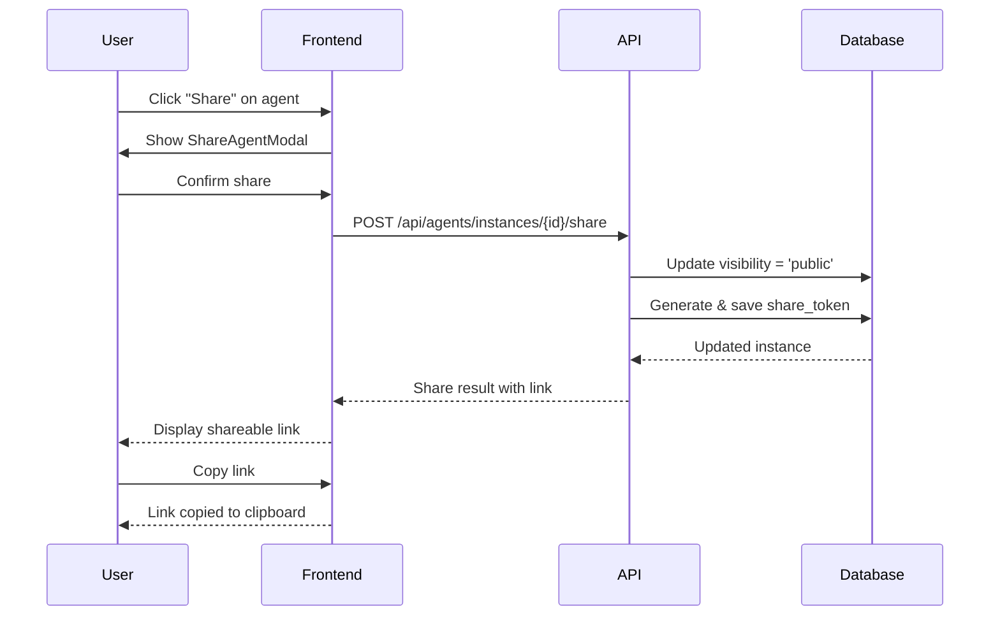
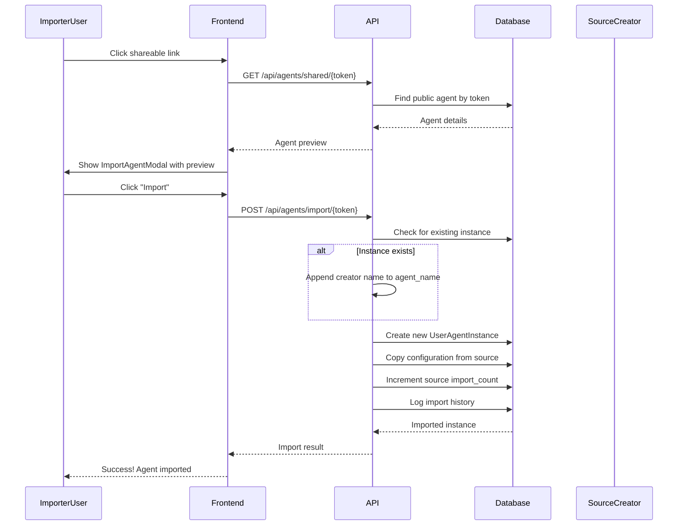
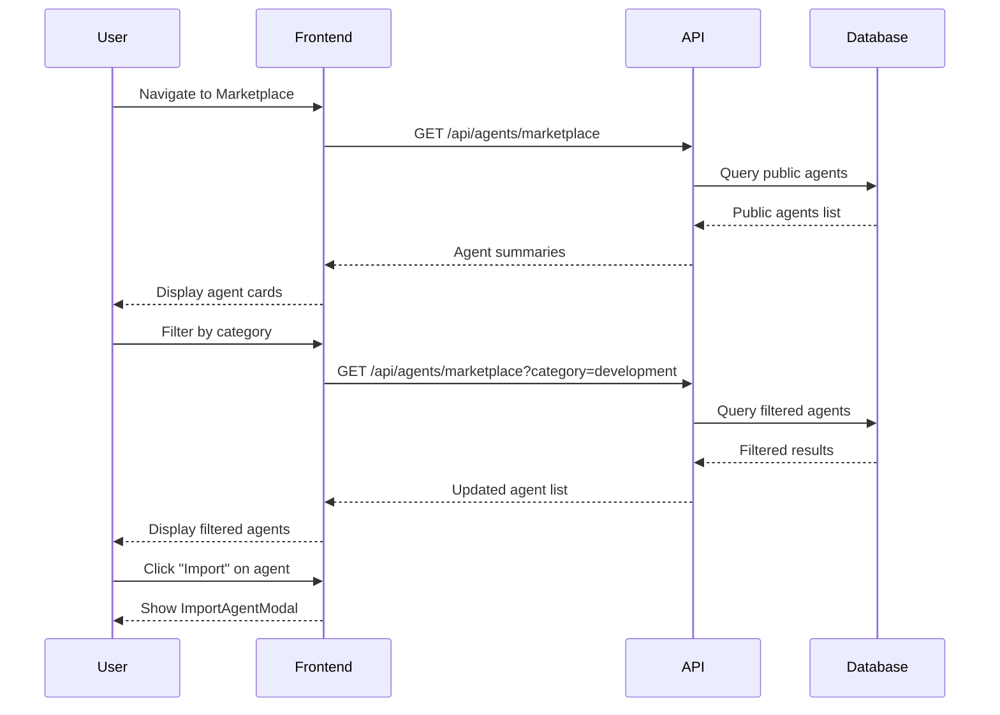

# Agent Sharing and Import System

## Overview

This document extends the **User-Specific Agent System Architecture** with social features that allow users to share their customized agents and import agents created by others, creating a collaborative agent marketplace.

---

## New Features

### 1. Agent Sharing
- Users can make their customized agents **public** (shareable)
- Generate a **shareable link** for public agents
- Other users can view shared agent details
- Import shared agents into their own workspace

### 2. Agent Importing
- Import another user's agent via shareable link
- **Import modal** confirmation before adding
- **Name collision handling**: If same agent exists, append creator name
- Track **agent lineage** (who created original customization)

### 3. Agent Attribution
- Display **creator information** for each agent:
  - "Default" for system templates
  - User email/name for user-customized agents
  - "Created by [username]" for imported agents

---

## Extended Database Schema

### Modified Table: user_agent_instances

```sql
ALTER TABLE user_agent_instances ADD COLUMN IF NOT EXISTS
    -- Sharing features
    visibility VARCHAR(20) DEFAULT 'private' CHECK (visibility IN ('private', 'public')),
    share_token VARCHAR(64) UNIQUE,  -- Generated for public agents
    share_count INTEGER DEFAULT 0,    -- How many times shared

    -- Attribution
    original_creator_id UUID,  -- NULL = system default, UUID = user who created customization
    imported_from_instance_id UUID,  -- Track import lineage

    -- Additional metadata
    is_imported BOOLEAN DEFAULT FALSE,
    import_count INTEGER DEFAULT 0;  -- How many times this agent was imported by others

-- Foreign keys
ALTER TABLE user_agent_instances
    ADD CONSTRAINT fk_original_creator
    FOREIGN KEY (original_creator_id) REFERENCES users(id) ON DELETE SET NULL;

ALTER TABLE user_agent_instances
    ADD CONSTRAINT fk_imported_from
    FOREIGN KEY (imported_from_instance_id) REFERENCES user_agent_instances(id) ON DELETE SET NULL;

-- Indexes for sharing
CREATE INDEX idx_user_agent_instances_share_token
    ON user_agent_instances(share_token) WHERE share_token IS NOT NULL;

CREATE INDEX idx_user_agent_instances_public
    ON user_agent_instances(user_id, visibility) WHERE visibility = 'public';

CREATE INDEX idx_user_agent_instances_creator
    ON user_agent_instances(original_creator_id) WHERE original_creator_id IS NOT NULL;
```

### New Table: agent_import_history

```sql
CREATE TABLE agent_import_history (
    id UUID PRIMARY KEY DEFAULT gen_random_uuid(),

    -- Who imported
    importer_user_id UUID NOT NULL,

    -- What was imported
    source_instance_id UUID NOT NULL,
    imported_instance_id UUID NOT NULL,

    -- When
    imported_at TIMESTAMP WITH TIME ZONE DEFAULT NOW(),

    -- Additional context
    share_token VARCHAR(64),

    -- Foreign keys
    FOREIGN KEY (importer_user_id) REFERENCES users(id) ON DELETE CASCADE,
    FOREIGN KEY (source_instance_id) REFERENCES user_agent_instances(id) ON DELETE CASCADE,
    FOREIGN KEY (imported_instance_id) REFERENCES user_agent_instances(id) ON DELETE CASCADE
);

-- Indexes for analytics
CREATE INDEX idx_import_history_importer ON agent_import_history(importer_user_id);
CREATE INDEX idx_import_history_source ON agent_import_history(source_instance_id);
CREATE INDEX idx_import_history_date ON agent_import_history(imported_at);
```

---

## Domain Layer Extensions

### Modified Entity: UserAgentInstance

```python
from enum import Enum

class AgentVisibility(Enum):
    PRIVATE = "private"
    PUBLIC = "public"

class UserAgentInstance:
    """Extended with sharing capabilities"""

    # ... existing fields ...

    # Sharing
    visibility: AgentVisibility
    share_token: Optional[str]
    share_count: int

    # Attribution
    original_creator_id: Optional[UserId]  # None = system default
    imported_from_instance_id: Optional[AgentInstanceId]

    # Import tracking
    is_imported: bool
    import_count: int

    # Methods

    def make_public(self) -> str:
        """
        Make agent public and generate share token
        Returns: share_token
        """
        if self.visibility == AgentVisibility.PUBLIC:
            return self.share_token

        self.visibility = AgentVisibility.PUBLIC
        self.share_token = self._generate_share_token()
        return self.share_token

    def make_private(self):
        """Make agent private (revoke sharing)"""
        self.visibility = AgentVisibility.PRIVATE
        self.share_token = None

    def get_shareable_link(self, base_url: str) -> str:
        """Get full shareable URL"""
        if not self.is_public():
            raise ValueError("Agent must be public to generate shareable link")
        return f"{base_url}/agents/import/{self.share_token}"

    def is_public(self) -> bool:
        """Check if agent is publicly shareable"""
        return self.visibility == AgentVisibility.PUBLIC

    def is_system_default(self) -> bool:
        """Check if this is a system default (not customized by user)"""
        return self.original_creator_id is None and not self.is_customized

    def is_user_created(self) -> bool:
        """Check if this was customized by a user"""
        return self.original_creator_id is not None

    def get_creator_display_name(self, users_repo) -> str:
        """Get display name for creator"""
        if self.is_system_default():
            return "Default"

        if self.original_creator_id:
            creator = users_repo.find_by_id(self.original_creator_id)
            return creator.email if creator else "Unknown"

        return "Default"

    def _generate_share_token(self) -> str:
        """Generate unique share token"""
        import secrets
        return secrets.token_urlsafe(48)  # 64 characters

    def increment_share_count(self):
        """Track when agent is shared"""
        self.share_count += 1

    def increment_import_count(self):
        """Track when agent is imported by someone"""
        self.import_count += 1
```

### New Domain Service: AgentSharingService

```python
class AgentSharingService:
    """Handles agent sharing logic"""

    def __init__(
        self,
        instance_repository: UserAgentInstanceRepository,
        users_repository: UserRepository
    ):
        self.instance_repo = instance_repository
        self.users_repo = users_repository

    def share_agent(
        self,
        instance: UserAgentInstance,
        base_url: str
    ) -> ShareResult:
        """
        Make agent public and generate shareable link

        Returns: ShareResult with link and token
        """
        # Validate user can share
        if not instance.is_customized:
            raise ValueError("Cannot share non-customized agents (use template instead)")

        # Make public and get token
        share_token = instance.make_public()

        # Save
        self.instance_repo.save(instance)

        # Generate shareable link
        shareable_link = instance.get_shareable_link(base_url)

        return ShareResult(
            share_token=share_token,
            shareable_link=shareable_link,
            agent_name=instance.agent_name
        )

    def revoke_sharing(self, instance: UserAgentInstance):
        """Revoke public sharing"""
        instance.make_private()
        self.instance_repo.save(instance)

    def get_shared_agent_details(
        self,
        share_token: str
    ) -> Optional[SharedAgentDetails]:
        """
        Get details of a shared agent (for preview before import)
        """
        instance = self.instance_repo.find_by_share_token(share_token)

        if not instance or not instance.is_public():
            return None

        creator = self.users_repo.find_by_id(instance.original_creator_id)

        return SharedAgentDetails(
            instance_id=instance.id,
            agent_name=instance.agent_name,
            template_slug=instance.template.slug,
            description=instance.configuration.instructions.content[:500],  # Preview
            creator_name=creator.email if creator else "System",
            creator_id=instance.original_creator_id,
            share_count=instance.share_count,
            is_customized=instance.is_customized,
            configuration_preview=instance.configuration.to_preview()
        )
```

### New Domain Service: AgentImportService

```python
class AgentImportService:
    """Handles agent importing logic"""

    def __init__(
        self,
        instance_repository: UserAgentInstanceRepository,
        template_repository: AgentTemplateRepository,
        users_repository: UserRepository
    ):
        self.instance_repo = instance_repository
        self.template_repo = template_repository
        self.users_repo = users_repository

    def import_agent(
        self,
        share_token: str,
        importer_user_id: UserId
    ) -> ImportResult:
        """
        Import a shared agent into user's workspace

        Handles name collision by appending creator name
        """
        # Get source agent
        source_instance = self.instance_repo.find_by_share_token(share_token)

        if not source_instance or not source_instance.is_public():
            raise ValueError("Agent not found or not publicly shared")

        # Check if user already has this template
        template = source_instance.template
        existing_instance = self.instance_repo.find_by_user_and_template(
            importer_user_id,
            template.id
        )

        # Determine agent name (handle collision)
        imported_agent_name = self._resolve_agent_name(
            source_instance,
            existing_instance,
            importer_user_id
        )

        # Create new instance with imported configuration
        imported_instance = UserAgentInstance(
            id=AgentInstanceId.generate(),
            user_id=importer_user_id,
            template_id=template.id,
            agent_name=imported_agent_name,
            is_customized=True,  # Imported agents are customized
            configuration=source_instance.configuration.copy(),  # Deep copy
            customizations=source_instance.customizations.copy(),
            visibility=AgentVisibility.PRIVATE,  # Always private on import
            original_creator_id=source_instance.original_creator_id or source_instance.user_id,
            imported_from_instance_id=source_instance.id,
            is_imported=True
        )

        # Save
        self.instance_repo.save(imported_instance)

        # Update source instance import count
        source_instance.increment_import_count()
        self.instance_repo.save(source_instance)

        # Log import history
        self._log_import_history(
            importer_user_id=importer_user_id,
            source_instance_id=source_instance.id,
            imported_instance_id=imported_instance.id,
            share_token=share_token
        )

        return ImportResult(
            imported_instance=imported_instance,
            source_agent_name=source_instance.agent_name,
            creator_name=self._get_creator_name(source_instance),
            was_renamed=existing_instance is not None
        )

    def _resolve_agent_name(
        self,
        source_instance: UserAgentInstance,
        existing_instance: Optional[UserAgentInstance],
        importer_user_id: UserId
    ) -> str:
        """
        Resolve agent name for import

        If user already has this template:
        - Append " - created by [creator_name]"
        """
        base_name = source_instance.agent_name

        if not existing_instance:
            # No collision, use original name
            return base_name

        # Collision detected - append creator name
        creator_name = self._get_creator_name(source_instance)
        return f"{base_name} - created by {creator_name}"

    def _get_creator_name(self, instance: UserAgentInstance) -> str:
        """Get display name of agent creator"""
        if instance.original_creator_id:
            creator = self.users_repo.find_by_id(instance.original_creator_id)
            return creator.email if creator else "Unknown"
        return "System"

    def _log_import_history(
        self,
        importer_user_id: UserId,
        source_instance_id: AgentInstanceId,
        imported_instance_id: AgentInstanceId,
        share_token: str
    ):
        """Log import for analytics"""
        from datetime import datetime

        history_entry = AgentImportHistory(
            importer_user_id=importer_user_id,
            source_instance_id=source_instance_id,
            imported_instance_id=imported_instance_id,
            share_token=share_token,
            imported_at=datetime.now()
        )

        # Save to database (implementation depends on repository)
        # import_history_repo.save(history_entry)
```

---

## Application Layer Extensions

### New Use Cases

```python
class ShareAgentUseCase:
    """Share an agent publicly"""

    def execute(
        self,
        user_id: UserId,
        instance_id: AgentInstanceId,
        base_url: str
    ) -> ShareResult:
        """
        Make agent public and generate shareable link
        """
        # Get instance (validate ownership)
        instance = self.instance_repo.find_by_id(user_id, instance_id)

        if not instance:
            raise NotFoundError("Agent instance not found")

        # Share
        return self.sharing_service.share_agent(instance, base_url)


class RevokeAgentSharingUseCase:
    """Revoke agent sharing (make private)"""

    def execute(
        self,
        user_id: UserId,
        instance_id: AgentInstanceId
    ):
        """Make agent private"""
        instance = self.instance_repo.find_by_id(user_id, instance_id)

        if not instance:
            raise NotFoundError("Agent instance not found")

        self.sharing_service.revoke_sharing(instance)


class GetSharedAgentDetailsUseCase:
    """Get details of a shared agent (for preview)"""

    def execute(self, share_token: str) -> Optional[SharedAgentDetails]:
        """
        Get shared agent details for preview before import
        No authentication required (public link)
        """
        return self.sharing_service.get_shared_agent_details(share_token)


class ImportAgentUseCase:
    """Import a shared agent"""

    def execute(
        self,
        share_token: str,
        importer_user_id: UserId
    ) -> ImportResult:
        """
        Import agent from share token
        Handles name collision automatically
        """
        return self.import_service.import_agent(share_token, importer_user_id)


class ListSharedAgentsUseCase:
    """List publicly shared agents (marketplace)"""

    def execute(
        self,
        filters: Optional[dict] = None,
        page: int = 1,
        page_size: int = 20
    ) -> PagedResult[SharedAgentSummary]:
        """
        List all publicly shared agents (marketplace view)
        Optional filters: category, creator, popularity
        """
        pass


class GetMySharedAgentsUseCase:
    """Get user's shared agents with statistics"""

    def execute(
        self,
        user_id: UserId
    ) -> list[SharedAgentSummary]:
        """
        Get all agents this user has shared
        Including import statistics
        """
        pass
```

### Extended DTOs

```python
@dataclass
class ShareResult:
    share_token: str
    shareable_link: str
    agent_name: str

@dataclass
class SharedAgentDetails:
    instance_id: str
    agent_name: str
    template_slug: str
    description: str  # Preview of instructions
    creator_name: str
    creator_id: Optional[str]
    share_count: int
    is_customized: bool
    configuration_preview: dict

@dataclass
class ImportResult:
    imported_instance: UserAgentInstance
    source_agent_name: str
    creator_name: str
    was_renamed: bool  # True if name was modified due to collision

@dataclass
class SharedAgentSummary:
    """For marketplace listing"""
    instance_id: str
    agent_name: str
    template_slug: str
    template_category: str
    description_preview: str  # First 200 chars
    creator_name: str
    share_token: str
    import_count: int
    created_at: str
    updated_at: str
```

---

## API Endpoints

### Sharing Endpoints

```python
# Share an agent
POST /api/agents/instances/{instance_id}/share
Request Body: { "base_url": "https://app.agenthub.com" }
Response: {
    "success": true,
    "share_token": "abc123...",
    "shareable_link": "https://app.agenthub.com/agents/import/abc123...",
    "agent_name": "My Custom Coding Agent"
}

# Revoke sharing
DELETE /api/agents/instances/{instance_id}/share
Response: { "success": true, "message": "Sharing revoked" }

# Get share status
GET /api/agents/instances/{instance_id}/share
Response: {
    "is_shared": true,
    "share_token": "abc123...",
    "shareable_link": "...",
    "share_count": 5,
    "import_count": 3
}

# List user's shared agents
GET /api/agents/shared/my
Response: {
    "shared_agents": [
        {
            "instance_id": "...",
            "agent_name": "My Custom Debugger",
            "share_token": "...",
            "import_count": 10,
            "share_count": 15
        }
    ]
}
```

### Import Endpoints

```python
# Preview shared agent (no auth required)
GET /api/agents/shared/{share_token}
Response: {
    "agent_name": "Advanced Coding Agent",
    "template_slug": "coding-agent",
    "description": "Custom coding agent with enhanced TypeScript support...",
    "creator_name": "john@example.com",
    "share_count": 25,
    "is_customized": true,
    "configuration_preview": {
        "instructions_preview": "First 500 chars...",
        "capabilities": {
            "file_operations": ["read", "write", "create"],
            "mcp_tools_count": 8
        }
    }
}

# Import agent
POST /api/agents/import/{share_token}
Request Body: {}
Response: {
    "success": true,
    "imported_instance": {
        "id": "new-instance-id",
        "agent_name": "Advanced Coding Agent - created by john@example.com",
        "was_renamed": true,
        "creator_name": "john@example.com"
    },
    "message": "Agent imported successfully. Name modified to avoid collision."
}

# Import history
GET /api/agents/imports/history
Response: {
    "imports": [
        {
            "id": "...",
            "agent_name": "Imported Agent",
            "source_creator": "jane@example.com",
            "imported_at": "2025-11-01T10:00:00Z"
        }
    ]
}
```

### Marketplace Endpoints

```python
# Browse public agents (marketplace)
GET /api/agents/marketplace
Query Params: ?category=development&page=1&page_size=20&sort=popular
Response: {
    "agents": [
        {
            "instance_id": "...",
            "agent_name": "Super Debugger",
            "template_category": "development",
            "description_preview": "...",
            "creator_name": "alice@example.com",
            "import_count": 150,
            "share_token": "xyz789..."
        }
    ],
    "pagination": {
        "page": 1,
        "page_size": 20,
        "total": 200
    }
}

# Search shared agents
GET /api/agents/marketplace/search?q=typescript+testing
Response: { ... search results ... }

# Get trending agents
GET /api/agents/marketplace/trending
Response: { ... top imported agents this week ... }
```

---

## Frontend Components

### 1. ShareAgentModal Component

```typescript
interface ShareAgentModalProps {
  instance: AgentInstance;
  isOpen: boolean;
  onClose: () => void;
}

const ShareAgentModal: React.FC<ShareAgentModalProps> = ({ instance, isOpen, onClose }) => {
  const { mutate: shareAgent, data: shareResult } = useMutation(
    () => axios.post(`/api/agents/instances/${instance.id}/share`, {
      base_url: window.location.origin
    })
  );

  return (
    <Dialog open={isOpen} onOpenChange={onClose}>
      <DialogContent>
        <DialogHeader>
          <DialogTitle>Share "{instance.agent_name}"</DialogTitle>
        </DialogHeader>

        {shareResult ? (
          <div className="space-y-4">
            <p>Your agent is now publicly shared!</p>

            <div className="flex gap-2">
              <Input
                value={shareResult.shareable_link}
                readOnly
                className="flex-1"
              />
              <Button onClick={() => navigator.clipboard.writeText(shareResult.shareable_link)}>
                Copy Link
              </Button>
            </div>

            <div className="text-sm text-muted-foreground">
              <p>Imports: {instance.import_count}</p>
              <p>Shares: {instance.share_count}</p>
            </div>

            <Button variant="destructive" onClick={revokeSharing}>
              Revoke Sharing
            </Button>
          </div>
        ) : (
          <div>
            <p>Make this agent publicly available for others to import?</p>
            <Button onClick={() => shareAgent()}>
              Generate Share Link
            </Button>
          </div>
        )}
      </DialogContent>
    </Dialog>
  );
};
```

### 2. ImportAgentModal Component

```typescript
interface ImportAgentModalProps {
  shareToken: string;
  isOpen: boolean;
  onClose: () => void;
  onImportSuccess: (instance: AgentInstance) => void;
}

const ImportAgentModal: React.FC<ImportAgentModalProps> = ({
  shareToken,
  isOpen,
  onClose,
  onImportSuccess
}) => {
  const { data: agentDetails } = useQuery(
    `/api/agents/shared/${shareToken}`,
    { enabled: isOpen }
  );

  const { mutate: importAgent, isLoading } = useMutation(
    () => axios.post(`/api/agents/import/${shareToken}`),
    {
      onSuccess: (response) => {
        onImportSuccess(response.data.imported_instance);
        onClose();
      }
    }
  );

  if (!agentDetails) return null;

  return (
    <Dialog open={isOpen} onOpenChange={onClose}>
      <DialogContent className="max-w-2xl">
        <DialogHeader>
          <DialogTitle>Import Agent</DialogTitle>
        </DialogHeader>

        <div className="space-y-4">
          <div>
            <h3 className="font-semibold">{agentDetails.agent_name}</h3>
            <p className="text-sm text-muted-foreground">
              Template: {agentDetails.template_slug}
            </p>
            <p className="text-sm text-muted-foreground">
              Created by: {agentDetails.creator_name}
            </p>
          </div>

          <div>
            <h4 className="font-medium mb-2">Description</h4>
            <p className="text-sm">{agentDetails.description}</p>
          </div>

          <div>
            <h4 className="font-medium mb-2">Capabilities Preview</h4>
            <div className="text-sm">
              <p>File Operations: {agentDetails.configuration_preview.capabilities.file_operations.join(', ')}</p>
              <p>MCP Tools: {agentDetails.configuration_preview.capabilities.mcp_tools_count} tools</p>
            </div>
          </div>

          <div className="flex items-center gap-2 text-sm text-muted-foreground">
            <Users className="w-4 h-4" />
            <span>{agentDetails.import_count} imports</span>
          </div>

          <Alert>
            <AlertDescription>
              {agentDetails.will_rename && (
                <p className="text-yellow-600">
                  ⚠️ You already have this agent. Imported agent will be renamed to:
                  <strong> "{agentDetails.agent_name} - created by {agentDetails.creator_name}"</strong>
                </p>
              )}
              {!agentDetails.will_rename && (
                <p>This agent will be imported as: <strong>"{agentDetails.agent_name}"</strong></p>
              )}
            </AlertDescription>
          </Alert>

          <div className="flex gap-2">
            <Button
              onClick={() => importAgent()}
              disabled={isLoading}
              className="flex-1"
            >
              {isLoading ? 'Importing...' : 'Import Agent'}
            </Button>
            <Button variant="outline" onClick={onClose}>
              Cancel
            </Button>
          </div>
        </div>
      </DialogContent>
    </Dialog>
  );
};
```

### 3. AgentMarketplace Component

```typescript
const AgentMarketplace: React.FC = () => {
  const [category, setCategory] = useState<string>('all');
  const [sortBy, setSortBy] = useState<'popular' | 'recent'>('popular');

  const { data: marketplace } = useQuery(
    `/api/agents/marketplace?category=${category}&sort=${sortBy}`
  );

  return (
    <div className="container mx-auto p-6">
      <div className="mb-6">
        <h1 className="text-3xl font-bold">Agent Marketplace</h1>
        <p className="text-muted-foreground">
          Discover and import agents shared by the community
        </p>
      </div>

      <div className="flex gap-4 mb-6">
        <Select value={category} onValueChange={setCategory}>
          <SelectTrigger className="w-[200px]">
            <SelectValue placeholder="Category" />
          </SelectTrigger>
          <SelectContent>
            <SelectItem value="all">All Categories</SelectItem>
            <SelectItem value="development">Development</SelectItem>
            <SelectItem value="testing">Testing</SelectItem>
            <SelectItem value="design">Design</SelectItem>
          </SelectContent>
        </Select>

        <Select value={sortBy} onValueChange={setSortBy}>
          <SelectTrigger className="w-[200px]">
            <SelectValue placeholder="Sort by" />
          </SelectTrigger>
          <SelectContent>
            <SelectItem value="popular">Most Popular</SelectItem>
            <SelectItem value="recent">Recently Shared</SelectItem>
          </SelectContent>
        </Select>
      </div>

      <div className="grid grid-cols-1 md:grid-cols-2 lg:grid-cols-3 gap-4">
        {marketplace?.agents.map((agent) => (
          <SharedAgentCard
            key={agent.instance_id}
            agent={agent}
            onImport={(shareToken) => {
              // Open import modal
            }}
          />
        ))}
      </div>
    </div>
  );
};
```

### 4. SharedAgentCard Component

```typescript
interface SharedAgentCardProps {
  agent: SharedAgentSummary;
  onImport: (shareToken: string) => void;
}

const SharedAgentCard: React.FC<SharedAgentCardProps> = ({ agent, onImport }) => {
  return (
    <Card>
      <CardHeader>
        <CardTitle className="flex items-center justify-between">
          <span>{agent.agent_name}</span>
          <Badge>{agent.template_category}</Badge>
        </CardTitle>
        <CardDescription>
          by {agent.creator_name}
        </CardDescription>
      </CardHeader>
      <CardContent>
        <p className="text-sm text-muted-foreground line-clamp-3">
          {agent.description_preview}
        </p>
        <div className="flex items-center gap-4 mt-4 text-sm text-muted-foreground">
          <div className="flex items-center gap-1">
            <Download className="w-4 h-4" />
            <span>{agent.import_count} imports</span>
          </div>
          <div className="flex items-center gap-1">
            <Clock className="w-4 h-4" />
            <span>{formatDistance(agent.updated_at)} ago</span>
          </div>
        </div>
      </CardContent>
      <CardFooter>
        <Button
          className="w-full"
          onClick={() => onImport(agent.share_token)}
        >
          Import Agent
        </Button>
      </CardFooter>
    </Card>
  );
};
```

### 5. MySharedAgents Component

```typescript
const MySharedAgents: React.FC = () => {
  const { data: sharedAgents } = useQuery('/api/agents/shared/my');

  return (
    <div className="space-y-4">
      <h2 className="text-2xl font-bold">My Shared Agents</h2>

      {sharedAgents?.length === 0 && (
        <Alert>
          <AlertDescription>
            You haven't shared any agents yet. Share your customized agents to help others!
          </AlertDescription>
        </Alert>
      )}

      {sharedAgents?.map((agent) => (
        <Card key={agent.instance_id}>
          <CardHeader>
            <CardTitle>{agent.agent_name}</CardTitle>
          </CardHeader>
          <CardContent>
            <div className="space-y-2">
              <div className="flex items-center gap-2">
                <Input
                  value={`${window.location.origin}/agents/import/${agent.share_token}`}
                  readOnly
                  className="flex-1"
                />
                <Button
                  size="sm"
                  variant="outline"
                  onClick={() => {
                    navigator.clipboard.writeText(
                      `${window.location.origin}/agents/import/${agent.share_token}`
                    );
                    toast.success('Link copied!');
                  }}
                >
                  Copy Link
                </Button>
              </div>

              <div className="flex gap-4 text-sm text-muted-foreground">
                <span>📊 {agent.import_count} imports</span>
                <span>🔗 {agent.share_count} shares</span>
              </div>
            </div>
          </CardContent>
          <CardFooter>
            <Button
              variant="destructive"
              size="sm"
              onClick={() => revokeSharing(agent.instance_id)}
            >
              Revoke Sharing
            </Button>
          </CardFooter>
        </Card>
      ))}
    </div>
  );
};
```

---

## User Workflows

### Workflow 1: Sharing an Agent



### Workflow 2: Importing an Agent



### Workflow 3: Browse Marketplace



---

## Security Considerations

### 1. Share Token Security

```python
class ShareTokenValidator:
    """Validate share tokens"""

    @staticmethod
    def validate_token(token: str) -> bool:
        """Validate token format and existence"""
        if len(token) != 64:  # Expected length
            return False

        # Check if token exists and agent is still public
        instance = instance_repo.find_by_share_token(token)
        return instance is not None and instance.is_public()

    @staticmethod
    def generate_secure_token() -> str:
        """Generate cryptographically secure token"""
        import secrets
        return secrets.token_urlsafe(48)  # 64 character URL-safe token
```

### 2. Import Validation

```python
class ImportValidator:
    """Validate import operations"""

    @staticmethod
    def can_import(user_id: UserId, share_token: str) -> ValidationResult:
        """Check if user can import agent"""

        # Get source agent
        source = instance_repo.find_by_share_token(share_token)

        if not source:
            return ValidationResult.error("Agent not found")

        if not source.is_public():
            return ValidationResult.error("Agent is no longer public")

        # Check if user is trying to import their own agent
        if source.user_id == user_id:
            return ValidationResult.error("Cannot import your own agent")

        # Check import limits
        user_instance_count = instance_repo.count_by_user(user_id)
        if user_instance_count >= MAX_INSTANCES_PER_USER:
            return ValidationResult.error("Maximum agent instances reached")

        return ValidationResult.success()
```

### 3. Rate Limiting

```python
# Rate limits for sharing/importing
RATE_LIMITS = {
    'share_agent': {
        'max_requests': 10,  # per hour
        'window': 3600
    },
    'import_agent': {
        'max_requests': 20,  # per hour
        'window': 3600
    },
    'revoke_sharing': {
        'max_requests': 20,  # per hour
        'window': 3600
    }
}
```

### 4. Content Moderation

```python
class ContentModerationService:
    """Moderate shared agent content"""

    def validate_shared_agent(self, instance: UserAgentInstance) -> ValidationResult:
        """Validate agent before allowing public sharing"""

        # Check for inappropriate content in instructions
        if self._contains_inappropriate_content(instance.configuration.instructions):
            return ValidationResult.error("Agent contains inappropriate content")

        # Check for malicious capabilities
        if self._has_malicious_capabilities(instance.configuration.capabilities):
            return ValidationResult.error("Agent has suspicious capabilities")

        # Check for spam patterns
        if self._is_spam(instance):
            return ValidationResult.error("Agent flagged as spam")

        return ValidationResult.success()

    def _contains_inappropriate_content(self, instructions: AgentInstructions) -> bool:
        """Check for inappropriate content"""
        # Implement content filtering
        pass

    def _has_malicious_capabilities(self, capabilities: AgentCapability) -> bool:
        """Check for suspicious capability combinations"""
        # Implement capability analysis
        pass

    def _is_spam(self, instance: UserAgentInstance) -> bool:
        """Check for spam patterns"""
        # Check if user is sharing too many similar agents
        pass
```

---

## Analytics and Metrics

### Tracking Metrics

```python
class AgentSharingAnalytics:
    """Track sharing and import metrics"""

    def track_share_event(self, instance_id: AgentInstanceId):
        """Track when agent is shared"""
        analytics.track('agent_shared', {
            'instance_id': str(instance_id),
            'template_slug': instance.template.slug,
            'timestamp': datetime.now()
        })

    def track_import_event(
        self,
        importer_id: UserId,
        source_instance_id: AgentInstanceId,
        was_renamed: bool
    ):
        """Track when agent is imported"""
        analytics.track('agent_imported', {
            'importer_id': str(importer_id),
            'source_instance_id': str(source_instance_id),
            'was_renamed': was_renamed,
            'timestamp': datetime.now()
        })

    def track_revoke_event(self, instance_id: AgentInstanceId):
        """Track when sharing is revoked"""
        analytics.track('sharing_revoked', {
            'instance_id': str(instance_id),
            'timestamp': datetime.now()
        })
```

### Dashboard Metrics

```typescript
// Analytics dashboard showing:
- Most imported agents (popularity)
- Most active sharers (contributors)
- Category breakdown of shared agents
- Import trends over time
- Average time from share to first import
```

---

## Implementation Roadmap

### Phase 1: Database and Domain (Week 1)
- [ ] Extend database schema with sharing fields
- [ ] Create migration scripts
- [ ] Update UserAgentInstance entity
- [ ] Implement AgentSharingService
- [ ] Implement AgentImportService
- [ ] Write unit tests

### Phase 2: Application Layer (Week 2)
- [ ] Implement sharing use cases
- [ ] Implement import use cases
- [ ] Add validation logic
- [ ] Create extended DTOs
- [ ] Write integration tests

### Phase 3: API Endpoints (Week 3)
- [ ] Create sharing endpoints
- [ ] Create import endpoints
- [ ] Add marketplace endpoints
- [ ] Implement rate limiting
- [ ] Add authentication/authorization
- [ ] Write API tests

### Phase 4: Frontend Components (Weeks 4-5)
- [ ] Build ShareAgentModal
- [ ] Build ImportAgentModal
- [ ] Create AgentMarketplace component
- [ ] Add SharedAgentCard component
- [ ] Build MySharedAgents view
- [ ] Add share/import flows to existing components

### Phase 5: Testing and Polish (Week 6)
- [ ] End-to-end testing
- [ ] Security testing
- [ ] Performance testing
- [ ] UI/UX refinement
- [ ] Documentation
- [ ] Beta launch

---

## Success Metrics

### Technical Metrics
- ✅ Share link generation < 100ms
- ✅ Import operation < 500ms
- ✅ Zero unauthorized access to private agents
- ✅ 100% accuracy in name collision handling

### Business Metrics
- 📊 % of users who share at least one agent
- 📊 % of users who import at least one agent
- 📊 Average imports per shared agent
- 📊 Marketplace engagement rate
- 📊 Contributor retention rate

### User Experience Metrics
- ⏱️ Time to share < 30 seconds
- ⏱️ Time to import < 1 minute
- 📝 User satisfaction with import process ≥ 4.5/5
- 🔄 Import success rate ≥ 99%

---

## Conclusion

The Agent Sharing and Import System transforms the user-specific agent system into a **collaborative marketplace** where users can:

1. **Share** their customized agents with others
2. **Import** agents created by the community
3. **Browse** a marketplace of publicly shared agents
4. **Attribute** agents to their creators
5. **Track** popularity and usage statistics

This creates a virtuous cycle:
- Users customize agents → Share with community → Others benefit → More customization → Better agents

The system maintains security through proper validation, rate limiting, and content moderation while providing a seamless user experience for discovering and importing agents.

**Next Steps**: Review with team, gather feedback, and integrate with the main User-Specific Agent System Architecture implementation plan.
