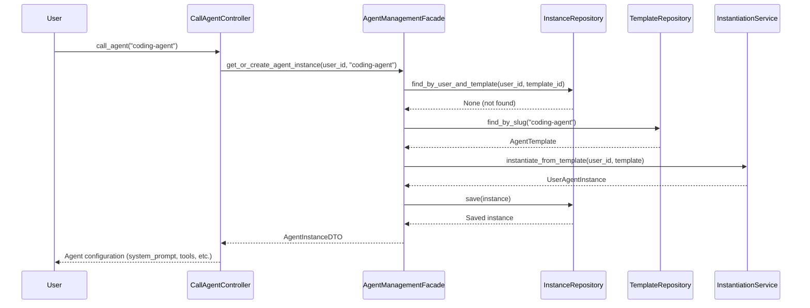
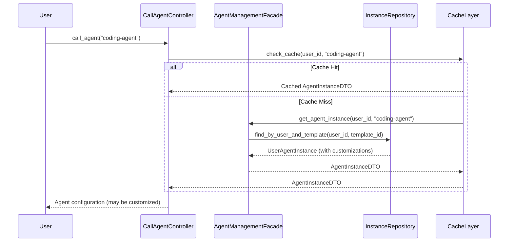
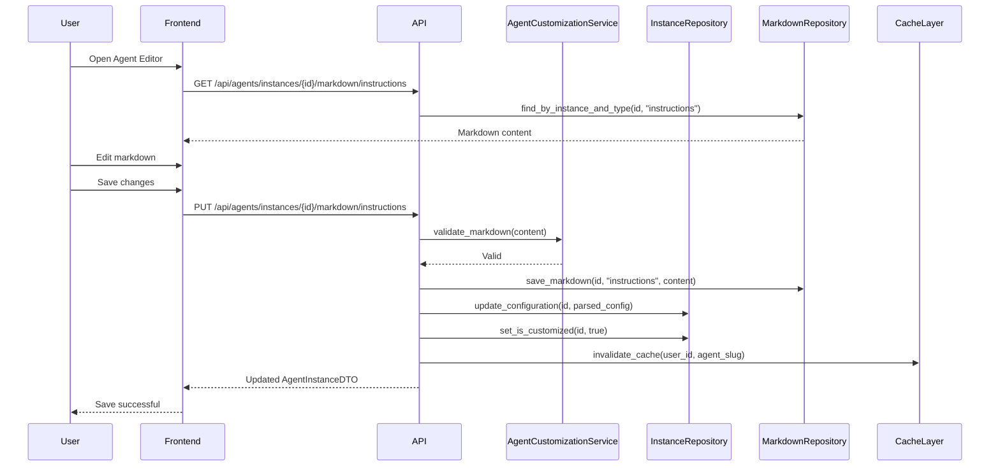

# User-Specific Agent System Architecture

## Executive Summary

This document outlines the complete architectural design for transforming the agenthub agent system from a **static shared library** to a **dynamic per-user agent system** where each user can create and customize their own agent instances.

**Current System**: All users share the same agent definitions from `agent-library/` YAML files.

**Proposed System**: Each user gets personalized agent instances created from templates, with full customization capabilities through markdown editing.

---

## Current System Analysis

### Agent-Library Structure

```
agent-library/
├── agents/
│   ├── coding-agent/
│   │   ├── metadata.yaml          # Agent metadata (name, description, model, color)
│   │   ├── config.yaml             # Configuration (category, version, capabilities)
│   │   ├── capabilities.yaml      # Detailed capabilities
│   │   ├── contexts/
│   │   │   ├── {agent}_instructions.yaml  # Main system prompt/instructions
│   │   │   ├── connectivity.yaml           # Integration patterns
│   │   │   └── input_specification.yaml    # Input requirements
│   │   ├── rules/
│   │   │   ├── error_handling.yaml
│   │   │   ├── continuous_learning.yaml
│   │   │   ├── health_check.yaml
│   │   │   ├── clean_code_enforcement.yaml
│   │   │   └── implementation_methodology.yaml
│   │   └── output_format/
│   │       └── output_specification.yaml
│   └── [32 other agents with similar structure]
```

### Key Properties Extracted from Agent-Library

**From metadata.yaml:**
- `name` - Agent display name
- `description` - Usage scenarios and examples
- `model` - AI model type (sonnet, etc.)
- `color` - UI color coding
- `migration` - Version tracking info

**From config.yaml:**
- `author` - Creator identification
- `category` - Agent category (development, testing, etc.)
- `version` - Template version
- `capabilities.groups` - Tool groups (read, edit, mcp, command)
- `capabilities.execution_modes` - Interactive, batch
- `compatibility` - Backward compatibility flags

**From capabilities.yaml:**
- `file_operations` - Read, write, create, delete permissions
- `command_execution` - Allowed commands (git, npm, python, etc.)
- `mcp_tools` - List of allowed MCP tools
- `collaboration` - Agent communication settings

**From contexts/{agent}_instructions.yaml:**
- `custom_instructions` - Complete system prompt with:
  - Core purpose
  - Key capabilities
  - Implementation process (10+ steps)
  - Edge cases and fallbacks
  - Quality standards
  - Integration patterns
  - Example use cases

**From rules/*.yaml:**
- `error_handling` - Error handling strategies
- `continuous_learning` - Learning and adaptation rules
- `health_check` - Self-test procedures
- `clean_code_enforcement` - Code quality rules
- `implementation_methodology` - Step-by-step workflows

**From output_format/*.yaml:**
- `output_specification` - Expected output formats and standards

---

## Proposed Architecture

### High-Level Transformation

```
┌─────────────────────────────────────────────────────────────┐
│                    CURRENT SYSTEM                           │
│                                                             │
│  User A ──┐                                                 │
│  User B ──┼──> agent-library/coding-agent/*.yaml (SHARED) │
│  User C ──┘                                                 │
│                                                             │
│  ❌ No customization                                        │
│  ❌ Same config for all users                              │
└─────────────────────────────────────────────────────────────┘

                          ↓ TRANSFORM TO ↓

┌─────────────────────────────────────────────────────────────┐
│                     NEW SYSTEM                              │
│                                                             │
│  agent-library/ (TEMPLATES - Read-Only)                    │
│           ↓                                                 │
│  ┌────────────────────────────────────┐                    │
│  │  Agent Template Repository         │                    │
│  │  (Loaded from YAML, stored in DB)  │                    │
│  └────────────────────────────────────┘                    │
│           ↓ INSTANTIATE (per user)                         │
│  ┌────────────────────────────────────┐                    │
│  │  User A's Agent Instances          │                    │
│  │  - coding-agent (customized)       │                    │
│  │  - debugger-agent (default)        │                    │
│  └────────────────────────────────────┘                    │
│  ┌────────────────────────────────────┐                    │
│  │  User B's Agent Instances          │                    │
│  │  - coding-agent (customized)       │                    │
│  │  - test-agent (customized)         │                    │
│  └────────────────────────────────────┘                    │
│                                                             │
│  ✅ Full customization per user                            │
│  ✅ Markdown-based editing                                 │
│  ✅ Template inheritance                                   │
└─────────────────────────────────────────────────────────────┘
```

---

## Domain-Driven Design Architecture

### Domain Layer

**Location**: `agenthub_main/src/fastmcp/agent_management/domain/`

#### Entities

**1. AgentTemplate (Immutable, Shared)**
```python
class AgentTemplate:
    """Represents the default agent definition from agent-library"""

    # Identity
    id: AgentTemplateId  # UUID
    slug: str  # e.g., "coding-agent" (unique)

    # Metadata
    name: str  # Display name
    category: AgentCategory  # development, testing, etc.
    description: str
    version: str  # Template version
    color: str  # UI color
    model: str  # AI model type

    # Configuration
    default_configuration: AgentConfiguration  # Full config as value object
    metadata: dict  # Migration info, author, etc.

    # Timestamps
    created_at: datetime
    updated_at: datetime

    # Methods
    def create_instance(self, user_id: UserId) -> UserAgentInstance:
        """Create a new user instance from this template"""

    def get_default_configuration(self) -> AgentConfiguration:
        """Get the default configuration for new instances"""
```

**2. UserAgentInstance (Mutable, Per-User)**
```python
class UserAgentInstance:
    """Represents a user's personalized agent instance"""

    # Identity
    id: AgentInstanceId  # UUID
    user_id: UserId
    template_id: AgentTemplateId

    # Customization
    agent_name: str  # User can rename (default from template)
    is_customized: bool  # Has user made changes?
    configuration: AgentConfiguration  # Current config (may differ from template)
    customizations: dict  # Track what user changed

    # Usage tracking
    last_used_at: Optional[datetime]
    usage_count: int

    # Timestamps
    created_at: datetime
    updated_at: datetime

    # Methods
    def update_instructions(self, instructions: AgentInstructions):
        """Update agent instructions (system prompt)"""

    def update_capabilities(self, capabilities: AgentCapability):
        """Update agent capabilities (with security validation)"""

    def update_rules(self, rules: AgentRules):
        """Update agent behavior rules"""

    def reset_to_default(self, template: AgentTemplate):
        """Reset all customizations to template default"""

    def get_effective_configuration(self) -> AgentConfiguration:
        """Get the current active configuration"""
```

**3. AgentConfiguration (Value Object)**
```python
class AgentConfiguration:
    """Complete agent configuration"""

    instructions: AgentInstructions  # System prompt/instructions
    capabilities: AgentCapability    # Permissions and tools
    rules: AgentRules                # Behavior rules
    output_format: OutputSpecification  # Output requirements
    metadata: dict                   # Additional settings

    # Methods
    def to_markdown(self) -> dict[str, str]:
        """Convert to markdown format for editing"""

    def from_markdown(self, markdown_content: dict[str, str]) -> 'AgentConfiguration':
        """Create from markdown content"""

    def to_json(self) -> dict:
        """Convert to JSON for storage"""

    def validate(self) -> ValidationResult:
        """Validate configuration integrity"""
```

**4. AgentCapability (Value Object)**
```python
class AgentCapability:
    """Agent capabilities and permissions"""

    # File operations
    file_operations: FileOperationPermissions

    # Command execution
    command_execution: CommandExecutionSettings
    allowed_commands: list[str]

    # MCP tools
    mcp_tools: list[str]

    # Collaboration
    agent_communication: bool

    # Methods
    def validate_against_user_permissions(self, user: User) -> bool:
        """Ensure user can grant these capabilities"""
```

#### Value Objects

```python
class AgentTemplateId(UUID):
    """Strong-typed agent template identifier"""

class AgentInstanceId(UUID):
    """Strong-typed agent instance identifier"""

class UserId(UUID):
    """Strong-typed user identifier"""

class AgentInstructions:
    """Agent instructions (system prompt)"""
    content: str  # Markdown format
    max_length: int = 50_000  # 50KB limit

class AgentRules:
    """Collection of agent behavior rules"""
    error_handling: str
    continuous_learning: str
    health_check: str
    clean_code_enforcement: Optional[str]
    implementation_methodology: Optional[str]

class AgentCategory(Enum):
    DEVELOPMENT = "development"
    TESTING = "testing"
    ARCHITECTURE = "architecture"
    DEVOPS = "devops"
    DOCUMENTATION = "documentation"
    PLANNING = "planning"
    SECURITY = "security"
    ANALYTICS = "analytics"
    MARKETING = "marketing"
    RESEARCH = "research"
    ML = "ml"
    CREATIVE = "creative"
```

#### Domain Services

**1. AgentInstantiationService**
```python
class AgentInstantiationService:
    """Creates user agent instances from templates"""

    def instantiate_from_template(
        self,
        user_id: UserId,
        template: AgentTemplate
    ) -> UserAgentInstance:
        """
        Create a new user agent instance from template
        - Copies default configuration
        - Sets is_customized = False
        - Creates markdown representations
        """

    def get_or_create_instance(
        self,
        user_id: UserId,
        agent_slug: str
    ) -> UserAgentInstance:
        """
        Get existing instance or create from template
        Used by call_agent - transparent instantiation
        """
```

**2. AgentCustomizationService**
```python
class AgentCustomizationService:
    """Handles user modifications to agent configurations"""

    def apply_customization(
        self,
        instance: UserAgentInstance,
        customization: AgentConfigurationUpdate
    ) -> UserAgentInstance:
        """
        Apply user customization with validation
        - Validates security constraints
        - Updates configuration
        - Marks as customized
        - Tracks changes
        """

    def validate_customization(
        self,
        user: User,
        customization: AgentConfigurationUpdate
    ) -> ValidationResult:
        """
        Validate customization against security rules
        - Check capability escalation
        - Validate command whitelist
        - Check MCP tool authorization
        """
```

**3. AgentTemplateLoaderService**
```python
class AgentTemplateLoaderService:
    """Loads templates from agent-library YAML files"""

    def load_all_templates(self) -> list[AgentTemplate]:
        """
        Scan agent-library directory
        Parse all YAML files
        Consolidate into AgentTemplate entities
        """

    def load_template_by_slug(self, slug: str) -> AgentTemplate:
        """Load specific template from YAML"""

    def refresh_template(self, slug: str) -> AgentTemplate:
        """Reload template when YAML files change"""
```

---

### Application Layer

**Location**: `agenthub_main/src/fastmcp/agent_management/application/`

#### Use Cases

```python
# Instance Management
class InstantiateAgentFromTemplate:
    """Create user agent instance from template"""

class GetUserAgentInstance:
    """Retrieve user's agent configuration"""

class ListUserAgentInstances:
    """Get all user's agent instances"""

class DeleteUserAgentInstance:
    """Remove user's agent instance"""

# Customization
class CustomizeAgentConfiguration:
    """Update user's agent settings"""

class UpdateAgentInstructionsMarkdown:
    """Update instructions via markdown"""

class UpdateAgentCapabilitiesMarkdown:
    """Update capabilities via markdown"""

class UpdateAgentRulesMarkdown:
    """Update rules via markdown"""

class UpdateAgentOutputFormatMarkdown:
    """Update output format via markdown"""

# Reset
class ResetAgentToDefault:
    """Reset to template default"""

# Execution
class LoadAgentForExecution:
    """Load agent config when user calls agent"""

# Template Management
class ListAvailableTemplates:
    """Get all available agent templates"""

class GetTemplateDetails:
    """Get template configuration details"""

class RefreshTemplatesFromLibrary:
    """Reload templates from YAML files"""
```

#### Application Services

```python
class AgentInstanceApplicationService:
    """Orchestrates agent instance operations"""

    def __init__(
        self,
        instance_repository: UserAgentInstanceRepository,
        template_repository: AgentTemplateRepository,
        instantiation_service: AgentInstantiationService,
        customization_service: AgentCustomizationService
    ):
        ...

class AgentCustomizationApplicationService:
    """Handles customization logic"""

    def update_markdown_configuration(
        self,
        instance_id: AgentInstanceId,
        configuration_type: str,
        markdown_content: str
    ) -> UserAgentInstance:
        """Update specific configuration section from markdown"""

class AgentTemplateApplicationService:
    """Manages template loading from YAML"""

    def sync_templates_from_library(self):
        """Synchronize templates from agent-library to database"""
```

#### DTOs

```python
@dataclass
class AgentInstanceDTO:
    id: str
    user_id: str
    template_id: str
    agent_name: str
    is_customized: bool
    configuration: dict
    last_used_at: Optional[str]
    created_at: str
    updated_at: str

@dataclass
class AgentConfigurationDTO:
    instructions: str
    capabilities: dict
    rules: dict
    output_format: dict

@dataclass
class AgentMarkdownDTO:
    instance_id: str
    configuration_type: str  # instructions, capabilities, rules, output_format
    content_markdown: str
    updated_at: str

@dataclass
class AgentTemplateDTO:
    id: str
    slug: str
    name: str
    category: str
    description: str
    version: str
    default_configuration: dict
```

#### Facades

```python
class AgentManagementFacade:
    """Unified interface for all agent operations"""

    def get_or_create_agent_instance(
        self,
        user_id: str,
        agent_slug: str
    ) -> AgentInstanceDTO:
        """Get existing instance or create from template"""

    def customize_agent(
        self,
        user_id: str,
        instance_id: str,
        customizations: dict
    ) -> AgentInstanceDTO:
        """Apply user customizations to agent"""

    def get_agent_markdown(
        self,
        user_id: str,
        instance_id: str,
        configuration_type: str
    ) -> AgentMarkdownDTO:
        """Get markdown for editing"""

    def update_agent_markdown(
        self,
        user_id: str,
        instance_id: str,
        configuration_type: str,
        markdown_content: str
    ) -> AgentMarkdownDTO:
        """Save markdown changes"""

    def reset_agent_to_default(
        self,
        user_id: str,
        instance_id: str
    ) -> AgentInstanceDTO:
        """Reset to template default"""

    def list_user_agents(
        self,
        user_id: str
    ) -> list[AgentInstanceDTO]:
        """List all user's agent instances"""

    def list_available_templates(
        self
    ) -> list[AgentTemplateDTO]:
        """List all available agent templates"""
```

---

### Infrastructure Layer

**Location**: `agenthub_main/src/fastmcp/agent_management/infrastructure/`

#### Repositories

**1. AgentTemplateRepository**
```python
class AgentTemplateRepository:
    """Repository for agent templates (YAML + Database)"""

    def find_by_slug(self, slug: str) -> Optional[AgentTemplate]:
        """Find template by slug"""

    def find_all(self) -> list[AgentTemplate]:
        """Get all templates"""

    def save(self, template: AgentTemplate) -> AgentTemplate:
        """Save template to database"""

    def load_from_yaml(self, slug: str) -> AgentTemplate:
        """Load template from agent-library YAML files"""

    def sync_all_from_yaml(self) -> int:
        """Sync all templates from YAML to database"""
```

**2. UserAgentInstanceRepository**
```python
class UserAgentInstanceRepository:
    """Repository for user agent instances (SQLAlchemy)"""

    def find_by_id(self, instance_id: AgentInstanceId) -> Optional[UserAgentInstance]:
        """Find instance by ID"""

    def find_by_user_and_template(
        self,
        user_id: UserId,
        template_id: AgentTemplateId
    ) -> Optional[UserAgentInstance]:
        """Find user's instance of specific template"""

    def find_all_by_user(self, user_id: UserId) -> list[UserAgentInstance]:
        """Get all instances for user"""

    def save(self, instance: UserAgentInstance) -> UserAgentInstance:
        """Save instance to database"""

    def delete(self, instance_id: AgentInstanceId):
        """Delete instance"""
```

**3. AgentConfigurationMarkdownRepository**
```python
class AgentConfigurationMarkdownRepository:
    """Repository for markdown configuration storage"""

    def find_by_instance_and_type(
        self,
        instance_id: AgentInstanceId,
        configuration_type: str
    ) -> Optional[str]:
        """Get markdown content for specific configuration type"""

    def save_markdown(
        self,
        instance_id: AgentInstanceId,
        configuration_type: str,
        markdown_content: str
    ):
        """Save markdown content"""

    def get_all_for_instance(
        self,
        instance_id: AgentInstanceId
    ) -> dict[str, str]:
        """Get all markdown configurations for instance"""
```

#### External Services

**1. YAMLAgentTemplateLoader**
```python
class YAMLAgentTemplateLoader:
    """Parse YAML files from agent-library"""

    def load_agent_configuration(self, agent_slug: str) -> dict:
        """
        Load and consolidate all YAML files for an agent:
        - metadata.yaml
        - config.yaml
        - capabilities.yaml
        - contexts/*.yaml
        - rules/*.yaml
        - output_format/*.yaml

        Returns consolidated configuration dictionary
        """

    def scan_available_agents(self) -> list[str]:
        """Get list of all agent slugs in library"""
```

**2. MarkdownConverter**
```python
class MarkdownConverter:
    """Convert between JSON configuration and markdown"""

    def config_to_markdown(
        self,
        configuration: AgentConfiguration
    ) -> dict[str, str]:
        """
        Convert configuration to markdown documents:
        - instructions.md
        - capabilities.md
        - rules.md
        - output_format.md
        """

    def markdown_to_config(
        self,
        markdown_docs: dict[str, str]
    ) -> AgentConfiguration:
        """Parse markdown documents back to configuration"""

    def validate_markdown_syntax(self, markdown: str) -> ValidationResult:
        """Validate markdown is well-formed"""
```

---

## Database Schema

### Table 1: agent_templates

```sql
CREATE TABLE agent_templates (
    id UUID PRIMARY KEY DEFAULT gen_random_uuid(),
    slug VARCHAR(255) UNIQUE NOT NULL,
    name VARCHAR(255) NOT NULL,
    category VARCHAR(100) NOT NULL,
    description TEXT,
    version VARCHAR(50) NOT NULL,

    -- Full configuration as JSONB
    default_configuration JSONB NOT NULL,

    -- Additional metadata
    metadata JSONB DEFAULT '{}'::jsonb,

    -- Timestamps
    created_at TIMESTAMP WITH TIME ZONE DEFAULT NOW(),
    updated_at TIMESTAMP WITH TIME ZONE DEFAULT NOW()
);

-- Indexes
CREATE INDEX idx_agent_templates_slug ON agent_templates(slug);
CREATE INDEX idx_agent_templates_category ON agent_templates(category);
```

### Table 2: user_agent_instances

```sql
CREATE TABLE user_agent_instances (
    id UUID PRIMARY KEY DEFAULT gen_random_uuid(),
    user_id UUID NOT NULL,
    template_id UUID NOT NULL,

    -- User customization
    agent_name VARCHAR(255) NOT NULL,
    is_customized BOOLEAN DEFAULT FALSE,

    -- Current configuration (may differ from template)
    configuration JSONB NOT NULL,

    -- Track what user changed
    customizations JSONB DEFAULT '{}'::jsonb,

    -- Usage tracking
    last_used_at TIMESTAMP WITH TIME ZONE,
    usage_count INTEGER DEFAULT 0,

    -- Timestamps
    created_at TIMESTAMP WITH TIME ZONE DEFAULT NOW(),
    updated_at TIMESTAMP WITH TIME ZONE DEFAULT NOW(),

    -- Foreign keys
    FOREIGN KEY (user_id) REFERENCES users(id) ON DELETE CASCADE,
    FOREIGN KEY (template_id) REFERENCES agent_templates(id),

    -- One instance per template per user
    UNIQUE(user_id, template_id)
);

-- Indexes
CREATE INDEX idx_user_agent_instances_user_template
    ON user_agent_instances(user_id, template_id);

CREATE INDEX idx_user_agent_instances_user_id
    ON user_agent_instances(user_id);

CREATE INDEX idx_user_agent_instances_template_id
    ON user_agent_instances(template_id);
```

### Table 3: user_agent_configurations_md

```sql
CREATE TABLE user_agent_configurations_md (
    id UUID PRIMARY KEY DEFAULT gen_random_uuid(),
    instance_id UUID NOT NULL,

    -- Configuration type: instructions, capabilities, rules, output_format
    configuration_type VARCHAR(50) NOT NULL,

    -- Markdown content for editing
    content_markdown TEXT NOT NULL,

    -- Timestamps
    created_at TIMESTAMP WITH TIME ZONE DEFAULT NOW(),
    updated_at TIMESTAMP WITH TIME ZONE DEFAULT NOW(),

    -- Foreign key
    FOREIGN KEY (instance_id) REFERENCES user_agent_instances(id) ON DELETE CASCADE,

    -- One markdown doc per type per instance
    UNIQUE(instance_id, configuration_type)
);

-- Indexes
CREATE INDEX idx_configurations_md_instance
    ON user_agent_configurations_md(instance_id, configuration_type);
```

### Table 4: agent_usage_logs (Optional - for analytics)

```sql
CREATE TABLE agent_usage_logs (
    id UUID PRIMARY KEY DEFAULT gen_random_uuid(),
    user_id UUID NOT NULL,
    instance_id UUID NOT NULL,
    agent_slug VARCHAR(255) NOT NULL,

    -- Execution context
    execution_context JSONB,

    -- Timestamps
    executed_at TIMESTAMP WITH TIME ZONE DEFAULT NOW(),

    -- Foreign keys
    FOREIGN KEY (user_id) REFERENCES users(id) ON DELETE CASCADE,
    FOREIGN KEY (instance_id) REFERENCES user_agent_instances(id) ON DELETE SET NULL
);

-- Indexes for analytics
CREATE INDEX idx_agent_usage_logs_user ON agent_usage_logs(user_id);
CREATE INDEX idx_agent_usage_logs_instance ON agent_usage_logs(instance_id);
CREATE INDEX idx_agent_usage_logs_executed_at ON agent_usage_logs(executed_at);
```

---

## Agent Instantiation and Customization Workflow

### First-Time Agent Call (No Instance Exists)



### Subsequent Agent Calls (Instance Exists)



### Agent Customization Workflow



---

## Markdown Storage Format

### Instructions Markdown (configuration_type = 'instructions')

```markdown
# Agent Instructions: Coding Agent

## Core Purpose
Transform specifications and designs into production-ready, well-tested, and documented code.

## Key Capabilities
- Multi-language code implementation (JavaScript/TypeScript, Python, Java, C#, Go, Rust, PHP, Ruby)
- Frontend development (React, Vue, Angular, Svelte, Next.js, Nuxt.js, SolidJS)
- Backend development (Node.js, Express, FastAPI, Spring, .NET, Flask, Django, Gin, Koa)
- Database integration (PostgreSQL, MySQL, MongoDB, Redis, Elasticsearch, SQLite)
- API development (REST, GraphQL, gRPC, WebSockets)
- Unit, integration, and end-to-end test creation
- Code documentation and commenting
- Performance optimization and refactoring

## Implementation Process
1. **Specification Analysis**: Thoroughly understand requirements...
2. **Architecture Planning**: Design code structure...
[... rest of process steps ...]

## Edge Cases & Fallback Strategies
- If input spec is incomplete, request clarification and pause implementation
- If a dependency is missing, use stubs/mocks and document the gap
[... rest of edge cases ...]

## Quality Standards
- Code coverage must be ≥90% for critical paths
- All public APIs must have comprehensive documentation
[... rest of quality standards ...]
```

### Capabilities Markdown (configuration_type = 'capabilities')

```markdown
# Agent Capabilities

## File Operations
- **Read**: ✅ Enabled
- **Write**: ✅ Enabled
- **Create**: ✅ Enabled
- **Delete**: ✅ Enabled

## Command Execution
- **Enabled**: ✅ Yes
- **Restrictions**: sandbox_mode
- **Allowed Commands**:
  - git
  - npm, yarn, pnpm
  - python
  - node
  - docker
  - make, cargo
  - pytest, jest, mvn, gradle

## MCP Tools
- mcp__ide__getDiagnostics
- mcp__ide__executeCode
- mcp__agenthub_http__manage_task
- mcp__agenthub_http__manage_subtask
- mcp--agenthub-http--manage-agent
- mcp__sequential-thinking__sequentialthinking

## Collaboration
- **Agent Communication**: ✅ Enabled
- **Collaborative Mode**: ✅ Yes
```

### Rules Markdown (configuration_type = 'rules')

```markdown
# Agent Behavior Rules

## Error Handling
**Strategy**: Implements try/catch, error boundaries, and fallback logic. On critical errors, halts execution, logs the error, and notifies devops-agent and health-monitor-agent. For missing dependencies, uses stubs/mocks and documents the gap.

## Continuous Learning
**Strategy**: Track implementation patterns, update knowledge base with successful strategies, learn from code reviews, and adapt to project-specific coding standards.

## Health Check
**Strategy**: Self-test before execution, validate dependencies, check tool availability, verify environment configuration, and report health status.

## Clean Code Enforcement
**Strategy**: Follow established coding conventions, enforce linting rules, maintain consistent formatting, use meaningful variable names, and apply SOLID principles.

## Implementation Methodology
**Strategy**: Follow 10-step process from specification to delivery, document all decisions, maintain test coverage, and ensure code quality gates pass.
```

### Output Format Markdown (configuration_type = 'output_format')

```markdown
# Output Specifications

## Code Files
- **Format**: Language-specific formatting standards
- **Documentation**: Inline comments required for complex logic
- **File Structure**: Modular organization with clear separation of concerns

## Test Files
- **Coverage**: ≥90% for critical paths, ≥80% overall
- **Format**: Unit tests, integration tests, E2E tests as appropriate
- **Documentation**: Test descriptions clearly state what is being tested

## Documentation Files
- **API Documentation**: OpenAPI/Swagger for all REST endpoints
- **Code Documentation**: JSDoc, Sphinx, or language-appropriate
- **README Updates**: Include usage examples and setup instructions

## Deliverables Checklist
- [ ] Source code files with proper formatting
- [ ] Comprehensive test suite
- [ ] API documentation (if applicable)
- [ ] Updated README and usage guides
- [ ] Migration scripts (if database changes)
- [ ] Health check endpoints (for critical modules)
```

---

## Interface Layer (MCP Controllers & API)

### Modified call_agent Controller

**Before (Current System):**
```python
@mcp_tool
def call_agent(agent_slug: str) -> dict:
    # Load from agent-library YAML
    agent_config = load_yaml(f"agent-library/agents/{agent_slug}/")
    return {
        "system_prompt": agent_config["instructions"],
        "tools": agent_config["capabilities"]["tools"],
        # ... rest of config
    }
```

**After (New System):**
```python
@mcp_tool
def call_agent(agent_slug: str, user_id: str) -> dict:
    # Get or create user instance
    instance = agent_management_facade.get_or_create_agent_instance(
        user_id=user_id,
        agent_slug=agent_slug
    )

    # Update usage tracking
    instance_repository.update_last_used(instance.id)

    # Return customized configuration
    return {
        "system_prompt": instance.configuration.instructions.content,
        "tools": instance.configuration.capabilities.mcp_tools,
        "capabilities": instance.configuration.capabilities,
        "is_customized": instance.is_customized,
        # ... rest of customized config
    }
```

### New MCP Controllers

**1. AgentInstanceMCPController**
```python
class AgentInstanceMCPController:
    """MCP tools for agent instance management"""

    @mcp_tool("manage_agent_instance")
    def manage_agent_instance(
        action: str,
        user_id: str,
        instance_id: Optional[str] = None,
        agent_slug: Optional[str] = None,
        **kwargs
    ) -> dict:
        """
        Actions:
        - create: Create instance from template
        - get: Get instance details
        - list: List all user instances
        - delete: Delete instance
        - reset: Reset to default template
        """

    @mcp_tool("customize_agent")
    def customize_agent(
        user_id: str,
        instance_id: str,
        customizations: dict
    ) -> dict:
        """Apply customizations to agent configuration"""
```

**2. AgentMarkdownMCPController**
```python
class AgentMarkdownMCPController:
    """MCP tools for markdown editing"""

    @mcp_tool("get_agent_markdown")
    def get_agent_markdown(
        user_id: str,
        instance_id: str,
        configuration_type: str  # instructions, capabilities, rules, output_format
    ) -> dict:
        """Retrieve markdown for editing"""

    @mcp_tool("update_agent_markdown")
    def update_agent_markdown(
        user_id: str,
        instance_id: str,
        configuration_type: str,
        markdown_content: str
    ) -> dict:
        """Save markdown changes"""
```

### REST API Endpoints (for Frontend)

```python
# Template endpoints
GET    /api/agents/templates              # List all available templates
GET    /api/agents/templates/{slug}       # Get template details

# Instance endpoints
GET    /api/agents/instances              # List user's agent instances
POST   /api/agents/instances              # Create instance from template
GET    /api/agents/instances/{id}         # Get instance details
PUT    /api/agents/instances/{id}         # Update instance configuration
DELETE /api/agents/instances/{id}         # Delete instance
POST   /api/agents/instances/{id}/reset   # Reset to default

# Markdown endpoints
GET    /api/agents/instances/{id}/markdown/{type}    # Get markdown
PUT    /api/agents/instances/{id}/markdown/{type}    # Update markdown
POST   /api/agents/instances/{id}/preview            # Preview changes

# Usage analytics
GET    /api/agents/usage                  # User's agent usage statistics
```

---

## Frontend Integration

### React Components

**1. AgentLibrary Component**
```typescript
// Browse available agent templates
interface AgentLibraryProps {
  onSelectTemplate: (template: AgentTemplate) => void;
}

const AgentLibrary: React.FC<AgentLibraryProps> = ({ onSelectTemplate }) => {
  const { data: templates } = useQuery('/api/agents/templates');

  return (
    <div className="grid grid-cols-3 gap-4">
      {templates?.map(template => (
        <AgentTemplateCard
          key={template.id}
          template={template}
          onSelect={() => onSelectTemplate(template)}
        />
      ))}
    </div>
  );
};
```

**2. AgentInstanceList Component**
```typescript
// User's customized agents
const AgentInstanceList: React.FC = () => {
  const { data: instances } = useQuery('/api/agents/instances');

  return (
    <div className="space-y-4">
      {instances?.map(instance => (
        <AgentInstanceCard
          key={instance.id}
          instance={instance}
          onEdit={() => navigate(`/agents/${instance.id}/edit`)}
          onReset={() => resetAgent(instance.id)}
        />
      ))}
    </div>
  );
};
```

**3. AgentEditor Component**
```typescript
// Markdown editor with tabs
const AgentEditor: React.FC<{ instanceId: string }> = ({ instanceId }) => {
  const [activeTab, setActiveTab] = useState<'instructions' | 'capabilities' | 'rules' | 'output_format'>('instructions');
  const [markdown, setMarkdown] = useState('');

  const { data } = useQuery(`/api/agents/instances/${instanceId}/markdown/${activeTab}`);
  const { mutate: saveMarkdown } = useMutation(
    (content: string) => axios.put(`/api/agents/instances/${instanceId}/markdown/${activeTab}`, { content })
  );

  return (
    <div className="flex flex-col h-full">
      <Tabs value={activeTab} onValueChange={setActiveTab}>
        <TabsList>
          <TabsTrigger value="instructions">Instructions</TabsTrigger>
          <TabsTrigger value="capabilities">Capabilities</TabsTrigger>
          <TabsTrigger value="rules">Rules</TabsTrigger>
          <TabsTrigger value="output_format">Output Format</TabsTrigger>
        </TabsList>

        <TabsContent value={activeTab}>
          <MarkdownEditor
            value={markdown}
            onChange={setMarkdown}
            onSave={() => saveMarkdown(markdown)}
          />
        </TabsContent>
      </Tabs>
    </div>
  );
};
```

**4. AgentPreview Component**
```typescript
// Preview agent configuration before saving
const AgentPreview: React.FC<{ instanceId: string }> = ({ instanceId }) => {
  const { data: preview } = useQuery(`/api/agents/instances/${instanceId}/preview`);

  return (
    <div className="prose max-w-none">
      <h2>Agent Configuration Preview</h2>
      <ReactMarkdown>{preview?.instructions}</ReactMarkdown>
      {/* ... render other sections ... */}
    </div>
  );
};
```

---

## Migration Strategy

### Phase 1: Backward Compatibility Layer

**Objective**: Add new infrastructure without breaking existing functionality

**Implementation**:
1. Create new database tables (agent_templates, user_agent_instances, user_agent_configurations_md)
2. Implement new domain entities and repositories
3. Keep existing call_agent working with YAML files
4. No changes to user-facing functionality

**Timeline**: 1-2 weeks

### Phase 2: Template Population

**Objective**: Populate agent_templates table from agent-library

**Implementation**:
1. Create AgentTemplateLoaderService
2. Write migration script to scan agent-library/agents/
3. Parse all YAML files and consolidate
4. Insert into agent_templates table
5. Verify all 60+ agents loaded correctly

**Script Example**:
```python
async def populate_agent_templates():
    """Populate agent_templates from agent-library YAML files"""
    loader = YAMLAgentTemplateLoader()
    template_repo = AgentTemplateRepository()

    agent_slugs = loader.scan_available_agents()

    for slug in agent_slugs:
        config = loader.load_agent_configuration(slug)
        template = AgentTemplate(
            slug=slug,
            name=config['name'],
            category=config['category'],
            description=config['description'],
            version=config['version'],
            default_configuration=config,
            metadata=config.get('metadata', {})
        )
        template_repo.save(template)
        print(f"✅ Loaded template: {slug}")

    print(f"🎉 Loaded {len(agent_slugs)} agent templates")
```

**Timeline**: 1 week

### Phase 3: Instance Layer Implementation

**Objective**: Implement user agent instances with auto-instantiation

**Implementation**:
1. Modify call_agent to check for user instances first
2. If no instance exists, create from template automatically
3. Transparent to users (they don't notice the change)
4. Monitor instance creation rates

**Modified Call Agent**:
```python
@mcp_tool
def call_agent(agent_slug: str, user_id: str) -> dict:
    # Try to find existing instance
    instance = instance_repo.find_by_user_and_template(user_id, agent_slug)

    if not instance:
        # Auto-create from template
        template = template_repo.find_by_slug(agent_slug)
        instance = instantiation_service.instantiate_from_template(user_id, template)
        instance_repo.save(instance)
        logger.info(f"Auto-created instance for user {user_id}, agent {agent_slug}")

    # Update usage tracking
    instance_repo.update_last_used(instance.id)

    # Return configuration (customized or default)
    return instance.configuration.to_dict()
```

**Timeline**: 2 weeks

### Phase 4: Customization Features

**Objective**: Enable user customization through UI

**Implementation**:
1. Implement markdown storage layer
2. Create REST API endpoints
3. Build frontend agent editor
4. Add markdown editing capabilities
5. Enable save/reset functionality

**Features**:
- List user's agent instances
- Edit agent instructions, capabilities, rules, output format
- Preview changes before saving
- Reset to default template
- Track customization history

**Timeline**: 3-4 weeks

### Phase 5: Template Sync Strategy

**Objective**: Handle template updates without overwriting user customizations

**Implementation**:
1. Track template version in user instances
2. When agent-library YAML updates:
   - Update agent_templates table with new version
   - Compare with user instances
   - If instance.template_version < template.version:
     - Show notification: "New template version available"
     - Option 1: "Keep my customizations"
     - Option 2: "Review changes and merge"
     - Option 3: "Reset to new default"
3. Provide diff view showing template changes
4. Allow selective merging of changes

**Timeline**: 2-3 weeks

---

## Security Considerations

### 1. User Isolation (CRITICAL)

**Requirement**: Each user can ONLY access their own agent instances

**Implementation**:
```python
# Always filter by user_id in repository queries
def find_by_id(self, user_id: UserId, instance_id: AgentInstanceId):
    return session.query(UserAgentInstanceModel).filter(
        UserAgentInstanceModel.user_id == user_id,
        UserAgentInstanceModel.id == instance_id
    ).first()

# Row-level security in PostgreSQL (optional but recommended)
CREATE POLICY user_agent_instances_isolation ON user_agent_instances
    USING (user_id = current_setting('app.current_user_id')::uuid);
```

### 2. Capability Restrictions

**Problem**: Users might try to grant themselves unauthorized capabilities

**Solution**: Validate all capability changes
```python
def validate_capability_customization(
    user: User,
    new_capabilities: AgentCapability
) -> ValidationResult:
    # Check file operations
    if new_capabilities.file_operations.delete and not user.has_permission('file_delete'):
        return ValidationResult.error("User not authorized for file deletion")

    # Check command execution
    for cmd in new_capabilities.allowed_commands:
        if cmd not in ALLOWED_COMMAND_WHITELIST:
            return ValidationResult.error(f"Command '{cmd}' not in whitelist")

    # Check MCP tools
    for tool in new_capabilities.mcp_tools:
        if not user.has_mcp_tool_permission(tool):
            return ValidationResult.error(f"User not authorized for tool '{tool}'")

    return ValidationResult.success()
```

### 3. Markdown Injection Prevention

**Problem**: Malicious markdown could execute scripts

**Solution**: Sanitize and validate
```python
from markupsafe import escape
import bleach

def sanitize_markdown(markdown_content: str) -> str:
    # Remove dangerous HTML tags
    allowed_tags = ['h1', 'h2', 'h3', 'p', 'ul', 'ol', 'li', 'code', 'pre', 'blockquote']
    clean_html = bleach.clean(markdown_content, tags=allowed_tags, strip=True)

    # Escape special characters
    safe_content = escape(clean_html)

    return safe_content
```

### 4. Resource Limits

```python
class ResourceLimits:
    MAX_INSTANCES_PER_USER = 100
    MAX_MARKDOWN_SIZE = 50_000  # 50KB
    MAX_INSTRUCTIONS_LENGTH = 50_000
    RATE_LIMIT_AGENT_CALLS = 100  # per hour
    RATE_LIMIT_CUSTOMIZATIONS = 20  # per hour
```

### 5. Audit Trail

```python
class AgentAuditLog:
    """Log all agent customizations"""

    def log_customization(
        self,
        user_id: UserId,
        instance_id: AgentInstanceId,
        action: str,
        changes: dict
    ):
        audit_entry = {
            "timestamp": datetime.now(),
            "user_id": str(user_id),
            "instance_id": str(instance_id),
            "action": action,
            "changes": changes,
            "ip_address": get_client_ip()
        }
        audit_repository.save(audit_entry)
```

---

## Performance Optimization

### 1. Caching Strategy

```python
# Redis cache for agent instances
class AgentInstanceCache:
    def get_or_load(self, user_id: UserId, agent_slug: str) -> UserAgentInstance:
        cache_key = f"agent_instance:{user_id}:{agent_slug}"

        # Try cache first
        cached = redis.get(cache_key)
        if cached:
            return UserAgentInstance.from_json(cached)

        # Load from database
        instance = instance_repo.find_by_user_and_template(user_id, agent_slug)

        # Cache for 1 hour
        redis.setex(cache_key, 3600, instance.to_json())

        return instance

    def invalidate(self, user_id: UserId, agent_slug: str):
        cache_key = f"agent_instance:{user_id}:{agent_slug}"
        redis.delete(cache_key)
```

### 2. Database Indexing

```sql
-- Critical indexes for performance
CREATE INDEX idx_user_agent_instances_user_template
    ON user_agent_instances(user_id, template_id);

CREATE INDEX idx_user_agent_instances_user_id
    ON user_agent_instances(user_id);

CREATE INDEX idx_agent_templates_slug
    ON agent_templates(slug);

CREATE INDEX idx_configurations_md_instance
    ON user_agent_configurations_md(instance_id, configuration_type);

-- Partial index for customized agents
CREATE INDEX idx_customized_agents
    ON user_agent_instances(user_id) WHERE is_customized = true;
```

### 3. Lazy Loading

```python
# Don't instantiate all agents on user signup
# Create instances on-demand (first call)

def get_or_create_agent_instance(user_id: UserId, agent_slug: str):
    # Check if instance exists
    instance = instance_repo.find_by_user_and_template(user_id, agent_slug)

    if not instance:
        # Create on first use (lazy instantiation)
        template = template_repo.find_by_slug(agent_slug)
        instance = instantiation_service.instantiate_from_template(user_id, template)
        instance_repo.save(instance)

    return instance
```

### 4. Batch Template Loading

```python
# Load all templates once at startup
class AgentTemplateRegistry:
    _templates: dict[str, AgentTemplate] = {}

    @classmethod
    def initialize(cls):
        """Load all templates into memory at startup"""
        templates = template_repo.find_all()
        cls._templates = {t.slug: t for t in templates}

    @classmethod
    def get_template(cls, slug: str) -> AgentTemplate:
        """Get from in-memory registry (fast)"""
        return cls._templates.get(slug)
```

---

## Implementation Roadmap

### Milestone 1: Foundation (Weeks 1-2)
- [ ] Create database schema and migrations
- [ ] Implement domain entities (AgentTemplate, UserAgentInstance, AgentConfiguration)
- [ ] Implement value objects and domain services
- [ ] Write unit tests for domain layer

### Milestone 2: Infrastructure (Weeks 3-4)
- [ ] Implement repositories (AgentTemplateRepository, UserAgentInstanceRepository)
- [ ] Create YAMLAgentTemplateLoader service
- [ ] Implement MarkdownConverter service
- [ ] Write template population script
- [ ] Populate agent_templates from agent-library

### Milestone 3: Application Layer (Weeks 5-6)
- [ ] Implement use cases
- [ ] Create application services
- [ ] Build AgentManagementFacade
- [ ] Add validation and error handling
- [ ] Write integration tests

### Milestone 4: Interface Layer (Weeks 7-8)
- [ ] Modify call_agent controller for auto-instantiation
- [ ] Create AgentInstanceMCPController
- [ ] Create AgentMarkdownMCPController
- [ ] Build REST API endpoints
- [ ] Add authentication and authorization

### Milestone 5: Frontend (Weeks 9-11)
- [ ] Create AgentLibrary component
- [ ] Build AgentInstanceList component
- [ ] Develop AgentEditor with markdown editing
- [ ] Add AgentPreview component
- [ ] Implement save/reset functionality

### Milestone 6: Testing & Deployment (Weeks 12-13)
- [ ] End-to-end testing
- [ ] Performance testing and optimization
- [ ] Security audit
- [ ] Documentation
- [ ] Gradual rollout to users

---

## Success Metrics

### Technical Metrics
- ✅ All 60+ agent templates loaded successfully
- ✅ < 100ms response time for cached agent instances
- ✅ < 500ms response time for first-time instantiation
- ✅ Zero security vulnerabilities in capability validation
- ✅ 99.9% uptime for agent customization features

### Business Metrics
- 📊 % of users who customize at least one agent
- 📊 Average number of customized agents per user
- 📊 User satisfaction with customization features
- 📊 Reduction in support requests (better agent behavior)
- 📊 Increase in agent usage (better personalization)

### User Experience Metrics
- ⏱️ Time to first agent customization < 5 minutes
- ⏱️ Markdown save time < 2 seconds
- 📝 User feedback rating ≥ 4.5/5
- 🔄 Reset to default success rate 100%

---

## Conclusion

This architecture transforms the agenthub agent system from a static shared library to a dynamic, user-specific system with full customization capabilities while:

1. **Maintaining Backward Compatibility** - Existing functionality continues to work
2. **Following DDD Principles** - Clean architecture with proper separation of concerns
3. **Ensuring Security** - User isolation, capability validation, audit trails
4. **Optimizing Performance** - Caching, lazy loading, efficient indexing
5. **Enabling Customization** - Markdown-based editing with frontend integration
6. **Supporting Evolution** - Template versioning and migration strategies

The system allows each user to create personalized agent instances from templates, customize their behavior through an intuitive markdown editor, and maintain those customizations while templates continue to evolve.

**Next Steps**: Review this architecture with the team, gather feedback, and proceed with implementation following the roadmap.
