# Agent Flow Diagrams - Visual Architecture
**Version**: 2.0  
**Date**: 2025-09-09  
**Status**: Active

## System Overview - 31 Agent Architecture

```mermaid
graph TB
    subgraph "Tier 1: Orchestrators"
        MO[🎯 master_orchestrator]
        TP[📋 task_planning]
        PI[🚀 project_initiator]
        EL[📝 elicitation]
    end
    
    subgraph "Tier 2: Implementation"
        CA[💻 coding]
        DB[🐞 debugger]
        TO[🧪 test_orchestrator]
        DO[📄 documentation]
        PA[🔧 prototyping]
    end
    
    subgraph "Tier 3: Specialists"
        SA[🏗️ system_architect]
        DS[🎨 design_system]
        UI[🎨 ui_specialist]
        ML[🤖 ml_specialist]
        DV[⚙️ devops]
        SE[🔒 security_auditor]
    end
    
    MO --> TP
    MO --> PI
    TP --> CA
    TP --> TO
    TP --> DO
    CA <--> DB
    CA --> TO
    SA --> CA
    UI --> CA
```

## Feature Development Flow

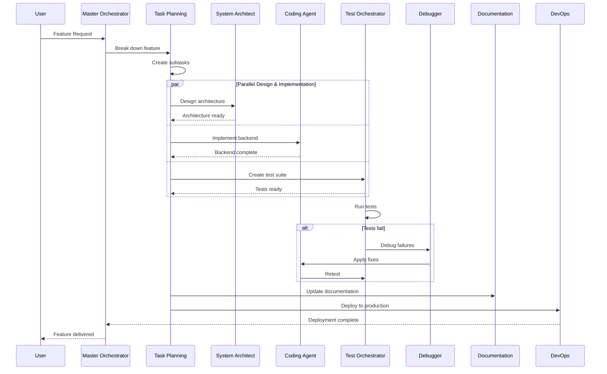

## Bug Resolution Flow

```mermaid
flowchart LR
    BR[Bug Report] --> DB[🐞 Debugger Agent]
    DB --> |Analyze| RC[Root Cause]
    RC --> |Fix| CA[💻 Coding Agent]
    CA --> |Validate| TO[🧪 Test Orchestrator]
    TO --> |Pass| DO[📄 Documentation]
    TO --> |Fail| DB
    DO --> |Complete| ✅
```

## Research & Decision Flow

```mermaid
graph TD
    RQ[Research Question] --> DR[🔍 Deep Research Agent]
    DR --> |MCP Research| MCP[MCP Platforms]
    DR --> |Tech Research| TECH[Technologies]
    DR --> |Market Research| MKT[Market Analysis]
    
    MCP --> TA[Technology Advisor]
    TECH --> TA
    MKT --> TA
    
    TA --> |Recommendations| MO[Master Orchestrator]
    MO --> |Decision| IMP[Implementation]
```

## Consolidated Agent Capabilities

### Documentation Agent Evolution
```mermaid
graph LR
    subgraph "Before - 3 Agents"
        TSA[tech_spec_agent]
        PRA[prd_architect_agent]
        ADA[api_doc_agent]
    end
    
    subgraph "After - 1 Agent"
        DOC[📄 documentation_agent<br/>• Tech Specs<br/>• PRDs<br/>• API Docs<br/>• User Guides<br/>• Architecture]
    end
    
    TSA -.->|Consolidated| DOC
    PRA -.->|Consolidated| DOC
    ADA -.->|Consolidated| DOC
```

### DevOps Agent Evolution
```mermaid
graph LR
    subgraph "Before - 4 Agents"
        SSA[swarm_scaler_agent]
        ADS[adaptive_deployment_strategist]
        MCA[mcp_configuration_agent]
        INF[infrastructure_agent]
    end
    
    subgraph "After - 1 Agent"
        DVO[⚙️ devops_agent<br/>• Swarm Scaling<br/>• Deployment Strategies<br/>• MCP Configuration<br/>• Infrastructure<br/>• CI/CD]
    end
    
    SSA -.->|Merged| DVO
    ADS -.->|Merged| DVO
    MCA -.->|Merged| DVO
    INF -.->|Merged| DVO
```

## Parallel Execution Pattern

```mermaid
graph TD
    MO[Master Orchestrator] --> |Spawns Parallel Agents| PAR{Parallel Execution}
    
    PAR --> A1[Agent 1: Backend API]
    PAR --> A2[Agent 2: Frontend UI]
    PAR --> A3[Agent 3: Database]
    PAR --> A4[Agent 4: Testing]
    PAR --> A5[Agent 5: Documentation]
    PAR --> A6[Agent 6: Security]
    
    A1 --> SYNC[Synchronization Point]
    A2 --> SYNC
    A3 --> SYNC
    A4 --> SYNC
    A5 --> SYNC
    A6 --> SYNC
    
    SYNC --> COMPLETE[✅ Task Complete]
```

## Marketing Strategy Flow

```mermaid
graph TB
    MKT[Marketing Request] --> MSO[📈 Marketing Strategy Orchestrator]
    
    MSO --> |SEO/SEM| SEO[Search Optimization]
    MSO --> |Growth| GRO[Growth Strategies]
    MSO --> |Content| CON[Content Planning]
    
    MSO --> BA[🎨 Branding Agent]
    MSO --> CS[👥 Community Strategy]
    MSO --> CI[💡 Creative Ideation]
    
    BA --> |Brand Guidelines| OUT[Campaign Output]
    CS --> |Community Plan| OUT
    CI --> |Creative Assets| OUT
```

## Creative Workflow

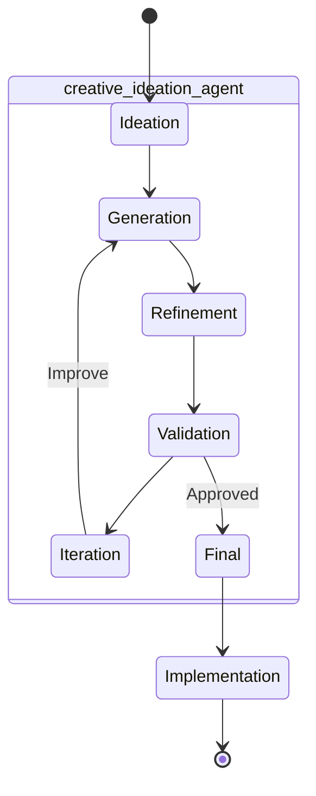

## Security & Compliance Flow

```mermaid
flowchart TD
    CODE[Code Changes] --> SA[🔒 Security Auditor]
    SA --> |Scan| VUL{Vulnerabilities?}
    
    VUL -->|Yes| DB[🐞 Debugger]
    DB --> FIX[Apply Fixes]
    FIX --> SA
    
    VUL -->|No| CS[Compliance Scope]
    CS --> |Check| REG{Compliant?}
    
    REG -->|Yes| ETH[Ethical Review]
    REG -->|No| REM[Remediation]
    REM --> CS
    
    ETH --> |Approved| ✅
```

## Testing Pyramid

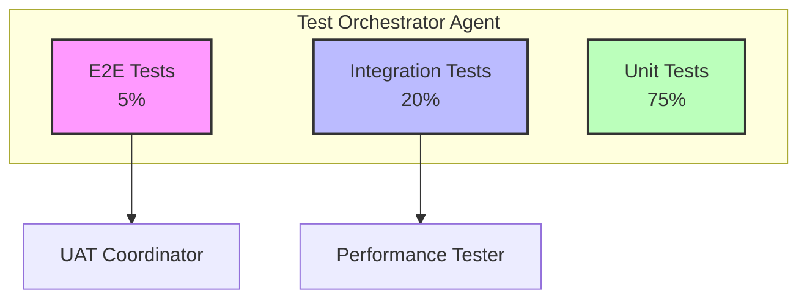

## Context Hierarchy Flow

```mermaid
graph TD
    G[🌍 GLOBAL Context] --> P[📁 PROJECT Context]
    P --> B[🌿 BRANCH Context]
    B --> T[✅ TASK Context]
    
    T --> |Updates| AG[Agent Work]
    AG --> |Insights| T
    T --> |Bubbles Up| B
    B --> |Aggregates| P
    P --> |Summarizes| G
```

## Agent Communication Matrix

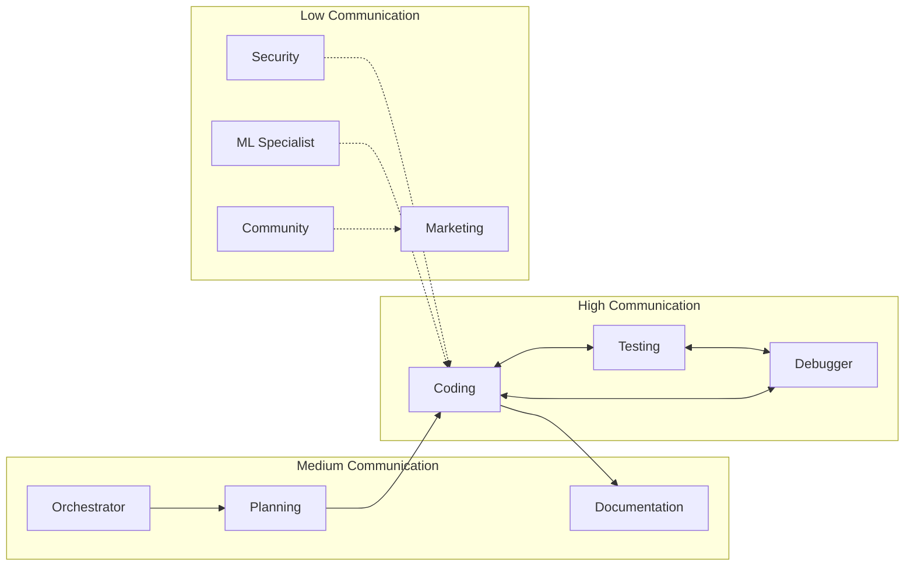

## Deployment Pipeline

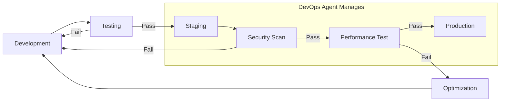

## Agent Selection Decision Tree

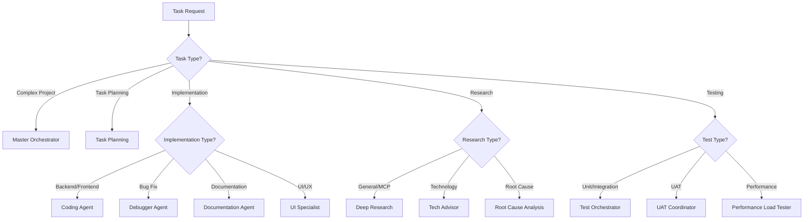

## Performance Optimization Flow

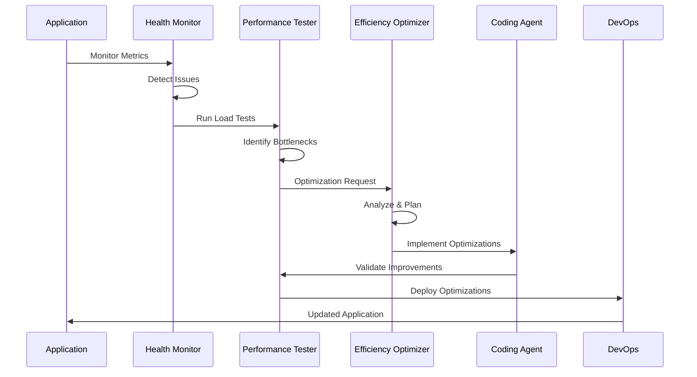

## Summary Statistics

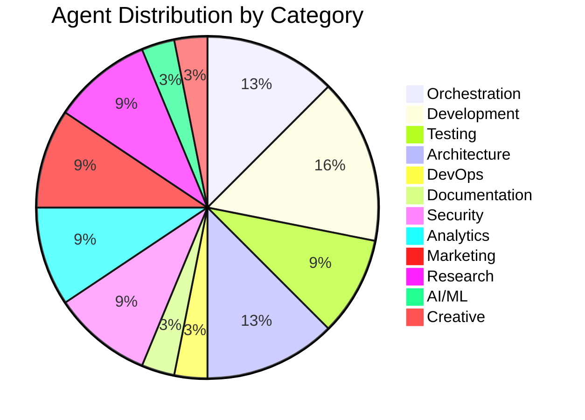

## Conclusion
These flow diagrams illustrate the streamlined architecture after consolidating from 42 to 31 agents. The key improvements include:

1. **Clearer delegation paths** - Direct flows from orchestrators to implementers
2. **Reduced handoffs** - Consolidated agents handle related tasks
3. **Better parallelization** - Independent agents work simultaneously
4. **Simplified communication** - Fewer agents mean fewer interactions
5. **Enhanced capabilities** - Each agent has broader, integrated skills

The visual flows demonstrate how the system maintains full functionality while operating more efficiently with 26% fewer agents.