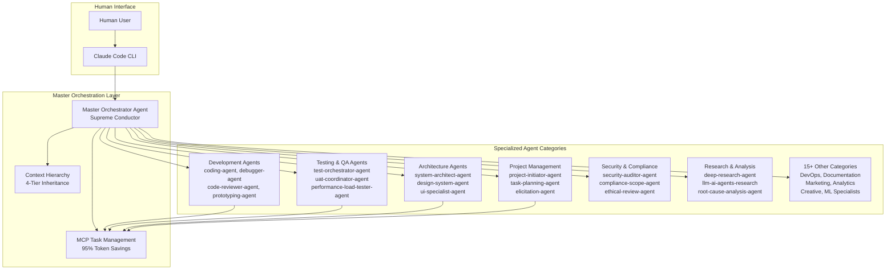
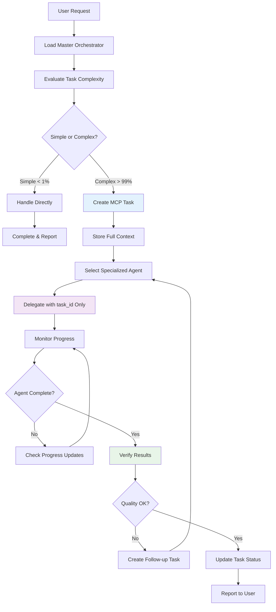
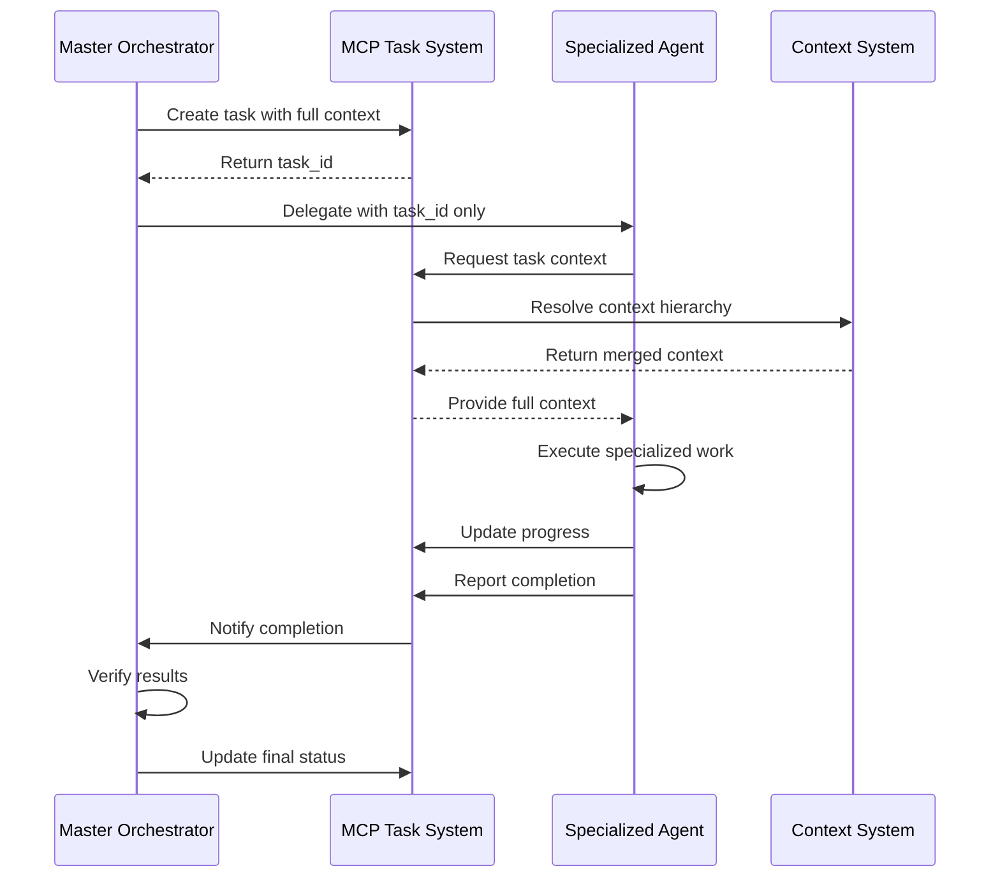

# Agent Orchestration Architecture

**Document Version:** 1.0  
**Last Updated:** 2025-09-12  
**Status:** Active  

## Executive Summary

The 4genthub system employs a sophisticated multi-agent orchestration architecture centered around a Master Orchestrator that coordinates 43+ specialized agents. This enterprise-grade system uses token-efficient delegation, transparent task management, and intelligent agent assignment patterns to deliver scalable, maintainable, and traceable AI-driven project management.

## Quick Navigation

- [Orchestration Overview](#orchestration-overview)
- [Master Orchestrator](#master-orchestrator)
- [Specialized Agent Directory](#specialized-agent-directory)
- [Agent Assignment Patterns](#agent-assignment-patterns)
- [Delegation Architecture](#delegation-architecture)
- [Communication Protocols](#communication-protocols)
- [Token Economy](#token-economy)
- [Performance Optimization](#performance-optimization)

## Orchestration Overview



## Master Orchestrator

### Core Responsibilities

The Master Orchestrator Agent serves as the supreme conductor of all complex workflows:

1. **Task Complexity Evaluation**
   - Simple tasks (< 1%): Handle directly
   - Complex tasks (> 99%): Create MCP task and delegate

2. **Agent Selection & Assignment**
   - Analyze task requirements
   - Match to specialized agent capabilities
   - Apply assignment decision trees

3. **Workflow Coordination**
   - Manage parallel agent execution
   - Handle agent handoffs and dependencies
   - Coordinate cross-agent communication

4. **Quality Assurance**
   - Verify agent results against requirements
   - Coordinate review processes
   - Ensure completion criteria are met

5. **Progress Monitoring**
   - Track task execution across all agents
   - Provide real-time updates to humans
   - Handle escalation and error recovery

### Master Orchestrator Workflow



### Enterprise Professional Model

The Master Orchestrator operates as a **Professional Enterprise Employee**, not a freelancer:

#### Professional Responsibilities:
- **Report Everything**: Document all work in MCP tasks
- **Update Status Regularly**: Provide real-time progress visibility
- **Follow Workflows**: Adhere to enterprise procedures
- **Communicate Constantly**: With humans and sub-agents
- **Request Approval**: For major decisions, escalate appropriately
- **Maintain Context**: Keep detailed records for audit trails

#### Enterprise Rules:
- **No YOLO Mode**: Every action planned and documented
- **No Solo Decisions**: Complex work requires task creation and delegation
- **No Silent Work**: All progress visible through MCP updates
- **No Assumptions**: Check MCP tasks for requirements
- **No Shortcuts**: Follow complete workflow every time

## Specialized Agent Directory

### Development & Coding (4 Agents)

#### 1. coding-agent
- **Specialization**: Implementation and feature development
- **Capabilities**: Code writing, refactoring, optimization
- **Use Cases**: Feature implementation, bug fixes, code improvements
- **Decision Criteria**: `work_type matches "implement|code|build|develop|create"`

#### 2. debugger-agent  
- **Specialization**: Bug fixing and troubleshooting
- **Capabilities**: Error analysis, debugging, problem resolution
- **Use Cases**: Bug investigation, error reproduction, fix implementation
- **Decision Criteria**: `work_type matches "debug|fix|error|bug|troubleshoot"`

#### 3. code-reviewer-agent
- **Specialization**: Code quality and review
- **Capabilities**: Quality assessment, best practices enforcement, security review
- **Use Cases**: Code reviews, quality gates, security audits
- **Decision Criteria**: Post-implementation quality verification

#### 4. prototyping-agent
- **Specialization**: Rapid prototyping and POCs
- **Capabilities**: Quick implementation, concept validation, spike solutions
- **Use Cases**: Proof of concepts, technical spikes, rapid validation
- **Decision Criteria**: `work_type matches "prototype|poc|proof of concept"`

### Testing & QA (3 Agents)

#### 5. test-orchestrator-agent
- **Specialization**: Comprehensive test management
- **Capabilities**: Test strategy, test automation, quality assurance
- **Use Cases**: Test planning, automation implementation, quality gates
- **Decision Criteria**: `work_type matches "test|verify|validate|qa"`

#### 6. uat-coordinator-agent
- **Specialization**: User acceptance testing
- **Capabilities**: UAT planning, user story validation, acceptance criteria
- **Use Cases**: User testing, acceptance validation, story completion
- **Decision Criteria**: `work_type matches "uat|acceptance testing|user testing"`

#### 7. performance-load-tester-agent
- **Specialization**: Performance and load testing
- **Capabilities**: Performance analysis, load testing, bottleneck identification
- **Use Cases**: Performance optimization, scalability testing, bottleneck analysis
- **Decision Criteria**: `work_type matches "performance|load|stress|benchmark"`

### Architecture & Design (4 Agents)

#### 8. system-architect-agent
- **Specialization**: System design and architecture
- **Capabilities**: Architecture design, system integration, technical decisions
- **Use Cases**: Architecture planning, system design, technical leadership
- **Decision Criteria**: `work_type matches "architecture|system|design patterns"`

#### 9. design-system-agent
- **Specialization**: Design system and UI patterns
- **Capabilities**: Component design, pattern libraries, UI consistency
- **Use Cases**: Design system creation, component libraries, UI standardization
- **Decision Criteria**: `work_type matches "design system|component library|ui patterns"`

#### 10. ui-specialist-agent
- **Specialization**: UI/UX design and frontend development
- **Capabilities**: User interface design, frontend implementation, user experience
- **Use Cases**: UI development, UX improvements, frontend features
- **Decision Criteria**: `work_type matches "design|ui|interface|ux|frontend"`

#### 11. core-concept-agent
- **Specialization**: Core concepts and fundamentals
- **Capabilities**: Foundational design, concept validation, architectural principles
- **Use Cases**: Foundational architecture, concept validation, principle enforcement
- **Decision Criteria**: `work_type matches "core concept|fundamental|foundation"`

### DevOps & Infrastructure (1 Agent)

#### 12. devops-agent
- **Specialization**: CI/CD and infrastructure
- **Capabilities**: Deployment automation, infrastructure management, DevOps practices
- **Use Cases**: CI/CD setup, deployment automation, infrastructure configuration
- **Decision Criteria**: `work_type matches "deploy|infrastructure|devops|ci/cd"`

### Documentation (1 Agent)

#### 13. documentation-agent
- **Specialization**: Technical documentation
- **Capabilities**: Documentation creation, technical writing, knowledge management
- **Use Cases**: API documentation, user guides, technical specifications
- **Decision Criteria**: `work_type matches "document|guide|manual|readme"`

### Project & Planning (4 Agents)

#### 14. project-initiator-agent
- **Specialization**: Project setup and kickoff
- **Capabilities**: Project initialization, team setup, process establishment
- **Use Cases**: New project setup, team onboarding, process definition
- **Decision Criteria**: `work_type matches "project|initiative|kickoff"`

#### 15. task-planning-agent
- **Specialization**: Task breakdown and planning
- **Capabilities**: Task decomposition, planning, workflow design
- **Use Cases**: Project planning, task breakdown, workflow optimization
- **Decision Criteria**: `work_type matches "plan|analyze|breakdown|organize"`

#### 16. master-orchestrator-agent
- **Specialization**: Complex workflow orchestration
- **Capabilities**: Multi-agent coordination, workflow management, decision making
- **Use Cases**: Complex project coordination, multi-step workflows, agent management
- **Decision Criteria**: `work_type matches "orchestrate|coordinate|multi-step|complex"`

#### 17. elicitation-agent
- **Specialization**: Requirements gathering
- **Capabilities**: Stakeholder communication, requirement analysis, scope definition
- **Use Cases**: Requirements gathering, stakeholder interviews, scope clarification
- **Decision Criteria**: `work_type matches "elicit|requirements|gathering"`

### Security & Compliance (3 Agents)

#### 18. security-auditor-agent
- **Specialization**: Security audits and reviews
- **Capabilities**: Security assessment, vulnerability analysis, security best practices
- **Use Cases**: Security audits, vulnerability assessment, security implementation
- **Decision Criteria**: `work_type matches "security|audit|vulnerability|penetration"`

#### 19. compliance-scope-agent
- **Specialization**: Regulatory compliance
- **Capabilities**: Compliance analysis, regulatory requirements, audit preparation
- **Use Cases**: Compliance assessment, regulatory alignment, audit support
- **Decision Criteria**: `work_type matches "compliance|regulatory|legal"`

#### 20. ethical-review-agent
- **Specialization**: Ethical considerations
- **Capabilities**: Ethical analysis, responsible AI, bias detection
- **Use Cases**: Ethical review, bias analysis, responsible implementation
- **Decision Criteria**: `work_type matches "ethics|ethical|responsible"`

### Analytics & Optimization (3 Agents)

#### 21. analytics-setup-agent
- **Specialization**: Analytics and tracking setup
- **Capabilities**: Analytics implementation, tracking setup, data collection
- **Use Cases**: Analytics setup, tracking implementation, data strategy
- **Decision Criteria**: `work_type matches "analytics|tracking|metrics"`

#### 22. efficiency-optimization-agent
- **Specialization**: Process optimization
- **Capabilities**: Process analysis, efficiency improvements, optimization
- **Use Cases**: Process optimization, efficiency analysis, workflow improvements
- **Decision Criteria**: `work_type matches "efficiency|optimize|process"`

#### 23. health-monitor-agent
- **Specialization**: System health monitoring
- **Capabilities**: System monitoring, health checks, alerting
- **Use Cases**: System monitoring, health assessment, alerting setup
- **Decision Criteria**: `work_type matches "health|monitor|monitoring|status"`

### Marketing & Branding (3 Agents)

#### 24. marketing-strategy-orchestrator-agent
- **Specialization**: Marketing strategy
- **Capabilities**: Marketing planning, campaign development, strategy execution
- **Use Cases**: Marketing strategy, campaign planning, growth initiatives
- **Decision Criteria**: `work_type matches "marketing|campaign|growth|seo"`

#### 25. community-strategy-agent
- **Specialization**: Community building
- **Capabilities**: Community management, engagement strategies, social initiatives
- **Use Cases**: Community building, engagement planning, social strategy
- **Decision Criteria**: `work_type matches "community|social|engagement"`

#### 26. branding-agent
- **Specialization**: Brand identity
- **Capabilities**: Brand development, identity design, brand consistency
- **Use Cases**: Brand development, identity creation, brand guidelines
- **Decision Criteria**: `work_type matches "brand|branding|identity"`

### Research & Analysis (4 Agents)

#### 27. deep-research-agent
- **Specialization**: In-depth research
- **Capabilities**: Research methodology, data analysis, insight generation
- **Use Cases**: Market research, technical research, competitive analysis
- **Decision Criteria**: `work_type matches "research|investigate|explore|study"`

#### 28. llm-ai-agents-research
- **Specialization**: AI/ML research and innovations
- **Capabilities**: AI research, ML implementation, innovation analysis
- **Use Cases**: AI research, ML strategy, innovation assessment
- **Decision Criteria**: AI/ML focused research and development

#### 29. root-cause-analysis-agent
- **Specialization**: Problem analysis
- **Capabilities**: Root cause analysis, problem diagnosis, systematic investigation
- **Use Cases**: Problem investigation, incident analysis, systematic troubleshooting
- **Decision Criteria**: `work_type matches "incident|postmortem|root cause"`

#### 30. technology-advisor-agent
- **Specialization**: Technology recommendations
- **Capabilities**: Technology assessment, recommendation analysis, tech stack decisions
- **Use Cases**: Technology selection, stack evaluation, technical recommendations
- **Decision Criteria**: `work_type matches "technology|tech stack|framework"`

### AI & Machine Learning (1 Agent)

#### 31. ml-specialist-agent
- **Specialization**: Machine learning implementation
- **Capabilities**: ML model development, data science, AI implementation
- **Use Cases**: ML model creation, data analysis, AI feature implementation
- **Decision Criteria**: `work_type matches "ml|machine learning|ai|neural"`

### Creative & Ideation (1 Agent)

#### 32. creative-ideation-agent
- **Specialization**: Creative idea generation
- **Capabilities**: Creative thinking, ideation, innovative solutions
- **Use Cases**: Creative brainstorming, innovative problem solving, idea generation
- **Decision Criteria**: `work_type matches "creative|idea|ideation|brainstorm"`

## Agent Assignment Patterns

### Decision Tree Algorithm

```python
def select_agent(work_type: str, context: Dict) -> str:
    """Intelligent agent selection based on work type and context"""
    
    # Primary matching based on work type
    if re.match(r"debug|fix|error|bug|troubleshoot", work_type, re.IGNORECASE):
        return "debugger-agent"
    elif re.match(r"implement|code|build|develop|create", work_type, re.IGNORECASE):
        return "coding-agent"
    elif re.match(r"test|verify|validate|qa", work_type, re.IGNORECASE):
        return "test-orchestrator-agent"
    elif re.match(r"plan|analyze|breakdown|organize", work_type, re.IGNORECASE):
        return "task-planning-agent"
    elif re.match(r"design|ui|interface|ux|frontend", work_type, re.IGNORECASE):
        return "ui-specialist-agent"
    elif re.match(r"security|audit|vulnerability", work_type, re.IGNORECASE):
        return "security-auditor-agent"
    elif re.match(r"deploy|infrastructure|devops|ci/cd", work_type, re.IGNORECASE):
        return "devops-agent"
    elif re.match(r"document|guide|manual|readme", work_type, re.IGNORECASE):
        return "documentation-agent"
    elif re.match(r"research|investigate|explore|study", work_type, re.IGNORECASE):
        return "deep-research-agent"
    elif re.match(r"orchestrate|coordinate|multi-step|complex", work_type, re.IGNORECASE):
        return "master-orchestrator-agent"
    # ... additional patterns for all 43+ agents
    else:
        return "master-orchestrator-agent"  # Default fallback

def apply_contextual_refinement(base_agent: str, context: Dict) -> str:
    """Refine agent selection based on project context"""
    
    project_type = context.get("project_type", "")
    complexity = context.get("complexity", "medium")
    tech_stack = context.get("tech_stack", [])
    
    # Context-based refinements
    if base_agent == "coding-agent" and "security" in project_type:
        return "security-auditor-agent"
    elif base_agent == "test-orchestrator-agent" and complexity == "high":
        return "performance-load-tester-agent"
    # ... additional contextual refinements
    
    return base_agent
```

### Multi-Agent Assignment Patterns

#### Sequential Assignment
```python
# For dependent tasks requiring specific order
agents = [
    ("system-architect-agent", "Design system architecture"),
    ("coding-agent", "Implement core functionality"),
    ("test-orchestrator-agent", "Create comprehensive tests"),
    ("security-auditor-agent", "Perform security review"),
    ("documentation-agent", "Create technical documentation")
]
```

#### Parallel Assignment
```python
# For independent tasks that can run simultaneously
parallel_agents = {
    "backend": "coding-agent",
    "frontend": "ui-specialist-agent", 
    "testing": "test-orchestrator-agent",
    "documentation": "documentation-agent"
}
```

#### Hybrid Assignment
```python
# Complex projects with both sequential and parallel phases
workflow = {
    "phase_1_sequential": [
        "project-initiator-agent",
        "system-architect-agent"
    ],
    "phase_2_parallel": [
        "coding-agent",
        "ui-specialist-agent",
        "test-orchestrator-agent"
    ],
    "phase_3_sequential": [
        "security-auditor-agent",
        "documentation-agent"
    ]
}
```

## Delegation Architecture

### Token-Efficient Delegation Pattern

The system achieves **95% token savings** through intelligent delegation:

```python
# Traditional approach (token-heavy)
Task(
    subagent_type="coding-agent",
    prompt=f"""
    Implement JWT authentication with the following requirements:
    - Use RS256 algorithm
    - 2-hour token expiry
    - Refresh token mechanism
    - Secure cookie storage
    - Database: {full_db_schema}
    - API endpoints: {full_api_spec}
    - Security requirements: {full_security_spec}
    - Testing requirements: {full_test_spec}
    ... (thousands more tokens)
    """
)

# 4genthub approach (token-efficient)
# Step 1: Store full context in MCP task
task = mcp__4genthub_http__manage_task(
    action="create",
    title="Implement JWT authentication",
    assignees="coding-agent",
    details="""COMPLETE CONTEXT WITH ALL REQUIREMENTS""" # Stored once
)

# Step 2: Delegate with only task ID (95% token savings)
Task(
    subagent_type="coding-agent", 
    prompt=f"task_id: {task['task']['id']}"  # Only 20-30 tokens!
)
```

### Context Retrieval Pattern

```python
class AgentContextRetriever:
    """How agents retrieve full context from task IDs"""
    
    def get_task_context(self, task_id: str, user_id: str) -> Dict:
        """Retrieve complete task context with inheritance"""
        
        # Get task with full context hierarchy
        context = self.context_manager.resolve_context(
            level="task",
            context_id=task_id, 
            user_id=user_id,
            include_inherited=True
        )
        
        return {
            "task_details": context["task_specific"],
            "branch_config": context["branch_inherited"],
            "project_config": context["project_inherited"], 
            "global_preferences": context["global_inherited"],
            "merged_configuration": context["resolved"]
        }
```

### Delegation Workflow



## Communication Protocols

### MCP Protocol Integration

#### Tool Categories
- **Task Management**: `manage_task`, `manage_subtask`
- **Agent Management**: `manage_agent`, `call_agent`
- **Context Management**: `manage_context`
- **Project Management**: `manage_project`, `manage_git_branch`

#### Agent-to-Agent Communication
```python
class AgentCommunication:
    """Standardized agent communication protocol"""
    
    def send_message(self, from_agent: str, to_agent: str, message: Dict):
        """Send message between agents through MCP"""
        
    def broadcast_event(self, event_type: str, data: Dict):
        """Broadcast event to relevant agents"""
        
    def request_assistance(self, requesting_agent: str, skill_needed: str, context: Dict):
        """Request help from appropriate specialist agent"""
```

### Progress Reporting Protocol

All agents follow standardized progress reporting:

```python
# Initial progress report
mcp__4genthub_http__manage_task(
    action="update",
    task_id=task_id,
    status="in_progress", 
    details="Started task analysis and planning"
)

# Regular progress updates (every 25% completion)
mcp__4genthub_http__manage_task(
    action="update",
    task_id=task_id,
    details="Completed authentication logic, implementing refresh tokens",
    progress_percentage=60
)

# Blocker escalation
mcp__4genthub_http__manage_task(
    action="update",
    task_id=task_id,
    details="Blocked: Need database schema approval before continuing"
)

# Completion report
mcp__4genthub_http__manage_task(
    action="complete",
    task_id=task_id,
    completion_summary="JWT authentication implemented with refresh tokens",
    testing_notes="Unit tests added, integration tests passing"
)
```

## Token Economy

### Token Optimization Strategies

1. **Context Storage**: Store once in MCP, reference by ID
2. **Inheritance Utilization**: Leverage 4-tier context hierarchy
3. **Compressed References**: Use UUIDs instead of full descriptions
4. **Smart Caching**: Cache frequently accessed contexts
5. **Lazy Loading**: Load context only when needed

### Token Usage Comparison

| Approach | Token Usage | Efficiency Gain |
|----------|-------------|-----------------|
| Traditional Full Context | 5,000-15,000 tokens | Baseline |
| 4genthub task_id Reference | 20-30 tokens | **95% savings** |
| Context Inheritance | 100-500 tokens | 90% savings |
| Cached Context | 50-200 tokens | 96% savings |

### Performance Metrics

```python
class TokenEconomyMetrics:
    """Track token efficiency across the system"""
    
    def track_delegation_efficiency(self):
        return {
            "average_tokens_per_delegation": 25,
            "token_savings_percentage": 95,
            "context_reuse_rate": 87,
            "cache_hit_rate": 92
        }
    
    def calculate_cost_savings(self, traditional_cost: float) -> float:
        """Calculate cost savings from token optimization"""
        return traditional_cost * 0.95  # 95% cost reduction
```

## Performance Optimization

### Agent Load Balancing

```python
class AgentLoadBalancer:
    """Distribute work across available agents"""
    
    def __init__(self):
        self.agent_workloads = {}
        self.agent_capabilities = {}
        
    def assign_optimal_agent(self, task_requirements: Dict) -> str:
        """Select best agent based on capability and current load"""
        
        # Filter agents by capability
        capable_agents = self.filter_by_capability(task_requirements)
        
        # Select agent with lowest current workload
        return min(capable_agents, key=lambda a: self.agent_workloads.get(a, 0))
    
    def update_workload(self, agent: str, task_complexity: int):
        """Update agent workload tracking"""
        self.agent_workloads[agent] = self.agent_workloads.get(agent, 0) + task_complexity
```

### Parallel Execution Optimization

```python
class ParallelExecutionManager:
    """Manage parallel agent execution"""
    
    def execute_parallel_tasks(self, task_groups: Dict[str, List[str]]):
        """Execute independent task groups in parallel"""
        
        for group_name, tasks in task_groups.items():
            # Create MCP tasks for each group
            for task in tasks:
                task_response = self.create_mcp_task(task)
                
            # Delegate all tasks in group simultaneously
            self.delegate_task_group(group_name, tasks)
            
    def coordinate_dependencies(self, dependency_graph: Dict):
        """Manage task dependencies and execution order"""
        
        completed_tasks = set()
        
        while dependency_graph:
            # Find tasks with no remaining dependencies
            ready_tasks = [
                task for task, deps in dependency_graph.items()
                if all(dep in completed_tasks for dep in deps)
            ]
            
            # Execute ready tasks in parallel
            for task in ready_tasks:
                self.execute_task(task)
                completed_tasks.add(task)
                del dependency_graph[task]
```

### Caching and Context Optimization

```python
class AgentContextCache:
    """Intelligent caching for agent contexts"""
    
    def __init__(self):
        self.context_cache = {}
        self.cache_ttl = {
            "project": 1800,  # 30 minutes
            "branch": 600,    # 10 minutes  
            "task": 300       # 5 minutes
        }
    
    def get_cached_context(self, context_key: str, context_level: str):
        """Retrieve cached context with appropriate TTL"""
        
        cache_entry = self.context_cache.get(context_key)
        if cache_entry and not self.is_expired(cache_entry, context_level):
            return cache_entry["data"]
            
        return None
    
    def cache_context(self, context_key: str, context_data: Dict, context_level: str):
        """Cache context with appropriate TTL"""
        
        self.context_cache[context_key] = {
            "data": context_data,
            "timestamp": datetime.utcnow(),
            "ttl": self.cache_ttl[context_level]
        }
```

## Error Handling and Recovery

### Agent Error Recovery

```python
class AgentErrorRecovery:
    """Handle agent failures and provide recovery mechanisms"""
    
    def handle_agent_failure(self, failed_agent: str, task_id: str, error: Exception):
        """Recover from agent failures"""
        
        # Log the failure
        self.log_agent_failure(failed_agent, task_id, error)
        
        # Attempt recovery strategies
        if self.is_transient_error(error):
            # Retry with same agent
            return self.retry_task(failed_agent, task_id)
        elif self.is_capability_mismatch(error):
            # Reassign to different agent
            return self.reassign_task(task_id, error)
        else:
            # Escalate to master orchestrator
            return self.escalate_to_master(task_id, error)
    
    def provide_fallback_agent(self, failed_agent: str, task_requirements: Dict) -> str:
        """Find suitable fallback agent"""
        
        fallback_mapping = {
            "coding-agent": ["debugger-agent", "prototyping-agent"],
            "ui-specialist-agent": ["design-system-agent", "coding-agent"],
            "test-orchestrator-agent": ["performance-load-tester-agent", "uat-coordinator-agent"]
        }
        
        return self.select_best_fallback(fallback_mapping.get(failed_agent, []), task_requirements)
```

### Quality Assurance Patterns

```python
class AgentQualityAssurance:
    """Ensure quality of agent outputs"""
    
    def validate_agent_output(self, agent: str, task_id: str, output: Dict) -> bool:
        """Validate agent output against requirements"""
        
        # Get task requirements
        task_context = self.get_task_context(task_id)
        
        # Apply agent-specific validation rules
        validation_rules = self.get_validation_rules(agent)
        
        for rule in validation_rules:
            if not rule.validate(output, task_context):
                return False
                
        return True
    
    def trigger_quality_review(self, task_id: str, output: Dict):
        """Trigger peer review process"""
        
        review_task = self.create_review_task(task_id, output)
        self.assign_reviewer(review_task)
```

---

**Related Documentation:**
- [System Architecture Overview](./system-architecture-overview.md)
- [Domain-Driven Design Layers](./domain-driven-design-layers.md)
- [Context Hierarchy System](./context-hierarchy-system.md)
- [Design Patterns in Architecture](./design-patterns-in-architecture.md)

**Last Updated:** 2025-09-12  
**Document Owner:** 4genthub Architecture Team  
**Review Schedule:** Monthly  
**Status:** Living Document