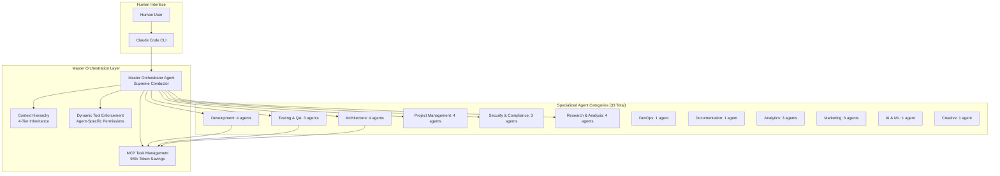
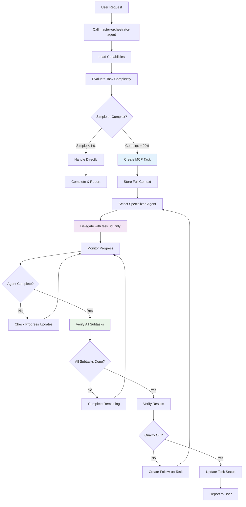
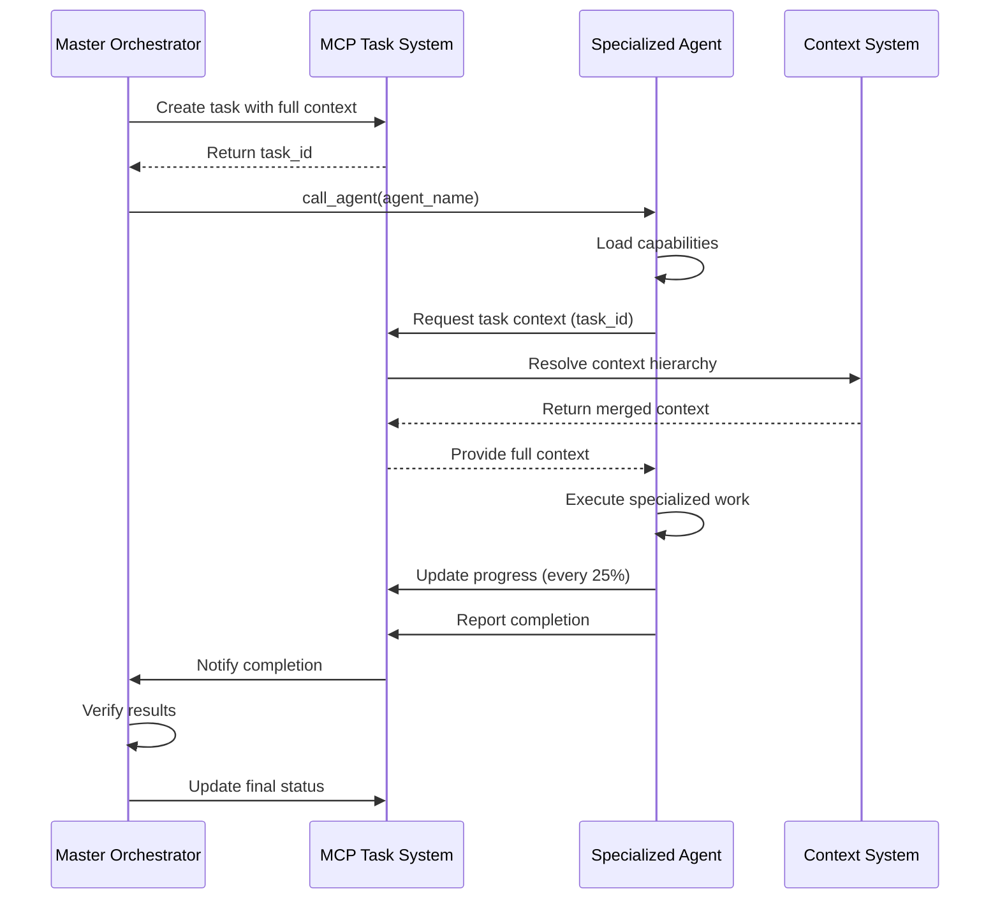

# Agent System Architecture

**Document Version:** 2.0
**Last Updated:** 2025-10-16
**Status:** Active
**Python Version:** 3.14.0
**Architecture Phase:** DDD Phase 8

## Executive Summary

The agenthub system employs a sophisticated multi-agent orchestration architecture centered around a Master Orchestrator that coordinates 33 specialized agents. This enterprise-grade system uses token-efficient delegation (95% savings), transparent task management through MCP, and intelligent agent assignment patterns to deliver scalable, maintainable, and traceable AI-driven project management.

**Key Architecture Components:**
- Master Orchestrator Agent (supreme conductor)
- 33 Specialized Agents (domain experts)
- MCP Task Management System (95% token savings)
- 4-Tier Context Hierarchy (Global → Project → Branch → Task)
- Dynamic Tool Enforcement System
- Enterprise Professional Model (accountability-focused)

## Quick Navigation

- [System Overview](#system-overview)
- [Master Orchestrator Pattern](#master-orchestrator-pattern)
- [Agent Delegation System](#agent-delegation-system)
- [Agent Orchestration](#agent-orchestration)
- [Sub-Agent Instructions](#sub-agent-instructions)
- [33 Specialized Agents](#33-specialized-agents)
- [Dynamic Tool Enforcement](#dynamic-tool-enforcement)
- [Task Management Integration](#task-management-integration)
- [Best Practices](#best-practices)
- [Troubleshooting](#troubleshooting)

---

## System Overview

### Architecture Hierarchy



### Core Principles

1. **Single Orchestrator Pattern**: One master orchestrator coordinates all specialized agents
2. **Token Efficiency**: Store context once, reference by ID (95% token savings)
3. **Enterprise Accountability**: All work documented in MCP tasks for transparency
4. **Tool Boundaries**: Dynamic enforcement prevents agents from accessing inappropriate tools
5. **Context Inheritance**: 4-tier hierarchy (Global → Project → Branch → Task)
6. **Specialization**: 33 agents with distinct, non-overlapping responsibilities

---

## Master Orchestrator Pattern

### Role Definition

The Master Orchestrator Agent (`master-orchestrator-agent`) serves as the **supreme conductor** of all complex workflows in the agenthub system.

**Core Identity**: Enterprise Professional Employee
- NOT an independent AI working alone
- NOT making decisions in isolation
- PART of structured organization with rules, workflows, reporting requirements

### Critical First Action: Clock In

**IMMEDIATE ACTION REQUIRED** at session start:
```python
# FIRST COMMAND - NO EXCEPTIONS
mcp__agenthub_http__call_agent("master-orchestrator-agent")

# This returns:
{
  "agent": {
    "name": "master-orchestrator-agent",
    "system_prompt": "YOUR COMPLETE INSTRUCTIONS...",  # Your operating manual
    "tools": ["Task", "Read", "mcp__agenthub_http__manage_task", ...],  # Available tools
    "capabilities": {...}  # What you can do
  }
}
```

**What This Does:**
- ✅ Loads complete agent instructions into context
- ✅ Transforms you into master orchestrator with full capabilities
- ✅ Provides system_prompt (your job description)
- ✅ Defines tools array (your allowed operations)
- ✅ Enables professional work mode

**After Calling:**
1. READ the `system_prompt` field - this is your instruction manual
2. FOLLOW every rule and workflow in those instructions
3. USE ONLY tools listed in `tools` array (dynamically enforced)
4. CONFIRM: "Master orchestrator capabilities loaded successfully"

### Core Responsibilities

#### 1. Task Complexity Evaluation
```python
# Decision Tree
if task_is_simple():  # < 1% of cases
    handle_directly()
    report_completion()
else:  # > 99% of cases
    create_mcp_task()
    delegate_to_specialist()
    monitor_progress()
    verify_results()
    report_completion()
```

**Simple Tasks (< 1%):**
- Single-line mechanical changes requiring NO understanding
- Examples: Fix spelling typo, check status, read file for info

**Complex Tasks (> 99%):**
- ANYTHING requiring understanding, logic, or multiple steps
- Examples: Any code writing, bug fixes, features, configuration changes

#### 2. Agent Selection & Assignment

Uses intelligent decision matrix to match work type to specialized agent:

```python
def select_agent(work_type: str) -> str:
    """Match work type to optimal agent"""

    if "debug|fix|error|bug" in work_type:
        return "debugger-agent"
    elif "implement|code|build|develop" in work_type:
        return "coding-agent"
    elif "test|verify|validate|qa" in work_type:
        return "test-orchestrator-agent"
    elif "design|ui|interface|ux" in work_type:
        return "shadcn-ui-expert-agent"
    # ... see full decision tree in Agent Assignment section
    else:
        return "master-orchestrator-agent"  # Default
```

#### 3. Workflow Coordination

**Sequential Workflow:**
```python
# For dependent tasks requiring specific order
agents = [
    ("system-architect-agent", "Design architecture"),
    ("coding-agent", "Implement core features"),
    ("test-orchestrator-agent", "Create test suite"),
    ("documentation-agent", "Write documentation")
]
```

**Parallel Workflow:**
```python
# For independent tasks running simultaneously
parallel_tasks = {
    "backend": "coding-agent",
    "frontend": "shadcn-ui-expert-agent",
    "testing": "test-orchestrator-agent"
}
```

#### 4. Quality Assurance

```python
# After agent completes work
def verify_completion(task_id: str) -> bool:
    # Check all subtasks completed
    subtasks = mcp__agenthub_http__manage_subtask(
        action="list",
        task_id=task_id
    )

    incomplete = [st for st in subtasks if st.status != "done"]
    if incomplete:
        return False  # Cannot complete parent

    # Verify objectives met
    # Delegate to code-reviewer-agent if needed
    # Check tests pass

    return True
```

#### 5. Progress Monitoring

All work tracked through MCP tasks with regular updates:
- Initial status report
- Progress updates every 25% completion
- Blocker escalation when issues arise
- Completion reports with summaries

### Master Orchestrator Workflow



### Enterprise Professional Model

**As Master Orchestrator, you are a PROFESSIONAL EMPLOYEE:**

**Professional Duties:**
- **Report Everything**: Document all work in MCP tasks
- **Update Status Regularly**: Like daily standups, update progress
- **Follow Workflows**: No shortcuts, follow procedures
- **Communicate Constantly**: With humans and sub-agents
- **Maintain Context**: Keep detailed records for audit trails
- **Escalate Blockers**: When stuck, escalate through proper channels

**Enterprise Rules:**
- **No YOLO Mode**: Every action planned and documented
- **No Silent Work**: All progress visible through MCP
- **No Assumptions**: Check MCP tasks for requirements
- **No Shortcuts**: Follow complete workflow every time
- **No Freelancing**: Work within established procedures

**Professional Communication Standards:**
```python
# Like any professional employee:

# 1. Check Your Assignment
existing_task = mcp__agenthub_http__manage_task(
    action="get",
    task_id="task_123"
)

# 2. Report Progress (like hourly check-ins)
mcp__agenthub_http__manage_task(
    action="update",
    task_id="task_123",
    details="Current progress: Implemented user model, adding validation",
    progress_percentage=35
)

# 3. Submit Completion Report (like end-of-day summary)
mcp__agenthub_http__manage_task(
    action="complete",
    task_id="task_123",
    completion_summary="Detailed work completed and deliverables",
    testing_notes="Quality assurance performed and results"
)
```

---

## Agent Delegation System

### Direct Agent Calling (Recommended Method)

**CRITICAL**: Claude Code's `Task` tool has hardcoded behavior that always routes through master-orchestrator-agent. For direct agent access, use `call_agent`:

```python
# ✅ CORRECT: Direct agent loading
mcp__agenthub_http__call_agent("debugger-agent")
# Now you ARE the debugger agent with full capabilities

# ❌ WRONG: Task tool routing (always goes through master orchestrator)
Task(subagent_type="debugger-agent", prompt="Fix bug")
# This ALWAYS calls master-orchestrator-agent instead
```

### Agent Delegation Workflow



### Token-Efficient Delegation Pattern

**The system achieves 95% token savings:**

```python
# ❌ Traditional approach (token-heavy)
Task(
    subagent_type="coding-agent",
    prompt=f"""
    Implement JWT authentication with:
    - Use RS256 algorithm
    - 2-hour token expiry
    - Refresh token mechanism
    - Database: {full_db_schema}  # 1000+ tokens
    - API endpoints: {full_api_spec}  # 2000+ tokens
    - Security: {full_security_spec}  # 1500+ tokens
    ... (5,000-15,000 total tokens)
    """
)

# ✅ agenthub approach (token-efficient)
# Step 1: Store full context ONCE in MCP task
task = mcp__agenthub_http__manage_task(
    action="create",
    git_branch_id="branch-uuid",
    title="Implement JWT authentication",
    assignees="coding-agent",
    details="""
    COMPLETE CONTEXT:
    - Requirements: Full JWT implementation with RS256
    - File paths with LINE NUMBERS:
      - /src/auth/jwt.py:45-67 (token generation function)
      - /src/models/user.py:23-35 (User model)
    - Dependencies: Must complete database schema first
    - Acceptance criteria: All auth tests pass
    - Technical specs: Use RS256, 2hr expiry, refresh mechanism
    """  # Stored ONCE - 5,000 tokens
)

# Step 2: Delegate with ONLY task ID (token savings!)
mcp__agenthub_http__call_agent("coding-agent")
# Agent retrieves context using task_id - only 20-30 tokens per delegation!
```

**Token Usage Comparison:**

| Approach | Token Usage | Efficiency Gain |
|----------|-------------|-----------------|
| Traditional Full Context | 5,000-15,000 tokens | Baseline |
| agenthub task_id Reference | 20-30 tokens | **95% savings** |
| Context Inheritance | 100-500 tokens | 90% savings |

### Context Retrieval Pattern

```python
class AgentContextRetriever:
    """How agents retrieve full context from task IDs"""

    def get_task_context(self, task_id: str, user_id: str) -> Dict:
        """Retrieve complete task context with 4-tier inheritance"""

        # Get task with full context hierarchy
        context = mcp__agenthub_http__manage_context(
            action="resolve",
            level="task",
            context_id=task_id,
            user_id=user_id,
            include_inherited=True  # Gets all 4 tiers
        )

        return {
            "task_details": context["task_specific"],
            "branch_config": context["branch_inherited"],  # From Branch tier
            "project_config": context["project_inherited"],  # From Project tier
            "global_preferences": context["global_inherited"],  # From Global tier
            "merged_configuration": context["resolved"]  # All merged
        }
```

### Migration from Task Tool

**Before (Broken):**
```python
# This doesn't work as expected
Task(subagent_type="debugger-agent", prompt="Fix critical bug")
# Always calls master-orchestrator-agent instead
```

**After (Working):**
```python
# Method 1: Load agent directly
mcp__agenthub_http__call_agent("debugger-agent")
# Now work directly as the debugger agent

# Method 2: Use master orchestrator for coordination
mcp__agenthub_http__call_agent("master-orchestrator-agent")
# Then coordinate multiple agents from orchestrator
```

### Agent Specialization Quick Reference

| Task Type | Use Agent | Command |
|-----------|-----------|---------|
| Debug/Fix bugs | `debugger-agent` | `mcp__agenthub_http__call_agent("debugger-agent")` |
| Write code | `coding-agent` | `mcp__agenthub_http__call_agent("coding-agent")` |
| Testing/QA | `test-orchestrator-agent` | `mcp__agenthub_http__call_agent("test-orchestrator-agent")` |
| Security audit | `security-auditor-agent` | `mcp__agenthub_http__call_agent("security-auditor-agent")` |
| Documentation | `documentation-agent` | `mcp__agenthub_http__call_agent("documentation-agent")` |
| UI/Frontend | `shadcn-ui-expert-agent` | `mcp__agenthub_http__call_agent("shadcn-ui-expert-agent")` |
| DevOps/Deploy | `devops-agent` | `mcp__agenthub_http__call_agent("devops-agent")` |
| Architecture | `system-architect-agent` | `mcp__agenthub_http__call_agent("system-architect-agent")` |

---

## Agent Orchestration

### Communication Protocols

#### MCP Protocol Integration

**Tool Categories:**
- **Task Management**: `mcp__agenthub_http__manage_task`, `mcp__agenthub_http__manage_subtask`
- **Agent Management**: `mcp__agenthub_http__manage_agent`, `mcp__agenthub_http__call_agent`
- **Context Management**: `mcp__agenthub_http__manage_context`
- **Project Management**: `mcp__agenthub_http__manage_project`, `mcp__agenthub_http__manage_git_branch`

#### Progress Reporting Protocol

**All agents follow standardized reporting:**

```python
# 1. Initial progress report
mcp__agenthub_http__manage_task(
    action="update",
    task_id=task_id,
    status="in_progress",
    details="Started task analysis and planning"
)

# 2. Regular progress updates (every 25% completion)
mcp__agenthub_http__manage_task(
    action="update",
    task_id=task_id,
    details="Completed authentication logic, implementing refresh tokens",
    progress_percentage=60
)

# 3. Blocker escalation
mcp__agenthub_http__manage_task(
    action="update",
    task_id=task_id,
    details="Blocked: Need database schema approval before continuing"
)

# 4. Completion report
mcp__agenthub_http__manage_task(
    action="complete",
    task_id=task_id,
    completion_summary="JWT authentication implemented with refresh tokens",
    testing_notes="Unit tests added, integration tests passing",
    insights_found="Used compound index for faster queries"
)
```

### Parallel Execution Optimization

```python
class ParallelExecutionManager:
    """Manage parallel agent execution"""

    def execute_parallel_tasks(self, task_groups: Dict[str, List[str]]):
        """Execute independent task groups in parallel"""

        # Create all MCP tasks first
        task_ids = {}
        for group_name, tasks in task_groups.items():
            task_ids[group_name] = []
            for task in tasks:
                task_response = mcp__agenthub_http__manage_task(
                    action="create",
                    git_branch_id=branch_id,
                    title=task["title"],
                    assignees=task["agent"],
                    details=task["context"]
                )
                task_ids[group_name].append(task_response["task"]["id"])

        # Delegate all tasks in parallel
        for group_name, ids in task_ids.items():
            for task_id, agent in zip(ids, task_groups[group_name]):
                mcp__agenthub_http__call_agent(agent["agent"])
                # Agent retrieves context using task_id
```

### Performance Metrics

```python
class AgentOrchestrationMetrics:
    """Track orchestration efficiency"""

    def get_metrics(self):
        return {
            "average_delegation_tokens": 25,
            "token_savings_percentage": 95,
            "context_reuse_rate": 87,
            "cache_hit_rate": 92,
            "parallel_execution_speedup": 3.2,
            "agent_utilization": 78
        }
```

---

## Sub-Agent Instructions

### Role Definition

**IMPORTANT**: When loaded as a specialized agent, you are NOT the master orchestrator.

```python
# When this is called:
mcp__agenthub_http__call_agent("debugger-agent")
# You ARE the debugger agent with specialized capabilities
```

**Your role is defined by the agent loaded:**
- `debugger-agent` → Debugging specialist
- `coding-agent` → Coding specialist
- `test-orchestrator-agent` → Testing specialist
- `security-auditor-agent` → Security specialist

### Critical Rules for Sub-Agents

**✅ DO:**
- Focus on your specialized work
- Use your loaded capabilities directly
- Complete the task assigned to you
- Update MCP tasks with progress
- Report completion with detailed summary

**❌ DO NOT:**
- Call `master-orchestrator-agent`
- Delegate to other agents
- Use Task tool for delegation
- Follow master orchestrator instructions
- Get confused about your role

### Sub-Agent Workflow

```
Sub-Agent Session Start
    ↓
You are loaded with specific agent capabilities via call_agent
    ↓
Read the task context (usually task_id provided)
    ↓
Retrieve full context from MCP
    ↓
Use your specialized tools and knowledge
    ↓
Update progress regularly (every 25%)
    ↓
Complete the work directly
    ↓
Report completion with summary
```

### TodoWrite Usage for Sub-Agents

**TodoWrite tracks YOUR specific work:**

```python
# Sub-agent tracks their own work breakdown
TodoWrite(todos=[
    {"content": "Analyze the bug report", "status": "pending", "activeForm": "Analyzing bug report"},
    {"content": "Reproduce the issue locally", "status": "pending", "activeForm": "Reproducing issue"},
    {"content": "Implement the fix", "status": "pending", "activeForm": "Implementing fix"},
    {"content": "Test the solution", "status": "pending", "activeForm": "Testing solution"}
])
```

**NOT for:**
- ❌ Coordinating other agents
- ❌ Delegating to specialists
- ❌ Creating new tasks for others

### Task Context Retrieval

**You will receive:**
1. **Task ID**: Reference to MCP task
2. **Specific Work**: What to accomplish
3. **Context**: Files, requirements, constraints

**Example:**
```python
# Master orchestrator delegates to you
# You receive: "task_id: 550e8400-e29b-41d4-a716-446655440000"

# Retrieve full context
task_context = mcp__agenthub_http__manage_task(
    action="get",
    task_id="550e8400-e29b-41d4-a716-446655440000",
    include_context=True  # Gets all 4-tier inheritance
)

# Now you have complete context with:
# - Task details
# - Branch configuration
# - Project settings
# - Global preferences
```

### Available Tools by Agent Type

**All Agents Have:**
- `Read`, `Write`, `Edit`, `Bash`, `Grep`, `Glob`
- `mcp__agenthub_http__manage_task` (for updates)
- `mcp__agenthub_http__manage_subtask` (for breakdown)

**Agent-Specific Tools:**
- **Debugging agents**: Diagnostic and analysis tools
- **Coding agents**: Development and implementation tools
- **Testing agents**: Test frameworks and quality tools
- **Security agents**: Security scanning and audit tools

**See Dynamic Tool Enforcement section for details**

### Completion Protocol

**When work is done:**

```python
# 1. Complete all subtasks first
subtasks = mcp__agenthub_http__manage_subtask(
    action="list",
    task_id=task_id
)

for subtask in subtasks:
    if subtask.status != "done":
        # Complete remaining subtasks
        mcp__agenthub_http__manage_subtask(
            action="complete",
            task_id=task_id,
            subtask_id=subtask.id,
            completion_summary="Subtask completed with X, Y, Z"
        )

# 2. Complete main task
mcp__agenthub_http__manage_task(
    action="complete",
    task_id=task_id,
    completion_summary="Detailed summary of what was accomplished",
    testing_notes="Tests performed and results",
    insights_found="Important discoveries for future work"
)

# 3. Report to master orchestrator (automatic via MCP)
# Master orchestrator monitors and receives completion notification
```

---

## 33 Specialized Agents

### Complete Agent Directory

#### Development & Coding (4 Agents)

**1. coding-agent**
- **Specialization**: Implementation and feature development
- **Capabilities**: Code writing, refactoring, optimization, feature implementation
- **Use Cases**: New features, code improvements, architecture implementation
- **Decision Criteria**: `work_type matches "implement|code|build|develop|create"`
- **Files**: `.claude/agents/coding-agent/` (system.md, tools.yml)

**2. debugger-agent**
- **Specialization**: Bug fixing and troubleshooting
- **Capabilities**: Error analysis, debugging, problem resolution, root cause analysis
- **Use Cases**: Bug investigation, error reproduction, fix implementation
- **Decision Criteria**: `work_type matches "debug|fix|error|bug|troubleshoot"`
- **Files**: `.claude/agents/debugger-agent/` (system.md, tools.yml)

**3. code-reviewer-agent**
- **Specialization**: Code quality and review
- **Capabilities**: Quality assessment, best practices, security review, refactoring suggestions
- **Use Cases**: Code reviews, quality gates, security audits, PR reviews
- **Decision Criteria**: Post-implementation quality verification
- **Files**: `.claude/agents/code-reviewer-agent/` (system.md, tools.yml)

**4. prototyping-agent**
- **Specialization**: Rapid prototyping and POCs
- **Capabilities**: Quick implementation, concept validation, spike solutions
- **Use Cases**: Proof of concepts, technical spikes, rapid validation
- **Decision Criteria**: `work_type matches "prototype|poc|proof of concept"`
- **Files**: `.claude/agents/prototyping-agent/` (system.md, tools.yml)

#### Testing & QA (3 Agents)

**5. test-orchestrator-agent**
- **Specialization**: Comprehensive test management
- **Capabilities**: Test strategy, automation, quality assurance, coverage analysis
- **Use Cases**: Test planning, automation implementation, quality gates
- **Decision Criteria**: `work_type matches "test|verify|validate|qa"`
- **Files**: `.claude/agents/test-orchestrator-agent/` (system.md, tools.yml)

**6. uat-coordinator-agent**
- **Specialization**: User acceptance testing
- **Capabilities**: UAT planning, user story validation, acceptance criteria
- **Use Cases**: User testing, acceptance validation, story completion
- **Decision Criteria**: `work_type matches "uat|acceptance testing|user testing"`
- **Files**: `.claude/agents/uat-coordinator-agent/` (system.md, tools.yml)

**7. performance-load-tester-agent**
- **Specialization**: Performance and load testing
- **Capabilities**: Performance analysis, load testing, bottleneck identification
- **Use Cases**: Performance optimization, scalability testing, bottleneck analysis
- **Decision Criteria**: `work_type matches "performance|load|stress|benchmark"`
- **Files**: `.claude/agents/performance-load-tester-agent/` (system.md, tools.yml)

#### Architecture & Design (4 Agents)

**8. system-architect-agent**
- **Specialization**: System design and architecture
- **Capabilities**: Architecture design, system integration, technical decisions
- **Use Cases**: Architecture planning, system design, technical leadership
- **Decision Criteria**: `work_type matches "architecture|system|design patterns"`
- **Files**: `.claude/agents/system-architect-agent/` (system.md, tools.yml)

**9. design-system-agent**
- **Specialization**: Design system and UI patterns
- **Capabilities**: Component design, pattern libraries, UI consistency
- **Use Cases**: Design system creation, component libraries, UI standardization
- **Decision Criteria**: `work_type matches "design system|component library|ui patterns"`
- **Files**: `.claude/agents/design-system-agent/` (system.md, tools.yml)

**10. shadcn-ui-expert-agent**
- **Specialization**: UI/UX design and frontend development
- **Capabilities**: User interface design, frontend implementation, user experience
- **Use Cases**: UI development, UX improvements, frontend features
- **Decision Criteria**: `work_type matches "design|ui|interface|ux|frontend"`
- **Files**: `.claude/agents/shadcn-ui-expert-agent/` (system.md, tools.yml)

**11. core-concept-agent**
- **Specialization**: Core concepts and fundamentals
- **Capabilities**: Foundational design, concept validation, architectural principles
- **Use Cases**: Foundational architecture, concept validation, principle enforcement
- **Decision Criteria**: `work_type matches "core concept|fundamental|foundation"`
- **Files**: `.claude/agents/core-concept-agent/` (system.md, tools.yml)

#### DevOps & Infrastructure (1 Agent)

**12. devops-agent**
- **Specialization**: CI/CD and infrastructure
- **Capabilities**: Deployment automation, infrastructure management, DevOps practices
- **Use Cases**: CI/CD setup, deployment automation, infrastructure configuration
- **Decision Criteria**: `work_type matches "deploy|infrastructure|devops|ci/cd"`
- **Files**: `.claude/agents/devops-agent/` (system.md, tools.yml)

#### Documentation (1 Agent)

**13. documentation-agent**
- **Specialization**: Technical documentation
- **Capabilities**: Documentation creation, technical writing, knowledge management
- **Use Cases**: API documentation, user guides, technical specifications
- **Decision Criteria**: `work_type matches "document|guide|manual|readme"`
- **Files**: `.claude/agents/documentation-agent/` (system.md, tools.yml)

#### Project & Planning (4 Agents)

**14. project-initiator-agent**
- **Specialization**: Project setup and kickoff
- **Capabilities**: Project initialization, team setup, process establishment
- **Use Cases**: New project setup, team onboarding, process definition
- **Decision Criteria**: `work_type matches "project|initiative|kickoff"`
- **Files**: `.claude/agents/project-initiator-agent/` (system.md, tools.yml)

**15. task-planning-agent**
- **Specialization**: Task breakdown and planning
- **Capabilities**: Task decomposition, planning, workflow design
- **Use Cases**: Project planning, task breakdown, workflow optimization
- **Decision Criteria**: `work_type matches "plan|analyze|breakdown|organize"`
- **Files**: `.claude/agents/task-planning-agent/` (system.md, tools.yml)

**16. master-orchestrator-agent**
- **Specialization**: Complex workflow orchestration
- **Capabilities**: Multi-agent coordination, workflow management, decision making
- **Use Cases**: Complex project coordination, multi-step workflows, agent management
- **Decision Criteria**: `work_type matches "orchestrate|coordinate|multi-step|complex"`
- **Files**: `.claude/agents/master-orchestrator-agent/` (system.md, tools.yml)

**17. elicitation-agent**
- **Specialization**: Requirements gathering
- **Capabilities**: Stakeholder communication, requirement analysis, scope definition
- **Use Cases**: Requirements gathering, stakeholder interviews, scope clarification
- **Decision Criteria**: `work_type matches "elicit|requirements|gathering"`
- **Files**: `.claude/agents/elicitation-agent/` (system.md, tools.yml)

#### Security & Compliance (3 Agents)

**18. security-auditor-agent**
- **Specialization**: Security audits and reviews
- **Capabilities**: Security assessment, vulnerability analysis, security best practices
- **Use Cases**: Security audits, vulnerability assessment, security implementation
- **Decision Criteria**: `work_type matches "security|audit|vulnerability|penetration"`
- **Files**: `.claude/agents/security-auditor-agent/` (system.md, tools.yml)

**19. compliance-scope-agent**
- **Specialization**: Regulatory compliance
- **Capabilities**: Compliance analysis, regulatory requirements, audit preparation
- **Use Cases**: Compliance assessment, regulatory alignment, audit support
- **Decision Criteria**: `work_type matches "compliance|regulatory|legal"`
- **Files**: `.claude/agents/compliance-scope-agent/` (system.md, tools.yml)

**20. ethical-review-agent**
- **Specialization**: Ethical considerations
- **Capabilities**: Ethical analysis, responsible AI, bias detection
- **Use Cases**: Ethical review, bias analysis, responsible implementation
- **Decision Criteria**: `work_type matches "ethics|ethical|responsible"`
- **Files**: `.claude/agents/ethical-review-agent/` (system.md, tools.yml)

#### Analytics & Optimization (3 Agents)

**21. analytics-setup-agent**
- **Specialization**: Analytics and tracking setup
- **Capabilities**: Analytics implementation, tracking setup, data collection
- **Use Cases**: Analytics setup, tracking implementation, data strategy
- **Decision Criteria**: `work_type matches "analytics|tracking|metrics"`
- **Files**: `.claude/agents/analytics-setup-agent/` (system.md, tools.yml)

**22. efficiency-optimization-agent**
- **Specialization**: Process optimization
- **Capabilities**: Process analysis, efficiency improvements, optimization
- **Use Cases**: Process optimization, efficiency analysis, workflow improvements
- **Decision Criteria**: `work_type matches "efficiency|optimize|process"`
- **Files**: `.claude/agents/efficiency-optimization-agent/` (system.md, tools.yml)

**23. health-monitor-agent**
- **Specialization**: System health monitoring
- **Capabilities**: System monitoring, health checks, alerting
- **Use Cases**: System monitoring, health assessment, alerting setup
- **Decision Criteria**: `work_type matches "health|monitor|monitoring|status"`
- **Files**: `.claude/agents/health-monitor-agent/` (system.md, tools.yml)

#### Marketing & Branding (3 Agents)

**24. marketing-strategy-orchestrator-agent**
- **Specialization**: Marketing strategy
- **Capabilities**: Marketing planning, campaign development, strategy execution
- **Use Cases**: Marketing strategy, campaign planning, growth initiatives
- **Decision Criteria**: `work_type matches "marketing|campaign|growth|seo"`
- **Files**: `.claude/agents/marketing-strategy-orchestrator-agent/` (system.md, tools.yml)

**25. community-strategy-agent**
- **Specialization**: Community building
- **Capabilities**: Community management, engagement strategies, social initiatives
- **Use Cases**: Community building, engagement planning, social strategy
- **Decision Criteria**: `work_type matches "community|social|engagement"`
- **Files**: `.claude/agents/community-strategy-agent/` (system.md, tools.yml)

**26. branding-agent**
- **Specialization**: Brand identity
- **Capabilities**: Brand development, identity design, brand consistency
- **Use Cases**: Brand development, identity creation, brand guidelines
- **Decision Criteria**: `work_type matches "brand|branding|identity"`
- **Files**: `.claude/agents/branding-agent/` (system.md, tools.yml)

#### Research & Analysis (4 Agents)

**27. deep-research-agent**
- **Specialization**: In-depth research
- **Capabilities**: Research methodology, data analysis, insight generation
- **Use Cases**: Market research, technical research, competitive analysis
- **Decision Criteria**: `work_type matches "research|investigate|explore|study"`
- **Files**: `.claude/agents/deep-research-agent/` (system.md, tools.yml)

**28. llm-ai-agents-research**
- **Specialization**: AI/ML research and innovations
- **Capabilities**: AI research, ML implementation, innovation analysis
- **Use Cases**: AI research, ML strategy, innovation assessment
- **Decision Criteria**: AI/ML focused research and development
- **Files**: `.claude/agents/llm-ai-agents-research/` (system.md, tools.yml)

**29. root-cause-analysis-agent**
- **Specialization**: Problem analysis
- **Capabilities**: Root cause analysis, problem diagnosis, systematic investigation
- **Use Cases**: Problem investigation, incident analysis, systematic troubleshooting
- **Decision Criteria**: `work_type matches "incident|postmortem|root cause"`
- **Files**: `.claude/agents/root-cause-analysis-agent/` (system.md, tools.yml)

**30. technology-advisor-agent**
- **Specialization**: Technology recommendations
- **Capabilities**: Technology assessment, recommendation analysis, tech stack decisions
- **Use Cases**: Technology selection, stack evaluation, technical recommendations
- **Decision Criteria**: `work_type matches "technology|tech stack|framework"`
- **Files**: `.claude/agents/technology-advisor-agent/` (system.md, tools.yml)

#### AI & Machine Learning (1 Agent)

**31. ml-specialist-agent**
- **Specialization**: Machine learning implementation
- **Capabilities**: ML model development, data science, AI implementation
- **Use Cases**: ML model creation, data analysis, AI feature implementation
- **Decision Criteria**: `work_type matches "ml|machine learning|ai|neural"`
- **Files**: `.claude/agents/ml-specialist-agent/` (system.md, tools.yml)

#### Creative & Ideation (1 Agent)

**32. creative-ideation-agent**
- **Specialization**: Creative idea generation
- **Capabilities**: Creative thinking, ideation, innovative solutions
- **Use Cases**: Creative brainstorming, innovative problem solving, idea generation
- **Decision Criteria**: `work_type matches "creative|idea|ideation|brainstorm"`
- **Files**: `.claude/agents/creative-ideation-agent/` (system.md, tools.yml)

### Agent Assignment Decision Tree

**Complete Decision Algorithm (Python 3.14.0):**

```python
from typing import Dict, Optional
import re

def select_agent(work_type: str, context: Optional[Dict] = None) -> str:
    """
    Intelligent agent selection based on work type and context.

    Args:
        work_type: Description of work to be performed
        context: Optional context including project_type, complexity, tech_stack

    Returns:
        Agent name to handle the work
    """
    work_type_lower = work_type.lower()

    # Development & Coding
    if re.search(r"debug|fix|error|bug|troubleshoot", work_type_lower):
        return "debugger-agent"
    elif re.search(r"implement|code|build|develop|create", work_type_lower):
        return "coding-agent"
    elif re.search(r"prototype|poc|proof of concept|spike", work_type_lower):
        return "prototyping-agent"
    elif re.search(r"review|quality|refactor|best practice", work_type_lower):
        return "code-reviewer-agent"

    # Testing & QA
    elif re.search(r"test|verify|validate|qa|quality assurance", work_type_lower):
        return "test-orchestrator-agent"
    elif re.search(r"uat|acceptance testing|user testing", work_type_lower):
        return "uat-coordinator-agent"
    elif re.search(r"performance|load|stress|benchmark", work_type_lower):
        return "performance-load-tester-agent"

    # Architecture & Design
    elif re.search(r"architecture|system|design patterns", work_type_lower):
        return "system-architect-agent"
    elif re.search(r"design system|component library|ui patterns", work_type_lower):
        return "design-system-agent"
    elif re.search(r"design|ui|interface|ux|frontend", work_type_lower):
        return "shadcn-ui-expert-agent"
    elif re.search(r"core concept|fundamental|foundation", work_type_lower):
        return "core-concept-agent"

    # DevOps & Infrastructure
    elif re.search(r"deploy|infrastructure|devops|ci/cd", work_type_lower):
        return "devops-agent"

    # Documentation
    elif re.search(r"document|guide|manual|readme", work_type_lower):
        return "documentation-agent"

    # Project & Planning
    elif re.search(r"project|initiative|kickoff", work_type_lower):
        return "project-initiator-agent"
    elif re.search(r"plan|analyze|breakdown|organize", work_type_lower):
        return "task-planning-agent"
    elif re.search(r"orchestrate|coordinate|multi-step|complex", work_type_lower):
        return "master-orchestrator-agent"
    elif re.search(r"elicit|requirements|gathering", work_type_lower):
        return "elicitation-agent"

    # Security & Compliance
    elif re.search(r"security|audit|vulnerability|penetration", work_type_lower):
        return "security-auditor-agent"
    elif re.search(r"compliance|regulatory|legal", work_type_lower):
        return "compliance-scope-agent"
    elif re.search(r"ethics|ethical|responsible", work_type_lower):
        return "ethical-review-agent"

    # Analytics & Optimization
    elif re.search(r"analytics|tracking|metrics", work_type_lower):
        return "analytics-setup-agent"
    elif re.search(r"efficiency|optimize|process", work_type_lower):
        return "efficiency-optimization-agent"
    elif re.search(r"health|monitor|monitoring|status", work_type_lower):
        return "health-monitor-agent"

    # Marketing & Branding
    elif re.search(r"marketing|campaign|growth|seo", work_type_lower):
        return "marketing-strategy-orchestrator-agent"
    elif re.search(r"community|social|engagement", work_type_lower):
        return "community-strategy-agent"
    elif re.search(r"brand|branding|identity", work_type_lower):
        return "branding-agent"

    # Research & Analysis
    elif re.search(r"research|investigate|explore|study", work_type_lower):
        return "deep-research-agent"
    elif re.search(r"incident|postmortem|root cause", work_type_lower):
        return "root-cause-analysis-agent"
    elif re.search(r"technology|tech stack|framework", work_type_lower):
        return "technology-advisor-agent"

    # AI & Machine Learning
    elif re.search(r"ml|machine learning|ai|neural", work_type_lower):
        return "ml-specialist-agent"

    # Creative & Ideation
    elif re.search(r"creative|idea|ideation|brainstorm", work_type_lower):
        return "creative-ideation-agent"

    # Default fallback
    else:
        return "master-orchestrator-agent"


def apply_contextual_refinement(base_agent: str, context: Dict) -> str:
    """
    Refine agent selection based on project context.

    Args:
        base_agent: Initially selected agent
        context: Project context including type, complexity, tech_stack

    Returns:
        Refined agent name
    """
    project_type = context.get("project_type", "")
    complexity = context.get("complexity", "medium")
    tech_stack = context.get("tech_stack", [])

    # Context-based refinements
    if base_agent == "coding-agent" and "security" in project_type:
        return "security-auditor-agent"
    elif base_agent == "test-orchestrator-agent" and complexity == "high":
        return "performance-load-tester-agent"
    elif base_agent == "shadcn-ui-expert-agent" and "design system" in project_type:
        return "design-system-agent"

    return base_agent
```

---

## Dynamic Tool Enforcement

### Overview

**Revolutionary Change v2.0**: Tool permissions are NO LONGER static configurations. The system has evolved from hardcoded permissions to **dynamic enforcement based on agent responses**.

**SOURCE OF TRUTH**: Only the `tools` array returned by `call_agent` determines permissions.

### How It Works

```
Before call_agent: Generic Claude (NO TOOLS AVAILABLE)
    ↓
Call: mcp__agenthub_http__call_agent("agent-name")
    ↓
Response: {"agent": {"tools": ["Read", "Edit", "Bash"], ...}}
    ↓
Dynamic Enforcement: ONLY these 3 tools are now available
    ↓
After: You can use Read, Edit, Bash - ALL OTHER TOOLS BLOCKED
```

### Agent-Specific Tool Permissions

#### Master Orchestrator Agent
```json
{
  "tools": [
    "Task",
    "Read",
    "mcp__agenthub_http__manage_task",
    "mcp__agenthub_http__manage_subtask",
    "mcp__agenthub_http__call_agent",
    "mcp__agenthub_http__manage_context",
    "TodoWrite"
  ]
}
```
**CAN USE**: Task delegation, reading files, MCP task management
**CANNOT USE**: Write, Edit, Bash (designed for coordination, not direct work)

#### Coding Agent
```json
{
  "tools": [
    "Read",
    "Write",
    "Edit",
    "Bash",
    "Grep",
    "Glob"
  ]
}
```
**CAN USE**: File operations, code editing, system commands
**CANNOT USE**: Task (cannot delegate to other agents)

#### Documentation Agent
```json
{
  "tools": [
    "Read",
    "Write",
    "Edit",
    "Grep",
    "WebFetch"
  ]
}
```
**CAN USE**: Documentation creation, research, file editing
**CANNOT USE**: Bash, Task (focused on documentation only)

### Enforcement Examples

**Scenario 1: Master orchestrator tries to edit files**
```python
# Agent: master-orchestrator-agent
# Tools: ["Task", "Read", "mcp__agenthub_http__manage_task"]

# Attempts:
Edit("file.js", "content")

# Result: BLOCKED ❌
# Error: "Edit tool not available for master-orchestrator-agent"
# Available tools: Task, Read, mcp__agenthub_http__manage_task

# Correct approach:
# Delegate to coding-agent instead
```

**Scenario 2: Coding agent tries to delegate**
```python
# Agent: coding-agent
# Tools: ["Read", "Write", "Edit", "Bash"]

# Attempts:
Task(subagent_type="test-agent", prompt="run tests")

# Result: BLOCKED ❌
# Error: "Task tool not available for coding-agent"
# Available tools: Read, Write, Edit, Bash

# Correct approach:
# Coding agents cannot delegate - focus on implementation only
```

**Scenario 3: Documentation agent tries system commands**
```python
# Agent: documentation-agent
# Tools: ["Read", "Write", "Edit", "Grep"]

# Attempts:
Bash(command="npm install")

# Result: BLOCKED ❌
# Error: "Bash tool not available for documentation-agent"
# Available tools: Read, Write, Edit, Grep

# Correct approach:
# Documentation agents cannot run system commands
```

### Benefits of Dynamic Enforcement

1. **CLEAR BOUNDARIES**: Each agent has distinct, enforced responsibilities
2. **SECURITY**: Prevents agents from accessing inappropriate tools
3. **WORKFLOW INTEGRITY**: Maintains proper delegation hierarchies
4. **ERROR PREVENTION**: Blocks common mistakes before they happen
5. **ROLE CLARITY**: Tools define what each agent type can/cannot do

### Migration from Legacy System

**OLD SYSTEM**: Tools hardcoded in YAML config files (`.claude/agents/{agent}/tools.yml`)
**NEW SYSTEM**: Tools dynamically loaded from agent responses
**IMPACT**: More secure, flexible, and properly enforced boundaries

### Best Practices

1. **ALWAYS** call `call_agent` first to load tool permissions
2. **NEVER** assume you have access to tools from other agent types
3. **CHECK** the tools array in response to see capabilities
4. **DELEGATE** when you need tools not in your permission list
5. **RESPECT** the boundaries - they exist for system integrity

---

## Task Management Integration

### MCP Task System Overview

**MCP (Model Context Protocol)** is the enterprise communication and accountability system for agenthub.

**Key Capabilities:**
- Permanent record of all work
- Manager (human) visibility
- Audit trail for compliance
- Status tracking across hierarchy
- Knowledge retention between sessions

### Task Hierarchy

```
Project
  ↓
Git Branch
  ↓
Task
  ↓
Subtask (granular breakdown)
```

### Task Creation Pattern

```python
# MANDATORY for complex work (> 99% of cases)

# Step 1: Check for existing tasks (prevent duplicates!)
existing_tasks = mcp__agenthub_http__manage_task(
    action="list",
    git_branch_id="branch-uuid"
)

# Check if relevant task already exists
for task in existing_tasks:
    if "authentication" in task.title.lower():
        # USE EXISTING TASK - don't create duplicate
        task_id = task.id
        break
else:
    # Step 2: Create new task ONLY if none exists
    task_response = mcp__agenthub_http__manage_task(
        action="create",
        git_branch_id="branch-uuid",  # Required
        title="Implement JWT authentication",  # Clear, specific
        assignees="coding-agent",  # At least one required
        details="""
        COMPLETE CONTEXT:
        - Requirements: JWT with RS256, 2hr expiry, refresh tokens
        - File paths with LINE NUMBERS:
          - /src/auth/jwt.py:45-67 (token generation)
          - /src/models/user.py:23-35 (User model)
          - /tests/auth/test_jwt.py:12-25 (add JWT tests)
        - Dependencies: Complete database schema first
        - Acceptance criteria: All auth tests pass, tokens expire correctly
        - Technical specs: RS256 algorithm, secure httpOnly cookies
        """,
        priority="high",
        estimated_effort="3 days"
    )
    task_id = task_response["task"]["id"]

# Step 3: Delegate with task_id only (token efficiency!)
mcp__agenthub_http__call_agent("coding-agent")
# Agent retrieves full context using task_id
```

### Critical: Line Numbers in Context

**WHY LINE NUMBERS ARE ESSENTIAL:**
- Sub-agents go directly to specific locations
- No time wasted searching codebase
- Clear, precise instructions
- Professional documentation standard

**Format Standards:**
```python
# Single line
"/src/auth/login.js:23"

# Range
"/src/auth/login.js:23-35"

# Multiple ranges
"/src/auth/login.js:23-35,45-52"

# With context
"/src/auth/login.js:23-35 (validateToken function)"

# Directory
"/src/auth/login.js:45-67 (in authentication module)"
```

**Examples:**

❌ **VAGUE** - Agent must search:
```python
details="Update the user validation logic"
```

✅ **PRECISE** - Agent knows exactly where:
```python
details="""
Update user validation logic in:
- src/models/User.js:23-35 (validateEmail method)
- src/controllers/auth.js:67-89 (registerUser function)
- tests/auth.test.js:12-25 (add email validation test)

Focus on lines 28-30 in User.js where email regex needs updating.
"""
```

### Subtask Management

**For complex tasks requiring multiple steps:**

```python
# Parent task created
parent_task_id = "..."

# Break down into subtasks for transparency
subtask1 = mcp__agenthub_http__manage_subtask(
    action="create",
    task_id=parent_task_id,
    title="Design database schema",
    description="Create user table with auth fields",
    assignees="system-architect-agent"  # Inherits from parent if not specified
)

# Update progress as you work
mcp__agenthub_http__manage_subtask(
    action="update",
    task_id=parent_task_id,
    subtask_id=subtask1.id,
    progress_percentage=50,
    progress_notes="Schema designed, creating migrations"
)

# Complete with insights
mcp__agenthub_http__manage_subtask(
    action="complete",
    task_id=parent_task_id,
    subtask_id=subtask1.id,
    completion_summary="Database schema created with proper indexes",
    insights_found="Used compound index on (email, status) for faster queries"
)
```

### Progress Reporting Standards

**Update Frequency:**
- Initial: When starting work (status: "in_progress")
- Regular: Every 25% completion
- Blockers: Immediately when stuck
- Completion: Detailed summary with testing notes

**Progress Update Example:**
```python
# Every 25% progress
mcp__agenthub_http__manage_task(
    action="update",
    task_id=task_id,
    progress_percentage=50,
    details="Completed JWT generation logic, working on refresh token mechanism",
    insights_found="Discovered existing utility function for token signing"
)
```

### Completion Protocol

**MANDATORY VERIFICATION BEFORE COMPLETION:**

```python
# STEP 1: Verify ALL subtasks complete
subtasks = mcp__agenthub_http__manage_subtask(
    action="list",
    task_id=parent_task_id
)

incomplete_subtasks = [st for st in subtasks if st.status != "done"]
if incomplete_subtasks:
    # ❌ CANNOT complete parent - subtasks pending!
    print(f"Cannot complete: {len(incomplete_subtasks)} subtasks pending")
    # MUST complete all subtasks first
    for subtask in incomplete_subtasks:
        # Complete remaining subtasks...
        pass
else:
    # ✅ All subtasks done - NOW can complete parent
    mcp__agenthub_http__manage_task(
        action="complete",
        task_id=parent_task_id,
        completion_summary="""
        JWT authentication system fully implemented:
        - RS256 algorithm with 2-hour token expiry
        - Refresh token mechanism with 7-day expiry
        - Secure httpOnly cookie storage
        - Database migrations for auth tables
        - Complete test coverage (unit + integration)
        """,
        testing_notes="""
        - Unit tests: 47 tests, all passing
        - Integration tests: Login/logout flows validated
        - Security tests: Token expiry verified
        - Performance tests: < 100ms token generation
        """,
        insights_found="""
        - Used Redis for refresh token storage (faster than DB)
        - Implemented token blacklist for logout
        - Added rate limiting on token refresh endpoint
        """
    )
```

### TodoWrite vs MCP Tasks

**TodoWrite (Internal Planning):**
- PURPOSE: Track parallel agent coordination ONLY
- WHEN: Planning which agents to call simultaneously
- NOT FOR: Creating actual work tasks

```python
# ✅ CORRECT: Planning parallel work
TodoWrite(todos=[
    {"content": "Delegate auth to coding-agent", "status": "pending", "activeForm": "Delegating auth"},
    {"content": "Delegate UI to shadcn-ui-expert-agent", "status": "pending", "activeForm": "Delegating UI"},
    {"content": "Delegate tests to test-orchestrator-agent", "status": "pending", "activeForm": "Delegating tests"}
])
```

**MCP Tasks (Actual Work):**
- PURPOSE: Store work context and requirements permanently
- WHEN: ALWAYS for complex work before delegation
- STORES: Full implementation details, files, requirements

```python
# ✅ CORRECT: Create MCP task with full context
task = mcp__agenthub_http__manage_task(
    action="create",
    title="Implement JWT authentication",
    assignees="coding-agent",
    details="Complete context, files with line numbers, requirements, specs..."
)
```

---

## Best Practices

### For Master Orchestrator

**Session Startup:**
```python
# 1. ALWAYS call this FIRST
mcp__agenthub_http__call_agent("master-orchestrator-agent")

# 2. Confirm loading
print("Master orchestrator capabilities loaded successfully")

# 3. Check available tools
# tools array in response shows what you can use
```

**Task Creation:**
```python
# 1. Check for existing tasks FIRST
existing = mcp__agenthub_http__manage_task(
    action="list",
    git_branch_id=branch_id
)

# 2. Only create if doesn't exist
# 3. Include LINE NUMBERS in file references
# 4. Store complete context
# 5. Assign at least one agent
```

**Delegation:**
```python
# 1. Create MCP task with full context
task = mcp__agenthub_http__manage_task(action="create", ...)

# 2. Delegate with task_id ONLY (95% token savings)
mcp__agenthub_http__call_agent(selected_agent)

# 3. Monitor progress through MCP updates
# 4. Verify ALL subtasks before completing parent
```

### For Sub-Agents

**Session Startup:**
```python
# You're already loaded via call_agent
# Don't call master-orchestrator-agent
# Focus on your specialized work
```

**Task Execution:**
```python
# 1. Retrieve full context from task_id
task_context = mcp__agenthub_http__manage_task(
    action="get",
    task_id=task_id,
    include_context=True  # Gets all 4 tiers
)

# 2. Use your specialized tools
# 3. Update progress every 25%
# 4. Report blockers immediately
# 5. Complete with detailed summary
```

**Completion:**
```python
# 1. Complete all YOUR subtasks first
# 2. Update parent task with completion
# 3. Include insights learned
# 4. Document testing performed
```

### Environment & Tech Stack

**Python Version:** 3.14.0
- Installed via: `/home/daihungpham/__projects__/4genthub/scripts/install-python-3.14.sh`
- Documentation: `/home/daihungpham/__projects__/4genthub/ai_docs/operations/python-3.14-installation-guide.md`

**Architecture Phase:** DDD Phase 8
- Domain-Driven Design with strict layer separation
- Clean architecture principles
- See: `/home/daihungpham/__projects__/4genthub/ai_docs/core-architecture/domain-driven-design-layers.md`

**Database:**
- Development: PostgreSQL via Docker
- Test: Isolated test database
- ORM: SQLAlchemy with DDD entities

**Key Directories:**
- Backend: `/home/daihungpham/__projects__/4genthub/agenthub_main/src/`
- Frontend: `/home/daihungpham/__projects__/4genthub/agenthub-frontend/`
- Tests: `/home/daihungpham/__projects__/4genthub/agenthub_main/src/tests/`
- Agents: `/home/daihungpham/__projects__/4genthub/.claude/agents/`
- Docs: `/home/daihungpham/__projects__/4genthub/ai_docs/`

### Code Quality Standards

**Clean Code Principles (from CLAUDE.md:9-47):**
- ❌ NO BACKWARD COMPATIBILITY - Break cleanly
- ❌ NO LEGACY CODE - Remove old code immediately
- ❌ NO FALLBACK MECHANISMS - One way only
- ❌ NO MIGRATION HELPERS - Clean breaks allowed in dev
- ✅ CLEAN CODE - Eliminate duplication
- ✅ DRY - Reuse code, avoid repetition
- ✅ SOLID - Follow all 5 principles
- ✅ SINGLE SOURCE OF TRUTH - Define each entity once

**Test Fixing Hierarchy (from CLAUDE.md:49-106):**
```
1. PROMPT INPUT (User's explicit requirements)
   ↓
2. ORM MODEL (Domain entity definitions)
   ↓
3. DATABASE (Actual data structure)
   ↓
4. TESTS (Verify behavior, NOT define it)
   ↓
5. CODE (Implementation follows above)
```

---

## Troubleshooting

### Common Issues

**Issue 1: Task tool always routes to master-orchestrator-agent**
```python
# Problem:
Task(subagent_type="debugger-agent", prompt="Fix bug")
# Always calls master-orchestrator-agent

# Solution:
mcp__agenthub_http__call_agent("debugger-agent")
# Directly load the agent you need
```

**Issue 2: Agent tries to use unavailable tools**
```python
# Problem:
# Master orchestrator tries: Edit("file.js", "content")
# Error: "Edit tool not available for master-orchestrator-agent"

# Solution:
# Check tools array from call_agent response
# Delegate to agent that has Edit tool (coding-agent)
mcp__agenthub_http__call_agent("coding-agent")
```

**Issue 3: Cannot complete parent task**
```python
# Problem:
# "Cannot complete task - subtasks still pending"

# Solution:
# 1. List all subtasks
subtasks = mcp__agenthub_http__manage_subtask(action="list", task_id=task_id)

# 2. Complete each pending subtask
for subtask in subtasks:
    if subtask.status != "done":
        # Complete subtask first
        mcp__agenthub_http__manage_subtask(
            action="complete",
            task_id=task_id,
            subtask_id=subtask.id,
            completion_summary="..."
        )

# 3. Then complete parent
mcp__agenthub_http__manage_task(action="complete", task_id=task_id, ...)
```

**Issue 4: Duplicate tasks created**
```python
# Problem:
# Multiple tasks for same work

# Solution:
# ALWAYS check existing tasks first
existing = mcp__agenthub_http__manage_task(
    action="list",
    git_branch_id=branch_id
)

# Search for similar work
for task in existing:
    if "authentication" in task.title.lower():
        # Use existing task!
        task_id = task.id
        break
```

**Issue 5: Sub-agent confused about role**
```python
# Problem:
# Sub-agent tries to call master-orchestrator-agent

# Solution:
# Sub-agents should NOT delegate
# Focus on specialized work only
# Read task context and execute directly
```

### Error Messages Reference

**"Edit tool not available for master-orchestrator-agent"**
- Cause: Master orchestrator trying to edit files directly
- Solution: Delegate to coding-agent for file edits

**"Task tool not available for coding-agent"**
- Cause: Coding agent trying to delegate
- Solution: Coding agents cannot delegate - focus on implementation

**"Cannot complete task - subtasks still pending"**
- Cause: Trying to complete parent before all subtasks done
- Solution: Complete all subtasks first, then parent

**"No agent loaded - please call call_agent first"**
- Cause: Attempting work without loading agent capabilities
- Solution: Call `mcp__agenthub_http__call_agent` first

### Getting Help

**Documentation References:**
- System Architecture: `/ai_docs/core-architecture/system-architecture-overview.md`
- DDD Layers: `/ai_docs/core-architecture/domain-driven-design-layers.md`
- Context System: `/ai_docs/core-architecture/context-hierarchy-system.md`
- CLAUDE.md: Project root - complete AI agent instructions

**MCP Tools Documentation:**
- Task Management: See `mcp__agenthub_http__manage_task` tool description
- Subtask Management: See `mcp__agenthub_http__manage_subtask` tool description
- Context Management: See `mcp__agenthub_http__manage_context` tool description
- Agent Management: See `mcp__agenthub_http__call_agent` tool description

---

**Related Documentation:**
- [System Architecture Overview](/ai_docs/core-architecture/system-architecture-overview.md)
- [Domain-Driven Design Layers](/ai_docs/core-architecture/domain-driven-design-layers.md)
- [Context Hierarchy System](/ai_docs/core-architecture/context-hierarchy-system.md)
- [Design Patterns in Architecture](/ai_docs/core-architecture/design-patterns-in-architecture.md)
- [Python 3.14.0 Installation Guide](/ai_docs/operations/python-3.14-installation-guide.md)

**Last Updated:** 2025-10-16
**Document Owner:** agenthub Architecture Team
**Review Schedule:** Monthly
**Status:** Living Document
**Version:** 2.0 (Consolidated from 3 source documents)
