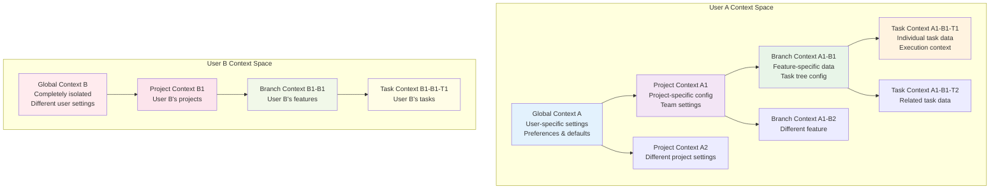
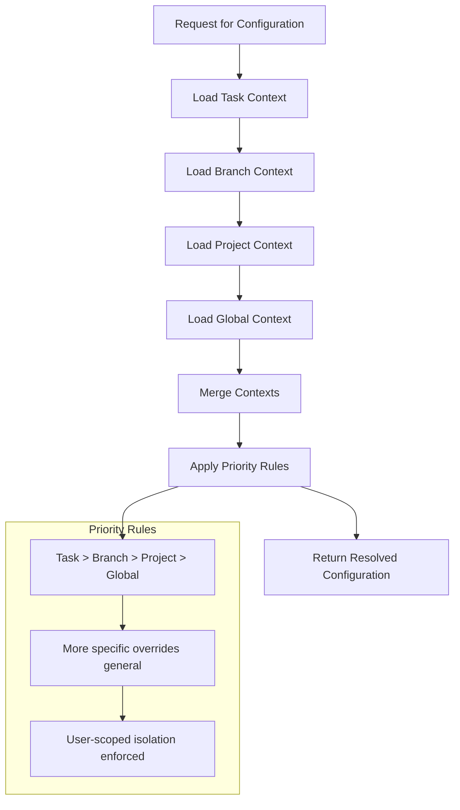
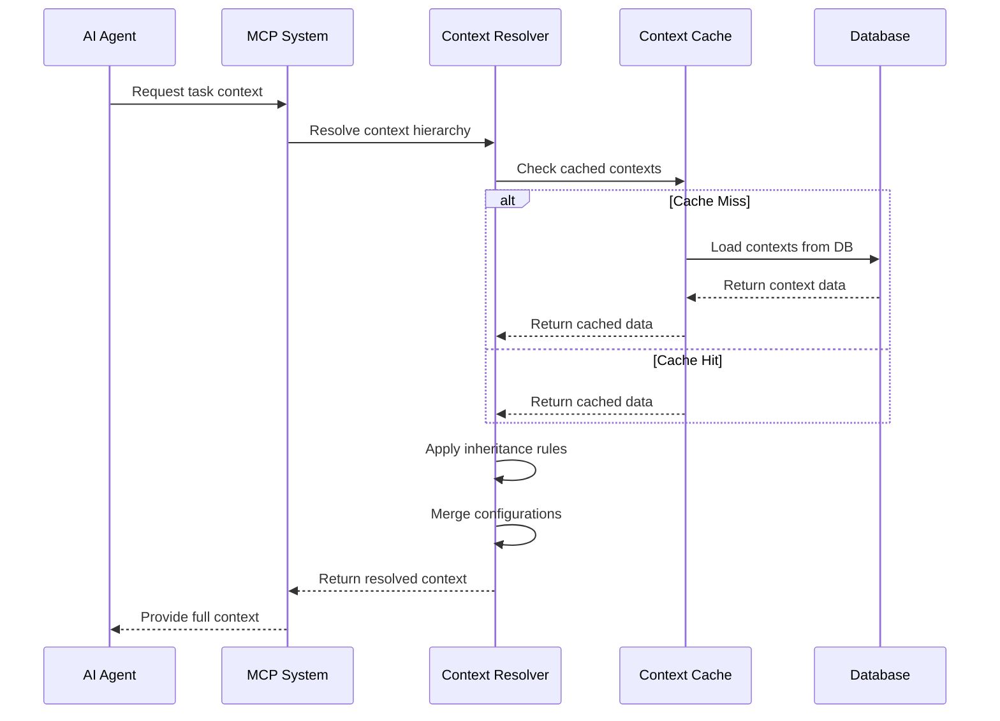
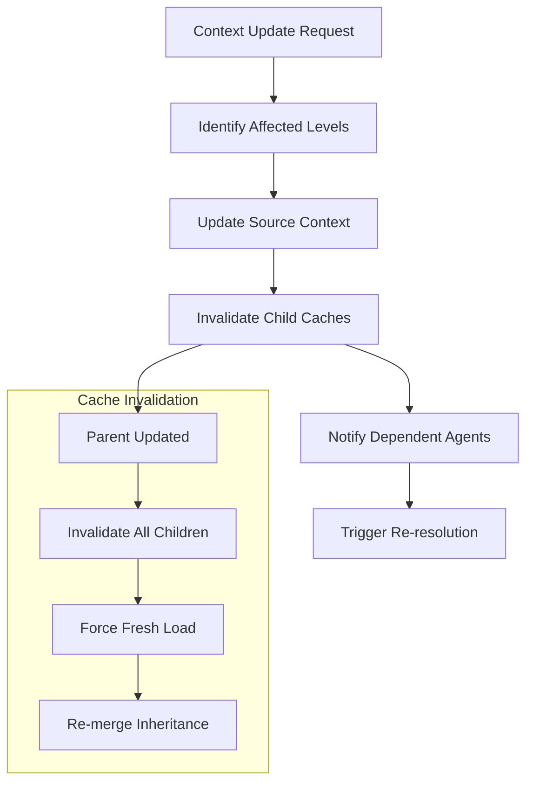

# Context Hierarchy System Architecture

**Document Version:** 1.0  
**Last Updated:** 2025-09-12  
**Status:** Active  

## Executive Summary

The agenthub system implements a sophisticated 4-tier context hierarchy that enables configuration inheritance, multi-tenant isolation, and intelligent data flow across the entire system. The hierarchy flows from Global (user-scoped) → Project → Branch → Task, with each level inheriting and extending configurations from its parent while maintaining complete data isolation between users.

## Quick Navigation

- [Hierarchy Overview](#hierarchy-overview)
- [Context Tier Definitions](#context-tier-definitions)
- [Inheritance Patterns](#inheritance-patterns)
- [Data Flow Architecture](#data-flow-architecture)
- [Multi-Tenant Isolation](#multi-tenant-isolation)
- [Context Management Operations](#context-management-operations)
- [Performance Optimization](#performance-optimization)
- [Implementation Examples](#implementation-examples)

## Hierarchy Overview



## Context Tier Definitions

### 1. Global Context (Tier 1)
**Scope:** Per-user system-wide settings
**Lifespan:** Persistent across all sessions
**Owner:** Individual user account

#### Responsibilities:
- User preferences and default configurations
- Agent assignment preferences
- System-wide workflow settings
- Authentication and authorization context
- Personal AI assistant configurations

#### Data Structure:
```json
{
  "user_id": "uuid",
  "preferences": {
    "default_priority": "medium",
    "preferred_agents": ["coding-agent", "test-orchestrator-agent"],
    "notification_settings": {...},
    "ui_preferences": {...}
  },
  "agent_configurations": {
    "coding-agent": {
      "default_parameters": {...},
      "specialized_settings": {...}
    }
  },
  "workflow_defaults": {
    "task_creation_template": {...},
    "completion_requirements": {...}
  }
}
```

### 2. Project Context (Tier 2)
**Scope:** Project-specific configurations and data
**Lifespan:** Exists for the duration of the project
**Owner:** Project team (with user-specific views)

#### Responsibilities:
- Project-specific agent configurations
- Team collaboration settings
- Project workflows and processes
- Technology stack configurations
- Quality standards and requirements

#### Inheritance:
- Inherits all Global Context settings
- Can override global defaults with project-specific values
- Extends global configuration with project-specific additions

#### Data Structure:
```json
{
  "project_id": "uuid",
  "user_id": "uuid",  // For multi-tenant isolation
  "inherited_from": "global_context_id",
  "project_config": {
    "name": "agenthub",
    "description": "Multi-agent task management system",
    "technology_stack": ["Python", "React", "PostgreSQL"],
    "quality_gates": {...},
    "team_settings": {...}
  },
  "agent_overrides": {
    "coding-agent": {
      "project_specific_config": {...}
    }
  },
  "workflow_overrides": {
    "task_approval_required": true,
    "automated_testing": true
  }
}
```

### 3. Branch Context (Tier 3)
**Scope:** Feature or task tree specific data
**Lifespan:** Duration of feature development
**Owner:** Feature team or individual developer

#### Responsibilities:
- Feature-specific configurations
- Task tree organization
- Branch-level agent assignments
- Feature workflow states
- Progress tracking for feature sets

#### Inheritance:
- Inherits from both Global and Project contexts
- Project context takes precedence over Global
- Branch-specific settings override both parent contexts

#### Data Structure:
```json
{
  "git_branch_id": "uuid",
  "project_id": "uuid",
  "user_id": "uuid",
  "inherited_from": ["global_context_id", "project_context_id"],
  "branch_config": {
    "name": "feature/user-authentication",
    "description": "Implement JWT-based user authentication",
    "assigned_agents": ["coding-agent", "security-auditor-agent"],
    "feature_flags": {...},
    "testing_requirements": {...}
  },
  "task_tree_config": {
    "max_depth": 3,
    "auto_assignment_rules": {...},
    "completion_criteria": {...}
  }
}
```

### 4. Task Context (Tier 4)
**Scope:** Individual task execution environment
**Lifespan:** Task lifecycle duration
**Owner:** Assigned agent(s) and task creator

#### Responsibilities:
- Task-specific execution parameters
- Agent working context
- Task state and progress
- Dependencies and relationships
- Execution artifacts and results

#### Inheritance:
- Inherits from Global, Project, and Branch contexts
- Task-specific settings have highest priority
- Can access full inheritance chain for decision making

#### Data Structure:
```json
{
  "task_id": "uuid",
  "git_branch_id": "uuid",
  "project_id": "uuid", 
  "user_id": "uuid",
  "inherited_from": ["global_context_id", "project_context_id", "branch_context_id"],
  "task_config": {
    "title": "Implement user login endpoint",
    "assigned_agents": ["coding-agent"],
    "execution_context": {...},
    "working_directory": "/src/auth",
    "dependencies": [...],
    "completion_criteria": {...}
  },
  "execution_state": {
    "current_step": "implementation",
    "progress_percentage": 75,
    "agent_notes": [...],
    "artifacts_created": [...]
  }
}
```

## Inheritance Patterns

### Configuration Resolution Algorithm



### Inheritance Resolution Rules

1. **Most Specific Wins:** Task context overrides all others
2. **Cascading Defaults:** Missing values inherit from parent
3. **User Isolation:** Never inherit across user boundaries  
4. **Type Consistency:** Inherited values must be type-compatible
5. **Validation Chain:** All inherited values validated at each level

### Configuration Merging Example

```python
class ContextResolver:
    """Resolves configuration from context hierarchy"""
    
    def resolve_context(self, task_id: str, user_id: str) -> Dict[str, Any]:
        """Resolve full context with inheritance"""
        
        # Load all contexts in hierarchy
        task_context = self._load_task_context(task_id, user_id)
        branch_context = self._load_branch_context(task_context.branch_id, user_id)
        project_context = self._load_project_context(task_context.project_id, user_id)
        global_context = self._load_global_context(user_id)
        
        # Merge with priority rules
        resolved = {}
        
        # Global context (lowest priority)
        resolved.update(global_context.configuration)
        
        # Project context (overrides global)
        resolved.update(project_context.configuration)
        
        # Branch context (overrides project)
        resolved.update(branch_context.configuration)
        
        # Task context (highest priority)
        resolved.update(task_context.configuration)
        
        return self._validate_resolved_context(resolved)
```

## Data Flow Architecture

### Context Creation Flow



### Context Update Propagation



## Multi-Tenant Isolation

### User-Scoped Global Contexts

Each user maintains their own completely isolated global context:

```python
class GlobalContextManager:
    """Manages user-scoped global contexts"""
    
    def get_user_global_context(self, user_id: str) -> GlobalContext:
        """Each user gets their own global context instance"""
        
        context_key = f"global_context_{user_id}"
        if not self._cache.exists(context_key):
            context = self._create_user_global_context(user_id)
            self._cache.set(context_key, context)
        
        return self._cache.get(context_key)
    
    def _create_user_global_context(self, user_id: str) -> GlobalContext:
        """Create new global context with user-specific defaults"""
        return GlobalContext(
            user_id=user_id,
            preferences=UserPreferences.get_defaults(),
            agent_configurations=AgentConfigurationDefaults.for_user(user_id)
        )
```

### Data Isolation Guarantees

1. **User Boundary Enforcement:** No context data crosses user boundaries
2. **Project Isolation:** Users can only access their own projects
3. **Branch Scoping:** Branch contexts linked to user's project access
4. **Task Security:** Task contexts validate user ownership chain

### Security Model

```python
class ContextSecurityValidator:
    """Ensures secure context access"""
    
    def validate_context_access(self, user_id: str, context_id: str, context_level: str):
        """Validate user has access to requested context"""
        
        if context_level == "global":
            return self._validate_global_access(user_id, context_id)
        elif context_level == "project":
            return self._validate_project_access(user_id, context_id)
        elif context_level == "branch":
            return self._validate_branch_access(user_id, context_id)
        elif context_level == "task":
            return self._validate_task_access(user_id, context_id)
            
    def _validate_ownership_chain(self, user_id: str, context_hierarchy: List[str]):
        """Ensure user owns entire context chain"""
        for context_id in context_hierarchy:
            if not self._user_owns_context(user_id, context_id):
                raise UnauthorizedContextAccessError()
```

## Context Management Operations

### Unified Context API

The system provides a unified API for all context operations:

```python
class UnifiedContextManager:
    """Single interface for all context management"""
    
    def create_context(self, level: str, context_id: str, data: Dict, user_id: str):
        """Create new context at specified level"""
        
    def get_context(self, level: str, context_id: str, user_id: str, include_inherited: bool = True):
        """Retrieve context with optional inheritance"""
        
    def update_context(self, level: str, context_id: str, data: Dict, user_id: str):
        """Update existing context"""
        
    def delete_context(self, level: str, context_id: str, user_id: str):
        """Remove context and handle dependencies"""
        
    def resolve_context(self, level: str, context_id: str, user_id: str):
        """Get fully resolved context with inheritance"""
```

### Context Lifecycle Management

#### Automatic Context Creation
- **Global Context:** Created on first user login
- **Project Context:** Created when user creates first project
- **Branch Context:** Created when git branch is registered
- **Task Context:** Created automatically with task creation

#### Context Cleanup
- **Task Context:** Removed when task is completed or deleted
- **Branch Context:** Archived when branch is merged/closed
- **Project Context:** Archived when project is completed
- **Global Context:** Persistent for user lifetime

## Performance Optimization

### Smart Caching Strategy

```python
class ContextCacheManager:
    """Intelligent caching for context hierarchy"""
    
    def __init__(self):
        self._cache_ttl = {
            "global": 3600,    # 1 hour - rarely changes
            "project": 1800,   # 30 minutes - moderate changes
            "branch": 600,     # 10 minutes - frequent changes
            "task": 300        # 5 minutes - very frequent changes
        }
    
    def get_cached_context(self, level: str, context_id: str, user_id: str):
        """Get context with level-appropriate caching"""
        cache_key = f"{level}_{context_id}_{user_id}"
        ttl = self._cache_ttl[level]
        
        return self._cache.get(cache_key, ttl=ttl)
    
    def invalidate_context_chain(self, level: str, context_id: str, user_id: str):
        """Invalidate context and all dependent children"""
        # Invalidate the context itself
        self._invalidate_context(level, context_id, user_id)
        
        # Invalidate all child contexts
        if level == "global":
            self._invalidate_user_contexts(user_id)
        elif level == "project":
            self._invalidate_project_children(context_id, user_id)
        elif level == "branch":
            self._invalidate_branch_children(context_id, user_id)
```

### Context Resolution Optimization

1. **Lazy Loading:** Load contexts only when needed
2. **Cached Merging:** Cache resolved contexts for reuse
3. **Delta Updates:** Only re-resolve changed portions
4. **Batch Resolution:** Resolve multiple contexts in single operation

## Implementation Examples

### Agent Context Access

```python
class TaskExecutionAgent:
    """Example of how agents access context"""
    
    def execute_task(self, task_id: str, user_id: str):
        """Execute task with full context access"""
        
        # Get resolved context with full inheritance
        context = self._context_manager.resolve_context(
            level="task",
            context_id=task_id,
            user_id=user_id,
            include_inherited=True
        )
        
        # Access configuration with fallbacks
        coding_standards = context.get(
            "coding_standards", 
            self._get_default_standards()
        )
        
        test_requirements = context.get(
            "test_requirements",
            self._get_default_test_config()
        )
        
        # Use context for decision making
        if context.get("strict_validation", False):
            self._enable_strict_validation()
            
        return self._perform_task_execution(context)
```

### Context-Aware Task Creation

```python
class TaskCreationService:
    """Service that uses context for intelligent task creation"""
    
    def create_task(self, request: CreateTaskRequest, user_id: str):
        """Create task with context-aware defaults"""
        
        # Resolve branch context for defaults
        branch_context = self._context_manager.resolve_context(
            level="branch",
            context_id=request.git_branch_id,
            user_id=user_id
        )
        
        # Apply context-based defaults
        task_data = {
            "title": request.title,
            "description": request.description,
            "priority": request.priority or branch_context.get("default_priority", "medium"),
            "assignees": request.assignees or branch_context.get("default_assignees", []),
            "labels": self._merge_labels(request.labels, branch_context.get("auto_labels", [])),
            "estimated_effort": request.effort or self._estimate_from_context(branch_context)
        }
        
        # Create task with context-enriched data
        task = Task(**task_data)
        
        # Create task-specific context
        task_context = self._context_manager.create_context(
            level="task",
            context_id=task.id,
            data={
                "task_specific_config": {...},
                "execution_environment": branch_context.get("environment", {}),
                "quality_requirements": branch_context.get("quality_gates", {})
            },
            user_id=user_id
        )
        
        return task
```

### Dynamic Configuration Updates

```python
class ContextUpdateHandler:
    """Handles real-time context updates"""
    
    def update_project_standards(self, project_id: str, new_standards: Dict, user_id: str):
        """Update project coding standards with propagation"""
        
        # Update project context
        self._context_manager.update_context(
            level="project",
            context_id=project_id,
            data={"coding_standards": new_standards},
            user_id=user_id
        )
        
        # Find all affected branches and tasks
        affected_branches = self._get_project_branches(project_id, user_id)
        affected_tasks = self._get_project_tasks(project_id, user_id)
        
        # Notify agents of context changes
        for task_id in affected_tasks:
            self._event_bus.publish(ContextUpdatedEvent(
                context_type="task",
                context_id=task_id,
                changed_fields=["coding_standards"],
                user_id=user_id
            ))
        
        # Invalidate caches
        self._cache_manager.invalidate_context_chain("project", project_id, user_id)
```

## Error Handling and Resilience

### Context Validation

```python
class ContextValidator:
    """Validates context data integrity"""
    
    def validate_context_creation(self, level: str, data: Dict, user_id: str):
        """Validate context before creation"""
        
        # Check required fields for level
        required_fields = self._get_required_fields(level)
        for field in required_fields:
            if field not in data:
                raise MissingRequiredFieldError(f"Field {field} required for {level} context")
        
        # Validate data types
        schema = self._get_context_schema(level)
        self._validate_against_schema(data, schema)
        
        # Check inheritance constraints
        if level != "global":
            parent_context = self._get_parent_context(level, data, user_id)
            self._validate_inheritance_compatibility(data, parent_context)
    
    def validate_inheritance_chain(self, context_hierarchy: List[Dict]):
        """Ensure inheritance chain is valid"""
        for i in range(len(context_hierarchy) - 1):
            parent = context_hierarchy[i]
            child = context_hierarchy[i + 1]
            
            if not self._is_valid_parent_child_relationship(parent, child):
                raise InvalidInheritanceChainError()
```

### Fallback Strategies

1. **Missing Context Recovery:** Create minimal context if missing
2. **Inheritance Chain Repair:** Rebuild broken inheritance links
3. **Cache Fallback:** Use stale cache if fresh data unavailable
4. **Default Configuration:** Provide system defaults when context incomplete

## Best Practices

### Context Design Guidelines

1. **Keep Contexts Focused:** Each level should have clear responsibilities
2. **Minimize Context Size:** Store only essential configuration and state
3. **Design for Inheritance:** Structure data for easy merging and overriding
4. **Version Context Schemas:** Plan for context structure evolution
5. **Cache Strategically:** Balance performance with data freshness

### Agent Integration Patterns

1. **Context-First Design:** Load context before making decisions
2. **Graceful Degradation:** Handle missing context elegantly
3. **Update Propagation:** Notify other agents of context changes
4. **Context Validation:** Validate context data before use

### Performance Optimization

1. **Lazy Resolution:** Resolve contexts only when needed
2. **Smart Caching:** Use appropriate TTLs for different context levels
3. **Batch Operations:** Group context operations when possible
4. **Delta Updates:** Update only changed portions of contexts

---

**Related Documentation:**
- [System Architecture Overview](./system-architecture-overview.md)
- [Domain-Driven Design Layers](./domain-driven-design-layers.md)
- [Agent Orchestration Architecture](./agent-orchestration-architecture.md)

**Last Updated:** 2025-09-12  
**Document Owner:** agenthub Architecture Team  
**Review Schedule:** Monthly  
**Status:** Living Document