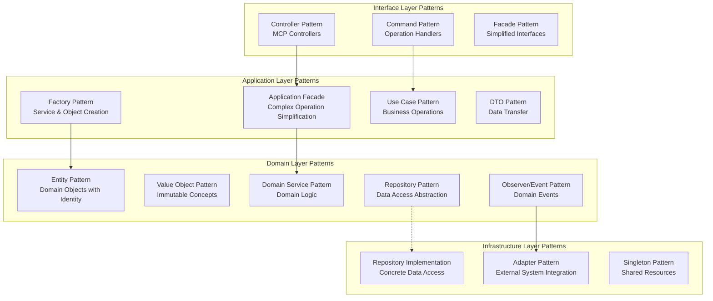

# Design Patterns in Architecture

**Document Version:** 1.0  
**Last Updated:** 2025-09-12  
**Status:** Active  

## Executive Summary

The 4genthub system implements a comprehensive set of design patterns across all architectural layers to achieve CLEAN and SOLID code principles. This document analyzes the current pattern usage, identifies opportunities for improvement, and provides implementation standards based on comprehensive analysis of 38 factory implementations and extensive pattern evaluation.

## Quick Navigation

- [Pattern Analysis Overview](#pattern-analysis-overview)
- [Current Pattern Implementation](#current-pattern-implementation)
- [Factory Pattern Analysis](#factory-pattern-analysis)
- [Core Design Patterns](#core-design-patterns)
- [Pattern Implementation Standards](#pattern-implementation-standards)
- [Refactoring Roadmap](#refactoring-roadmap)
- [Anti-Patterns to Avoid](#anti-patterns-to-avoid)

## Pattern Analysis Overview

Based on comprehensive analysis of the task_management module, the following patterns have been identified and evaluated:

### Current Pattern Usage Matrix

| Pattern | Current Usage | Quality | Improvement Needed | Priority |
|---------|--------------|---------|-------------------|----------|
| **Factory** | 38 implementations | Mixed | High - consolidation needed | **High** |
| **Singleton** | 15+ implementations | Good | Medium - standardize approach | **Medium** |
| **Repository** | 20+ implementations | Good | Low - mostly consistent | **Low** |
| **Strategy** | Scattered | Poor | High - formalize patterns | **High** |
| **Observer/Event** | Event system exists | Fair | Medium - enhance usage | **Medium** |
| **Builder** | Not used | N/A | High - needed for DTOs | **High** |
| **Adapter** | 5 implementations | Good | Low - well implemented | **Low** |
| **Facade** | 8 implementations | Good | Medium - reduce coupling | **Medium** |
| **Command** | Not formalized | N/A | High - for operations | **High** |
| **Chain of Responsibility** | Not used | N/A | Medium - for validation | **Medium** |

### Architecture Pattern Distribution



## Current Pattern Implementation

### Well-Implemented Patterns

#### 1. Repository Pattern (Good Implementation)
**Quality Rating:** ⭐⭐⭐⭐  
**Implementations Found:** 20+ repositories

```python
# Example: Well-structured repository interface
class TaskRepository(ABC):
    """Repository interface for Task aggregate"""
    
    @abstractmethod
    def save(self, task: Task) -> Optional[Task]:
        pass
    
    @abstractmethod
    def find_by_id(self, task_id: TaskId) -> Optional[Task]:
        pass
    
    @abstractmethod
    def find_by_status(self, status: TaskStatus) -> List[Task]:
        pass

# Concrete implementation with proper separation
class ORMTaskRepository(TaskRepository):
    def __init__(self, session: Session):
        self._session = session
    
    def save(self, task: Task) -> Optional[Task]:
        orm_task = TaskORM.from_domain_entity(task)
        self._session.add(orm_task)
        self._session.commit()
        return orm_task.to_domain_entity()
```

**Strengths:**
- Clear interface definitions
- Proper abstraction from infrastructure
- Consistent implementation across entities
- Good separation of concerns

#### 2. Adapter Pattern (Well Implemented)
**Quality Rating:** ⭐⭐⭐⭐⭐  
**Implementations Found:** 5 adapters

```python
# Example: Clean adapter implementation
class CacheServiceAdapter:
    """Adapter for different cache implementations"""
    
    def __init__(self, cache_implementation):
        self._cache = cache_implementation
    
    def get(self, key: str) -> Optional[Any]:
        return self._cache.retrieve(key)
    
    def set(self, key: str, value: Any, ttl: int = 3600):
        return self._cache.store(key, value, ttl)
```

**Strengths:**
- Clean interface definitions
- Proper abstraction from infrastructure
- Consistent implementation
- Good encapsulation of external dependencies

### Patterns Needing Improvement

#### 1. Factory Pattern (Mixed Quality)
**Quality Rating:** ⭐⭐⭐  
**Implementations Found:** 38 factory files

**Analysis Results:**
- **Good Examples:** `TaskFacadeFactory`, `ProjectFacadeFactory`
- **Needs Refactoring:** `OperationFactory` (violates SRP)
- **Missing Abstractions:** No base factory classes
- **Code Duplication:** Repeated singleton patterns

**Issues Identified:**

##### Issue 1: Single Responsibility Violations
```python
# PROBLEM: OperationFactory doing too much
class OperationFactory:
    def handle_operation(self, operation: str, facade, **kwargs):
        # ❌ Routing logic
        if operation == "create":
            # ❌ Parameter filtering 
            filtered_params = self._filter_params(kwargs)
            # ❌ Handler creation
            handler = CreateHandler(facade)
            # ❌ Execution
            return handler.execute(filtered_params)
```

##### Solution: Extract Responsibilities
```python
# ✅ SOLUTION: Separate concerns
class OperationFactory:
    """Only responsible for creating handlers"""
    def create_handler(self, operation: str) -> OperationHandler:
        return self._handlers[operation](self._facade)

class OperationRouter:
    """Only responsible for routing"""
    def route(self, operation: str, **kwargs):
        handler = self._factory.create_handler(operation)
        return handler.execute(kwargs)

class ParameterFilter:
    """Only responsible for parameter filtering"""
    def filter(self, params: Dict, operation: str) -> Dict:
        allowed = self._get_allowed_params(operation)
        return {k: v for k, v in params.items() if k in allowed}
```

#### 2. Strategy Pattern (Poor Implementation)
**Quality Rating:** ⭐⭐  
**Current State:** Scattered if-elif chains

**Issues Identified:**

##### Issue 1: Validation Logic Scattered
```python
# PROBLEM: Hard-coded validation chains
def validate_entity(entity_type: str, data: Dict):
    if entity_type == "task":
        validate_task_rules(data)
    elif entity_type == "project":
        validate_project_rules(data)
    elif entity_type == "agent":
        validate_agent_rules(data)
    # ... more elif statements
```

##### Solution: Strategy Pattern Implementation
```python
# ✅ SOLUTION: Strategy Pattern
class ValidationStrategy(ABC):
    @abstractmethod
    def validate(self, data: Dict) -> ValidationResult:
        pass

class TaskValidationStrategy(ValidationStrategy):
    def validate(self, data: Dict) -> ValidationResult:
        # Task-specific validation logic
        return ValidationResult(is_valid=True, errors=[])

class ValidationContext:
    def __init__(self, strategy: ValidationStrategy):
        self._strategy = strategy
    
    def validate(self, data: Dict) -> ValidationResult:
        return self._strategy.validate(data)

# Registry for dynamic strategy selection
class ValidationStrategyRegistry:
    _strategies = {
        "task": TaskValidationStrategy(),
        "project": ProjectValidationStrategy(),
        "agent": AgentValidationStrategy()
    }
    
    @classmethod
    def get_strategy(cls, entity_type: str) -> ValidationStrategy:
        return cls._strategies.get(entity_type, DefaultValidationStrategy())
```

##### Issue 2: Hint Generation Logic Scattered
**File:** `hint_optimizer.py`
**Problem:** Multiple if-elif chains for different hint types

```python
# PROBLEM: Hard-coded hint generation
def generate_hint(context_type: str, data: Dict):
    if context_type == "task_creation":
        return self._generate_task_hints(data)
    elif context_type == "agent_assignment":
        return self._generate_agent_hints(data)
    # ... more branches
```

##### Solution: Hint Generation Strategy
```python
# ✅ SOLUTION: Hint Strategy Pattern
class HintGenerationStrategy(ABC):
    @abstractmethod
    def generate_hints(self, context: Dict) -> List[Hint]:
        pass

class TaskCreationHintStrategy(HintGenerationStrategy):
    def generate_hints(self, context: Dict) -> List[Hint]:
        hints = []
        if self._should_suggest_agents(context):
            hints.append(Hint("Consider assigning specialized agents"))
        return hints

class HintGeneratorRegistry:
    _strategies = {
        "task_creation": TaskCreationHintStrategy(),
        "agent_assignment": AgentAssignmentHintStrategy(),
        "progress_update": ProgressUpdateHintStrategy()
    }
```

## Factory Pattern Analysis

### Factory Pattern Distribution

Based on analysis of 38 factory files:

#### Application Layer Factories (8 files)
- `agent_facade_factory.py` ⚠️ **Needs Refactoring**
- `task_facade_factory.py` ✅ **Good Example**
- `project_facade_factory.py` ✅ **Good Example** 
- `subtask_facade_factory.py` ⏳ **Pending Review**
- `context_response_factory.py` ⏳ **Pending Review**
- `git_branch_facade_factory.py` ⏳ **Pending Review**
- `token_facade_factory.py` ⏳ **Pending Review**
- `unified_context_facade_factory.py` ⏳ **Pending Review**

#### Infrastructure Layer Factories (11 files)
- Repository factories for each domain entity
- Service factories for cross-cutting concerns
- Adapter factories for external integrations

#### Interface Layer Factories (16 files)
- Operation factories for each MCP controller
- Response factories for consistent formatting
- Validation factories for different contexts

### Factory Pattern Best Practices

#### 1. Abstract Factory Base Class
```python
from abc import ABC, abstractmethod
from typing import Dict, Any, Optional, TypeVar, Generic

T = TypeVar('T')

class AbstractFacadeFactory(ABC, Generic[T]):
    """Abstract base factory for all facade factories"""
    
    _instances: Dict[type, 'AbstractFacadeFactory'] = {}
    _initialized: Dict[type, bool] = {}
    
    def __new__(cls, *args, **kwargs):
        """Implement singleton pattern at class level"""
        if cls not in cls._instances:
            cls._instances[cls] = super().__new__(cls)
            cls._initialized[cls] = False
        return cls._instances[cls]
    
    @abstractmethod
    def _create_facade_impl(self, user_id: str, **kwargs) -> T:
        """Subclasses implement specific facade creation"""
        pass
    
    def create_facade(self, user_id: str, **kwargs) -> T:
        """Template method with common logic"""
        # Validate user
        self._validate_user(user_id)
        
        # Check cache
        cache_key = self._create_cache_key(user_id, **kwargs)
        if cached_facade := self._get_cached_facade(cache_key):
            return cached_facade
        
        # Create facade
        facade = self._create_facade_impl(user_id, **kwargs)
        
        # Cache facade
        self._cache_facade(cache_key, facade)
        
        return facade
```

#### 2. Factory Registry Pattern
```python
class FactoryRegistry:
    """Central registry for all factory instances"""
    
    _factories: Dict[str, Any] = {}
    
    @classmethod
    def register_factory(cls, name: str, factory: Any):
        """Register a factory instance"""
        cls._factories[name] = factory
    
    @classmethod
    def get_factory(cls, name: str) -> Any:
        """Get factory by name"""
        if name not in cls._factories:
            raise FactoryNotFoundError(f"Factory '{name}' not registered")
        return cls._factories[name]
    
    @classmethod
    def create_instance(cls, factory_name: str, *args, **kwargs):
        """Create instance using registered factory"""
        factory = cls.get_factory(factory_name)
        return factory.create(*args, **kwargs)

# Usage
FactoryRegistry.register_factory("task_facade", TaskFacadeFactory())
FactoryRegistry.register_factory("project_facade", ProjectFacadeFactory())

# Create instances
task_facade = FactoryRegistry.create_instance("task_facade", user_id="123")
```

## Core Design Patterns

### 1. Builder Pattern Implementation

**Current State:** Not implemented  
**Priority:** High - needed for complex DTOs

#### Complex Object Creation Problem
```python
# PROBLEM: Complex task creation with 15+ parameters
task = Task(
    id=TaskId(uuid4()),
    title="Implement feature",
    description="Long description...",
    status=TaskStatus.TODO,
    priority=Priority.HIGH,
    git_branch_id="branch-id",
    assignees=["agent1", "agent2"],
    labels=["frontend", "auth"],
    dependencies=[TaskId("dep1"), TaskId("dep2")],
    estimated_effort="3 days",
    due_date="2025-12-31",
    # ... more parameters
)
```

#### Builder Pattern Solution
```python
# ✅ SOLUTION: Task Builder Pattern
class TaskBuilder:
    """Builder for creating complex Task objects"""
    
    def __init__(self):
        self._task_data = {}
        self._validation_errors = []
    
    def with_title(self, title: str) -> 'TaskBuilder':
        self._task_data['title'] = title
        return self
    
    def with_description(self, description: str) -> 'TaskBuilder':
        self._task_data['description'] = description
        return self
    
    def with_priority(self, priority: str) -> 'TaskBuilder':
        self._task_data['priority'] = Priority.from_string(priority)
        return self
    
    def with_assignees(self, *assignees: str) -> 'TaskBuilder':
        self._task_data['assignees'] = list(assignees)
        return self
    
    def with_dependencies(self, *task_ids: str) -> 'TaskBuilder':
        self._task_data['dependencies'] = [TaskId(tid) for tid in task_ids]
        return self
    
    def build(self) -> Task:
        """Build the final Task object with validation"""
        self._validate()
        if self._validation_errors:
            raise ValidationError(self._validation_errors)
        
        return Task(**self._task_data)
    
    def _validate(self):
        """Validate task data before building"""
        if 'title' not in self._task_data:
            self._validation_errors.append("Title is required")
        if 'description' not in self._task_data:
            self._validation_errors.append("Description is required")

# Usage
task = (TaskBuilder()
    .with_title("Implement JWT authentication")
    .with_description("Add secure authentication with refresh tokens")
    .with_priority("high")
    .with_assignees("coding-agent", "security-auditor-agent")
    .with_dependencies("task-1", "task-2")
    .build())
```

#### Response DTO Builder
```python
class TaskResponseBuilder:
    """Builder for creating complex response DTOs"""
    
    def __init__(self):
        self._response_data = {}
    
    def with_task(self, task: Task) -> 'TaskResponseBuilder':
        self._response_data['task'] = TaskDTO.from_entity(task)
        return self
    
    def with_metadata(self, **metadata) -> 'TaskResponseBuilder':
        self._response_data['metadata'] = metadata
        return self
    
    def with_context_hints(self, hints: List[str]) -> 'TaskResponseBuilder':
        self._response_data['hints'] = hints
        return self
    
    def with_related_tasks(self, tasks: List[Task]) -> 'TaskResponseBuilder':
        self._response_data['related'] = [TaskDTO.from_entity(t) for t in tasks]
        return self
    
    def build(self) -> TaskResponse:
        return TaskResponse(**self._response_data)
```

### 2. Command Pattern Implementation

**Current State:** Not formalized  
**Priority:** High - for operations with undo capability

#### Command Pattern for Operations
```python
class Command(ABC):
    """Base command interface"""
    
    @abstractmethod
    def execute(self) -> Any:
        """Execute the command"""
        pass
    
    @abstractmethod
    def undo(self) -> Any:
        """Undo the command"""
        pass
    
    @abstractmethod
    def can_undo(self) -> bool:
        """Check if command can be undone"""
        pass

class CreateTaskCommand(Command):
    """Command for creating tasks"""
    
    def __init__(self, facade: TaskApplicationFacade, task_data: Dict):
        self._facade = facade
        self._task_data = task_data
        self._created_task_id = None
        self._executed = False
    
    def execute(self) -> Dict[str, Any]:
        """Execute task creation"""
        result = self._facade.create_task(**self._task_data)
        self._created_task_id = result['task']['id']
        self._executed = True
        return result
    
    def undo(self) -> Dict[str, Any]:
        """Undo task creation by deleting the task"""
        if not self.can_undo():
            raise CommandError("Cannot undo: task not created or already deleted")
        
        result = self._facade.delete_task(self._created_task_id)
        self._executed = False
        return result
    
    def can_undo(self) -> bool:
        """Check if command can be undone"""
        return self._executed and self._created_task_id is not None

class CommandInvoker:
    """Invoker for executing and managing commands"""
    
    def __init__(self):
        self._command_history: List[Command] = []
        self._current_position = -1
    
    def execute_command(self, command: Command) -> Any:
        """Execute command and add to history"""
        result = command.execute()
        
        # Remove any commands after current position (for redo functionality)
        self._command_history = self._command_history[:self._current_position + 1]
        
        # Add new command
        self._command_history.append(command)
        self._current_position += 1
        
        return result
    
    def undo_last_command(self) -> Any:
        """Undo the last executed command"""
        if self._current_position < 0:
            raise CommandError("No commands to undo")
        
        command = self._command_history[self._current_position]
        if not command.can_undo():
            raise CommandError("Command cannot be undone")
        
        result = command.undo()
        self._current_position -= 1
        return result
    
    def redo_command(self) -> Any:
        """Redo a previously undone command"""
        if self._current_position >= len(self._command_history) - 1:
            raise CommandError("No commands to redo")
        
        self._current_position += 1
        command = self._command_history[self._current_position]
        return command.execute()
```

### 3. Chain of Responsibility Pattern

**Current State:** Not used  
**Priority:** Medium - for validation pipelines

#### Validation Chain Implementation
```python
class ValidationHandler(ABC):
    """Base validation handler"""
    
    def __init__(self):
        self._next_handler: Optional['ValidationHandler'] = None
    
    def set_next(self, handler: 'ValidationHandler') -> 'ValidationHandler':
        """Set the next handler in the chain"""
        self._next_handler = handler
        return handler
    
    @abstractmethod
    def handle(self, request: ValidationRequest) -> ValidationResult:
        """Handle validation request"""
        pass
    
    def _handle_next(self, request: ValidationRequest) -> ValidationResult:
        """Pass request to next handler if exists"""
        if self._next_handler:
            return self._next_handler.handle(request)
        return ValidationResult(is_valid=True, errors=[])

class RequiredFieldsValidator(ValidationHandler):
    """Validate required fields"""
    
    def handle(self, request: ValidationRequest) -> ValidationResult:
        required_fields = self._get_required_fields(request.entity_type)
        errors = []
        
        for field in required_fields:
            if field not in request.data or not request.data[field]:
                errors.append(f"Required field '{field}' is missing or empty")
        
        if errors:
            return ValidationResult(is_valid=False, errors=errors)
        
        return self._handle_next(request)

class BusinessRulesValidator(ValidationHandler):
    """Validate business rules"""
    
    def handle(self, request: ValidationRequest) -> ValidationResult:
        # Business rule validation logic
        if not self._validate_business_rules(request):
            return ValidationResult(is_valid=False, errors=["Business rules violated"])
        
        return self._handle_next(request)

class SecurityValidator(ValidationHandler):
    """Validate security constraints"""
    
    def handle(self, request: ValidationRequest) -> ValidationResult:
        if not self._validate_security(request):
            return ValidationResult(is_valid=False, errors=["Security validation failed"])
        
        return self._handle_next(request)

# Usage: Building the validation chain
def create_validation_chain() -> ValidationHandler:
    """Create a complete validation chain"""
    
    required_fields = RequiredFieldsValidator()
    business_rules = BusinessRulesValidator() 
    security = SecurityValidator()
    
    required_fields.set_next(business_rules).set_next(security)
    
    return required_fields

# Execute validation
chain = create_validation_chain()
result = chain.handle(ValidationRequest(entity_type="task", data=task_data))
```

### 4. Observer/Event Pattern Enhancement

**Current State:** Event system exists but underutilized  
**Priority:** Medium - enhance existing implementation

#### Enhanced Event System
```python
class EventManager:
    """Enhanced event manager with typed events"""
    
    def __init__(self):
        self._observers: Dict[Type[Event], List[EventHandler]] = defaultdict(list)
        self._event_history: List[Event] = []
        self._middleware: List[EventMiddleware] = []
    
    def subscribe(self, event_type: Type[Event], handler: EventHandler) -> None:
        """Subscribe handler to specific event type"""
        self._observers[event_type].append(handler)
    
    def unsubscribe(self, event_type: Type[Event], handler: EventHandler) -> None:
        """Unsubscribe handler from event type"""
        if handler in self._observers[event_type]:
            self._observers[event_type].remove(handler)
    
    def publish(self, event: Event) -> None:
        """Publish event to all subscribers"""
        # Apply middleware
        for middleware in self._middleware:
            event = middleware.process(event)
        
        # Store in history
        self._event_history.append(event)
        
        # Notify observers
        for handler in self._observers[type(event)]:
            try:
                handler.handle(event)
            except Exception as e:
                self._handle_event_error(event, handler, e)
    
    def add_middleware(self, middleware: EventMiddleware) -> None:
        """Add event middleware"""
        self._middleware.append(middleware)

# Usage example
event_manager = EventManager()

# Subscribe to task events
event_manager.subscribe(TaskCreatedEvent, audit_logger.handle)
event_manager.subscribe(TaskCreatedEvent, notification_service.handle)
event_manager.subscribe(TaskCompletedEvent, progress_tracker.handle)

# Publish events
task_created_event = TaskCreatedEvent(task_id="123", user_id="user1", timestamp=datetime.utcnow())
event_manager.publish(task_created_event)
```

## Pattern Implementation Standards

### 1. Factory Pattern Standards

#### Naming Conventions
- Factory classes: `{Entity}Factory` (e.g., `TaskFactory`)
- Factory methods: `create_{entity}()` (e.g., `create_task()`)
- Builder methods: `with_{property}()` (e.g., `with_title()`)

#### Implementation Guidelines
```python
# ✅ Standard factory implementation
class EntityFactory(AbstractFactory[Entity]):
    """Standard factory implementation"""
    
    def __init__(self, dependencies: Dependencies):
        self._dependencies = dependencies
    
    def create(self, **kwargs) -> Entity:
        """Create entity with validation"""
        self._validate_parameters(kwargs)
        return self._create_impl(**kwargs)
    
    @abstractmethod
    def _create_impl(self, **kwargs) -> Entity:
        """Subclasses implement specific creation logic"""
        pass
    
    def _validate_parameters(self, kwargs: Dict) -> None:
        """Validate creation parameters"""
        required = self._get_required_parameters()
        missing = [param for param in required if param not in kwargs]
        if missing:
            raise ParameterValidationError(f"Missing parameters: {missing}")
```

### 2. Builder Pattern Standards

#### Fluent Interface Design
```python
# ✅ Standard builder implementation
class EntityBuilder:
    """Standard builder with fluent interface"""
    
    def __init__(self):
        self._data = {}
        self._errors = []
    
    def with_property(self, value: Any) -> 'EntityBuilder':
        """Set property value"""
        self._data['property'] = value
        return self
    
    def build(self) -> Entity:
        """Build final entity with validation"""
        self._validate()
        if self._errors:
            raise ValidationError(self._errors)
        return Entity(**self._data)
    
    def build_or_none(self) -> Optional[Entity]:
        """Build entity, return None if validation fails"""
        try:
            return self.build()
        except ValidationError:
            return None
```

### 3. Command Pattern Standards

#### Command Interface Definition
```python
class Command(ABC):
    """Standard command interface"""
    
    @abstractmethod
    def execute(self) -> CommandResult:
        """Execute the command"""
        pass
    
    @abstractmethod
    def undo(self) -> CommandResult:
        """Undo the command if possible"""
        pass
    
    @property
    @abstractmethod
    def can_undo(self) -> bool:
        """Check if command supports undo"""
        pass
    
    @property
    @abstractmethod
    def description(self) -> str:
        """Human-readable command description"""
        pass
```

## Refactoring Roadmap

### Phase 1: Quick Wins (Week 1)
- [ ] **Implement Service Registry** - Centralize service creation
- [ ] **Create ValidationStrategy** - Replace if-elif validation chains
- [ ] **Add TaskBuilder** - Simplify complex task creation
- [ ] **Standardize Factory Base Classes** - Create AbstractFacadeFactory

### Phase 2: Core Patterns (Week 2-3)
- [ ] **Implement Command Pattern** - Add undo capability to operations
- [ ] **Create Response DTOBuilder** - Standardize response construction
- [ ] **Enhance Event System** - Improve observer pattern usage
- [ ] **Refactor OperationFactory** - Split responsibilities properly

### Phase 3: Advanced Patterns (Week 4)
- [ ] **Add Chain of Responsibility** - Implement validation pipelines
- [ ] **Implement Decorator Pattern** - Add repository caching
- [ ] **Create Strategy Registry** - Dynamic strategy selection
- [ ] **Add Builder for Complex DTOs** - Simplify response construction

### Phase 4: Consolidation (Week 5)
- [ ] **Update All Factories** - Apply new base classes and patterns
- [ ] **Comprehensive Testing** - Ensure pattern implementations work
- [ ] **Documentation Update** - Document all pattern usage
- [ ] **Performance Optimization** - Optimize pattern implementations

### Success Metrics

| Metric | Current | Target | Measurement |
|--------|---------|---------|-------------|
| **Code Duplication** | High | -60% | Static analysis tools |
| **Cyclomatic Complexity** | High | -40% | Complexity metrics |
| **Test Coverage** | 70% | 85% | Coverage reports |
| **Pattern Consistency** | 60% | 100% | Code review compliance |
| **SOLID Compliance** | 70% | 95% | Architecture review |

## Anti-Patterns to Avoid

### 1. God Objects
**Problem:** Classes with too many responsibilities
**Example:** Services handling multiple concerns

```python
# ❌ Anti-pattern: God Object
class TaskService:
    def create_task(self): pass
    def validate_task(self): pass
    def send_notifications(self): pass
    def audit_changes(self): pass
    def cache_results(self): pass
    def generate_reports(self): pass
    # ... 20+ more methods
```

**Solution:** Single Responsibility Principle
```python
# ✅ Solution: Separate concerns
class TaskCreationService:
    def create_task(self): pass

class TaskValidationService:
    def validate_task(self): pass

class NotificationService:
    def send_notification(self): pass
```

### 2. Anemic Domain Models
**Problem:** Domain entities without behavior
**Current Risk:** Some entities are data containers only

```python
# ❌ Anti-pattern: Anemic model
class Task:
    def __init__(self):
        self.id = None
        self.title = None
        self.status = None
    # No behavior methods
```

**Solution:** Rich domain models
```python
# ✅ Solution: Rich domain model
class Task:
    def can_be_completed(self) -> bool:
        return all(dep.is_completed() for dep in self.dependencies)
    
    def assign_to_agent(self, agent: Agent) -> None:
        if not agent.can_handle_task_type(self.task_type):
            raise InvalidAssignmentError()
        self.assignees.append(agent)
    
    def estimate_completion_time(self) -> timedelta:
        # Business logic for time estimation
        pass
```

### 3. Service Locator Anti-Pattern
**Problem:** Global access to services
**Risk:** Hidden dependencies, testing difficulties

```python
# ❌ Anti-pattern: Service Locator
class TaskService:
    def create_task(self):
        validator = ServiceLocator.get("validator")  # Hidden dependency
        notifier = ServiceLocator.get("notifier")    # Hard to test
```

**Solution:** Dependency Injection
```python
# ✅ Solution: Explicit dependencies
class TaskService:
    def __init__(self, validator: Validator, notifier: Notifier):
        self._validator = validator  # Explicit dependency
        self._notifier = notifier    # Easy to mock in tests
```

### 4. Singleton Overuse
**Current Risk:** 15+ singleton implementations
**Problem:** Global state, testing difficulties

```python
# ❌ Overuse: Everything as singleton
class ConfigService(Singleton): pass
class CacheService(Singleton): pass
class LoggingService(Singleton): pass
class ValidationService(Singleton): pass  # Doesn't need to be singleton
```

**Solution:** Use singletons sparingly
```python
# ✅ Solution: Singleton only when truly needed
class DatabaseConnection(Singleton):  # Expensive resource
    pass

class ValidationService:  # Regular class, injected as dependency
    def __init__(self, config: Config):
        self._config = config
```

## Implementation Examples

### Complete Pattern Implementation Example

```python
# Domain Layer: Rich entity with behavior
class Task:
    """Rich domain entity with business logic"""
    
    def can_transition_to(self, new_status: TaskStatus) -> bool:
        """Business rule: valid status transitions"""
        return new_status in self._allowed_transitions[self.status]
    
    def assign_to_agent(self, agent: Agent) -> None:
        """Business logic: agent assignment validation"""
        if not agent.can_handle_task_type(self.task_type):
            raise InvalidAgentAssignmentError()

# Application Layer: Builder for complex creation
class TaskBuilder:
    """Builder for creating complex tasks with validation"""
    
    def with_title(self, title: str) -> 'TaskBuilder':
        self._data['title'] = title
        return self
    
    def build(self) -> Task:
        self._validate()
        return Task(**self._data)

# Application Layer: Command for operations
class CreateTaskCommand(Command):
    """Command with undo capability"""
    
    def execute(self) -> CommandResult:
        task = self._builder.build()
        self._created_task = self._repository.save(task)
        return CommandResult(success=True, data=task)
    
    def undo(self) -> CommandResult:
        self._repository.delete(self._created_task.id)
        return CommandResult(success=True)

# Infrastructure Layer: Factory with registry
class TaskFactory(AbstractFactory[Task]):
    """Factory with proper abstraction"""
    
    def create(self, **kwargs) -> Task:
        builder = TaskBuilder()
        for key, value in kwargs.items():
            if hasattr(builder, f'with_{key}'):
                getattr(builder, f'with_{key}')(value)
        return builder.build()

# Interface Layer: Facade with patterns
class TaskFacade:
    """Facade coordinating multiple patterns"""
    
    def __init__(
        self,
        command_invoker: CommandInvoker,
        task_factory: TaskFactory,
        event_manager: EventManager
    ):
        self._commands = command_invoker
        self._factory = task_factory
        self._events = event_manager
    
    def create_task(self, **kwargs) -> TaskResponse:
        # Use Command pattern for undo capability
        command = CreateTaskCommand(self._factory, kwargs)
        result = self._commands.execute_command(command)
        
        # Use Observer pattern for side effects
        self._events.publish(TaskCreatedEvent(result.data))
        
        # Use Builder pattern for response
        return (TaskResponseBuilder()
            .with_task(result.data)
            .with_metadata(command_id=command.id)
            .build())
```

---

**Related Documentation:**
- [System Architecture Overview](./system-architecture-overview.md)
- [Domain-Driven Design Layers](./domain-driven-design-layers.md)
- [Factory Check Status Report](../reports-status/factory-check-status.md)
- [Factory Refactoring Templates](../development-guides/factory-refactoring-templates.md)

**Last Updated:** 2025-09-12  
**Document Owner:** 4genthub Architecture Team  
**Review Schedule:** Monthly  
**Status:** Living Document