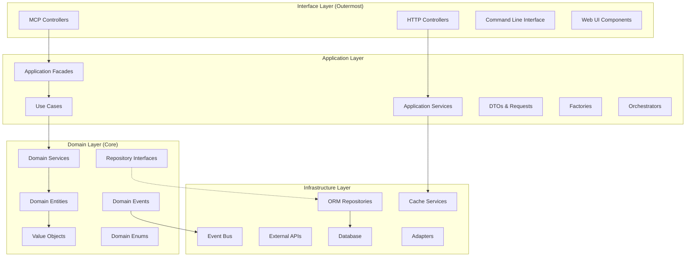
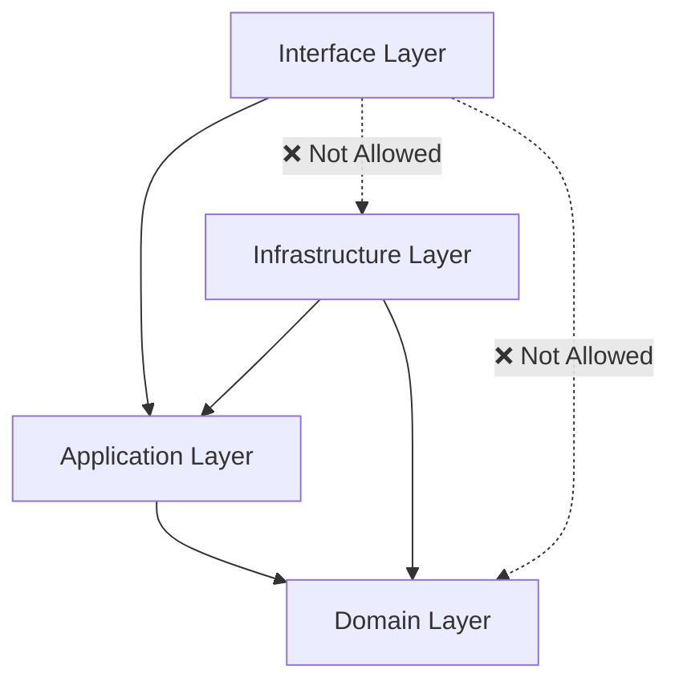

# Domain-Driven Design Layers in agenthub

**Document Version:** 1.0  
**Last Updated:** 2025-09-12  
**Status:** Active  

## Executive Summary

The agenthub system implements a strict 4-layer Domain-Driven Design architecture that ensures clear separation of concerns, maintainability, and testability. Each layer has well-defined responsibilities and dependencies flow inward toward the domain core, following the principles of Clean Architecture and DDD.

## Quick Navigation

- [DDD Layer Overview](#ddd-layer-overview)
- [Domain Layer (Core)](#domain-layer-core)
- [Application Layer](#application-layer)
- [Infrastructure Layer](#infrastructure-layer)
- [Interface Layer](#interface-layer)
- [Layer Dependencies](#layer-dependencies)
- [Design Patterns by Layer](#design-patterns-by-layer)
- [Implementation Examples](#implementation-examples)

## DDD Layer Overview



## Domain Layer (Core)

**Purpose:** Contains the business logic, domain rules, and core concepts of the system
**Dependencies:** None (completely independent)

### Domain Entities

Rich objects with identity, state, and business behavior:

#### Key Domain Entities

1. **Task** (`task.py`)
   - **Identity:** TaskId (UUID-based value object)
   - **Behavior:** Progress tracking, status transitions, validation
   - **State Management:** Created, in progress, completed, blocked
   - **Business Rules:** Priority assignment, effort estimation

```python
@dataclass
class Task:
    """Task domain entity with business logic"""
    title: str
    description: str
    id: TaskId | None = None
    status: TaskStatus | None = None
    priority: Priority | None = None
    
    def can_be_completed(self) -> bool:
        """Business rule: Task can only be completed if all dependencies are done"""
        return all(dep.is_completed() for dep in self.dependencies)
    
    def assign_to_agent(self, agent: AgentRole) -> None:
        """Business logic for agent assignment"""
        if agent.can_handle_task_type(self.get_task_type()):
            self.assignees.append(agent.name)
        else:
            raise InvalidAgentAssignmentError()
```

2. **Project** (`project.py`)
   - **Identity:** ProjectId
   - **Aggregation:** Contains multiple tasks and git branches
   - **Business Rules:** Project health monitoring, agent balancing

3. **Subtask** (`subtask.py`)
   - **Identity:** SubtaskId
   - **Parent Relationship:** Belongs to a Task
   - **Progress Tracking:** Granular completion percentages

4. **Agent** (`agent.py`)
   - **Identity:** AgentId
   - **Capabilities:** Specialized domain expertise
   - **Assignment Rules:** Task compatibility, workload balancing

5. **Context** (`context.py`)
   - **Hierarchy Management:** Global → Project → Branch → Task
   - **Inheritance Logic:** Configuration and data flow
   - **Multi-tenant Isolation:** User-scoped contexts

### Value Objects

Immutable objects representing domain concepts:

1. **TaskId** (`task_id.py`)
   - UUID-based unique identifier
   - Validation and formatting logic
   - Immutable and equality-based

2. **TaskStatus** (`task_status.py`)
   - Enumerated status values
   - State transition validation
   - Business rule enforcement

```python
@dataclass(frozen=True)
class TaskStatus:
    """Value object representing task status with validation"""
    value: TaskStatusEnum
    
    def can_transition_to(self, new_status: 'TaskStatus') -> bool:
        """Domain rule: Valid status transitions"""
        valid_transitions = {
            TaskStatusEnum.TODO: [TaskStatusEnum.IN_PROGRESS],
            TaskStatusEnum.IN_PROGRESS: [TaskStatusEnum.DONE, TaskStatusEnum.BLOCKED],
            TaskStatusEnum.BLOCKED: [TaskStatusEnum.IN_PROGRESS],
        }
        return new_status.value in valid_transitions.get(self.value, [])
```

3. **Priority** (`priority.py`)
   - Business priority levels
   - Comparison and ordering logic
   - Impact on task scheduling

4. **ProgressSnapshot** (`progress.py`)
   - Point-in-time progress representation
   - Calculation strategies for different metrics
   - Timeline tracking capabilities

### Domain Services

Encapsulate domain logic that doesn't belong in entities:

1. **TaskValidationService** (`task_validation_service.py`)
   - Cross-entity validation rules
   - Complex business logic coordination
   - Consistency enforcement

2. **TaskPriorityService** (`task_priority_service.py`)
   - Priority calculation algorithms
   - Impact analysis for priority changes
   - Resource allocation optimization

3. **DependencyValidationService** (`dependency_validation_service.py`)
   - Circular dependency detection
   - Dependency chain analysis
   - Blocking relationship management

4. **TaskCompletionService** (`task_completion_service.py`)
   - Completion criteria validation
   - Progress aggregation from subtasks
   - Automated status transitions

### Domain Events

Represent significant business occurrences:

1. **TaskCreated** - When a new task is created
2. **TaskUpdated** - When task properties change
3. **TaskCompleted** - When a task reaches completion
4. **ProgressMilestoneReached** - When significant progress is made
5. **AgentAssigned** - When an agent is assigned to work

### Repository Interfaces

Define data access contracts without implementation:

```python
class TaskRepository(ABC):
    """Repository interface for Task aggregate"""
    
    @abstractmethod
    def save(self, task: Task) -> Optional[Task]:
        pass
    
    @abstractmethod
    def find_by_id(self, task_id: TaskId) -> Optional[Task]:
        pass
        
    @abstractmethod
    def find_by_status(self, status: TaskStatus) -> List[Task]:
        pass
```

## Application Layer

**Purpose:** Orchestrate domain objects to fulfill use cases
**Dependencies:** Domain Layer only

### Application Services

Coordinate complex workflows and cross-cutting concerns:

1. **TaskApplicationService** - Task CRUD operations
2. **AgentCoordinationService** - Multi-agent orchestration
3. **ContextManagementService** - Context hierarchy management
4. **WorkflowOrchestrationService** - Complex workflow coordination

### Use Cases

Implement specific business operations:

```python
class CreateTaskUseCase:
    """Use case for creating a new task with full validation"""
    
    def __init__(
        self, 
        task_repo: TaskRepository,
        validation_service: TaskValidationService
    ):
        self._task_repo = task_repo
        self._validation_service = validation_service
    
    def execute(self, request: CreateTaskRequest) -> TaskResponse:
        # 1. Validate request
        self._validation_service.validate_creation_request(request)
        
        # 2. Create domain entity
        task = Task(
            title=request.title,
            description=request.description,
            priority=Priority.from_string(request.priority)
        )
        
        # 3. Apply business rules
        task.assign_default_priority()
        task.validate_assignees(request.assignees)
        
        # 4. Persist
        saved_task = self._task_repo.save(task)
        
        # 5. Return response
        return TaskResponse.from_entity(saved_task)
```

### Application Facades

Simplify complex interactions for external consumers:

```python
class TaskApplicationFacade:
    """Simplified interface for task operations"""
    
    def create_task(self, user_id: str, **kwargs) -> Dict[str, Any]:
        # Coordinates multiple use cases and services
        # Handles error translation and response formatting
        # Provides single entry point for task operations
```

### DTOs and Request/Response Objects

Data transfer objects for layer boundaries:

```python
@dataclass
class CreateTaskRequest:
    """Request DTO for task creation"""
    title: str
    description: str
    priority: str
    assignees: List[str]
    git_branch_id: str
    
    def to_domain_entity(self) -> Task:
        """Convert to domain entity"""
```

### Factories

Create complex domain objects and services:

1. **TaskFacadeFactory** - Creates fully configured task facades
2. **OperationFactory** - Creates operation handlers
3. **ServiceFactory** - Manages service instantiation

## Infrastructure Layer  

**Purpose:** Implement technical concerns and external integrations
**Dependencies:** Application Layer, Domain Layer interfaces

### ORM Repositories

Concrete implementations of repository interfaces:

```python
class ORMTaskRepository(TaskRepository):
    """SQLAlchemy implementation of TaskRepository"""
    
    def __init__(self, session: Session):
        self._session = session
    
    def save(self, task: Task) -> Optional[Task]:
        orm_task = TaskORM.from_domain_entity(task)
        self._session.add(orm_task)
        self._session.commit()
        return orm_task.to_domain_entity()
    
    def find_by_id(self, task_id: TaskId) -> Optional[Task]:
        orm_task = self._session.query(TaskORM).filter_by(
            id=str(task_id)
        ).first()
        return orm_task.to_domain_entity() if orm_task else None
```

### Database Models (ORM)

SQLAlchemy models for persistence:

```python
class TaskORM(Base):
    """ORM model for Task entity"""
    __tablename__ = 'tasks'
    
    id = Column(String, primary_key=True)
    title = Column(String, nullable=False)
    status = Column(String, nullable=False)
    
    def to_domain_entity(self) -> Task:
        """Convert ORM to domain entity"""
        return Task(
            id=TaskId(self.id),
            title=self.title,
            status=TaskStatus.from_string(self.status)
        )
```

### Cache Services

Performance optimization layers:

```python
class RedisCacheService:
    """Redis-based caching implementation"""
    
    def get_task(self, task_id: TaskId) -> Optional[Task]:
        # Cache layer for frequent task access
        
    def invalidate_task_cache(self, task_id: TaskId):
        # Cache invalidation on updates
```

### External Service Adapters

Integration with external systems:

1. **KeycloakAuthAdapter** - Authentication service integration
2. **DatabaseAdapter** - Database connection management
3. **EventBusAdapter** - Message broker integration

## Interface Layer

**Purpose:** Handle external communications and protocols
**Dependencies:** Application Layer

### MCP Controllers

Handle Model Context Protocol communications:

```python
class TaskMCPController:
    """MCP controller for task operations"""
    
    def __init__(self, task_facade: TaskApplicationFacade):
        self._task_facade = task_facade
        self._operation_factory = OperationFactory(task_facade)
    
    def handle_task_operation(self, operation: str, **params) -> Dict[str, Any]:
        handler = self._operation_factory.create_handler(operation)
        return handler.execute(params)
```

### HTTP Controllers  

REST API endpoints for web interface:

```python
class TaskHTTPController:
    """HTTP REST controller for tasks"""
    
    @router.post("/tasks")
    def create_task(self, request: CreateTaskRequest) -> TaskResponse:
        return self._task_service.create_task(request)
```

### Response Formatters

Ensure consistent response structures:

```python
class MCPResponseFormatter:
    """Formats responses for MCP protocol"""
    
    def format_task_response(self, task: Task) -> Dict[str, Any]:
        return {
            "task": TaskResponse.from_entity(task).dict(),
            "success": True,
            "metadata": self._create_metadata()
        }
```

## Layer Dependencies

### Dependency Flow Rules



### Dependency Inversion

- **Domain Layer** defines interfaces (Repository, Services)
- **Infrastructure Layer** implements interfaces
- **Application Layer** depends on abstractions, not concretions
- **Interface Layer** depends only on application contracts

## Design Patterns by Layer

### Domain Layer Patterns
- **Entity Pattern** - Rich domain objects with identity
- **Value Object Pattern** - Immutable domain concepts
- **Domain Service Pattern** - Domain logic not belonging to entities
- **Repository Pattern** - Data access abstraction
- **Domain Events Pattern** - Business event notifications

### Application Layer Patterns
- **Use Case Pattern** - Single business operation encapsulation
- **Facade Pattern** - Simplified complex subsystem interfaces
- **Factory Pattern** - Complex object creation
- **DTO Pattern** - Data transfer across boundaries

### Infrastructure Layer Patterns
- **Repository Implementation** - Concrete data access
- **Adapter Pattern** - External system integration
- **Unit of Work Pattern** - Transaction management

### Interface Layer Patterns
- **Controller Pattern** - Request handling and routing
- **Command Pattern** - Operation encapsulation
- **Strategy Pattern** - Multiple algorithm implementations

## Implementation Examples

### Complete Flow Example: Task Creation

1. **Interface Layer**
   ```python
   # MCP Controller receives request
   controller.handle_task_operation("create", **params)
   ```

2. **Application Layer**
   ```python
   # Facade coordinates the operation
   facade.create_task(user_id, **task_data)
   # Use case executes business logic
   use_case.execute(CreateTaskRequest(**task_data))
   ```

3. **Domain Layer**
   ```python
   # Domain entity encapsulates business rules
   task = Task(title, description)
   task.validate_priority()
   task.assign_default_status()
   ```

4. **Infrastructure Layer**
   ```python
   # Repository persists the data
   orm_repo.save(task)
   # Event bus publishes domain events
   event_bus.publish(TaskCreated(task))
   ```

### Error Handling Across Layers

```python
# Domain Layer - Domain-specific exceptions
class InvalidTaskStatusTransitionError(DomainError):
    pass

# Application Layer - Coordinates and translates
class TaskApplicationService:
    def update_task_status(self, task_id, new_status):
        try:
            task.transition_to(new_status)
        except InvalidTaskStatusTransitionError as e:
            raise ApplicationError(f"Cannot update task: {e}")

# Interface Layer - User-friendly responses
class TaskMCPController:
    def handle_update(self, params):
        try:
            return self._service.update_task_status(...)
        except ApplicationError as e:
            return {"success": False, "error": str(e)}
```

## Best Practices by Layer

### Domain Layer Best Practices
- Keep domain logic pure and testable
- Avoid dependencies on frameworks or external libraries
- Use domain events for cross-aggregate communication
- Implement rich domain models with behavior

### Application Layer Best Practices
- Orchestrate domain objects without business logic
- Handle cross-cutting concerns (logging, caching)
- Coordinate transactions and persistence
- Transform between domain and external representations

### Infrastructure Layer Best Practices
- Implement interfaces defined by inner layers
- Handle technical concerns (database, networking)
- Provide adapters for external systems
- Manage configuration and deployment concerns

### Interface Layer Best Practices
- Focus on protocol-specific concerns
- Validate input and format output
- Handle authentication and authorization
- Route requests to appropriate application services

## Testing Strategy by Layer

### Domain Layer Testing
```python
def test_task_status_transition():
    # Pure unit tests - no mocks needed
    task = Task("Test task", "Description")
    task.start_progress()
    assert task.status == TaskStatus.IN_PROGRESS
```

### Application Layer Testing
```python
def test_create_task_use_case():
    # Mock external dependencies
    mock_repo = Mock(spec=TaskRepository)
    use_case = CreateTaskUseCase(mock_repo)
    
    result = use_case.execute(CreateTaskRequest(...))
    mock_repo.save.assert_called_once()
```

### Infrastructure Layer Testing
```python
def test_orm_task_repository():
    # Integration tests with test database
    repo = ORMTaskRepository(test_session)
    task = Task("Test", "Description")
    
    saved_task = repo.save(task)
    assert saved_task.id is not None
```

### Interface Layer Testing
```python
def test_task_mcp_controller():
    # Test protocol-specific behavior
    mock_facade = Mock(spec=TaskApplicationFacade)
    controller = TaskMCPController(mock_facade)
    
    response = controller.handle_task_operation("create", ...)
    assert response["success"] is True
```

## Migration and Evolution

### Adding New Features
1. Start with domain modeling and business rules
2. Create domain entities and value objects
3. Define repository interfaces
4. Implement use cases in application layer
5. Add infrastructure implementations
6. Create interface layer endpoints

### Refactoring Guidelines
- Always maintain layer boundaries
- Use dependency inversion for testability
- Extract domain services for complex business logic
- Keep infrastructure concerns separate from business logic

---

**Related Documentation:**
- [System Architecture Overview](./system-architecture-overview.md)
- [Design Patterns in Architecture](./design-patterns-in-architecture.md)
- [Context Hierarchy System](./context-hierarchy-system.md)

**Last Updated:** 2025-09-12  
**Document Owner:** agenthub Architecture Team  
**Review Schedule:** Monthly  
**Status:** Living Document