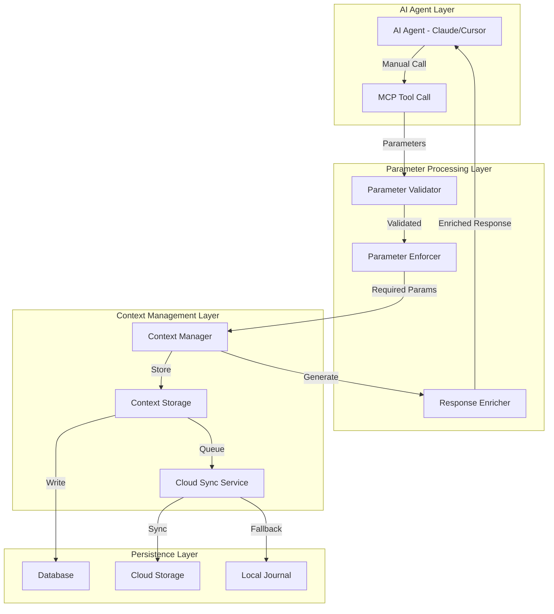
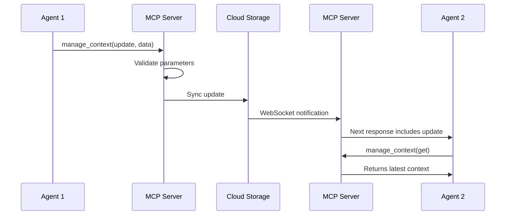

# Manual Context System Technical Architecture
**Version**: 1.0  
**Date**: February 3, 2025  
**Status**: Architecture Design Document

## Executive Summary

This document outlines the technical architecture for the Manual Context System, where AI agents explicitly manage context through MCP tool parameters. The system enforces context discipline through required parameters, response enrichment, and cloud synchronization of manual updates.

## 1. Architecture Overview

### 1.1 Core Concept
The Manual Context System operates as a "cloud notebook" where:
- AI agents must explicitly call MCP tools to read/write context
- Context updates only occur through tool parameters
- Manual writes sync automatically to cloud storage
- Response enrichment provides reminders and templates

### 1.2 Key Principles
1. **Explicit Over Implicit**: All context operations require explicit tool calls
2. **Parameter-Driven**: Context data passed through tool parameters only
3. **Enforcement Through UX**: Required parameters and helpful responses
4. **Cloud-First Design**: Manual updates sync automatically for multi-agent awareness
5. **Fail-Safe Persistence**: Local journaling ensures no data loss

## 2. System Components

### 2.1 Core Components



### 2.2 Component Responsibilities

#### Parameter Validator
- Validates parameter types and formats
- Enforces required fields (e.g., completion_summary)
- Provides clear error messages for missing parameters

#### Parameter Enforcer
- Blocks operations without required context parameters
- Implements business rules for context updates
- Maintains parameter schema versioning

#### Response Enricher
- Adds context reminders to responses
- Provides update templates
- Shows time since last update
- Includes helpful prompts for next actions

#### Context Manager
- Processes parameter-based updates
- Manages 4-tier hierarchy (Global → Project → Branch → Task)
- Handles context inheritance
- Coordinates with sync services

#### Cloud Sync Service
- Automatically syncs manual updates to cloud
- Manages WebSocket connections for real-time updates
- Handles conflict resolution
- Provides eventual consistency

#### Local Journal
- Atomic writes for fail-safe persistence
- Queues updates during network failures
- Enables offline work
- Guarantees zero data loss

## 3. Data Flow Architecture

### 3.1 Manual Update Flow

```python
# 1. AI makes explicit call with parameters
manage_task(
    action="update",
    task_id="task-123",
    status="in_progress",
    work_notes="Implemented authentication flow",  # REQUIRED
    progress_made="Added JWT token generation"     # REQUIRED
)

# 2. Parameter validation
if not work_notes or not progress_made:
    raise ValidationError("Context parameters required")

# 3. Context update from parameters
context_data = {
    "work_notes": work_notes,
    "progress_made": progress_made,
    "timestamp": datetime.utcnow(),
    "agent_id": current_agent_id
}

# 4. Store and sync
context_manager.update(task_id, context_data)
cloud_sync.queue_update(task_id, context_data)

# 5. Enriched response
return {
    "success": True,
    "context_reminder": "✅ Context updated (0 seconds ago)",
    "next_action_hint": "Remember to update context after next work phase"
}
```

### 3.2 Multi-Agent Synchronization



## 4. Parameter Schema Design

### 4.1 Task Update Parameters

```typescript
interface TaskUpdateParams {
  action: "update";
  task_id: string;
  
  // Required context parameters
  work_notes?: string;       // What was done
  progress_made?: string;    // Specific progress
  files_modified?: string[]; // Files touched
  decisions_made?: string[]; // Technical decisions
  blockers?: string[];       // Issues encountered
  
  // Optional parameters
  status?: TaskStatus;
  priority?: Priority;
}
```

### 4.2 Task Completion Parameters

```typescript
interface TaskCompletionParams {
  action: "complete";
  task_id: string;
  
  // Required for completion
  completion_summary: string;  // MANDATORY
  testing_notes?: string;      // Strongly recommended
  
  // Auto-captured from parameters
  files_created?: string[];
  files_modified?: string[];
  patterns_discovered?: object;
}
```

### 4.3 Context Update Parameters

```typescript
interface ContextUpdateParams {
  action: "update" | "add_insight" | "add_progress";
  level: "global" | "project" | "branch" | "task";
  context_id: string;
  
  // Context data from parameters
  data?: {
    [key: string]: any;  // Flexible schema
  };
  
  // For insights/progress
  content?: string;
  category?: InsightCategory;
  importance?: "low" | "medium" | "high" | "critical";
}
```

## 5. Response Enrichment Strategy

### 5.1 Enrichment Components

```python
class ResponseEnricher:
    def enrich_response(self, base_response: Dict, context_state: ContextState) -> Dict:
        enriched = base_response.copy()
        
        # Add context reminders
        if context_state.is_stale():
            enriched["context_reminder"] = self._generate_staleness_reminder(context_state)
        
        # Add update templates
        if context_state.needs_update():
            enriched["update_template"] = self._generate_update_template(context_state)
        
        # Add next action hints
        enriched["next_action"] = self._suggest_next_action(context_state)
        
        # Add visual indicators
        enriched["context_status"] = self._get_visual_status(context_state)
        
        return enriched
    
    def _generate_staleness_reminder(self, state: ContextState) -> str:
        minutes_stale = state.minutes_since_update()
        if minutes_stale > 60:
            return f"⚠️ Context last updated {minutes_stale//60} hours ago - please update"
        elif minutes_stale > 30:
            return f"🟡 Context getting stale ({minutes_stale} min) - consider updating"
        return f"✅ Context updated {minutes_stale} min ago"
```

### 5.2 Template Generation

```python
def _generate_update_template(self, state: ContextState) -> Dict:
    return {
        "suggested_call": f"""
manage_context(
    action="update",
    level="task",
    context_id="{state.context_id}",
    data={{
        "progress": ["List what you've done"],
        "files_modified": ["file1.py", "file2.js"],
        "decisions": ["Chose X because Y"],
        "next_steps": ["What's next"]
    }}
)""",
        "quick_update": f"""
manage_task(
    action="update",
    task_id="{state.task_id}",
    work_notes="[Describe your work]",
    progress_made="[Specific progress]"
)"""
    }
```

## 6. Enforcement Mechanisms

### 6.1 Required Parameter Enforcement

```python
class ParameterEnforcer:
    REQUIRED_PARAMS = {
        "complete": ["completion_summary"],
        "update": ["work_notes", "progress_made"],  # When updating progress
        "create": ["title", "description"]
    }
    
    def enforce(self, action: str, params: Dict) -> ValidationResult:
        required = self.REQUIRED_PARAMS.get(action, [])
        missing = [p for p in required if not params.get(p)]
        
        if missing:
            return ValidationResult(
                success=False,
                error=f"Missing required parameters: {', '.join(missing)}",
                hint=self._generate_helpful_hint(action, missing)
            )
        
        return ValidationResult(success=True)
```

### 6.2 Progressive Enforcement

```python
class ProgressiveEnforcer:
    """Gradually increases enforcement as agents learn"""
    
    def __init__(self):
        self.warning_threshold = 3  # Warnings before enforcement
        self.warning_counts = {}
    
    def check_context_update(self, agent_id: str, has_context_params: bool) -> Response:
        if has_context_params:
            self.warning_counts[agent_id] = 0
            return Response(success=True)
        
        warnings = self.warning_counts.get(agent_id, 0)
        
        if warnings < self.warning_threshold:
            self.warning_counts[agent_id] = warnings + 1
            return Response(
                success=True,
                warning=f"Context update recommended ({warnings+1}/{self.warning_threshold} warnings)"
            )
        else:
            return Response(
                success=False,
                error="Context update required - too many operations without updates"
            )
```

## 7. Cloud Synchronization Architecture

### 7.1 Sync Service Design

```python
class CloudSyncService:
    def __init__(self):
        self.sync_queue = PersistentQueue()
        self.websocket_manager = WebSocketManager()
        self.conflict_resolver = ConflictResolver()
    
    async def sync_context_update(self, update: ContextUpdate):
        # 1. Queue for sync
        self.sync_queue.enqueue(update)
        
        # 2. Attempt immediate sync
        try:
            await self._sync_to_cloud(update)
            self.sync_queue.mark_complete(update.id)
            
            # 3. Broadcast to other agents
            await self.websocket_manager.broadcast({
                "type": "context_update",
                "context_id": update.context_id,
                "timestamp": update.timestamp,
                "agent_id": update.agent_id
            })
        except NetworkError:
            # Will retry from queue
            pass
    
    async def _sync_to_cloud(self, update: ContextUpdate):
        # Check for conflicts
        cloud_version = await self.fetch_cloud_version(update.context_id)
        if cloud_version.timestamp > update.base_timestamp:
            resolved = self.conflict_resolver.resolve(cloud_version, update)
            update = resolved
        
        # Push to cloud
        await self.cloud_client.push(update)
```

### 7.2 Conflict Resolution

```python
class ConflictResolver:
    def resolve(self, cloud_version: Context, local_update: ContextUpdate) -> ContextUpdate:
        strategy = self.determine_strategy(cloud_version, local_update)
        
        if strategy == "merge":
            return self._merge_contexts(cloud_version, local_update)
        elif strategy == "local_wins":
            return local_update
        elif strategy == "cloud_wins":
            return ContextUpdate.from_context(cloud_version)
        else:
            return self._manual_resolution(cloud_version, local_update)
```

## 8. Local Journal Architecture

### 8.1 Journal Design

```python
class LocalJournal:
    """Fail-safe local persistence for context updates"""
    
    def __init__(self, path: Path):
        self.path = path
        self.ensure_directory()
    
    def write_entry(self, update: ContextUpdate):
        """Atomic write to ensure no data loss"""
        entry = {
            "id": str(uuid.uuid4()),
            "timestamp": datetime.utcnow().isoformat(),
            "update": update.to_dict(),
            "sync_status": "pending"
        }
        
        # Atomic write
        temp_file = self.path / f"{entry['id']}.tmp"
        final_file = self.path / f"{entry['id']}.json"
        
        with open(temp_file, 'w') as f:
            json.dump(entry, f)
        
        # Atomic rename
        temp_file.rename(final_file)
    
    def get_pending_entries(self) -> List[JournalEntry]:
        """Get all entries pending sync"""
        entries = []
        for file in self.path.glob("*.json"):
            with open(file) as f:
                entry = json.load(f)
                if entry["sync_status"] == "pending":
                    entries.append(JournalEntry.from_dict(entry))
        return sorted(entries, key=lambda e: e.timestamp)
```

## 9. Implementation Patterns

### 9.1 MCP Tool Pattern

```python
@mcp_tool
async def manage_task_with_context(
    action: str,
    task_id: str,
    **context_params
) -> Dict:
    """Enhanced task management with mandatory context updates"""
    
    # Extract context parameters
    context_data = extract_context_params(context_params)
    
    # Validate based on action
    if action == "update" and not context_data:
        return create_error_response(
            "Context parameters required for updates",
            hint="Include work_notes, progress_made, or files_modified"
        )
    
    # Perform task operation
    result = await task_manager.execute(action, task_id, **context_params)
    
    # Update context if parameters provided
    if context_data:
        await context_manager.update_from_params(task_id, context_data)
    
    # Enrich response
    response = response_enricher.enrich(result, task_id)
    
    return response
```

### 9.2 Context Extraction Pattern

```python
def extract_context_params(params: Dict) -> Dict:
    """Extract context-relevant parameters"""
    context_keys = {
        "work_notes", "progress_made", "files_modified",
        "decisions_made", "blockers", "discoveries",
        "completion_summary", "testing_notes"
    }
    
    return {k: v for k, v in params.items() if k in context_keys and v}
```

## 10. Performance Considerations

### 10.1 Optimization Strategies

1. **Parameter Validation Caching**
   - Cache parameter schemas
   - Pre-compile validation rules
   - Fast-path for common operations

2. **Response Enrichment Performance**
   - Lazy loading of templates
   - Cached staleness calculations
   - Asynchronous enrichment for non-critical data

3. **Sync Optimization**
   - Batch updates when possible
   - Compress large context payloads
   - Priority queue for critical updates

### 10.2 Scalability Design

```python
class ScalableContextSystem:
    def __init__(self):
        self.parameter_cache = LRUCache(maxsize=1000)
        self.template_cache = TTLCache(maxsize=100, ttl=3600)
        self.sync_batcher = UpdateBatcher(max_batch=50, max_wait=5.0)
    
    async def process_update(self, update: ContextUpdate):
        # Fast path for cached validations
        if self.parameter_cache.get(update.signature):
            return await self._fast_process(update)
        
        # Standard processing
        return await self._standard_process(update)
```

## 11. Security Considerations

### 11.1 Parameter Sanitization

```python
class ParameterSanitizer:
    def sanitize(self, params: Dict) -> Dict:
        """Remove potentially harmful content from parameters"""
        sanitized = {}
        
        for key, value in params.items():
            if isinstance(value, str):
                sanitized[key] = self._sanitize_string(value)
            elif isinstance(value, list):
                sanitized[key] = [self._sanitize_string(v) for v in value]
            else:
                sanitized[key] = value
        
        return sanitized
    
    def _sanitize_string(self, value: str) -> str:
        # Remove potential injection attacks
        # Limit length
        # Validate encoding
        return cleaned_value
```

### 11.2 Access Control

```python
class ContextAccessControl:
    def can_update(self, agent_id: str, context_id: str) -> bool:
        """Check if agent can update context"""
        context = self.get_context(context_id)
        
        # Check ownership
        if context.owner_id == agent_id:
            return True
        
        # Check team membership
        if agent_id in context.team_members:
            return True
        
        # Check role-based access
        return self.check_role_access(agent_id, context.required_role)
```

## 12. Monitoring and Observability

### 12.1 Metrics Collection

```python
class ContextMetrics:
    def __init__(self):
        self.update_counter = Counter("context_updates_total")
        self.sync_latency = Histogram("context_sync_latency_seconds")
        self.parameter_errors = Counter("parameter_validation_errors")
        self.staleness_gauge = Gauge("context_staleness_minutes")
    
    def record_update(self, context_id: str, has_params: bool):
        labels = {"context_id": context_id, "has_params": str(has_params)}
        self.update_counter.inc(labels)
    
    def record_sync(self, duration: float, success: bool):
        self.sync_latency.observe(duration, {"success": str(success)})
```

### 12.2 Audit Logging

```python
class ContextAuditLogger:
    def log_update(self, update: ContextUpdate):
        audit_entry = {
            "timestamp": datetime.utcnow().isoformat(),
            "agent_id": update.agent_id,
            "context_id": update.context_id,
            "action": update.action,
            "parameters_provided": list(update.parameters.keys()),
            "sync_status": update.sync_status
        }
        
        self.audit_log.write(audit_entry)
```

## 13. Migration Strategy

### 13.1 From Automatic to Manual System

1. **Phase 1: Parallel Running**
   - Deploy manual system alongside existing
   - Log both automatic and manual updates
   - Compare coverage and accuracy

2. **Phase 2: Soft Enforcement**
   - Enable parameter warnings
   - Provide templates and hints
   - Track adoption metrics

3. **Phase 3: Progressive Enforcement**
   - Enable required parameters for new tasks
   - Grandfather existing tasks
   - Increase enforcement gradually

4. **Phase 4: Full Migration**
   - Require parameters for all operations
   - Disable automatic tracking
   - Monitor and support

## 14. Future Enhancements

### 14.1 Planned Features

1. **Smart Templates**
   - Context-aware template generation
   - Learning from usage patterns
   - Personalized suggestions

2. **Voice-Activated Updates**
   - Voice-to-text context updates
   - Natural language processing
   - Hands-free operation

3. **Visual Context Builder**
   - GUI for context updates
   - Drag-and-drop interface
   - Visual history timeline

### 14.2 Research Areas

1. **Predictive Context**
   - Predict needed updates
   - Proactive reminders
   - Smart defaults

2. **Context Analytics**
   - Usage pattern analysis
   - Team insights
   - Optimization recommendations

## 15. Conclusion

The Manual Context System architecture provides a robust, scalable solution for explicit context management in AI agent workflows. By enforcing context discipline through required parameters and enriched responses, while maintaining automatic cloud synchronization, the system balances user experience with data completeness and multi-agent collaboration needs.

---
*Technical Architecture Document v1.0 - February 2025*