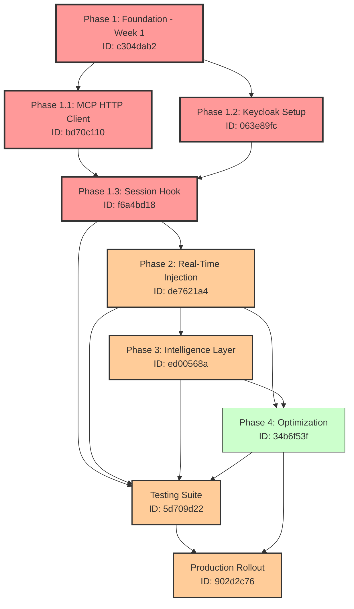

# MCP Auto-Injection System - Task Dependencies Analysis

## Task Dependency Graph



## Dependency Analysis

### 1. Critical Path (Must Complete First)
**Duration: Week 1**

| Task | Dependencies | Blockers | Priority |
|------|-------------|----------|----------|
| **Phase 1: Foundation** | None | None | CRITICAL |
| → Phase 1.1: MCP HTTP Client | Phase 1 | None | CRITICAL |
| → Phase 1.2: Keycloak Setup | Phase 1 | None | CRITICAL |
| → Phase 1.3: Session Hook | Phase 1.1, Phase 1.2 | HTTP Client & Auth | CRITICAL |

**Rationale**: These form the foundation. Without HTTP client and authentication, no other components can function.

### 2. Sequential Dependencies (Must Follow Order)
**Duration: Weeks 2-4**

| Task | Dependencies | Why Sequential | Priority |
|------|-------------|----------------|----------|
| **Phase 2: Real-Time Injection** | Phase 1.3 | Needs working hooks | HIGH |
| **Phase 3: Intelligence Layer** | Phase 2 | Needs injection pipeline | HIGH |
| **Phase 4: Optimization** | Phase 2, Phase 3 | Needs full system to optimize | MEDIUM |

### 3. Parallel Work Opportunities

#### Can Run in Parallel:
- **Phase 1.1** and **Phase 1.2** (Independent foundation components)
- **Testing Suite** (Can start after each phase completes)
- **Phase 3** and early **Phase 4** work (Different focus areas)

#### Cannot Parallelize:
- Phase 1.3 (Depends on both 1.1 and 1.2)
- Phase 2 (Depends on complete Phase 1)
- Deployment (Depends on all phases + testing)

### 4. Task Dependency Matrix

| Task ID | Task Name | Direct Dependencies | Transitive Dependencies | Can Start After |
|---------|-----------|-------------------|------------------------|-----------------|
| c304dab2 | Phase 1: Foundation | None | None | Immediately |
| bd70c110 | Phase 1.1: HTTP Client | c304dab2 | None | Day 1 |
| 063e89fc | Phase 1.2: Keycloak | c304dab2 | None | Day 1 |
| f6a4bd18 | Phase 1.3: Session Hook | bd70c110, 063e89fc | c304dab2 | Day 3 |
| de7621a4 | Phase 2: Real-Time | f6a4bd18 | c304dab2, bd70c110, 063e89fc | Week 2 |
| ed00568a | Phase 3: Intelligence | de7621a4 | All Phase 1 & 2 | Week 3 |
| 34b6f53f | Phase 4: Optimization | de7621a4, ed00568a | All Phase 1, 2, 3 | Week 3-4 |
| 5d709d22 | Testing Suite | Progressive | Each phase as completed | Week 1+ |
| 902d2c76 | Deployment | 5d709d22, 34b6f53f | All tasks | Week 4+ |

### 5. Risk Analysis

#### High-Risk Dependencies:
1. **Phase 1.3 depends on 1.1 & 1.2**: If either HTTP client or Keycloak setup fails, entire pipeline blocked
2. **Phase 2 depends on Phase 1.3**: Session hook is critical path - any delay cascades
3. **Deployment depends on Testing**: Cannot deploy without comprehensive testing

#### Mitigation Strategies:
1. **Start Phase 1.1 and 1.2 immediately** in parallel
2. **Begin test development early** alongside implementation
3. **Create mock services** for testing while real components develop
4. **Implement feature flags** to deploy partially complete features

### 6. Optimal Execution Order

```yaml
Week 1:
  Day 1-2:
    Parallel:
      - Phase 1.1: MCP HTTP Client (2 days)
      - Phase 1.2: Keycloak Setup (2 days)
      - Testing: Setup test framework
  Day 3-5:
    Sequential:
      - Phase 1.3: Session Hook Enhancement (2 days)
      - Testing: Unit tests for Phase 1

Week 2:
  Sequential:
    - Phase 2: Real-Time Injection (5 days)
  Parallel:
    - Testing: Integration tests
    - Documentation: Start user guides

Week 3:
  Primary:
    - Phase 3: Intelligence Layer (5 days)
  Parallel:
    - Phase 4: Early optimization work (2 days)
    - Testing: E2E test scenarios

Week 4:
  Sequential:
    - Phase 4: Complete optimization (3 days)
    - Testing: Full suite validation (2 days)
    - Deployment: Staging rollout (1 day)
  
Week 4+:
  - Deployment: Production rollout (2 days)
  - Monitoring: 48-hour observation
```

### 7. Dependency Update Commands

To properly set dependencies in MCP system:

```python
# Phase 1 subtasks depend on Phase 1
add_dependency(task="bd70c110", depends_on="c304dab2")
add_dependency(task="063e89fc", depends_on="c304dab2")

# Phase 1.3 depends on 1.1 and 1.2
add_dependency(task="f6a4bd18", depends_on="bd70c110")
add_dependency(task="f6a4bd18", depends_on="063e89fc")

# Phase 2 depends on Phase 1.3
add_dependency(task="de7621a4", depends_on="f6a4bd18")

# Phase 3 depends on Phase 2
add_dependency(task="ed00568a", depends_on="de7621a4")

# Phase 4 depends on Phase 2 and 3
add_dependency(task="34b6f53f", depends_on="de7621a4")
add_dependency(task="34b6f53f", depends_on="ed00568a")

# Testing depends on all phases progressively
add_dependency(task="5d709d22", depends_on="f6a4bd18")  # After Phase 1
add_dependency(task="5d709d22", depends_on="de7621a4")  # After Phase 2
add_dependency(task="5d709d22", depends_on="ed00568a")  # After Phase 3

# Deployment depends on testing and Phase 4
add_dependency(task="902d2c76", depends_on="5d709d22")
add_dependency(task="902d2c76", depends_on="34b6f53f")
```

### 8. Critical Success Factors

1. **Phase 1 Completion**: Must be 100% functional before Phase 2
2. **Authentication Working**: Keycloak must be properly configured
3. **Testing Coverage**: Each phase needs tests before next phase
4. **Performance Baselines**: Establish before optimization
5. **Rollback Ready**: Have rollback procedures before deployment

### 9. Monitoring Points

| Milestone | Success Criteria | Go/No-Go Decision |
|-----------|-----------------|-------------------|
| Phase 1 Complete | HTTP client works, Auth successful | Proceed to Phase 2 |
| Phase 2 Complete | Real-time injection < 500ms | Proceed to Phase 3 |
| Phase 3 Complete | 90% context relevance | Proceed to Phase 4 |
| Testing Complete | 100% pass rate | Proceed to Deploy |
| Staging Deploy | No critical issues 24hr | Proceed to Prod |

## Summary

The MCP auto-injection system has a **clear critical path** through Phase 1, with opportunities for parallel work within phases. The total implementation timeline is 4 weeks with proper dependency management. Phase 1 is the highest risk due to being on the critical path for all other work.

**Key Insight**: Start Phase 1.1 and 1.2 immediately in parallel to minimize critical path duration. Begin test development alongside implementation to enable continuous validation.