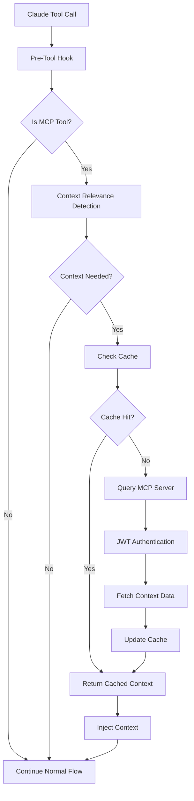

# Real-Time Context Injection System

## Overview

The Real-Time Context Injection System is a sophisticated architecture that enhances Claude AI's tool operations with contextual awareness from the MCP (Model Context Protocol) server. This system automatically injects relevant project context, task information, and workflow hints into tool operations, enabling Claude to make more informed decisions.

## Architecture Components

### 1. Authentication Layer

#### Hook Authentication (JWT)
- **Purpose**: Secure communication between Claude hooks and MCP server
- **Implementation**: `dhafnck_mcp_main/src/fastmcp/auth/hook_auth.py`
- **Configuration**:
  ```bash
  HOOK_JWT_SECRET="dhafnck-mcp-hook-secret-2025"
  HOOK_JWT_ALGORITHM="HS256"
  ```
- **Token Generation**: Automatic JWT token creation for hook requests
- **Token Validation**: Server-side validation with signature verification

### 2. Context Injection Module

#### Core Components
- **Location**: `.claude/hooks/utils/context_injector.py`
- **Main Classes**:
  - `ContextInjector`: Main injection orchestrator
  - `ContextRelevanceDetector`: Detects when context is needed
  - `OptimizedMCPClient`: Handles MCP server communication
  - `SessionContextCache`: Manages context caching

#### Key Features
- **Automatic Detection**: Identifies MCP tool calls that require context
- **Performance Optimization**: Sub-500ms response time target
- **Caching Strategy**: 15-minute TTL with session-based invalidation
- **Fallback Mechanisms**: Cache-then-skip strategy for resilience

### 3. MCP Client Integration

#### Optimized MCP Client
- **Location**: `.claude/hooks/utils/mcp_client.py`
- **Features**:
  - Connection pooling for performance
  - Retry logic with exponential backoff
  - Request batching capabilities
  - Performance monitoring

#### Supported Operations
- Task management context injection
- Project context retrieval
- Git branch information
- Subtask hierarchies
- Agent assignments

### 4. Cache Management

#### Session Context Cache
- **Location**: `.claude/hooks/utils/cache_manager.py`
- **Strategy**: LRU (Least Recently Used) with TTL
- **Invalidation**: Automatic on context updates
- **Storage**: In-memory with optional persistence

### 5. Hook Integration

#### Pre-Tool Use Hook
- **Location**: `.claude/hooks/pre_tool_use.py`
- **Integration Point**: After tool input parsing
- **Implementation**:
  ```python
  # CONTEXT INJECTION: Inject relevant context for MCP tools
  if CONTEXT_INJECTION_ENABLED and tool_name.startswith('mcp__'):
      context = inject_context_sync(tool_name, tool_input)
  ```

## Data Flow



## Configuration

### Environment Variables
```bash
# Hook JWT Authentication
HOOK_JWT_SECRET="dhafnck-mcp-hook-secret-2025"
HOOK_JWT_ALGORITHM="HS256"

# MCP Server Configuration
MCP_SERVER_URL="http://localhost:8000"
MCP_REQUEST_TIMEOUT="10"

# Performance Settings
CONTEXT_INJECTION_THRESHOLD_MS="500"
CONTEXT_CACHE_TTL_SECONDS="900"
```

### Context Triggers Configuration
```python
context_triggers = {
    'mcp__dhafnck_mcp_http__manage_task': {
        'actions': ['create', 'update', 'list'],
        'context_types': ['project', 'branch', 'recent_tasks']
    },
    'mcp__dhafnck_mcp_http__manage_subtask': {
        'actions': ['create', 'update'],
        'context_types': ['parent_task', 'project']
    },
    # ... more triggers
}
```

## Performance Optimization

### Strategies Implemented
1. **Connection Pooling**: Reuse HTTP connections to MCP server
2. **Request Batching**: Combine multiple context requests
3. **Smart Caching**: Cache with intelligent invalidation
4. **Async Operations**: Non-blocking context fetching where possible
5. **Fallback Mechanisms**: Graceful degradation on failures

### Performance Metrics
- **Target Response Time**: < 500ms
- **Cache Hit Rate Goal**: > 80%
- **Maximum Retry Attempts**: 3
- **Connection Pool Size**: 10

## Testing

### Test Suite Location
- **Unit Tests**: `dhafnck_mcp_main/src/tests/test_context_injection.py`
- **Integration Tests**: `dhafnck_mcp_main/src/tests/test_context_injection_system.py`
- **Performance Tests**: `dhafnck_mcp_main/src/tests/test_context_injection_performance.py`

### Test Coverage
- Authentication flow validation
- Context detection accuracy
- Cache hit/miss scenarios
- Performance under load
- Fallback mechanism testing
- Error handling validation

### Running Tests
```bash
# Create test data
python3 dhafnck_mcp_main/src/tests/create_test_data.py

# Run comprehensive test
HOOK_JWT_SECRET="dhafnck-mcp-hook-secret-2025" \
HOOK_JWT_ALGORITHM="HS256" \
python3 dhafnck_mcp_main/src/tests/test_context_injection_system.py
```

## Security Considerations

### Authentication Security
- **JWT Tokens**: Short-lived tokens with secure signing
- **Secret Management**: Environment variables for sensitive data
- **No Credential Storage**: Tokens generated per request
- **Signature Validation**: All requests verified server-side

### Data Security
- **User Isolation**: Context scoped to user sessions
- **No PII in Cache**: Only project metadata cached
- **Secure Communication**: HTTPS in production
- **Audit Logging**: All context injections logged

## Monitoring and Debugging

### Log Files
- **Context Injection Log**: `logs/context_injection.log`
- **Error Log**: `logs/context_injection_errors.log`
- **Performance Log**: `logs/context_performance.log`

### Debug Output
Enable debug mode for detailed output:
```bash
export CONTEXT_INJECTION_DEBUG=true
```

### Performance Monitoring
Monitor key metrics:
- Response time per injection
- Cache hit/miss ratios
- MCP query performance
- Error rates and types

## Future Enhancements

### Planned Improvements
1. **Machine Learning Context Prediction**: Predict needed context before tool execution
2. **Distributed Caching**: Redis integration for multi-instance support
3. **Context Streaming**: Stream large contexts progressively
4. **Custom Context Providers**: Plugin architecture for context sources
5. **Context Compression**: Reduce payload sizes for faster transmission

### Optimization Opportunities
- GraphQL for selective field queries
- WebSocket connections for real-time updates
- Context pre-warming based on usage patterns
- Intelligent cache preloading
- Context aggregation and summarization

## Troubleshooting

### Common Issues

#### 1. Authentication Failures
**Symptom**: 401 errors in logs
**Solution**: Verify JWT secret matches between hook and server

#### 2. Slow Context Injection
**Symptom**: Response time > 500ms
**Solution**: Check cache configuration and MCP server performance

#### 3. Missing Context
**Symptom**: No context returned for MCP tools
**Solution**: Verify test data exists and context triggers are configured

#### 4. Cache Misses
**Symptom**: Low cache hit rate
**Solution**: Increase cache TTL or adjust invalidation strategy

## Best Practices

### For Developers
1. Always set environment variables before starting MCP server
2. Create test data before running integration tests
3. Monitor performance logs regularly
4. Use debug mode for troubleshooting
5. Keep JWT secrets secure and rotate regularly

### For Operations
1. Monitor system resources (memory for cache)
2. Set up log rotation for injection logs
3. Configure alerts for high error rates
4. Regular performance baseline testing
5. Document any custom configurations

## Conclusion

The Real-Time Context Injection System represents a significant advancement in AI-assisted development workflows. By providing Claude with relevant context at the moment of tool execution, we enable more intelligent, context-aware operations that improve development efficiency and reduce errors.

The system's modular architecture, performance optimizations, and robust security measures make it production-ready while maintaining flexibility for future enhancements.