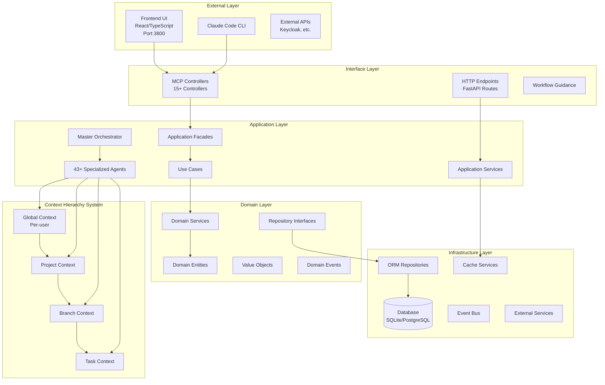
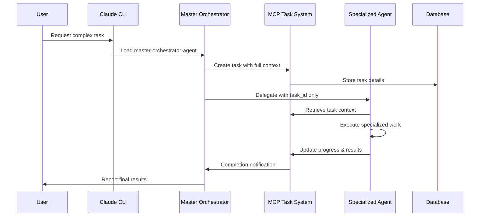
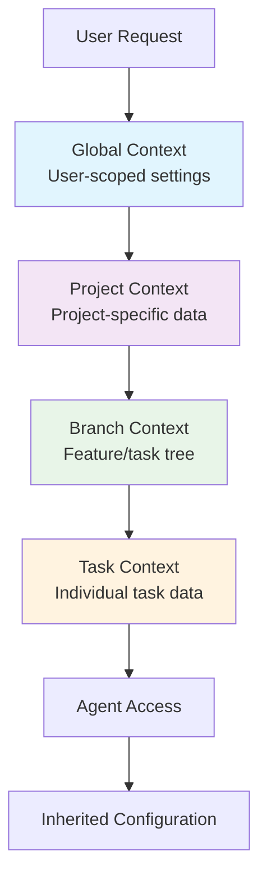
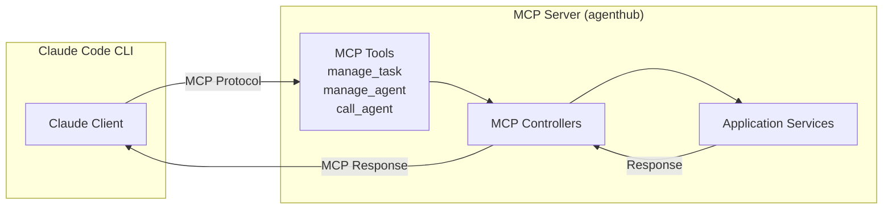

# agenthub System Architecture Overview

**Document Version:** 1.0  
**Last Updated:** 2025-09-12  
**Status:** Active  

## Executive Summary

The agenthub system is a sophisticated multi-agent project management platform built on Domain-Driven Design (DDD) principles with a 4-tier context hierarchy. The system orchestrates 43+ specialized agents through MCP (Model Context Protocol) integration, providing intelligent task management, automated workflows, and comprehensive project coordination capabilities.

## Quick Navigation

- [High-Level Architecture](#high-level-architecture)
- [System Layers](#system-layers)
- [Technology Stack](#technology-stack)
- [Component Interactions](#component-interactions)
- [Data Flow](#data-flow)
- [Deployment Architecture](#deployment-architecture)
- [Related Documentation](#related-documentation)

## High-Level Architecture



## System Layers

### 1. Interface Layer
**Purpose:** Handle external interactions and protocol communications
- **MCP Controllers:** 15+ controllers for specialized operations
- **HTTP Endpoints:** REST API endpoints for web interface
- **Workflow Guidance:** AI-driven workflow recommendations
- **Response Formatting:** Consistent response structures

### 2. Application Layer  
**Purpose:** Orchestrate business use cases and coordinate agents
- **Master Orchestrator:** Central coordination agent
- **Specialized Agents:** 43+ agents with domain expertise
- **Application Facades:** Simplified interfaces for complex operations  
- **Application Services:** Cross-cutting concerns and coordination
- **Use Cases:** Business operation implementations

### 3. Domain Layer
**Purpose:** Core business logic and rules
- **Domain Entities:** Task, Project, Agent, Context objects
- **Value Objects:** Immutable domain concepts
- **Domain Services:** Business logic that doesn't belong in entities
- **Domain Events:** Business event notifications
- **Repository Interfaces:** Data access abstractions

### 4. Infrastructure Layer
**Purpose:** Technical implementation details
- **ORM Repositories:** SQLAlchemy-based data persistence
- **Database:** SQLite (dev) / PostgreSQL (prod) with migrations
- **Cache Services:** Performance optimization
- **Event Bus:** Event-driven architecture support
- **External Services:** Third-party integrations

## Technology Stack

### Backend Technologies
```
Language:         Python 3.11+
Framework:        FastMCP (custom MCP server framework)
ORM:              SQLAlchemy 2.0+
Database:         SQLite (dev) / PostgreSQL (prod)
Cache:            Redis (optional)
Authentication:   Keycloak + JWT
Event System:     Custom Event Bus
Testing:          pytest, unittest
Documentation:    Markdown + Mermaid
```

### Frontend Technologies  
```
Language:         TypeScript
Framework:        React 18+
Styling:          Tailwind CSS
State Management: React Context + Custom Hooks
Build Tool:       Vite
HTTP Client:      Fetch API
Port:             3800
```

### Infrastructure
```
Containerization: Docker + docker-compose
Database Volume:  /data/agenthub.db
Backend Port:     8000
Environment:      .env configuration
Orchestration:    docker-system/docker-menu.sh
```

### Agent System
```
Total Agents:     43+ specialized agents
Categories:       15+ (Development, Testing, Architecture, etc.)
Protocol:         MCP (Model Context Protocol)
Orchestration:    Master Orchestrator Agent
Task Management:  MCP Task/Subtask system
Context:          4-tier hierarchy with inheritance
```

## Component Interactions

### Agent Orchestration Flow


### Context Inheritance Flow


### MCP Protocol Communication


## Data Flow

### Task Management Data Flow
1. **Task Creation:** User → Master Orchestrator → MCP Task System → Database
2. **Task Assignment:** Master Orchestrator → Specialized Agent (via task_id)
3. **Context Retrieval:** Agent → MCP System → Context Hierarchy → Merged Context
4. **Progress Updates:** Agent → MCP System → Database → User Visibility
5. **Task Completion:** Agent → MCP System → Master Orchestrator → User

### Context Data Flow
- **Global Context:** Persistent user preferences and system defaults
- **Project Context:** Inherits from Global + project-specific settings
- **Branch Context:** Inherits from Project + branch/feature-specific data  
- **Task Context:** Inherits from Branch + task-specific details

### Event-Driven Data Flow
1. **Domain Events:** Generated by entity state changes
2. **Event Bus:** Routes events to registered handlers
3. **Event Handlers:** Update related systems (cache, search, etc.)
4. **Integration Events:** Communicate with external systems

## Key Architectural Principles

### Domain-Driven Design (DDD)
- **Clear layer separation** with defined responsibilities
- **Rich domain models** with behavior, not anemic data structures
- **Ubiquitous language** consistent across code and documentation
- **Bounded contexts** for different business domains

### 4-Tier Context Hierarchy
- **Inheritance-based** configuration and data flow
- **UUID-based identification** for all entities
- **Auto-creation** of contexts when needed
- **Multi-tenant isolation** at the user level

### Agent-Centric Architecture  
- **Master Orchestrator** coordinates all complex workflows
- **Specialized Agents** with domain expertise (43+ agents)
- **Token-efficient delegation** using task IDs instead of full context
- **Transparent progress tracking** through MCP task system

### Event-Driven Architecture
- **Domain events** for business state changes
- **Event sourcing** for audit trails and debugging
- **Asynchronous processing** for non-blocking operations
- **Integration events** for external system communication

## Performance Characteristics

### Scalability Patterns
- **Repository caching** for frequently accessed data
- **Context inheritance caching** for performance optimization
- **Agent connection pooling** for efficient resource usage
- **Database connection management** with SQLAlchemy

### Token Economy (AI Efficiency)
- **95% token savings** through task_id-based delegation
- **Context reuse** via inheritance hierarchy
- **Compressed responses** from MCP tools
- **Efficient agent handoffs** without context duplication

## Security Architecture

### Authentication & Authorization
- **Keycloak** as the single source of truth for user identity
- **JWT tokens** with automatic refresh
- **Multi-tenant isolation** with user-scoped data
- **Role-based access control** for different agent capabilities

### Data Protection
- **Environment variable security** for all secrets
- **Database encryption** for sensitive data
- **API rate limiting** to prevent abuse
- **Audit trails** for all operations

## Deployment Architecture

### Development Environment
```
Docker Containers:
├── agenthub-backend (Python/FastMCP)
├── agenthub-frontend (React/TypeScript) 
├── postgresql (Database)
├── keycloak (Authentication)
└── redis (Optional caching)

Ports:
- Backend: 8000
- Frontend: 3800
- Database: 5432
- Keycloak: 8080
```

### Production Considerations
- **Container orchestration** with Docker Compose
- **Database migration** management with SQLAlchemy
- **Environment-specific** configuration via .env files
- **Health checks** and monitoring for all services

## Quality Attributes

### Maintainability
- **Clean Architecture** with clear separation of concerns
- **SOLID principles** applied throughout the codebase
- **Design patterns** consistently implemented
- **Comprehensive documentation** for all components

### Testability
- **Dependency injection** for easy mocking
- **Repository pattern** for data access abstraction  
- **Event-driven architecture** for integration testing
- **Factory patterns** for test data creation

### Extensibility
- **Plugin architecture** for new agents
- **Factory pattern** for dynamic object creation
- **Strategy pattern** for varying algorithms
- **Observer pattern** for event handling

## System Boundaries

### Internal Boundaries
- **Layer boundaries** enforced through dependency direction
- **Context boundaries** defined by business domains
- **Agent boundaries** with specialized responsibilities
- **Data boundaries** with repository abstractions

### External Boundaries
- **MCP protocol** for Claude Code integration
- **HTTP/REST** for web client communication  
- **Database protocol** for data persistence
- **Authentication protocol** with Keycloak

## Related Documentation

### Architecture Details
- [Domain-Driven Design Layers](./domain-driven-design-layers.md)
- [Context Hierarchy System](./context-hierarchy-system.md)
- [Agent Orchestration Architecture](./agent-orchestration-architecture.md)
- [Design Patterns in Architecture](./design-patterns-in-architecture.md)

### Analysis Reports
- [Design Patterns Analysis](../reports-status/design-patterns-analysis.md)
- [Factory Check Status](../reports-status/factory-check-status.md)
- [Factory Refactoring Templates](../development-guides/factory-refactoring-templates.md)

### Implementation Guides
- [MCP Task Creation Guide](../development-guides/mcp-task-creation-guide.md)
- [AI Task Planning Prompt](../development-guides/ai-task-planning-prompt.md)
- [Setup Guides](../setup-guides/)

## Architectural Decision Records (ADRs)

### Major Decisions
1. **Domain-Driven Design:** Chosen for clear business logic separation
2. **4-Tier Context Hierarchy:** Enables configuration inheritance and isolation
3. **Agent-Centric Architecture:** Provides specialized expertise and scalability
4. **MCP Protocol Integration:** Enables seamless Claude Code integration
5. **Event-Driven Architecture:** Supports loose coupling and extensibility

### Trade-offs Made
- **Complexity vs. Maintainability:** DDD adds complexity but improves long-term maintainability
- **Performance vs. Flexibility:** Context hierarchy adds overhead but enables powerful inheritance
- **Token Usage vs. Transparency:** Task-based delegation saves tokens while maintaining visibility

## Future Evolution

### Planned Enhancements
- **Advanced caching strategies** for improved performance
- **Machine learning integration** for intelligent task assignment
- **Real-time collaboration** features for multi-user workflows
- **Advanced analytics** and reporting capabilities

### Extensibility Points
- **New agent types** can be added through the agent registration system
- **Custom contexts** can be added to the hierarchy system
- **New event types** can be integrated into the event bus
- **External integrations** can be added through adapter patterns

---

**Last Updated:** 2025-09-12  
**Document Owner:** agenthub Architecture Team  
**Review Schedule:** Monthly  
**Status:** Living Document - Updated as system evolves