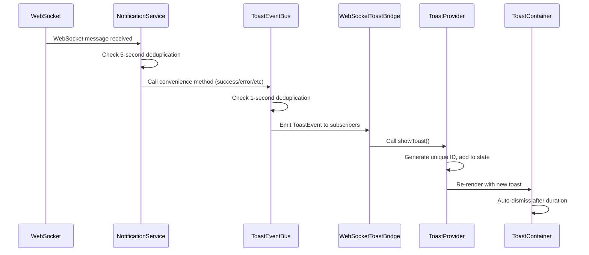
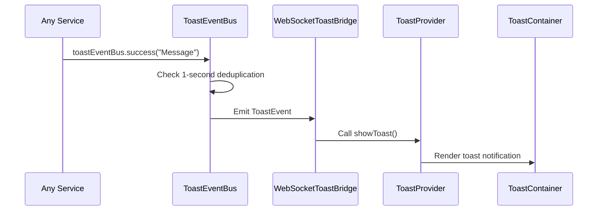

# Toast Notification System Architecture

## Table of Contents
1. [Architecture Overview](#architecture-overview)
2. [Component Relationships](#component-relationships)
3. [Data Flow Diagram](#data-flow-diagram)
4. [Files and Components](#files-and-components)
5. [Technical Implementation](#technical-implementation)
6. [Usage Guidelines](#usage-guidelines)
7. [Best Practices](#best-practices)
8. [Code Examples](#code-examples)
9. [Troubleshooting](#troubleshooting)

## Architecture Overview

The toast notification system is a decoupled, event-driven architecture that provides real-time user feedback across the application. It consists of multiple layers working together to deliver notifications from various sources (WebSocket events, service calls, user actions) to a unified UI component.

### System Design Principles

- **Decoupling**: Services emit notifications without knowing about UI implementation
- **Event-Driven**: Uses an event bus pattern for loose coupling between components
- **Deduplication**: Multiple layers prevent duplicate notifications from overwhelming users
- **Flexibility**: Supports various notification types, actions, and customization
- **Real-time**: Integrates with WebSocket for instant notifications

### Architecture Layers

```
┌─────────────────────────────────────────────────────────────┐
│                     UI Layer                                 │
│  ┌─────────────────┐    ┌─────────────────────────────────┐ │
│  │  ToastProvider  │◄──►│      ToastContainer             │ │
│  │  (Context)      │    │      (Visual Components)        │ │
│  └─────────────────┘    └─────────────────────────────────┘ │
└─────────────────────────────────────────────────────────────┘
                           ▲
                           │
┌─────────────────────────────────────────────────────────────┐
│                   Bridge Layer                               │
│  ┌─────────────────────────────────────────────────────────┐ │
│  │            WebSocketToastBridge                         │ │
│  │            (Event Bus Subscriber)                       │ │
│  └─────────────────────────────────────────────────────────┘ │
└─────────────────────────────────────────────────────────────┘
                           ▲
                           │
┌─────────────────────────────────────────────────────────────┐
│                 Event Bus Layer                              │
│  ┌─────────────────────────────────────────────────────────┐ │
│  │                 ToastEventBus                           │ │
│  │              (1-second deduplication)                   │ │
│  └─────────────────────────────────────────────────────────┘ │
└─────────────────────────────────────────────────────────────┘
                           ▲
                           │
┌─────────────────────────────────────────────────────────────┐
│                 Service Layer                                │
│  ┌─────────────────┐    ┌─────────────────────────────────┐ │
│  │Notification     │    │    Other Services               │ │
│  │Service          │    │    (API calls, etc.)           │ │
│  │(5-sec dedup)    │    │                                 │ │
│  └─────────────────┘    └─────────────────────────────────┘ │
└─────────────────────────────────────────────────────────────┘
                           ▲
                           │
┌─────────────────────────────────────────────────────────────┐
│                 Data Source Layer                            │
│  ┌─────────────────┐    ┌─────────────────────────────────┐ │
│  │  WebSocket      │    │    Direct Service Calls         │ │
│  │  Messages       │    │    (User Actions)               │ │
│  └─────────────────┘    └─────────────────────────────────┘ │
└─────────────────────────────────────────────────────────────┘
```

## Component Relationships

### Core Components

1. **ToastEventBus** - Central event dispatcher with deduplication
2. **NotificationService** - Higher-level service with WebSocket integration
3. **WebSocketToastBridge** - Connects event bus to React context
4. **ToastProvider** - React context provider for UI state
5. **ToastContainer** - Visual rendering of toast notifications

### Dependency Graph

```
App.tsx
├── ToastProvider (wraps entire app)
│   ├── ToastContainer (renders toasts)
│   └── WebSocketToastBridge (subscribes to events)
│       └── toastEventBus (event dispatcher)
│           ├── NotificationService (higher-level API)
│           └── Direct service calls
└── Other Components (can use toast hooks)
```

## Data Flow Diagram

### Standard Notification Flow



### Direct Service Call Flow



## Files and Components

### 1. `/src/services/toastEventBus.ts`

**Purpose**: Central event bus for toast notifications with deduplication

**Key Features**:
- Singleton pattern for global access
- 1-second deduplication window
- Legacy and modern API support
- Convenience methods for different toast types

**Core Interface**:
```typescript
export interface ToastEvent {
  type: ToastEventType;
  title: string;
  description?: string;
  action?: {
    label: string;
    onClick: () => void;
  };
}

class ToastEventBus {
  subscribe(callback: (event: ToastEvent) => void): () => void
  emit(typeOrEvent: string | ToastEvent, message?: string, options?: any): void
  success(title: string, description?: string, action?: ToastEvent['action']): void
  error(title: string, description?: string, action?: ToastEvent['action']): void
  warning(title: string, description?: string, action?: ToastEvent['action']): void
  info(title: string, description?: string, action?: ToastEvent['action']): void
}
```

### 2. `/src/services/notificationService.ts`

**Purpose**: Higher-level notification service with WebSocket integration

**Key Features**:
- 5-second deduplication for entity changes
- WebSocket message processing
- Browser notification support
- Audio feedback
- Entity-specific notification formatting

**Core Interface**:
```typescript
class NotificationService {
  notifyEntityChange(entityType: EntityType, eventType: EventType, entityName?: string, entityId?: string, userName?: string): void
  success(message: string, options?: NotificationOptions): void
  error(message: string, options?: NotificationOptions): void
  warning(message: string, options?: NotificationOptions): void
  info(message: string, options?: NotificationOptions): void
  initializeWebSocketListener(webSocketClient: any): () => void
}
```

### 3. `/src/components/WebSocketToastBridge.tsx`

**Purpose**: Bridge between event bus and React toast context

**Key Features**:
- Subscribes to toastEventBus on mount
- Converts ToastEvent objects to toast context calls
- Handles browser notification permissions
- No visual rendering (pure logic component)

**Implementation Pattern**:
```typescript
export const WebSocketToastBridge: React.FC = () => {
  const { showToast } = useToast();

  useEffect(() => {
    const unsubscribe = toastEventBus.subscribe((event: ToastEvent) => {
      showToast({
        type: event.type,
        title: event.title,
        description: event.description,
        action: event.action,
        duration: event.type === 'error' ? 8000 : 5000
      });
    });

    return unsubscribe;
  }, []);

  return null;
};
```

### 4. `/src/components/ui/toast.tsx`

**Purpose**: React context and UI components for toast display

**Key Features**:
- React Context for global toast state
- Multiple toast type variants (success, error, warning, info)
- Auto-dismiss with pause on hover
- Action button support
- Accessibility features (ARIA roles)

**Core Interface**:
```typescript
interface ToastContextType {
  toasts: Toast[];
  showToast: (toast: Omit<Toast, 'id'>) => string;
  dismissToast: (id: string) => void;
  dismissAll: () => void;
}

export const ToastProvider: React.FC<{ children: React.ReactNode }>
export const ToastContainer: React.FC
export const useToast: () => ToastContextType
```

### 5. `/src/App.tsx` - Integration Point

**Purpose**: Application root with toast system initialization

**Key Integration**:
```typescript
function App() {
  return (
    <ReduxProvider store={store}>
      <ThemeProvider>
        <ToastProvider>                {/* Toast context */}
          <WebSocketToastBridge />     {/* Event bus bridge */}
          <AuthWrapper>
            {/* App routes */}
          </AuthWrapper>
        </ToastProvider>
      </ThemeProvider>
    </ReduxProvider>
  );
}
```

## Technical Implementation

### Deduplication Mechanism

The system implements a two-tier deduplication strategy:

#### Level 1: ToastEventBus (1-second window)
```typescript
private shouldDeduplicate(key: string): boolean {
  const now = Date.now();
  const lastEmitted = this.recentMessages.get(key);

  if (lastEmitted && (now - lastEmitted) < this.DEDUPLICATION_WINDOW) {
    return true; // Skip duplicate
  }

  this.recentMessages.set(key, now);
  return false;
}
```

#### Level 2: NotificationService (5-second window)
```typescript
private isDuplicate(entityType: EntityType, eventType: EventType, entityId?: string): boolean {
  const key = `${entityType}:${eventType}:${entityId || 'unknown'}`;
  const now = Date.now();
  const lastNotification = this.recentNotifications.get(key);

  if (lastNotification && (now - lastNotification) < 5000) {
    return true; // Skip duplicate
  }

  this.recentNotifications.set(key, now);
  return false;
}
```

### Event Flow Architecture

1. **Data Sources** generate events (WebSocket, user actions, API responses)
2. **NotificationService** processes WebSocket messages and applies entity-level deduplication
3. **ToastEventBus** receives notifications and applies general deduplication
4. **WebSocketToastBridge** subscribes to the event bus and forwards to React context
5. **ToastProvider** manages UI state and renders notifications
6. **ToastContainer** displays visual notifications with auto-dismiss logic

### Memory Management

- **Automatic Cleanup**: Both deduplication systems clean up old entries to prevent memory leaks
- **Timer Management**: Toast auto-dismiss timers are properly cleaned up on component unmount
- **Event Subscription**: Unsubscribe functions are called during cleanup

## Usage Guidelines

### Basic Usage

#### For Simple Notifications
```typescript
import { toastEventBus } from '../services/toastEventBus';

// Convenience methods (recommended)
toastEventBus.success('Operation completed successfully');
toastEventBus.error('Failed to save changes');
toastEventBus.warning('Network connection unstable');
toastEventBus.info('New version available');
```

#### For Complex Notifications
```typescript
toastEventBus.success('File uploaded', 'Document.pdf uploaded successfully', {
  label: 'View File',
  onClick: () => openFile('document.pdf')
});
```

#### In React Components
```typescript
import { useToast } from '../components/ui/toast';

function MyComponent() {
  const { showToast } = useToast();

  const handleAction = () => {
    // Direct toast context usage
    showToast({
      type: 'success',
      title: 'Action completed',
      description: 'Your changes have been saved'
    });
  };
}
```

#### For Entity Changes (WebSocket Integration)
```typescript
import { notificationService } from '../services/notificationService';

// Entity-specific notifications (automatically formatted)
notificationService.notifyEntityChange('task', 'completed', 'User Authentication Task', 'task-123', 'John Doe');
// Result: "Task 'User Authentication Task' was completed by John Doe"
```

### WebSocket Integration Setup

The notification service automatically integrates with WebSocket v2.0:

```typescript
// In your WebSocket hook or service
const webSocketClient = new WebSocketClient();
const cleanup = notificationService.initializeWebSocketListener(webSocketClient);

// Cleanup on component unmount
return cleanup;
```

## Best Practices

### Do's ✅

1. **Use Convenience Methods**: Prefer `toastEventBus.success()` over manual event objects
2. **Provide Context**: Include descriptions for complex operations
3. **Use Actions Sparingly**: Only for toasts that need user interaction
4. **Keep Messages Concise**: Toast titles should be brief and clear
5. **Use Appropriate Types**:
   - `success` for completed operations
   - `error` for failures requiring attention
   - `warning` for potential issues
   - `info` for general information

### Don'ts ❌

1. **Don't Spam Notifications**: The deduplication system helps, but be mindful
2. **Don't Use for Long Messages**: Keep descriptions under 2 lines
3. **Don't Override Durations Unnecessarily**: Default durations are optimized
4. **Don't Create Manual Toast Objects**: Use the provided APIs instead
5. **Don't Bypass the Event Bus**: Always go through toastEventBus or notificationService

### Performance Considerations

1. **Deduplication**: Two-tier system prevents notification spam
2. **Memory Management**: Automatic cleanup of old deduplication entries
3. **Event Subscription**: Proper cleanup prevents memory leaks
4. **Lazy Loading**: Toast components only render when needed

### Accessibility

1. **ARIA Roles**: Toast containers include proper `role="alert"` attributes
2. **Keyboard Navigation**: Close buttons are keyboard accessible
3. **Screen Reader Support**: Toast content is announced to screen readers
4. **Color Contrast**: Toast variants meet WCAG accessibility standards

## Code Examples

### Basic Notification Examples

```typescript
// Simple success message
toastEventBus.success('Settings saved successfully');

// Error with description
toastEventBus.error('Upload failed', 'File size exceeds 10MB limit');

// Warning with action
toastEventBus.warning('Unsaved changes', 'You have unsaved changes that will be lost', {
  label: 'Save Now',
  onClick: () => saveChanges()
});

// Info notification
toastEventBus.info('System maintenance scheduled for tonight at 2 AM');
```

### WebSocket Integration Example

```typescript
// Automatic entity change notifications
// When a WebSocket message arrives:
{
  "type": "update",
  "payload": {
    "entity": "task",
    "action": "completed",
    "data": {
      "primary": {
        "id": "task-123",
        "title": "User Authentication Implementation",
        "status": "completed"
      }
    }
  },
  "metadata": {
    "source": "user",
    "userName": "John Doe"
  }
}

// Automatically generates:
// Toast: "Task 'User Authentication Implementation' was completed by John Doe"
```

### Custom Service Integration

```typescript
// In your service file
import { toastEventBus } from '../services/toastEventBus';

class ApiService {
  async saveData(data: any) {
    try {
      const result = await api.post('/data', data);
      toastEventBus.success('Data saved successfully');
      return result;
    } catch (error) {
      toastEventBus.error('Failed to save data', error.message);
      throw error;
    }
  }

  async uploadFile(file: File) {
    try {
      const result = await api.upload('/files', file);
      toastEventBus.success('File uploaded', `${file.name} uploaded successfully`, {
        label: 'View File',
        onClick: () => this.openFile(result.id)
      });
      return result;
    } catch (error) {
      toastEventBus.error('Upload failed', `Could not upload ${file.name}`);
      throw error;
    }
  }
}
```

### React Hook Usage

```typescript
// Using toast context directly in components
function TaskForm() {
  const { showToast } = useToast();
  const [saving, setSaving] = useState(false);

  const handleSubmit = async (data: TaskData) => {
    setSaving(true);
    try {
      await taskService.create(data);
      showToast({
        type: 'success',
        title: 'Task created',
        description: `"${data.title}" has been created successfully`
      });
    } catch (error) {
      showToast({
        type: 'error',
        title: 'Failed to create task',
        description: error.message,
        duration: 8000 // Longer duration for errors
      });
    } finally {
      setSaving(false);
    }
  };
}
```

### Advanced Deduplication Example

```typescript
// This will only show one notification even if called multiple times rapidly
for (let i = 0; i < 10; i++) {
  toastEventBus.success('Batch operation completed', `Processed item ${i}`);
}
// Result: Only one notification is shown due to 1-second deduplication window

// Entity changes are deduplicated separately with longer window
notificationService.notifyEntityChange('task', 'updated', 'My Task', 'task-123');
notificationService.notifyEntityChange('task', 'updated', 'My Task', 'task-123'); // Deduplicated
// Result: Only one notification for this specific task update
```

## Troubleshooting

### Common Issues

#### Issue 1: Notifications Not Appearing
**Symptoms**: Toast events are emitted but no visual notifications appear

**Debugging Steps**:
1. Check browser console for WebSocketToastBridge logs
2. Verify ToastProvider wraps the entire app
3. Ensure WebSocketToastBridge is included in component tree
4. Check if showToast is being called with correct parameters

**Solution**:
```typescript
// Verify in App.tsx
<ToastProvider>
  <WebSocketToastBridge />
  {/* Rest of app */}
</ToastProvider>
```

#### Issue 2: Duplicate Notifications
**Symptoms**: Same notification appears multiple times

**Debugging Steps**:
1. Check deduplication logs in browser console
2. Verify that you're not calling both toastEventBus AND showToast for the same event
3. Check if multiple services are triggering the same notification

**Solution**:
- Use only one notification method per event
- Rely on the deduplication system
- Check for proper cleanup of event listeners

#### Issue 3: WebSocket Notifications Not Working
**Symptoms**: Manual notifications work but WebSocket-triggered ones don't

**Debugging Steps**:
1. Verify WebSocket connection is established
2. Check if notificationService.initializeWebSocketListener() was called
3. Look for WebSocket message processing logs
4. Verify message format matches expected structure

**Solution**:
```typescript
// Ensure WebSocket listener is initialized
useEffect(() => {
  const cleanup = notificationService.initializeWebSocketListener(webSocketClient);
  return cleanup;
}, [webSocketClient]);
```

#### Issue 4: Notifications Not Auto-Dismissing
**Symptoms**: Toast notifications stay visible indefinitely

**Debugging Steps**:
1. Check if duration is set correctly
2. Verify timer cleanup in useEffect
3. Check for JavaScript errors preventing timer execution

**Solution**:
```typescript
// Ensure proper duration is set
toastEventBus.success('Message', 'Description'); // Uses default 5s
// Or explicitly set duration
showToast({ type: 'info', title: 'Message', duration: 3000 });
```

### Debug Console Output

The system provides extensive console logging for debugging:

```
📝 ToastEventBus.subscribe() called - adding legacy listener
📡 ToastEventBus.emit() called with: success Operation completed
🔔 WebSocketToastBridge: Received toast event from toastEventBus
🍞 ToastProvider.showToast() called with: {type: 'success', title: 'Operation completed'}
✅ WebSocketToastBridge: Called showToast, returned ID: abc123
```

### Performance Monitoring

Monitor these metrics for system health:

1. **Deduplication Rate**: Check console for "DEDUPLICATING" messages
2. **Memory Usage**: Monitor recentMessages and recentNotifications Maps
3. **Event Subscription**: Ensure proper cleanup of event listeners
4. **Toast Count**: Monitor active toast count in ToastProvider state

### Testing the System

```typescript
// Test basic functionality
toastEventBus.success('Test notification');

// Test deduplication
toastEventBus.success('Duplicate test');
toastEventBus.success('Duplicate test'); // Should be deduplicated

// Test WebSocket integration
// Trigger a WebSocket message and verify notification appears

// Test cleanup
// Navigate away and back, ensure no memory leaks
```

This comprehensive architecture provides a robust, scalable, and user-friendly notification system that handles real-time updates while preventing notification spam through intelligent deduplication.