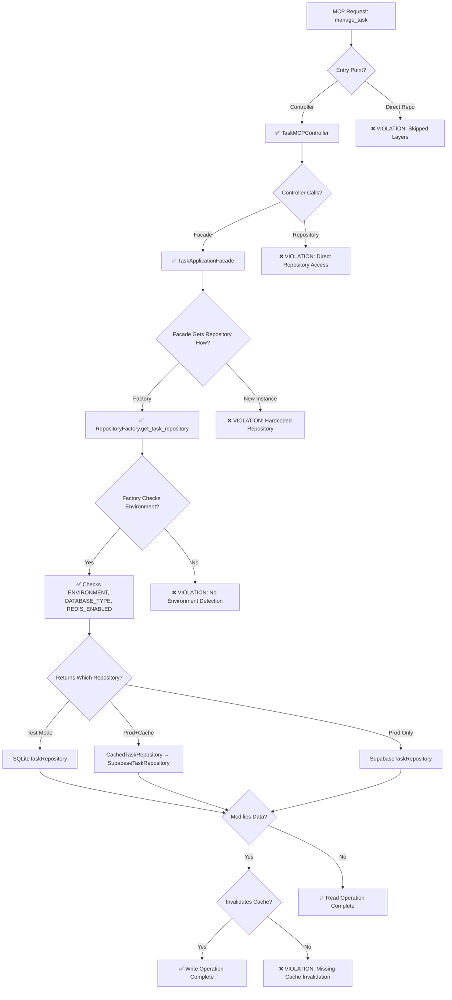

# 🔍 Visual Flow Verification Prompt for Architecture Compliance

## Agent Instructions: Verify Each Code Path (Chemin)

**YOUR MISSION**: For each feature/endpoint, trace the complete code path and verify it follows the architecture. Create visual flow diagrams to confirm compliance.

## 📊 Flow Verification Template

### For Each MCP Tool Endpoint, Create This Diagram:



## 🔬 Specific Code Paths to Analyze

### 1. Task Creation Flow
```python
# TRACE THIS PATH:
mcp__4genthub_http__manage_task(action="create")
    ↓
# EXPECTED:
→ TaskMCPController.manage_task()
→ TaskApplicationFacade.create_task()
→ RepositoryFactory.get_task_repository()
→ [Environment-based Repository].create()
→ CacheInvalidationMixin.invalidate_cache_for_entity()

# VERIFY:
□ Controller exists at: interface/controllers/task_mcp_controller.py
□ Facade exists at: application/facades/task_application_facade.py
□ Factory used at: Line X in facade
□ Cache invalidated at: Line Y in repository
```

### 2. Context Update Flow
```python
# TRACE THIS PATH:
mcp__4genthub_http__manage_context(action="update")
    ↓
# EXPECTED:
→ ContextMCPController.manage_context()
→ UnifiedContextService.update_context()
→ ContextRepositoryFactory.get_repository_for_level()
→ [Level]ContextRepository.update()
→ ContextCache.invalidate_context()

# VERIFY:
□ No direct cache access in controller
□ Service uses factory pattern
□ Repository selected based on level (global/project/branch/task)
□ Cache invalidation includes hierarchy
```

### 3. Project Health Check Flow
```python
# TRACE THIS PATH:
mcp__4genthub_http__manage_project(action="project_health_check")
    ↓
# EXPECTED:
→ ProjectMCPController.manage_project()
→ ProjectApplicationFacade.project_health_check()
→ Multiple repository calls via factory
→ Aggregated health metrics returned

# VERIFY:
□ Facade coordinates multiple repositories
□ All repositories obtained via factory
□ No hardcoded repository instances
□ Read-only operation (no cache invalidation needed)
```

## 🎨 Visual Code Flow Analysis Commands

### Step 1: Map Entry Points
```bash
# Find all MCP tool entry points
find src -name "*.py" -exec grep -l "class.*MCPController" {} \;

# For each controller, create entry map:
grep "def manage_" src/fastmcp/task_management/interface/controllers/*.py
```

### Step 2: Trace Dependencies
```python
# Script to trace import dependencies
import ast
import os

def analyze_imports(file_path):
    with open(file_path) as f:
        tree = ast.parse(f.read())
    
    imports = []
    for node in ast.walk(tree):
        if isinstance(node, ast.Import):
            imports.extend([n.name for n in node.names])
        elif isinstance(node, ast.ImportFrom):
            module = node.module or ''
            imports.extend([f"{module}.{n.name}" for n in node.names])
    
    # Categorize imports
    categories = {
        'facade': [],
        'repository': [],
        'factory': [],
        'direct_db': [],
        'violations': []
    }
    
    for imp in imports:
        if 'facade' in imp:
            categories['facade'].append(imp)
        elif 'repository_factory' in imp:
            categories['factory'].append(imp)
        elif 'repositories' in imp and 'factory' not in imp:
            categories['violations'].append(f"❌ Direct repository: {imp}")
        elif 'database' in imp:
            categories['violations'].append(f"❌ Direct database: {imp}")
    
    return categories
```

### Step 3: Generate Flow Diagram
```python
# Generate Mermaid diagram for a specific flow
def generate_flow_diagram(entry_point, controller, facade, repository):
    diagram = f"""
graph TD
    Entry["{entry_point}"] --> Controller["{controller}"]
    Controller --> Facade["{facade}"]
    Facade --> Factory["RepositoryFactory"]
    Factory --> EnvCheck{{Environment Check}}
    EnvCheck -->|TEST| SQLite["SQLiteRepository"]
    EnvCheck -->|PROD| ProdCheck{{Cache Enabled?}}
    ProdCheck -->|Yes| Cached["CachedRepository"]
    ProdCheck -->|No| Direct["{repository}"]
    Cached --> Base["{repository}"]
    
    style Entry fill:#e1f5fe
    style Controller fill:#b3e5fc
    style Facade fill:#81d4fa
    style Factory fill:#4fc3f7
    """
    return diagram
```

## 📋 Verification Checklist Matrix

### Create This Table for Each Feature:

| Step | Layer | Expected Component | Actual Component | Status | Notes |
|------|-------|-------------------|------------------|--------|-------|
| 1 | Entry | MCP Tool | `mcp__4genthub_http__manage_X` | ✅/❌ | |
| 2 | Interface | Controller | `XMCPController` | ✅/❌ | |
| 3 | Application | Facade | `XApplicationFacade` | ✅/❌ | |
| 4 | Application | Use Case | `XUseCase` (optional) | ✅/❌ | |
| 5 | Infrastructure | Factory | `RepositoryFactory.get_X_repository()` | ✅/❌ | |
| 6 | Infrastructure | Env Check | `os.getenv('ENVIRONMENT')` | ✅/❌ | |
| 7 | Infrastructure | DB Check | `os.getenv('DATABASE_TYPE')` | ✅/❌ | |
| 8 | Infrastructure | Cache Check | `os.getenv('REDIS_ENABLED')` | ✅/❌ | |
| 9 | Infrastructure | Repository | Correct type based on env | ✅/❌ | |
| 10 | Cache | Invalidation | `invalidate_cache_for_entity()` | ✅/❌ | |

## 🚨 Critical Violation Patterns

### Pattern 1: Direct Repository Access
```python
# ❌ VIOLATION
class TaskMCPController:
    def __init__(self):
        self.repository = ORMTaskRepository()  # Direct instantiation
        
# ✅ CORRECT
class TaskMCPController:
    def __init__(self):
        self.facade = TaskApplicationFacade()  # Use facade
```

### Pattern 2: Hardcoded Repository Type
```python
# ❌ VIOLATION
class TaskApplicationFacade:
    def get_repository(self):
        return SupabaseTaskRepository()  # Hardcoded
        
# ✅ CORRECT
class TaskApplicationFacade:
    def get_repository(self):
        return RepositoryFactory.get_task_repository()  # Factory
```

### Pattern 3: Missing Cache Invalidation
```python
# ❌ VIOLATION
def update_task(self, task):
    result = self.db.update(task)
    return result  # No cache invalidation
    
# ✅ CORRECT
def update_task(self, task):
    result = self.db.update(task)
    self.invalidate_cache_for_entity(
        entity_type="task",
        entity_id=task.id,
        operation=CacheOperation.UPDATE
    )
    return result
```

### Pattern 4: Cache Without Checking Availability
```python
# ❌ VIOLATION
def get_task(self, task_id):
    return self.redis_client.get(f"task:{task_id}")  # Assumes Redis exists
    
# ✅ CORRECT
def get_task(self, task_id):
    if self.cache_strategy.is_enabled:
        cached = self.cache_strategy.get(f"task:{task_id}")
        if cached:
            return cached
    return self.repository.get(task_id)
```

## 🔄 Complete Flow Examples to Verify

### Example 1: Task Management Complete Flow
```
1. Entry: mcp__4genthub_http__manage_task
2. Controller: TaskMCPController.manage_task()
   - Location: interface/controllers/task_mcp_controller.py
   - Imports: from application.facades import TaskApplicationFacade ✅
   
3. Facade: TaskApplicationFacade.execute()
   - Location: application/facades/task_application_facade.py
   - Gets repo: RepositoryFactory.get_task_repository() ✅
   
4. Factory: RepositoryFactory.get_task_repository()
   - Checks: ENVIRONMENT ✅, DATABASE_TYPE ✅, REDIS_ENABLED ✅
   - Returns: Appropriate repository based on config ✅
   
5. Repository: [Selected]TaskRepository.create()
   - If modifying: Calls invalidate_cache_for_entity() ✅
```

### Example 2: Context Management Complete Flow
```
1. Entry: mcp__4genthub_http__manage_context
2. Controller: ContextMCPController.manage_context()
3. Service: UnifiedContextService.execute()
4. Factory: Based on level (global/project/branch/task)
5. Repository: [Level]ContextRepository.operation()
6. Cache: Invalidation with hierarchy propagation
```

## 📊 Automated Flow Verification Script

```python
#!/usr/bin/env python3
# scripts/verify_architecture_flows.py

import re
from pathlib import Path
from typing import Dict, List, Tuple

class FlowVerifier:
    def __init__(self, project_root: Path):
        self.project_root = project_root
        self.flows = {}
        
    def trace_flow(self, mcp_tool: str) -> Dict:
        """Trace complete flow for an MCP tool"""
        flow = {
            'mcp_tool': mcp_tool,
            'controller': None,
            'facade': None,
            'factory_used': False,
            'env_checks': [],
            'cache_invalidation': False,
            'violations': []
        }
        
        # Find controller
        controller = self.find_controller_for_tool(mcp_tool)
        if not controller:
            flow['violations'].append("No controller found")
            return flow
            
        flow['controller'] = controller
        
        # Check controller implementation
        controller_file = self.find_controller_file(controller)
        if controller_file:
            flow['facade'] = self.find_facade_in_controller(controller_file)
            
            # Check for violations
            if self.has_direct_repo_access(controller_file):
                flow['violations'].append("Controller has direct repository access")
        
        # Check facade implementation
        if flow['facade']:
            facade_file = self.find_facade_file(flow['facade'])
            if facade_file:
                flow['factory_used'] = self.uses_factory(facade_file)
                
                if not flow['factory_used']:
                    flow['violations'].append("Facade doesn't use RepositoryFactory")
        
        # Check factory implementation
        factory_files = self.find_factory_files()
        for factory_file in factory_files:
            flow['env_checks'].extend(self.check_env_variables(factory_file))
        
        # Check cache invalidation
        flow['cache_invalidation'] = self.check_cache_invalidation(mcp_tool)
        
        return flow
    
    def generate_report(self, flows: List[Dict]) -> str:
        """Generate compliance report"""
        report = "# Architecture Flow Verification Report\n\n"
        
        for flow in flows:
            report += f"## {flow['mcp_tool']}\n\n"
            
            # Status
            status = "✅ COMPLIANT" if not flow['violations'] else "❌ VIOLATIONS"
            report += f"**Status**: {status}\n\n"
            
            # Flow diagram
            report += "### Flow Path\n```\n"
            report += f"{flow['mcp_tool']}\n"
            report += f"  → {flow['controller'] or '❌ MISSING'}\n"
            report += f"  → {flow['facade'] or '❌ MISSING'}\n"
            report += f"  → {'RepositoryFactory' if flow['factory_used'] else '❌ NO FACTORY'}\n"
            report += f"  → Repository (env-based selection)\n"
            report += f"  → {'Cache Invalidation ✅' if flow['cache_invalidation'] else '⚠️ No Cache Invalidation'}\n"
            report += "```\n\n"
            
            # Checks
            report += "### Compliance Checks\n"
            report += f"- Controller exists: {'✅' if flow['controller'] else '❌'}\n"
            report += f"- Uses Facade: {'✅' if flow['facade'] else '❌'}\n"
            report += f"- Uses Factory: {'✅' if flow['factory_used'] else '❌'}\n"
            report += f"- Environment checks: {', '.join(flow['env_checks']) or '❌'}\n"
            report += f"- Cache invalidation: {'✅' if flow['cache_invalidation'] else '⚠️'}\n\n"
            
            # Violations
            if flow['violations']:
                report += "### Violations Found\n"
                for v in flow['violations']:
                    report += f"- ❌ {v}\n"
                report += "\n"
            
        return report

# Usage
if __name__ == "__main__":
    verifier = FlowVerifier(Path("."))
    
    # List of MCP tools to verify
    mcp_tools = [
        "mcp__4genthub_http__manage_task",
        "mcp__4genthub_http__manage_context",
        "mcp__4genthub_http__manage_project",
        "mcp__4genthub_http__manage_subtask",
        "mcp__4genthub_http__manage_agent",
    ]
    
    flows = []
    for tool in mcp_tools:
        flow = verifier.trace_flow(tool)
        flows.append(flow)
    
    report = verifier.generate_report(flows)
    print(report)
    
    # Save report
    with open("architecture_flow_report.md", "w") as f:
        f.write(report)
```

## 🎯 Success Metrics

A code path is COMPLIANT when it shows:

1. ✅ **Layer Progression**: Entry → Controller → Facade → Factory → Repository
2. ✅ **No Shortcuts**: No direct database or repository access from controllers
3. ✅ **Factory Usage**: All repositories obtained via RepositoryFactory
4. ✅ **Environment Awareness**: Factory checks ENVIRONMENT, DATABASE_TYPE, REDIS_ENABLED
5. ✅ **Cache Management**: Invalidation after modifications (when cache enabled)
6. ✅ **Graceful Degradation**: Works with cache on AND off

Use this visual verification prompt to ensure every code path in the system follows the correct architectural flow!