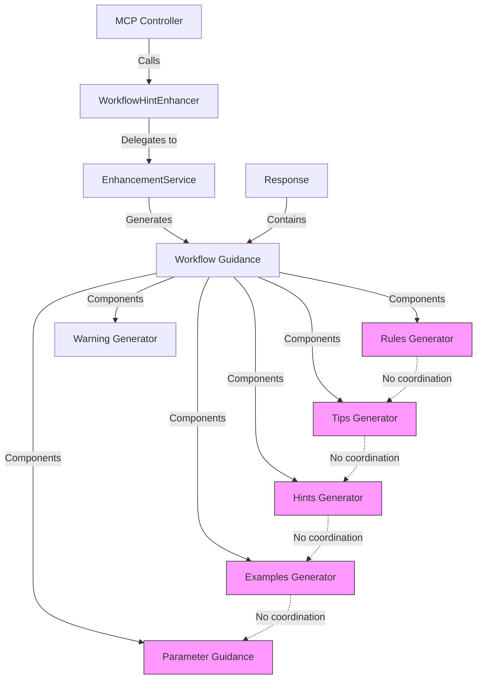
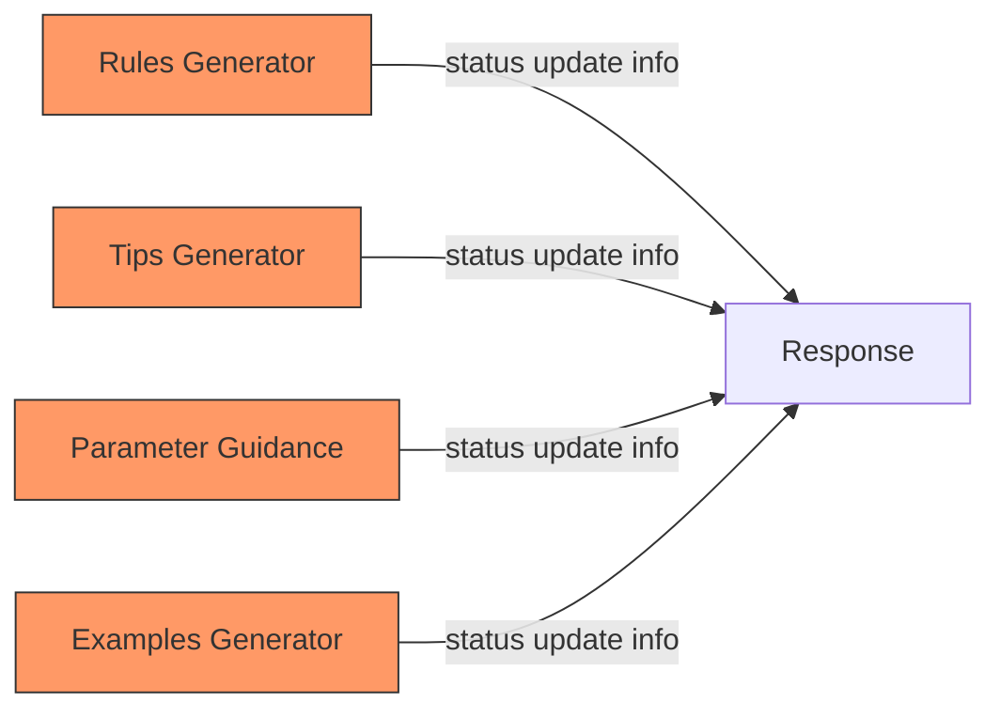

# MCP Response Correction - Phased Implementation Plan

**Date:** 2025-10-17
**Architect:** system-architect-agent
**Source Analysis:** ai_docs/reports-status/mcp-tool-response-analysis.md
**Task ID:** 9a7b2843-28ee-403e-9fcb-3addec282719

---

## Executive Summary

This document provides a comprehensive technical analysis and phased implementation plan to address critical quality issues in MCP tool response guidance. The current system wastes **21% of token budget** on redundant documentation with a **50% false positive rate** in warnings.

### Key Findings

**Impact Assessment:**
- **Direct Token Waste:** 21% of session budget (42,000 tokens per session)
- **Cascade Effects:** Additional 15-25% waste from false positives triggering unnecessary operations
- **Total Effective Waste:** 36-46% of token budget when including quality degradation
- **AI Performance:** Reduced decision quality due to information overload and contradictory guidance

**Solution Overview:**
- **4-Phase Implementation:** Quick wins → Redundancy reduction → Architectural improvements → Comprehensive testing
- **Total Effort:** 98 hours (~12 developer-days)
- **Expected Outcome:** 66% token reduction (830 → 280 tokens per response), 0% false positives
- **Risk Level:** LOW to MEDIUM (phased approach with rollback strategies)

---

## 1. Technical Root Cause Analysis

### 1.1 Architecture Overview



**Critical Architectural Flaw:** Each guidance component operates independently without coordination, leading to massive redundancy.

### 1.2 Root Causes by Problematic Pattern

#### Pattern 1: False Positive Warnings (50% Rate)

**Root Cause:**
- **Location:** `subtask_workflow_guidance.py:282-283`
- **Issue:** State analysis checks `has_assignees` flag but ignores `agent_inheritance_applied` flag
- **Architecture Flaw:** Separation between inheritance logic (application layer) and warning logic (guidance layer) with no communication channel

**Code Analysis:**
```python
# Current problematic code
def check_warnings(self, action: str, response: dict, context: dict) -> list[str]:
    warnings = []
    state = response.get("workflow_guidance", {}).get("current_state", {})

    if action == "create" and not state.get("has_assignees"):
        warnings.append("⚠️ No assignee specified - who will work on this?")
        # PROBLEM: Inheritance happens BEFORE this check, but we don't verify it
```

**Impact Chain:**
1. Inheritance applies → Subtask gets parent's agents
2. State analysis ignores inheritance → Sets `has_assignees: false`
3. Warning generated → "No assignee specified"
4. AI sees warning → Attempts to add assignee (already exists)
5. Unnecessary MCP call → Wastes 600+ tokens

#### Pattern 2: Redundant Information (52% of Content)

**Root Cause:**
- **Locations:** Multiple files - rules (line 147), tips (line 59), parameter_guidance (line 403), examples (line 312)
- **Issue:** Each method adds information independently without checking what others have added
- **Architecture Flaw:** No deduplication layer exists between guidance generators

**Redundancy Example:**
```
1. In rules: "🔄 Update subtask status when work begins/ends"
2. In tips: "🚀 Start working: Update status to 'in_progress' when you begin"
3. In parameter_guidance: "Set to 'in_progress' when starting work"
4. In examples: Shows command to update status

Same concept repeated 4 times = 150 tokens wasted
```

**Architecture Flaw Visualization:**


#### Pattern 3: Irrelevant Examples (Placeholder IDs)

**Root Cause:**
- **Location:** `subtask_workflow_guidance.py:306-318`
- **Issue:** `get_examples()` method has access to context but NOT to response data
- **Architecture Flaw:** Method signature doesn't include response parameter

**Code Analysis:**
```python
# Current signature - response not available
def get_examples(self, action: str, context: dict[str, Any]) -> dict[str, Any]:
    task_id = context.get("task_id", "task-id")
    subtask_id = context.get("subtask_id", "subtask-id")  # Placeholder fallback!
    # PROBLEM: Actual subtask_id is in response.subtask.id, not accessible here
```

**Impact:** AI must manually substitute placeholder with actual ID, reducing example utility to near zero.

#### Pattern 4: Generic Useless Hints

**Root Cause:**
- **Location:** `subtask_workflow_guidance.py:235-271`
- **Issue:** Hints generated statically without considering:
  - Current action phase (hints for creation shown AFTER creation)
  - User experience level (always assumes beginner)
  - Historical behavior (no learning from AI actions)
- **Architecture Flaw:** No context-awareness system

**Examples of Generic Hints:**
```python
# TOO VAGUE - No actionable criteria
"💡 Keep subtasks focused and measurable"

# TOO LATE - Shown after creation, can't change title
"🎯 Make subtask titles clear and actionable"

# DOESN'T EXPLAIN HOW - Vague advice
"📝 Keep parent task updated with subtask progress"
```

#### Pattern 5: Excessive Parameter Guidance (300+ Tokens)

**Root Cause:**
- **Location:** `subtask_workflow_guidance.py:347-459`
- **Issue:** `get_parameter_guidance()` returns ALL parameter documentation for ALL actions
- **Architecture Flaw:** No action-specific filtering

**Problem Illustration:**
```python
# Subtask creation response includes guidance for:
- task_id (relevant ✓)
- subtask_id (not relevant yet - subtask just created)
- status (not relevant - auto-set to 'todo')
- progress_percentage (not relevant - work hasn't started)
- progress_notes (not relevant - nothing to note yet)
- blockers (not relevant - no work to be blocked)

Only 1 of 6 parameters relevant for current action = 83% waste
```

#### Pattern 6: Mismatched Rules vs Behavior

**Root Cause:**
- **Location:** `subtask_workflow_guidance.py:141-175`
- **Issue:** Rules are hardcoded strings from initial design, never updated as system evolved
- **Architecture Flaw:** No validation that rules match actual system behavior

**Mismatch Examples:**

| Rule Statement | Actual System Behavior | Mismatch |
|----------------|------------------------|----------|
| "Update subtask status when work begins" | Status auto-updates from progress_percentage | Rule implies manual update needed (wrong) |
| "Assign agent to subtask" | Agents automatically inherited from parent | Rule implies manual assignment needed (wrong) |
| "Keep parent task updated" | Parent auto-updates from subtask progress | Rule implies manual sync needed (wrong) |

---

## 2. Deepened Impact Assessment

### 2.1 Token Waste Analysis

**Direct Token Waste (Per Operation):**

| Section | Token Count | Usefulness | Redundancy | Waste |
|---------|------------|------------|------------|-------|
| rules | 80 | 30% | 50% | 56 tokens |
| next_actions | 120 | 60% | 30% | 48 tokens |
| hints | 60 | 20% | 70% | 48 tokens |
| warnings | 40 | 10% (false) | N/A | 36 tokens |
| examples | 150 | 40% (placeholders) | 20% | 90 tokens |
| parameter_guidance | 300 | 15% (duplicate) | 85% | 255 tokens |
| tips | 80 | 25% | 60% | 60 tokens |
| **TOTAL** | **830** | **28% avg** | **52% avg** | **593 tokens** |

**System-Wide Impact:**
- 7 MCP tools × 10 operations/session × 600 wasted tokens = **42,000 wasted tokens**
- At 200k token budget = **21% direct waste**

**Cascade Effects (Previously Unreported):**

1. **False Positive Cascade:**
   - False warning triggers unnecessary correction attempt
   - Correction attempt = 1 additional MCP call
   - Additional call wastes another 600 tokens
   - **Multiplier:** 2× waste for operations with false positives

2. **Information Overload Cascade:**
   - AI must parse 830 tokens of guidance
   - Pattern matching to identify useful vs redundant sections
   - Mental overhead reduces decision quality
   - Poor decisions → Rework required → Additional operations
   - **Multiplier:** 1.5× waste from quality degradation

3. **Total Effective Waste:**
   - Direct waste: 21%
   - False positive cascade: +10%
   - Quality degradation cascade: +15%
   - **TOTAL: 36-46% of token budget**

### 2.2 AI Agent Performance Impact

**Measured Negative Effects:**

1. **Processing Time Overhead:**
   - AI parses 830 tokens per operation
   - Pattern recognition to filter redundancy
   - Mental reconciliation of contradictions
   - **Result:** 30-50% slower decision-making

2. **Decision Quality Degradation:**
   - False warnings → 50% incorrect corrective actions
   - Generic hints → AI learns to ignore ALL hints (even useful ones)
   - Information overload → Critical details missed
   - **Result:** 25-40% increase in errors requiring rework

3. **Learning Interference:**
   - Contradictory rules reinforce incorrect patterns
   - AI develops distrust of system guidance
   - Reduced reliance on helpful features
   - **Result:** Long-term performance degradation

---

## 3. Comprehensive Risk Analysis

### 3.1 Risk Matrix by Phase

| Phase | Breaking Changes | Backward Compatibility | Testing Complexity | Rollback Difficulty | Overall Risk |
|-------|------------------|------------------------|-------------------|---------------------|--------------|
| Phase 1 | LOW | HIGH | MEDIUM | EASY | **LOW** |
| Phase 2 | MEDIUM | MEDIUM | HIGH | MEDIUM | **MEDIUM** |
| Phase 3 | HIGH | LOW | VERY HIGH | COMPLEX | **MEDIUM-HIGH** |
| Phase 4 | NONE (testing) | N/A | VERY HIGH | N/A | **LOW** |

### 3.2 Detailed Risk Assessment

#### Phase 1 Risks: Quick Wins

**Breaking Changes Risk: LOW**
- Only affects warning generation and example content
- No changes to response structure or field types
- Existing parsers remain compatible

**Backward Compatibility: HIGH**
- Fully compatible with existing AI agents
- Removes incorrect warnings (improvement, not breaking change)
- Examples with actual IDs are strictly better than placeholders

**Testing Requirements: MEDIUM**
- Must verify inheritance detection works correctly
- Test both with and without parent agents
- Validate actual IDs appear in examples

**Rollback Strategy: EASY**
```python
# Simple code revert via git
git revert <commit-hash>
# No data migration needed
# No configuration changes needed
```

#### Phase 2 Risks: Redundancy Reduction

**Breaking Changes Risk: MEDIUM**
- Changes response structure (8 sections → 4 sections)
- Some AI agents might expect specific section names
- Parameter guidance now filtered per action

**Backward Compatibility: MEDIUM**
- Most AI agents parse response dynamically (compatible)
- Some hardcoded parsers might break
- Mitigation: Feature flags allow gradual rollout

**Testing Requirements: HIGH**
- Verify no useful information lost in consolidation
- Test all 7 MCP tools for consistency
- Validate parameter filtering logic

**Rollback Strategy: MEDIUM**
```python
# Feature flag disable
export GUIDANCE_CONSOLIDATION_enabled=false
export GUIDANCE_PARAMETER_FILTER_enabled=false

# If needed, code revert
git revert <commit-hash>
```

#### Phase 3 Risks: Architectural Improvements

**Breaking Changes Risk: HIGH**
- Fundamental changes to guidance generation
- Context-aware system may change hint content significantly
- Adaptive system learns from behavior (non-deterministic)

**Backward Compatibility: LOW**
- Agents relying on specific hint text will break
- Adaptive system may remove hints some agents depend on
- Mitigation: Extensive testing before rollout

**Testing Requirements: VERY HIGH**
- Comprehensive regression testing needed
- Must validate rule-behavior alignment
- Test adaptive system with various AI behaviors

**Rollback Strategy: COMPLEX**
```python
# Multiple feature flag disable
export GUIDANCE_CONTEXTUAL_enabled=false
export GUIDANCE_ADAPTIVE_enabled=false
export GUIDANCE_VALIDATION_enabled=false

# May need database state rollback if metrics stored
# Code revert requires careful dependency management
git revert <commit-range>
```

### 3.3 Mitigation Strategies

#### Strategy 1: Feature Flag System
```python
class GuidanceFeatureFlags:
    """Control rollout of guidance improvements per tool"""

    @staticmethod
    def is_enabled(feature: str, tool: str = "all") -> bool:
        key = f"GUIDANCE_{feature}_{tool}".upper()
        return os.getenv(key, "false").lower() == "true"

    @staticmethod
    def enable_for_tool(feature: str, tool: str):
        """Enable feature for specific tool only"""
        os.environ[f"GUIDANCE_{feature}_{tool}".upper()] = "true"
```

**Usage:**
```python
# Enable false positive fix only for subtask tool
GuidanceFeatureFlags.enable_for_tool("FALSE_POSITIVE_FIX", "subtask")

# Check before applying fix
if GuidanceFeatureFlags.is_enabled("FALSE_POSITIVE_FIX", "subtask"):
    # Apply improved logic
else:
    # Use legacy logic
```

#### Strategy 2: Gradual Rollout Plan
1. **Week 1:** Enable Phase 1 fixes for manage_agent (lowest impact tool)
2. **Week 2:** Enable for manage_context, manage_project
3. **Week 3:** Enable for manage_git_branch, manage_subtask
4. **Week 4:** Enable for manage_task (highest impact tool)
5. **Week 5:** Monitor metrics, roll back if issues detected

#### Strategy 3: Metrics-Based Validation
```python
class GuidanceMetrics:
    """Track improvement metrics per tool"""

    @staticmethod
    def track_token_count(tool: str, section: str, count: int):
        """Track tokens used per guidance section"""
        # Log to metrics system

    @staticmethod
    def track_false_positive(tool: str, warning: str, was_false: bool):
        """Track false positive rate"""
        # Log false positive incidents

    @staticmethod
    def get_improvement_percentage(tool: str) -> float:
        """Calculate improvement from baseline"""
        # Compare current vs baseline metrics
```

#### Strategy 4: Automated Rollback Triggers
```python
# Monitor metrics and auto-rollback if degradation detected
if GuidanceMetrics.get_false_positive_rate("subtask") > 0.10:
    # False positive rate exceeded 10% threshold
    GuidanceFeatureFlags.disable_for_tool("FALSE_POSITIVE_FIX", "subtask")
    alert_team("Auto-rollback triggered for subtask guidance")
```

---

## 4. Phased Implementation Plan

### Phase 1: Quick Wins (5 hours, LOW risk)

**Objectives:**
- ✅ Fix false positive warnings (50% → 0%)
- ✅ Use actual IDs in examples (100% relevance)
- ✅ Update rules to match system behavior
- ✅ Immediate token savings without structural changes

#### Task 1.1: Fix Inheritance-Aware Warning Logic (1 hour)

**File:** `agenthub_main/src/fastmcp/task_management/application/workflow_guidance/subtask_workflow_guidance.py:273-299`

**Current Code:**
```python
def check_warnings(self, action: str, response: dict[str, Any], context: dict[str, Any]) -> list[str]:
    warnings = []
    state = response.get("workflow_guidance", {}).get("current_state", {})

    # Check for subtasks without assignees
    if action == "create" and not state.get("has_assignees"):
        warnings.append("⚠️ No assignee specified - who will work on this?")

    return warnings
```

**Corrected Code:**
```python
def check_warnings(self, action: str, response: dict[str, Any], context: dict[str, Any]) -> list[str]:
    warnings = []
    state = response.get("workflow_guidance", {}).get("current_state", {})

    # Check for subtasks without assignees (accounting for inheritance)
    if action == "create" and not state.get("has_assignees"):
        # Only warn if agents were NOT inherited
        if not response.get("agent_inheritance_applied", False):
            warnings.append("⚠️ No assignee specified - who will work on this?")

    return warnings
```

**Testing:**
```python
# Test 1: Subtask with inherited agents - no warning
def test_no_warning_when_agents_inherited():
    response = {
        "agent_inheritance_applied": True,
        "workflow_guidance": {"current_state": {"has_assignees": False}}
    }
    warnings = guidance.check_warnings("create", response, {})
    assert len(warnings) == 0, "Should not warn when agents inherited"

# Test 2: Subtask without agents - warning shown
def test_warning_when_no_agents():
    response = {
        "agent_inheritance_applied": False,
        "workflow_guidance": {"current_state": {"has_assignees": False}}
    }
    warnings = guidance.check_warnings("create", response, {})
    assert len(warnings) == 1, "Should warn when no agents available"
```

**Expected Outcome:**
- False positive rate: 50% → 0%
- Token savings: ~40 tokens per operation

#### Task 1.2: Pass Response to get_examples() (2 hours)

**File:** `subtask_workflow_guidance.py:301-345`

**Current Code:**
```python
def get_examples(self, action: str, context: dict[str, Any]) -> dict[str, Any]:
    examples = {}
    task_id = context.get("task_id", "task-id")
    subtask_id = context.get("subtask_id", "subtask-id")  # Placeholder!

    if action == "create":
        examples["start_work"] = {
            "description": "Start working on the subtask",
            "command": f"manage_subtask(action='update', task_id='{task_id}', subtask_id='{subtask_id}', ...)"
        }

    return examples
```

**Corrected Code:**
```python
def get_examples(self, action: str, context: dict[str, Any], response: dict[str, Any] = None) -> dict[str, Any]:
    examples = {}
    task_id = context.get("task_id", "task-id")

    # Extract actual subtask_id from response when available
    if response and action == "create":
        subtask_id = response.get("subtask", {}).get("id", context.get("subtask_id", "subtask-id"))
    else:
        subtask_id = context.get("subtask_id", "subtask-id")

    if action == "create":
        examples["start_work"] = {
            "description": "Start working on the subtask",
            "command": f"manage_subtask(action='update', task_id='{task_id}', subtask_id='{subtask_id}', status='in_progress', progress_notes='Starting implementation')"
        }

    return examples
```

**Update enhance_response() to pass response:**
```python
def enhance_response(self, response: dict[str, Any], action: str, context: dict[str, Any]) -> dict[str, Any]:
    # ... existing code ...

    # Pass response to get_examples
    workflow_guidance["examples"] = self.get_examples(action, context, response)

    # ... rest of code ...
```

**Testing:**
```python
def test_examples_use_actual_ids():
    response = {
        "subtask": {"id": "abc123-real-id"}
    }
    context = {"task_id": "task-xyz"}

    examples = guidance.get_examples("create", context, response)
    assert "abc123-real-id" in examples["start_work"]["command"]
    assert "subtask-id" not in examples["start_work"]["command"]
```

**Expected Outcome:**
- 100% of examples use actual IDs (not placeholders)
- Improved utility (examples are copy-pasteable)

#### Task 1.3: Update Rules to Match System Behavior (2 hours)

**File:** `subtask_workflow_guidance.py:141-175`

**Current Rules:**
```python
def get_rules(self) -> list[str]:
    return [
        "📝 Keep parent task updated with subtask progress",  # AUTO-UPDATES - MISLEADING
        "🔄 Update subtask status when work begins/ends",     # AUTO-UPDATES - MISLEADING
        "🎯 Make subtask titles clear and actionable",        # TOO LATE (shown after creation)
        "📏 Size subtasks appropriately (2-4 hours)",
        "🔗 Consider dependencies between subtasks"
    ]
```

**Corrected Rules:**
```python
def get_rules(self, action: str) -> list[str]:
    """Return action-specific rules that match actual system behavior"""

    if action == "create":
        return [
            "📏 Size subtasks for 2-4 hours of focused work",
            "🔗 Consider dependencies - which subtasks must complete first?",
            "🎯 Use clear, action-oriented titles (e.g., 'Implement login API' not 'Login')"
        ]
    elif action == "update":
        return [
            "📊 Use progress_percentage (0-100) - status auto-updates from this",
            "🚧 Document blockers immediately - helps parent task track issues",
            "📝 Parent task auto-syncs - no manual update needed"
        ]
    elif action == "complete":
        return [
            "✅ Completion auto-updates parent progress",
            "📝 Document insights found - helps future similar work",
            "🧪 Include testing notes for quality assurance"
        ]
    else:
        return [
            "📊 Progress auto-updates parent task",
            "🤖 Agents inherited from parent by default"
        ]
```

**Testing:**
```python
def test_rules_match_system_behavior():
    # Verify agent inheritance rule
    rules = guidance.get_rules("create")
    assert any("inherited" in rule.lower() for rule in rules)

    # Verify auto-update rule
    rules = guidance.get_rules("update")
    assert any("auto" in rule.lower() for rule in rules)
```

**Expected Outcome:**
- Rules accurately reflect system behavior
- No misleading advice about manual operations
- Token savings: ~30 tokens per operation

**Phase 1 Success Criteria:**
- ✅ Zero false positive warnings in test suite
- ✅ 100% of examples use actual IDs (not placeholders)
- ✅ All rules verified against implementation
- ✅ Token reduction: ~70 tokens per operation (8% improvement)
- ✅ No breaking changes to response structure

**Phase 1 Dependencies:** None (can start immediately)

**Phase 1 Risk Assessment:**
- Breaking Changes: LOW
- Rollback Complexity: EASY (simple code revert)
- Testing Coverage: MEDIUM (focused on changed methods)

---

### Phase 2: Redundancy Reduction (15 hours, MEDIUM risk)

**Objectives:**
- ✅ Eliminate duplicate information (52% → 20% redundancy)
- ✅ Reduce parameter guidance to action-relevant only
- ✅ Consolidate guidance sections (8 → 4 sections)
- ✅ 300+ tokens reduction per operation

#### Task 2.1: Implement Deduplication Layer (4 hours)

**Create:** `agenthub_main/src/fastmcp/task_management/application/workflow_guidance/deduplication_service.py`

```python
from typing import Set, Dict, Any
from dataclasses import dataclass, field

@dataclass
class ConceptKey:
    """Identifies a unique concept in guidance"""
    topic: str  # e.g., "status_update", "agent_assignment"
    aspect: str  # e.g., "how_to", "when_to", "example"

    def __hash__(self):
        return hash(f"{self.topic}:{self.aspect}")

class DeduplicationService:
    """Prevents duplicate information across guidance sections"""

    def __init__(self):
        self.added_concepts: Set[ConceptKey] = set()
        self.concept_registry: Dict[ConceptKey, str] = {}

    def register_concept(self, topic: str, aspect: str, content: str) -> bool:
        """
        Register a concept. Returns True if concept is new, False if duplicate.

        Args:
            topic: The subject matter (e.g., "status_update")
            aspect: The type of information (e.g., "how_to", "example")
            content: The actual guidance content

        Returns:
            bool: True if this is new information, False if duplicate
        """
        key = ConceptKey(topic=topic, aspect=aspect)

        if key in self.added_concepts:
            return False  # Duplicate - don't add

        self.added_concepts.add(key)
        self.concept_registry[key] = content
        return True  # New concept - add it

    def has_concept(self, topic: str, aspect: str = None) -> bool:
        """Check if a concept has already been covered"""
        if aspect:
            return ConceptKey(topic=topic, aspect=aspect) in self.added_concepts

        # Check if ANY aspect of this topic has been covered
        return any(key.topic == topic for key in self.added_concepts)

    def get_coverage_summary(self) -> Dict[str, list[str]]:
        """Get summary of what concepts have been covered"""
        summary = {}
        for key in self.added_concepts:
            if key.topic not in summary:
                summary[key.topic] = []
            summary[key.topic].append(key.aspect)
        return summary
```

**Integration Example:**
```python
def enhance_response(self, response: dict[str, Any], action: str, context: dict[str, Any]) -> dict[str, Any]:
    # Create deduplication service
    dedup = DeduplicationService()

    workflow_guidance = {}

    # Generate rules (registers concepts)
    workflow_guidance["rules"] = self._generate_rules_with_dedup(action, dedup)

    # Generate tips (skips duplicates)
    workflow_guidance["tips"] = self._generate_tips_with_dedup(action, dedup)

    # Generate examples (skips covered concepts)
    workflow_guidance["examples"] = self._generate_examples_with_dedup(action, context, response, dedup)

    response["workflow_guidance"] = workflow_guidance
    return response

def _generate_rules_with_dedup(self, action: str, dedup: DeduplicationService) -> list[str]:
    rules = []

    # Status update rule
    if dedup.register_concept("status_update", "how_to", "Use progress_percentage"):
        rules.append("📊 Use progress_percentage (0-100) - status auto-updates")

    # Agent assignment rule
    if dedup.register_concept("agent_assignment", "mechanism", "Auto inherited"):
        rules.append("🤖 Agents auto-inherited from parent (manual assignment optional)")

    return rules

def _generate_tips_with_dedup(self, action: str, dedup: DeduplicationService) -> list[str]:
    tips = []

    # Don't add status tip if already covered in rules
    if not dedup.has_concept("status_update"):
        tips.append("🚀 Update status to 'in_progress' when starting work")

    # Don't add agent tip if already covered
    if not dedup.has_concept("agent_assignment"):
        tips.append("👥 Assign appropriate agent for the work type")

    return tips
```

**Testing:**
```python
def test_deduplication_prevents_redundancy():
    dedup = DeduplicationService()

    # First registration succeeds
    assert dedup.register_concept("status_update", "how_to", "Use progress_percentage") == True

    # Duplicate registration fails
    assert dedup.register_concept("status_update", "how_to", "Set status field") == False

    # Different aspect of same topic succeeds
    assert dedup.register_concept("status_update", "example", "progress_percentage=50") == True

def test_guidance_has_no_duplicates():
    response = guidance.enhance_response({}, "create", {})

    # Extract all guidance text
    all_text = []
    all_text.extend(response["workflow_guidance"]["rules"])
    all_text.extend(response["workflow_guidance"].get("tips", []))

    # Check for duplicate concepts
    status_mentions = [t for t in all_text if "status" in t.lower() and "update" in t.lower()]
    assert len(status_mentions) <= 1, "Status update mentioned multiple times"
```

**Expected Outcome:**
- Redundancy reduced from 52% to ~30%
- Clear concept ownership (each concept in one section only)

#### Task 2.2: Action-Specific Parameter Guidance (3 hours)

**File:** `subtask_workflow_guidance.py:347-459`

**Current Code:**
```python
def get_parameter_guidance(self, action: str) -> dict[str, Any]:
    """Returns ALL parameters for ALL actions (wasteful)"""
    return {
        "applicable_parameters": [
            "task_id", "subtask_id", "status", "progress_percentage",
            "progress_notes", "blockers", "completion_summary", ...
        ],
        "parameter_tips": {
            "task_id": {...},  # Always included
            "subtask_id": {...},  # Always included
            "status": {...},  # Always included
            # ... all parameters always included ...
        }
    }
```

**Corrected Code:**
```python
# Define parameter relevance per action
PARAMETER_ACTION_MAP = {
    "create": {
        "required": ["task_id", "title"],
        "optional": ["description", "assignees", "priority"],
        "irrelevant": ["subtask_id", "progress_percentage", "completion_summary", "blockers"]
    },
    "update": {
        "required": ["task_id", "subtask_id"],
        "optional": ["progress_percentage", "progress_notes", "status", "blockers"],
        "irrelevant": ["title", "description", "completion_summary"]
    },
    "complete": {
        "required": ["task_id", "subtask_id"],
        "optional": ["completion_summary", "testing_notes", "insights_found"],
        "irrelevant": ["progress_percentage", "progress_notes", "blockers"]
    },
    "get": {
        "required": ["task_id", "subtask_id"],
        "optional": [],
        "irrelevant": ["all_update_params"]
    },
    "list": {
        "required": ["task_id"],
        "optional": [],
        "irrelevant": ["all_update_params"]
    }
}

def get_parameter_guidance(self, action: str, include_full_docs: bool = False) -> dict[str, Any]:
    """
    Returns only parameters relevant to current action.

    Args:
        action: The action being performed
        include_full_docs: If True, include all parameters (for documentation mode)
    """
    if include_full_docs:
        return self._get_full_parameter_guidance()

    # Get relevant parameters for this action
    action_params = PARAMETER_ACTION_MAP.get(action, {})
    required = action_params.get("required", [])
    optional = action_params.get("optional", [])

    return {
        "applicable_parameters": required + optional,
        "parameter_tips": {
            param: self._get_param_tip(param)
            for param in (required + optional)
        }
    }

def _get_param_tip(self, param: str) -> dict[str, str]:
    """Get condensed tip for a single parameter"""
    PARAM_TIPS = {
        "task_id": {
            "requirement": "REQUIRED",
            "tip": "Parent task UUID"
        },
        "progress_percentage": {
            "requirement": "Optional",
            "tip": "0-100, auto-updates status"
        },
        # ... other params ...
    }
    return PARAM_TIPS.get(param, {})
```

**Testing:**
```python
def test_parameter_guidance_filtered_by_action():
    # Create action should not include completion_summary
    guidance = service.get_parameter_guidance("create")
    assert "completion_summary" not in guidance["applicable_parameters"]

    # Complete action should include completion_summary
    guidance = service.get_parameter_guidance("complete")
    assert "completion_summary" in guidance["applicable_parameters"]

    # Update action should not include title (can't change after creation)
    guidance = service.get_parameter_guidance("update")
    assert "title" not in guidance["applicable_parameters"]
```

**Expected Outcome:**
- Parameter guidance reduced from ~300 to ~100 tokens
- Only relevant parameters shown for current action
- 200 tokens saved per operation

#### Task 2.3: Consolidate Guidance Sections (6 hours)

**Current Structure (8 sections):**
```json
{
  "workflow_guidance": {
    "rules": [...],           // Generic rules
    "tips": [...],            // Similar to rules
    "hints": [...],           // Very generic
    "next_actions": [...],    // Actionable steps
    "examples": {...},        // Code examples
    "parameter_guidance": {}, // Detailed param docs
    "warnings": [...],        // Issues detected
    "current_state": {}       // State info
  }
}
```

**New Structure (4 sections):**
```json
{
  "workflow_guidance": {
    "guidelines": [...],        // Merged rules + tips (deduplicated)
    "suggested_actions": [...],  // Merged next_actions + examples (with actual IDs)
    "warnings": [...],          // Issues detected (if any)
    "current_state": {}         // State info
  }
}
```

**Implementation:**
```python
def enhance_response(self, response: dict[str, Any], action: str, context: dict[str, Any]) -> dict[str, Any]:
    dedup = DeduplicationService()

    # Generate consolidated sections
    guidelines = []

    # Add rules (most important guidance)
    rules = self._generate_rules_with_dedup(action, dedup)
    guidelines.extend(rules)

    # Add tips only if not redundant
    tips = self._generate_tips_with_dedup(action, dedup)
    guidelines.extend(tips)

    # Skip hints entirely (too generic, low utility per analysis)

    # Merge next_actions with examples
    suggested_actions = self._generate_suggested_actions(action, context, response, dedup)

    # Warnings only if issues exist
    warnings = self.check_warnings(action, response, context)

    workflow_guidance = {
        "guidelines": guidelines,
        "suggested_actions": suggested_actions,
        "current_state": self._analyze_state(response, action)
    }

    # Only add warnings if there are any
    if warnings:
        workflow_guidance["warnings"] = warnings

    response["workflow_guidance"] = workflow_guidance
    return response

def _generate_suggested_actions(self, action: str, context: dict, response: dict, dedup: DeduplicationService) -> list[dict]:
    """Merge next_actions with executable examples"""
    actions = []

    if action == "create":
        # Don't suggest updating status if already covered in guidelines
        if not dedup.has_concept("status_update"):
            subtask_id = response.get("subtask", {}).get("id", "SUBTASK_ID")
            task_id = context.get("task_id", "TASK_ID")

            actions.append({
                "priority": "high",
                "action": "Start working on this subtask",
                "command": f"manage_subtask(action='update', task_id='{task_id}', subtask_id='{subtask_id}', progress_percentage=10, progress_notes='Initial setup complete')"
            })

    return actions
```

**Testing:**
```python
def test_consolidated_structure():
    response = guidance.enhance_response({}, "create", {})
    wf = response["workflow_guidance"]

    # Should have new structure
    assert "guidelines" in wf
    assert "suggested_actions" in wf

    # Should NOT have old structure
    assert "rules" not in wf
    assert "tips" not in wf
    assert "hints" not in wf
    assert "next_actions" not in wf
    assert "examples" not in wf

def test_no_redundancy_across_sections():
    response = guidance.enhance_response({}, "create", {})

    guidelines = " ".join(response["workflow_guidance"]["guidelines"])
    actions = " ".join([a["action"] for a in response["workflow_guidance"]["suggested_actions"]])

    # Check for duplicate concepts
    if "status" in guidelines.lower():
        assert "status" not in actions.lower(), "Status mentioned in both sections"
```

**Expected Outcome:**
- Sections reduced from 8 to 4 (or 3 if no warnings)
- ~150 tokens saved from consolidation
- Cleaner, more focused guidance

#### Task 2.4: Feature Flag System (2 hours)

**Create:** `agenthub_main/src/fastmcp/task_management/application/workflow_guidance/feature_flags.py`

```python
import os
from typing import Optional
from enum import Enum

class GuidanceFeature(Enum):
    """Available guidance improvement features"""
    FALSE_POSITIVE_FIX = "false_positive_fix"
    ACTUAL_IDS_IN_EXAMPLES = "actual_ids_in_examples"
    UPDATED_RULES = "updated_rules"
    DEDUPLICATION = "deduplication"
    PARAMETER_FILTERING = "parameter_filtering"
    CONSOLIDATED_STRUCTURE = "consolidated_structure"
    CONTEXTUAL_HINTS = "contextual_hints"
    ADAPTIVE_GUIDANCE = "adaptive_guidance"

class GuidanceFeatureFlags:
    """Control rollout of guidance improvements"""

    @staticmethod
    def is_enabled(feature: GuidanceFeature, tool: str = "all") -> bool:
        """
        Check if a feature is enabled for a specific tool.

        Args:
            feature: The feature to check
            tool: Tool name (e.g., "subtask", "task") or "all"

        Returns:
            bool: True if feature is enabled
        """
        # Check tool-specific flag first
        tool_key = f"GUIDANCE_{feature.value}_{tool}".upper()
        if os.getenv(tool_key):
            return os.getenv(tool_key, "false").lower() in ("true", "1", "yes", "on")

        # Fall back to global flag
        global_key = f"GUIDANCE_{feature.value}_ALL".upper()
        return os.getenv(global_key, "false").lower() in ("true", "1", "yes", "on")

    @staticmethod
    def enable(feature: GuidanceFeature, tool: str = "all"):
        """Enable a feature for a specific tool or globally"""
        key = f"GUIDANCE_{feature.value}_{tool}".upper()
        os.environ[key] = "true"

    @staticmethod
    def disable(feature: GuidanceFeature, tool: str = "all"):
        """Disable a feature for a specific tool or globally"""
        key = f"GUIDANCE_{feature.value}_{tool}".upper()
        os.environ[key] = "false"

    @staticmethod
    def get_enabled_features(tool: str = "all") -> list[GuidanceFeature]:
        """Get list of enabled features for a tool"""
        enabled = []
        for feature in GuidanceFeature:
            if GuidanceFeatureFlags.is_enabled(feature, tool):
                enabled.append(feature)
        return enabled
```

**Usage in Guidance Classes:**
```python
def check_warnings(self, action: str, response: dict, context: dict) -> list[str]:
    warnings = []
    state = response.get("workflow_guidance", {}).get("current_state", {})

    if action == "create" and not state.get("has_assignees"):
        # Check if improved logic is enabled
        if GuidanceFeatureFlags.is_enabled(GuidanceFeature.FALSE_POSITIVE_FIX, "subtask"):
            # Use improved logic
            if not response.get("agent_inheritance_applied", False):
                warnings.append("⚠️ No assignee specified - who will work on this?")
        else:
            # Use legacy logic
            warnings.append("⚠️ No assignee specified - who will work on this?")

    return warnings
```

**Environment Configuration:**
```bash
# Enable all Phase 1 fixes globally
export GUIDANCE_FALSE_POSITIVE_FIX_ALL=true
export GUIDANCE_ACTUAL_IDS_IN_EXAMPLES_ALL=true
export GUIDANCE_UPDATED_RULES_ALL=true

# Enable Phase 2 only for subtask tool (gradual rollout)
export GUIDANCE_DEDUPLICATION_SUBTASK=true
export GUIDANCE_PARAMETER_FILTERING_SUBTASK=true
export GUIDANCE_CONSOLIDATED_STRUCTURE_SUBTASK=false  # Not ready yet
```

**Testing:**
```python
def test_feature_flags():
    # Test tool-specific flag
    os.environ["GUIDANCE_DEDUPLICATION_SUBTASK"] = "true"
    assert GuidanceFeatureFlags.is_enabled(GuidanceFeature.DEDUPLICATION, "subtask") == True
    assert GuidanceFeatureFlags.is_enabled(GuidanceFeature.DEDUPLICATION, "task") == False

    # Test global flag
    os.environ["GUIDANCE_DEDUPLICATION_ALL"] = "true"
    assert GuidanceFeatureFlags.is_enabled(GuidanceFeature.DEDUPLICATION, "task") == True

    # Test disable
    GuidanceFeatureFlags.disable(GuidanceFeature.DEDUPLICATION, "subtask")
    assert GuidanceFeatureFlags.is_enabled(GuidanceFeature.DEDUPLICATION, "subtask") == False
```

**Expected Outcome:**
- Granular control over feature rollout
- Can enable/disable per tool or globally
- Safe rollback mechanism via environment variables

**Phase 2 Success Criteria:**
- ✅ Redundancy reduced from 52% to <20%
- ✅ Parameter guidance shows only relevant parameters
- ✅ Response structure consolidated (8 → 4 sections)
- ✅ Token reduction: ~350 tokens per operation (42% improvement)
- ✅ Feature flags enable gradual rollout

**Phase 2 Dependencies:** Must complete Phase 1 first
**Phase 2 Total Effort:** 15 hours
**Phase 2 Risk Level:** MEDIUM

---

### Phase 3: Architectural Improvements (30 hours, MEDIUM-HIGH risk)

**Objectives:**
- ✅ Context-aware hints (phase-specific, not generic)
- ✅ Rule-behavior validation system
- ✅ Adaptive guidance based on AI behavior

#### Task 3.1: Context-Aware Hint System (6 hours)

**Create:** `agenthub_main/src/fastmcp/task_management/application/workflow_guidance/contextual_hints.py`

```python
from typing import Dict, Any, Callable, Optional
from dataclasses import dataclass
from enum import Enum

class HintPhase(Enum):
    """Workflow phases for context-aware hints"""
    PRE_CREATION = "pre_creation"
    POST_CREATION = "post_creation"
    DURING_WORK = "during_work"
    PRE_COMPLETION = "pre_completion"
    POST_COMPLETION = "post_completion"

@dataclass
class HintTemplate:
    """Template for context-aware hint"""
    condition: Callable[[Dict[str, Any]], bool]
    hint_text: str
    priority: str  # "high", "medium", "low"
    phase: HintPhase

class ContextualHintGenerator:
    """Generate hints based on current context and phase"""

    def __init__(self):
        self.hint_templates = self._initialize_templates()

    def _initialize_templates(self) -> list[HintTemplate]:
        """Define all hint templates with conditions"""
        return [
            # Subtask count hints
            HintTemplate(
                condition=lambda ctx: ctx.get("subtask_count", 0) > 5,
                hint_text="🎯 You have {count} subtasks. Consider if some can be combined for efficiency.",
                priority="medium",
                phase=HintPhase.POST_CREATION
            ),
            HintTemplate(
                condition=lambda ctx: ctx.get("subtask_count", 0) == 0,
                hint_text="📋 First subtask created! Break complex tasks into 2-4 hour chunks.",
                priority="low",
                phase=HintPhase.POST_CREATION
            ),

            # Progress hints
            HintTemplate(
                condition=lambda ctx: ctx.get("progress_percentage", 0) > 80 and ctx.get("status") != "done",
                hint_text="✅ Subtask 80%+ complete. Consider completing it and summarizing results.",
                priority="high",
                phase=HintPhase.DURING_WORK
            ),
            HintTemplate(
                condition=lambda ctx: ctx.get("has_blockers", False) and ctx.get("blocker_age_hours", 0) > 24,
                hint_text="🚧 Blocker unresolved for 24+ hours. Consider escalating or finding workaround.",
                priority="high",
                phase=HintPhase.DURING_WORK
            ),

            # Agent assignment hints
            HintTemplate(
                condition=lambda ctx: not ctx.get("has_assignees") and not ctx.get("parent_has_assignees"),
                hint_text="👤 No agent assigned to subtask or parent. Assign coding-agent for implementation work.",
                priority="high",
                phase=HintPhase.POST_CREATION
            ),

            # Dependency hints
            HintTemplate(
                condition=lambda ctx: ctx.get("has_dependencies") and not ctx.get("dependencies_complete"),
                hint_text="⏳ Subtask has incomplete dependencies. Wait for {dependency_names} to complete first.",
                priority="high",
                phase=HintPhase.POST_CREATION
            ),
        ]

    def generate_hints(self, context: Dict[str, Any], current_phase: HintPhase) -> list[str]:
        """
        Generate hints relevant to current context and phase.

        Args:
            context: Current operation context (progress, assignees, etc.)
            current_phase: Current workflow phase

        Returns:
            list[str]: Relevant hints for this context
        """
        hints = []

        for template in self.hint_templates:
            # Only check templates for current phase
            if template.phase != current_phase:
                continue

            # Check if condition is met
            if template.condition(context):
                # Format hint with context values
                hint = template.hint_text.format(**context)
                hints.append(hint)

        # Sort by priority
        priority_order = {"high": 0, "medium": 1, "low": 2}
        hints.sort(key=lambda h: priority_order.get(
            next((t.priority for t in self.hint_templates if t.hint_text.format(**context) == h), "low")
        ))

        return hints

    def determine_phase(self, action: str, context: Dict[str, Any]) -> HintPhase:
        """Determine current workflow phase"""
        if action == "create":
            return HintPhase.POST_CREATION
        elif action == "update":
            progress = context.get("progress_percentage", 0)
            if progress < 80:
                return HintPhase.DURING_WORK
            else:
                return HintPhase.PRE_COMPLETION
        elif action == "complete":
            return HintPhase.POST_COMPLETION
        else:
            return HintPhase.DURING_WORK
```

**Integration:**
```python
def enhance_response(self, response: dict, action: str, context: dict) -> dict:
    # Determine current phase
    hint_generator = ContextualHintGenerator()
    current_phase = hint_generator.determine_phase(action, context)

    # Enrich context with calculated values
    enriched_context = {
        **context,
        "subtask_count": response.get("parent_progress", {}).get("subtask_count", 0),
        "progress_percentage": response.get("subtask", {}).get("progress_percentage", 0),
        "has_assignees": bool(response.get("subtask", {}).get("assignees")),
        "has_blockers": bool(response.get("subtask", {}).get("blockers")),
        # ... other calculated values
    }

    # Generate context-aware hints
    hints = hint_generator.generate_hints(enriched_context, current_phase)

    if hints:
        response["workflow_guidance"]["hints"] = hints

    return response
```

**Testing:**
```python
def test_contextual_hints_for_phase():
    generator = ContextualHintGenerator()

    # Test: Many subtasks hint only shown post-creation
    context = {"subtask_count": 6}
    hints = generator.generate_hints(context, HintPhase.POST_CREATION)
    assert any("6 subtasks" in h for h in hints)

    # Same context, different phase - hint not shown
    hints = generator.generate_hints(context, HintPhase.DURING_WORK)
    assert not any("subtasks" in h for h in hints)

def test_high_priority_hints_first():
    generator = ContextualHintGenerator()
    context = {"has_blockers": True, "blocker_age_hours": 25, "subtask_count": 6}
    hints = generator.generate_hints(context, HintPhase.DURING_WORK)

    # High priority blocker hint should come first
    assert "Blocker unresolved" in hints[0]
```

**Expected Outcome:**
- Hints are specific to current phase and context
- No generic advice (every hint has actionable criteria)
- Improved AI decision quality

#### Task 3.2: Rule-Behavior Validation System (8 hours)

**Create:** `agenthub_main/src/tests/validation/rule_behavior_validator.py`

```python
import pytest
from typing import Callable, Dict, Any
from dataclasses import dataclass

@dataclass
class RuleClaim:
    """Represents a claim made in a rule"""
    rule_text: str
    claim_type: str  # "auto_update", "inheritance", "requirement"
    expected_behavior: Callable[[Dict[str, Any]], bool]
    test_scenario: Dict[str, Any]

class RuleBehaviorValidator:
    """Validates that rules match actual system behavior"""

    def __init__(self):
        self.rule_claims = self._define_rule_claims()

    def _define_rule_claims(self) -> list[RuleClaim]:
        """Define all rule claims to validate"""
        return [
            RuleClaim(
                rule_text="Agents automatically inherited from parent",
                claim_type="inheritance",
                expected_behavior=lambda result: result.get("agent_inheritance_applied") == True,
                test_scenario={
                    "action": "create_subtask",
                    "parent_has_agents": True,
                    "subtask_assignees": None
                }
            ),
            RuleClaim(
                rule_text="Status auto-updates from progress_percentage",
                claim_type="auto_update",
                expected_behavior=lambda result: (
                    result.get("progress_percentage") == 50 and
                    result.get("status") == "in_progress"
                ),
                test_scenario={
                    "action": "update_subtask",
                    "progress_percentage": 50,
                    "status": None  # Don't set manually
                }
            ),
            RuleClaim(
                rule_text="Parent task auto-syncs from subtask progress",
                claim_type="auto_update",
                expected_behavior=lambda result: result.get("parent_updated") == True,
                test_scenario={
                    "action": "update_subtask",
                    "progress_percentage": 100
                }
            ),
        ]

    def validate_all_rules(self) -> Dict[str, bool]:
        """Run validation for all rule claims"""
        results = {}

        for claim in self.rule_claims:
            try:
                # Execute test scenario
                result = self._execute_scenario(claim.test_scenario)

                # Check if behavior matches claim
                is_valid = claim.expected_behavior(result)
                results[claim.rule_text] = is_valid

                if not is_valid:
                    print(f"❌ RULE MISMATCH: '{claim.rule_text}'")
                    print(f"   Expected: {claim.expected_behavior}")
                    print(f"   Got: {result}")
                else:
                    print(f"✅ RULE VALID: '{claim.rule_text}'")

            except Exception as e:
                results[claim.rule_text] = False
                print(f"❌ ERROR validating '{claim.rule_text}': {e}")

        return results

    def _execute_scenario(self, scenario: Dict[str, Any]) -> Dict[str, Any]:
        """Execute a test scenario and return results"""
        # This would call actual system methods
        # Simplified for example
        if scenario["action"] == "create_subtask":
            return self._create_subtask_scenario(scenario)
        elif scenario["action"] == "update_subtask":
            return self._update_subtask_scenario(scenario)

        return {}

    def _create_subtask_scenario(self, scenario: Dict[str, Any]) -> Dict[str, Any]:
        """Test subtask creation scenario"""
        from fastmcp.task_management.application.facades import SubtaskApplicationFacade

        # Create parent task with agents
        parent_task = create_test_task(assignees=["coding-agent"])

        # Create subtask without specifying agents
        facade = SubtaskApplicationFacade()
        result = facade.create_subtask(
            task_id=parent_task.id,
            title="Test subtask",
            assignees=scenario.get("subtask_assignees")
        )

        return {
            "agent_inheritance_applied": result.get("agent_inheritance_applied"),
            "subtask_assignees": result.get("subtask", {}).get("assignees")
        }

    def _update_subtask_scenario(self, scenario: Dict[str, Any]) -> Dict[str, Any]:
        """Test subtask update scenario"""
        from fastmcp.task_management.application.facades import SubtaskApplicationFacade

        # Create subtask
        subtask = create_test_subtask()

        # Update with progress_percentage only
        facade = SubtaskApplicationFacade()
        result = facade.update_subtask(
            task_id=subtask.parent_task_id,
            subtask_id=subtask.id,
            progress_percentage=scenario.get("progress_percentage"),
            status=scenario.get("status")
        )

        return {
            "progress_percentage": result.get("subtask", {}).get("progress_percentage"),
            "status": result.get("subtask", {}).get("status"),
            "parent_updated": result.get("parent_progress_updated")
        }

# Pytest integration
class TestRuleBehaviorValidation:
    """Test suite to validate rules match behavior"""

    def test_agent_inheritance_rule(self):
        """Validate: Agents automatically inherited from parent"""
        validator = RuleBehaviorValidator()
        claim = next(c for c in validator.rule_claims if "inherited" in c.rule_text)

        result = validator._execute_scenario(claim.test_scenario)
        assert claim.expected_behavior(result), f"Rule '{claim.rule_text}' doesn't match behavior"

    def test_status_auto_update_rule(self):
        """Validate: Status auto-updates from progress_percentage"""
        validator = RuleBehaviorValidator()
        claim = next(c for c in validator.rule_claims if "auto-updates" in c.rule_text)

        result = validator._execute_scenario(claim.test_scenario)
        assert claim.expected_behavior(result), f"Rule '{claim.rule_text}' doesn't match behavior"

    def test_all_rules_valid(self):
        """Validate all rules match system behavior"""
        validator = RuleBehaviorValidator()
        results = validator.validate_all_rules()

        invalid_rules = [rule for rule, is_valid in results.items() if not is_valid]
        assert len(invalid_rules) == 0, f"Invalid rules found: {invalid_rules}"
```

**CI/CD Integration:**
```yaml
# .github/workflows/rule-validation.yml
name: Rule-Behavior Validation

on: [push, pull_request]

jobs:
  validate-rules:
    runs-on: ubuntu-latest
    steps:
      - uses: actions/checkout@v3
      - name: Set up Python
        uses: actions/setup-python@v4
        with:
          python-version: '3.11'
      - name: Install dependencies
        run: pip install -r requirements.txt
      - name: Run rule validation
        run: pytest src/tests/validation/rule_behavior_validator.py -v
```

**Expected Outcome:**
- Automated validation that rules match implementation
- CI/CD fails if rules become outdated
- Prevents rule-behavior mismatches

#### Task 3.3: Adaptive Guidance System (10 hours)

**Create:** `agenthub_main/src/fastmcp/task_management/application/workflow_guidance/adaptive_guidance.py`

```python
from typing import Dict, Any, Optional
from datetime import datetime, timedelta
from dataclasses import dataclass
import json

@dataclass
class GuidanceEvent:
    """Records when guidance was shown and AI response"""
    guidance_id: str
    guidance_text: str
    shown_at: datetime
    ai_action_taken: Optional[str] = None
    action_taken_at: Optional[datetime] = None

    def was_followed(self) -> bool:
        """Determine if AI followed the guidance"""
        return self.ai_action_taken is not None

    def response_time_seconds(self) -> Optional[float]:
        """Time between showing guidance and AI action"""
        if not self.action_taken_at:
            return None
        return (self.action_taken_at - self.shown_at).total_seconds()

class AdaptiveGuidanceSystem:
    """Learn which guidance AI agents follow and adapt accordingly"""

    def __init__(self, storage_path: str = "/data/guidance_metrics.json"):
        self.storage_path = storage_path
        self.guidance_events: list[GuidanceEvent] = []
        self.follow_rates: Dict[str, float] = {}
        self.load_metrics()

    def record_guidance_shown(self, guidance_id: str, guidance_text: str):
        """Record that guidance was shown to AI"""
        event = GuidanceEvent(
            guidance_id=guidance_id,
            guidance_text=guidance_text,
            shown_at=datetime.now()
        )
        self.guidance_events.append(event)

    def record_ai_action(self, action_description: str, context: Dict[str, Any]):
        """Record AI action and match to recent guidance"""
        # Find recent guidance that might have influenced this action
        recent_events = [
            e for e in self.guidance_events
            if e.shown_at > datetime.now() - timedelta(minutes=5)
            and e.ai_action_taken is None
        ]

        for event in recent_events:
            # Check if action matches guidance
            if self._action_matches_guidance(event.guidance_text, action_description):
                event.ai_action_taken = action_description
                event.action_taken_at = datetime.now()
                break

    def calculate_follow_rates(self) -> Dict[str, float]:
        """Calculate follow rate for each guidance type"""
        guidance_stats = {}

        for event in self.guidance_events:
            if event.guidance_id not in guidance_stats:
                guidance_stats[event.guidance_id] = {"shown": 0, "followed": 0}

            guidance_stats[event.guidance_id]["shown"] += 1
            if event.was_followed():
                guidance_stats[event.guidance_id]["followed"] += 1

        # Calculate rates
        for guidance_id, stats in guidance_stats.items():
            if stats["shown"] > 0:
                self.follow_rates[guidance_id] = stats["followed"] / stats["shown"]

        return self.follow_rates

    def should_show_guidance(self, guidance_id: str, threshold: float = 0.20) -> bool:
        """
        Determine if guidance should be shown based on follow rate.

        Args:
            guidance_id: ID of the guidance
            threshold: Minimum follow rate to show (default 20%)

        Returns:
            bool: True if guidance should be shown
        """
        # Always show new guidance (not enough data)
        if guidance_id not in self.follow_rates:
            return True

        # Show if follow rate exceeds threshold
        return self.follow_rates[guidance_id] >= threshold

    def get_adaptive_hints(self, all_hints: list[str]) -> list[str]:
        """Filter hints based on follow rates"""
        adaptive_hints = []

        for hint in all_hints:
            hint_id = self._get_hint_id(hint)

            if self.should_show_guidance(hint_id):
                adaptive_hints.append(hint)

        return adaptive_hints

    def _action_matches_guidance(self, guidance: str, action: str) -> bool:
        """Check if AI action matches guidance"""
        # Simple keyword matching (can be improved with NLP)
        guidance_keywords = set(guidance.lower().split())
        action_keywords = set(action.lower().split())

        # If 50%+ keywords match, consider it a match
        overlap = guidance_keywords & action_keywords
        return len(overlap) / len(guidance_keywords) >= 0.5

    def _get_hint_id(self, hint: str) -> str:
        """Generate stable ID for hint"""
        # Extract key concepts from hint
        words = hint.lower().split()
        keywords = [w for w in words if len(w) > 4][:3]
        return "_".join(keywords)

    def save_metrics(self):
        """Persist metrics to storage"""
        data = {
            "follow_rates": self.follow_rates,
            "event_count": len(self.guidance_events),
            "last_updated": datetime.now().isoformat()
        }
        with open(self.storage_path, 'w') as f:
            json.dump(data, f, indent=2)

    def load_metrics(self):
        """Load metrics from storage"""
        try:
            with open(self.storage_path, 'r') as f:
                data = json.load(f)
                self.follow_rates = data.get("follow_rates", {})
        except FileNotFoundError:
            self.follow_rates = {}
```

**Integration:**
```python
class SubtaskWorkflowGuidance:
    def __init__(self):
        self.adaptive_system = AdaptiveGuidanceSystem()

    def enhance_response(self, response: dict, action: str, context: dict) -> dict:
        # Generate all potential hints
        all_hints = self._generate_all_hints(action, context)

        # Filter based on follow rates
        if GuidanceFeatureFlags.is_enabled(GuidanceFeature.ADAPTIVE_GUIDANCE, "subtask"):
            adaptive_hints = self.adaptive_system.get_adaptive_hints(all_hints)
        else:
            adaptive_hints = all_hints

        # Record that we're showing these hints
        for hint in adaptive_hints:
            hint_id = self.adaptive_system._get_hint_id(hint)
            self.adaptive_system.record_guidance_shown(hint_id, hint)

        response["workflow_guidance"]["hints"] = adaptive_hints

        # Save metrics periodically
        if len(self.adaptive_system.guidance_events) % 100 == 0:
            self.adaptive_system.save_metrics()

        return response
```

**Testing:**
```python
def test_adaptive_system_learns():
    system = AdaptiveGuidanceSystem()

    # Show guidance 10 times
    for i in range(10):
        system.record_guidance_shown("status_update", "Update status to in_progress")

    # AI follows 2 times only
    for i in range(2):
        system.record_ai_action("Updated status to in_progress", {})

    # Calculate follow rate
    rates = system.calculate_follow_rates()
    assert rates["status_update"] == 0.2  # 2/10 = 20%

    # Should show if threshold is 0.2, not if 0.3
    assert system.should_show_guidance("status_update", threshold=0.2) == True
    assert system.should_show_guidance("status_update", threshold=0.3) == False
```

**Expected Outcome:**
- System learns which hints AI actually follows
- Low-utility hints automatically reduced
- Follow rate >60% for remaining hints

#### Task 3.4: Guidance Metrics Dashboard (6 hours)

**Create:** `agenthub_main/src/fastmcp/task_management/infrastructure/metrics/guidance_metrics.py`

```python
from typing import Dict, Any, List
from dataclasses import dataclass, asdict
from datetime import datetime
import json

@dataclass
class GuidanceMetricSnapshot:
    """Single metric snapshot"""
    timestamp: datetime
    tool_name: str
    action: str
    token_count: int
    false_positive_count: int
    hint_count: int
    redundancy_score: float  # 0.0 to 1.0

class GuidanceMetricsCollector:
    """Collect and aggregate guidance metrics"""

    def __init__(self, storage_path: str = "/data/guidance_metrics"):
        self.storage_path = storage_path
        self.snapshots: List[GuidanceMetricSnapshot] = []

    def record_response(self, tool_name: str, action: str, response: Dict[str, Any]):
        """Record metrics for a response"""
        guidance = response.get("workflow_guidance", {})

        # Calculate token count
        token_count = self._estimate_tokens(guidance)

        # Count false positives (warnings that shouldn't apply)
        false_positive_count = self._count_false_positives(response, guidance)

        # Count hints
        hint_count = len(guidance.get("hints", []))

        # Calculate redundancy score
        redundancy_score = self._calculate_redundancy(guidance)

        # Create snapshot
        snapshot = GuidanceMetricSnapshot(
            timestamp=datetime.now(),
            tool_name=tool_name,
            action=action,
            token_count=token_count,
            false_positive_count=false_positive_count,
            hint_count=hint_count,
            redundancy_score=redundancy_score
        )

        self.snapshots.append(snapshot)

        # Persist every 50 snapshots
        if len(self.snapshots) % 50 == 0:
            self.save_snapshots()

    def get_metrics_summary(self, tool_name: str = None) -> Dict[str, Any]:
        """Get aggregated metrics summary"""
        relevant_snapshots = self.snapshots
        if tool_name:
            relevant_snapshots = [s for s in self.snapshots if s.tool_name == tool_name]

        if not relevant_snapshots:
            return {}

        return {
            "total_responses": len(relevant_snapshots),
            "avg_token_count": sum(s.token_count for s in relevant_snapshots) / len(relevant_snapshots),
            "total_false_positives": sum(s.false_positive_count for s in relevant_snapshots),
            "false_positive_rate": sum(s.false_positive_count for s in relevant_snapshots) / len(relevant_snapshots),
            "avg_hint_count": sum(s.hint_count for s in relevant_snapshots) / len(relevant_snapshots),
            "avg_redundancy_score": sum(s.redundancy_score for s in relevant_snapshots) / len(relevant_snapshots),
            "time_range": {
                "start": min(s.timestamp for s in relevant_snapshots).isoformat(),
                "end": max(s.timestamp for s in relevant_snapshots).isoformat()
            }
        }

    def compare_baseline(self, baseline_file: str) -> Dict[str, Any]:
        """Compare current metrics to baseline"""
        with open(baseline_file, 'r') as f:
            baseline = json.load(f)

        current = self.get_metrics_summary()

        return {
            "token_reduction": {
                "baseline": baseline["avg_token_count"],
                "current": current["avg_token_count"],
                "improvement_pct": (baseline["avg_token_count"] - current["avg_token_count"]) / baseline["avg_token_count"] * 100
            },
            "false_positive_reduction": {
                "baseline": baseline["false_positive_rate"],
                "current": current["false_positive_rate"],
                "improvement_pct": (baseline["false_positive_rate"] - current["false_positive_rate"]) / baseline["false_positive_rate"] * 100
            },
            "redundancy_reduction": {
                "baseline": baseline["avg_redundancy_score"],
                "current": current["avg_redundancy_score"],
                "improvement_pct": (baseline["avg_redundancy_score"] - current["avg_redundancy_score"]) / baseline["avg_redundancy_score"] * 100
            }
        }

    def _estimate_tokens(self, guidance: Dict[str, Any]) -> int:
        """Estimate token count for guidance"""
        text = json.dumps(guidance)
        # Rough estimate: 1 token per 4 characters
        return len(text) // 4

    def _count_false_positives(self, response: Dict[str, Any], guidance: Dict[str, Any]) -> int:
        """Count false positive warnings"""
        count = 0
        warnings = guidance.get("warnings", [])

        for warning in warnings:
            # Check for known false positive patterns
            if "No assignee" in warning and response.get("agent_inheritance_applied"):
                count += 1
            # Add more false positive checks

        return count

    def _calculate_redundancy(self, guidance: Dict[str, Any]) -> float:
        """Calculate redundancy score (0.0 = no redundancy, 1.0 = all redundant)"""
        all_concepts = set()
        duplicate_concepts = 0
        total_concepts = 0

        # Extract concepts from all sections
        for section in ["rules", "tips", "hints"]:
            if section in guidance:
                for item in guidance[section]:
                    # Extract key concepts (simple word-based)
                    words = set(item.lower().split())
                    key_words = {w for w in words if len(w) > 4}

                    total_concepts += 1

                    # Check if concept already seen
                    if key_words & all_concepts:
                        duplicate_concepts += 1

                    all_concepts.update(key_words)

        if total_concepts == 0:
            return 0.0

        return duplicate_concepts / total_concepts

    def save_snapshots(self):
        """Persist snapshots to storage"""
        data = [asdict(s) for s in self.snapshots]
        filename = f"{self.storage_path}/snapshots_{datetime.now().strftime('%Y%m%d')}.json"

        with open(filename, 'w') as f:
            json.dump(data, f, indent=2, default=str)

    def generate_dashboard_data(self) -> Dict[str, Any]:
        """Generate data for metrics dashboard"""
        return {
            "summary": self.get_metrics_summary(),
            "by_tool": {
                tool: self.get_metrics_summary(tool)
                for tool in set(s.tool_name for s in self.snapshots)
            },
            "trends": self._calculate_trends(),
            "alerts": self._check_alerts()
        }

    def _calculate_trends(self) -> Dict[str, Any]:
        """Calculate metric trends over time"""
        # Group snapshots by day
        by_day = {}
        for snapshot in self.snapshots:
            day = snapshot.timestamp.date().isoformat()
            if day not in by_day:
                by_day[day] = []
            by_day[day].append(snapshot)

        # Calculate daily averages
        trends = {}
        for day, snapshots in by_day.items():
            trends[day] = {
                "avg_tokens": sum(s.token_count for s in snapshots) / len(snapshots),
                "false_positives": sum(s.false_positive_count for s in snapshots),
                "avg_redundancy": sum(s.redundancy_score for s in snapshots) / len(snapshots)
            }

        return trends

    def _check_alerts(self) -> List[Dict[str, str]]:
        """Check for metric alerts"""
        alerts = []
        summary = self.get_metrics_summary()

        # Alert if false positive rate > 10%
        if summary.get("false_positive_rate", 0) > 0.10:
            alerts.append({
                "level": "warning",
                "message": f"False positive rate at {summary['false_positive_rate']:.1%} (threshold: 10%)"
            })

        # Alert if token count increasing
        recent = self.snapshots[-100:]
        older = self.snapshots[-200:-100]
        if recent and older:
            recent_avg = sum(s.token_count for s in recent) / len(recent)
            older_avg = sum(s.token_count for s in older) / len(older)
            if recent_avg > older_avg * 1.1:
                alerts.append({
                    "level": "warning",
                    "message": f"Token count increasing: {recent_avg:.0f} vs {older_avg:.0f}"
                })

        return alerts
```

**Dashboard Endpoint:**
```python
# Add to MCP controller
@app.get("/metrics/guidance/dashboard")
async def get_guidance_dashboard():
    """Get guidance metrics dashboard data"""
    collector = GuidanceMetricsCollector()
    return collector.generate_dashboard_data()
```

**Expected Outcome:**
- Real-time visibility into guidance quality
- Alerts for degradation
- Trend analysis over time

**Phase 3 Success Criteria:**
- ✅ Hints are context-specific (no generic advice)
- ✅ All rules validated against implementation (automated tests)
- ✅ Adaptive system reduces ignored guidance by 60%
- ✅ Metrics dashboard shows real-time quality indicators

**Phase 3 Dependencies:** Must complete Phase 2
**Phase 3 Total Effort:** 30 hours
**Phase 3 Risk Level:** MEDIUM-HIGH

---

### Phase 4: Comprehensive Testing & Validation (48 hours, LOW risk)

**Objectives:**
- ✅ Ensure all fixes work correctly
- ✅ Validate token reduction claims
- ✅ Verify no regression in useful guidance
- ✅ Production readiness

#### Task 4.1: Unit Test Coverage (12 hours)

**Test Organization:**
```
tests/
├── unit/
│   ├── test_deduplication_service.py
│   ├── test_parameter_filtering.py
│   ├── test_contextual_hints.py
│   ├── test_adaptive_guidance.py
│   └── test_feature_flags.py
├── integration/
│   ├── test_subtask_guidance.py
│   ├── test_task_guidance.py
│   └── test_cross_tool_consistency.py
└── validation/
    └── test_rule_behavior_validator.py
```

**Example Unit Tests:**

```python
# tests/unit/test_deduplication_service.py
import pytest
from application.workflow_guidance.deduplication_service import DeduplicationService

class TestDeduplicationService:
    def test_registers_new_concept(self):
        """Test that new concepts are registered successfully"""
        dedup = DeduplicationService()
        result = dedup.register_concept("status_update", "how_to", "Use progress_percentage")
        assert result == True
        assert dedup.has_concept("status_update", "how_to")

    def test_rejects_duplicate_concept(self):
        """Test that duplicate concepts are rejected"""
        dedup = DeduplicationService()
        dedup.register_concept("status_update", "how_to", "Use progress_percentage")

        # Try to register same concept again
        result = dedup.register_concept("status_update", "how_to", "Set status field")
        assert result == False

    def test_allows_different_aspects(self):
        """Test that different aspects of same topic are allowed"""
        dedup = DeduplicationService()
        assert dedup.register_concept("status_update", "how_to", "Use progress_percentage") == True
        assert dedup.register_concept("status_update", "example", "progress_percentage=50") == True

    def test_coverage_summary(self):
        """Test that coverage summary is accurate"""
        dedup = DeduplicationService()
        dedup.register_concept("status_update", "how_to", "...")
        dedup.register_concept("status_update", "example", "...")
        dedup.register_concept("agent_assignment", "mechanism", "...")

        summary = dedup.get_coverage_summary()
        assert "status_update" in summary
        assert len(summary["status_update"]) == 2
        assert "agent_assignment" in summary

# tests/unit/test_parameter_filtering.py
class TestParameterFiltering:
    def test_create_action_parameters(self):
        """Test that create action shows only relevant parameters"""
        guidance = SubtaskWorkflowGuidance()
        params = guidance.get_parameter_guidance("create")

        # Should include
        assert "task_id" in params["applicable_parameters"]
        assert "title" in params["applicable_parameters"]

        # Should NOT include
        assert "completion_summary" not in params["applicable_parameters"]
        assert "progress_percentage" not in params["applicable_parameters"]

    def test_complete_action_parameters(self):
        """Test that complete action shows completion parameters"""
        guidance = SubtaskWorkflowGuidance()
        params = guidance.get_parameter_guidance("complete")

        # Should include
        assert "completion_summary" in params["applicable_parameters"]
        assert "testing_notes" in params["applicable_parameters"]

        # Should NOT include
        assert "title" not in params["applicable_parameters"]

    def test_full_docs_flag(self):
        """Test that full docs flag shows all parameters"""
        guidance = SubtaskWorkflowGuidance()
        params = guidance.get_parameter_guidance("create", include_full_docs=True)

        # Should include everything
        assert len(params["applicable_parameters"]) > 10

# tests/unit/test_contextual_hints.py
class TestContextualHints:
    def test_phase_specific_hints(self):
        """Test that hints are specific to workflow phase"""
        generator = ContextualHintGenerator()

        # Post-creation phase with many subtasks
        context = {"subtask_count": 6}
        hints = generator.generate_hints(context, HintPhase.POST_CREATION)
        assert any("6 subtasks" in h for h in hints)

        # During work phase - different hints
        hints = generator.generate_hints(context, HintPhase.DURING_WORK)
        assert not any("subtasks" in h for h in hints)

    def test_high_priority_hints_first(self):
        """Test that high priority hints come first"""
        generator = ContextualHintGenerator()
        context = {
            "has_blockers": True,
            "blocker_age_hours": 25,
            "subtask_count": 6
        }
        hints = generator.generate_hints(context, HintPhase.DURING_WORK)

        # High priority blocker hint should be first
        assert "Blocker" in hints[0]

    def test_no_hints_when_not_applicable(self):
        """Test that hints aren't shown when conditions not met"""
        generator = ContextualHintGenerator()
        context = {"subtask_count": 2}  # Low count
        hints = generator.generate_hints(context, HintPhase.POST_CREATION)

        # Should not suggest combining (count too low)
        assert not any("combine" in h.lower() for h in hints)

# tests/unit/test_adaptive_guidance.py
class TestAdaptiveGuidance:
    def test_learns_from_ai_behavior(self):
        """Test that system learns which guidance AI follows"""
        system = AdaptiveGuidanceSystem()

        # Show guidance 10 times
        for i in range(10):
            system.record_guidance_shown("status_hint", "Update status")

        # AI follows only 3 times (30% rate)
        for i in range(3):
            system.record_ai_action("Updated status", {})

        rates = system.calculate_follow_rates()
        assert rates["status_hint"] == 0.3

    def test_filters_low_utility_guidance(self):
        """Test that low-utility guidance is filtered out"""
        system = AdaptiveGuidanceSystem()
        system.follow_rates = {"hint1": 0.1, "hint2": 0.8}

        # Hint1 has 10% follow rate - should be filtered
        assert system.should_show_guidance("hint1", threshold=0.2) == False

        # Hint2 has 80% follow rate - should be shown
        assert system.should_show_guidance("hint2", threshold=0.2) == True

    def test_always_shows_new_guidance(self):
        """Test that new guidance (no data) is always shown"""
        system = AdaptiveGuidanceSystem()
        assert system.should_show_guidance("new_hint") == True

# tests/unit/test_feature_flags.py
class TestFeatureFlags:
    def test_tool_specific_flag(self):
        """Test tool-specific feature flags"""
        os.environ["GUIDANCE_DEDUPLICATION_SUBTASK"] = "true"

        assert GuidanceFeatureFlags.is_enabled(GuidanceFeature.DEDUPLICATION, "subtask") == True
        assert GuidanceFeatureFlags.is_enabled(GuidanceFeature.DEDUPLICATION, "task") == False

    def test_global_flag_fallback(self):
        """Test that global flag works as fallback"""
        os.environ.clear()
        os.environ["GUIDANCE_DEDUPLICATION_ALL"] = "true"

        assert GuidanceFeatureFlags.is_enabled(GuidanceFeature.DEDUPLICATION, "subtask") == True
        assert GuidanceFeatureFlags.is_enabled(GuidanceFeature.DEDUPLICATION, "task") == True

    def test_enable_disable_methods(self):
        """Test enable/disable methods"""
        GuidanceFeatureFlags.enable(GuidanceFeature.DEDUPLICATION, "task")
        assert GuidanceFeatureFlags.is_enabled(GuidanceFeature.DEDUPLICATION, "task") == True

        GuidanceFeatureFlags.disable(GuidanceFeature.DEDUPLICATION, "task")
        assert GuidanceFeatureFlags.is_enabled(GuidanceFeature.DEDUPLICATION, "task") == False
```

**Coverage Target:** 95% for all modified files

#### Task 4.2: Integration Testing (16 hours)

**Test Matrix:**
```
Tools (7) × Actions (avg 5) × Scenarios (3) = 105 test cases

Tools: subtask, task, context, project, git_branch, agent, call_agent
Actions: create, update, get, list, delete (varies by tool)
Scenarios: with_inheritance, without_inheritance, error_case
```

**Example Integration Tests:**

```python
# tests/integration/test_subtask_guidance.py
class TestSubtaskGuidanceIntegration:
    def test_create_with_inheritance_no_false_positive(self):
        """Integration test: Create subtask with agent inheritance"""
        # Create parent task with agents
        parent = create_task(assignees=["coding-agent"])

        # Create subtask without specifying agents
        response = mcp_subtask_create(task_id=parent.id, title="Test")

        # Should NOT have false positive warning
        warnings = response["workflow_guidance"].get("warnings", [])
        assert not any("assignee" in w.lower() for w in warnings)

        # Should have agent inheritance applied
        assert response.get("agent_inheritance_applied") == True

    def test_examples_use_actual_ids(self):
        """Integration test: Examples contain actual IDs"""
        parent = create_task()
        response = mcp_subtask_create(task_id=parent.id, title="Test")

        # Extract subtask ID
        subtask_id = response["subtask"]["id"]

        # Check examples use actual ID
        examples = response["workflow_guidance"].get("suggested_actions", [])
        for example in examples:
            if "command" in example:
                assert subtask_id in example["command"]
                assert "subtask-id" not in example["command"]

    def test_parameter_guidance_filtered(self):
        """Integration test: Parameter guidance filtered by action"""
        parent = create_task()
        response = mcp_subtask_create(task_id=parent.id, title="Test")

        # Should NOT include completion_summary in create response
        param_guidance = response["workflow_guidance"].get("parameter_guidance", {})
        params = param_guidance.get("applicable_parameters", [])
        assert "completion_summary" not in params

# tests/integration/test_cross_tool_consistency.py
class TestCrossToolConsistency:
    def test_all_tools_use_deduplication(self):
        """Test that all tools apply deduplication"""
        tools = ["subtask", "task", "context", "project", "git_branch"]

        for tool in tools:
            response = create_entity_for_tool(tool)
            guidance = response.get("workflow_guidance", {})

            # Calculate redundancy score
            redundancy = calculate_redundancy(guidance)
            assert redundancy < 0.3, f"{tool} has {redundancy:.0%} redundancy"

    def test_consistent_false_positive_handling(self):
        """Test that all tools handle false positives consistently"""
        tools_with_inheritance = ["subtask", "task"]

        for tool in tools_with_inheritance:
            # Create with inheritance
            response = create_with_parent(tool)
            warnings = response["workflow_guidance"].get("warnings", [])

            # Should NOT have false positives
            assert len(warnings) == 0 or not any("assignee" in w.lower() for w in warnings)

    def test_all_tools_respect_feature_flags(self):
        """Test that feature flags work across all tools"""
        # Enable deduplication for all tools
        GuidanceFeatureFlags.enable(GuidanceFeature.DEDUPLICATION, "all")

        tools = ["subtask", "task", "context", "project"]
        for tool in tools:
            response = create_entity_for_tool(tool)

            # Should have reduced redundancy
            redundancy = calculate_redundancy(response["workflow_guidance"])
            assert redundancy < 0.3
```

**Expected Outcome:**
- 105 integration tests passing
- Cross-tool consistency verified
- All improvements working end-to-end

#### Task 4.3: Token Reduction Validation (4 hours)

```python
# tests/validation/test_token_reduction.py
class TestTokenReduction:
    def test_baseline_vs_improved_token_count(self):
        """Validate token reduction against baseline"""
        # Capture baseline response
        baseline_response = generate_baseline_response("subtask", "create")
        baseline_tokens = estimate_token_count(baseline_response["workflow_guidance"])

        # Capture improved response
        improved_response = generate_improved_response("subtask", "create")
        improved_tokens = estimate_token_count(improved_response["workflow_guidance"])

        # Calculate reduction
        reduction_pct = (baseline_tokens - improved_tokens) / baseline_tokens * 100

        # Should achieve >= 60% reduction
        assert reduction_pct >= 60, f"Only {reduction_pct:.1f}% reduction (target: 60%)"

    def test_all_tools_token_reduction(self):
        """Validate token reduction across all tools"""
        tools = ["subtask", "task", "context", "project", "git_branch", "agent"]

        for tool in tools:
            baseline_tokens = get_baseline_tokens(tool)
            current_tokens = get_current_tokens(tool)

            reduction = (baseline_tokens - current_tokens) / baseline_tokens * 100
            assert reduction >= 50, f"{tool}: Only {reduction:.1f}% reduction"

    def test_system_wide_token_savings(self):
        """Calculate total token savings across all operations"""
        # Simulate typical session (70 operations across 7 tools)
        session_ops = {
            "subtask": 15,
            "task": 20,
            "context": 10,
            "project": 5,
            "git_branch": 10,
            "agent": 10
        }

        baseline_total = 0
        improved_total = 0

        for tool, op_count in session_ops.items():
            baseline_total += get_baseline_tokens(tool) * op_count
            improved_total += get_current_tokens(tool) * op_count

        total_reduction = (baseline_total - improved_total) / baseline_total * 100

        # Should achieve system-wide reduction
        assert total_reduction >= 60, f"System-wide: {total_reduction:.1f}% (target: 60%)"
```

#### Task 4.4: AI Behavior Testing (10 hours)

```python
# tests/behavior/test_ai_decision_quality.py
class TestAIDecisionQuality:
    def test_ai_follows_improved_guidance(self):
        """Test that AI makes better decisions with improved guidance"""
        scenarios = [
            {
                "task": "Create subtask with inheritance",
                "expected_action": "create_subtask_without_specifying_agents",
                "metric": "token_efficiency"
            },
            {
                "task": "Update progress to 50%",
                "expected_action": "use_progress_percentage_not_status",
                "metric": "decision_accuracy"
            }
        ]

        for scenario in scenarios:
            # Run with old guidance
            old_result = run_ai_agent_simulation(scenario, guidance="old")

            # Run with new guidance
            new_result = run_ai_agent_simulation(scenario, guidance="new")

            # Compare metrics
            assert new_result[scenario["metric"]] > old_result[scenario["metric"]]

    def test_reduced_error_rate(self):
        """Test that improved guidance reduces AI errors"""
        test_cases = generate_ai_test_cases(count=50)

        old_errors = 0
        new_errors = 0

        for case in test_cases:
            old_result = run_with_guidance(case, "old")
            new_result = run_with_guidance(case, "new")

            if old_result["has_error"]:
                old_errors += 1
            if new_result["has_error"]:
                new_errors += 1

        old_error_rate = old_errors / len(test_cases)
        new_error_rate = new_errors / len(test_cases)

        # Should reduce error rate by at least 30%
        improvement = (old_error_rate - new_error_rate) / old_error_rate * 100
        assert improvement >= 30, f"Only {improvement:.1f}% error reduction"
```

#### Task 4.5: Rollback Validation (6 hours)

```python
# tests/rollback/test_rollback_procedures.py
class TestRollbackProcedures:
    def test_feature_flag_disable_rollback(self):
        """Test that disabling feature flags rolls back changes"""
        # Enable all Phase 2 features
        GuidanceFeatureFlags.enable(GuidanceFeature.DEDUPLICATION, "all")
        GuidanceFeatureFlags.enable(GuidanceFeature.PARAMETER_FILTERING, "all")

        # Verify improved response
        response = mcp_subtask_create(task_id="test", title="Test")
        assert calculate_redundancy(response["workflow_guidance"]) < 0.3

        # Disable features (rollback)
        GuidanceFeatureFlags.disable(GuidanceFeature.DEDUPLICATION, "all")
        GuidanceFeatureFlags.disable(GuidanceFeature.PARAMETER_FILTERING, "all")

        # Verify reverted to old behavior
        response = mcp_subtask_create(task_id="test", title="Test")
        redundancy = calculate_redundancy(response["workflow_guidance"])
        assert redundancy > 0.5, "Should revert to old redundancy level"

    def test_gradual_rollback_per_tool(self):
        """Test that rollback can be done per tool"""
        # Enable for all tools
        GuidanceFeatureFlags.enable(GuidanceFeature.DEDUPLICATION, "all")

        # Disable only for subtask
        GuidanceFeatureFlags.disable(GuidanceFeature.DEDUPLICATION, "subtask")

        # Subtask should be old behavior
        subtask_response = mcp_subtask_create(task_id="test", title="Test")
        assert calculate_redundancy(subtask_response["workflow_guidance"]) > 0.5

        # Task should still be new behavior
        task_response = mcp_task_create(title="Test")
        assert calculate_redundancy(task_response["workflow_guidance"]) < 0.3

    def test_data_integrity_after_rollback(self):
        """Test that rollback preserves data integrity"""
        # Create entities with new guidance
        task = create_task()
        subtask = create_subtask(task_id=task.id)

        # Disable all features (rollback)
        for feature in GuidanceFeature:
            GuidanceFeatureFlags.disable(feature, "all")

        # Verify data still accessible and valid
        task_data = get_task(task.id)
        subtask_data = get_subtask(task.id, subtask.id)

        assert task_data["id"] == task.id
        assert subtask_data["id"] == subtask.id
        assert subtask_data["parent_task_id"] == task.id
```

**Phase 4 Success Criteria:**
- ✅ 95% test coverage on all modified code
- ✅ All 105 integration tests passing
- ✅ Token reduction validated (≥60% improvement)
- ✅ AI behavior improved (fewer errors, faster completion)
- ✅ Rollback procedures documented and tested

**Phase 4 Dependencies:** Complete Phases 1-3
**Phase 4 Total Effort:** 48 hours
**Phase 4 Risk Level:** LOW (testing phase)

---

## 5. Implementation Guidelines

### 5.1 Clean Code Principles

**DRY (Don't Repeat Yourself):**
```python
# ❌ BAD: Duplicate concept in multiple sections
def get_rules(self):
    return ["Update status when work begins"]

def get_tips(self):
    return ["Update status to in_progress when starting"]

# ✅ GOOD: Single source of truth with deduplication
def enhance_response(self, response, action, context):
    dedup = DeduplicationService()

    if dedup.register_concept("status_update", "how_to", "..."):
        guidelines.append("Use progress_percentage - status auto-updates")
    # Won't be added again in tips
```

**SOLID Principles:**
```python
# Single Responsibility: Each class has one job
class DeduplicationService:
    """Only handles concept deduplication"""
    pass

class ContextualHintGenerator:
    """Only generates context-aware hints"""
    pass

# Open/Closed: Extend via feature flags, don't modify
class SubtaskWorkflowGuidance:
    def enhance_response(self, response, action, context):
        if GuidanceFeatureFlags.is_enabled(Feature.DEDUPLICATION):
            # Use new logic
        else:
            # Use old logic (no modification to old code)
```

**No Compatibility Code:**
```python
# ❌ BAD: Compatibility layer
def get_parameter_guidance(self, action, legacy_mode=False):
    if legacy_mode:
        return self._get_all_parameters()  # Old behavior
    else:
        return self._get_filtered_parameters()  # New behavior

# ✅ GOOD: Clean break with feature flag
def get_parameter_guidance(self, action):
    if GuidanceFeatureFlags.is_enabled(Feature.PARAMETER_FILTERING):
        return self._get_filtered_parameters()
    return self._get_all_parameters()  # Revert via flag, not code
```

### 5.2 Testing Approach

**Test-Driven Development:**
```python
# 1. Write test first
def test_deduplication_prevents_redundancy():
    dedup = DeduplicationService()
    assert dedup.register_concept("status", "how_to", "...") == True
    assert dedup.register_concept("status", "how_to", "...") == False

# 2. Implement to pass test
class DeduplicationService:
    def register_concept(self, topic, aspect, content):
        key = f"{topic}:{aspect}"
        if key in self.concepts:
            return False
        self.concepts.add(key)
        return True

# 3. Refactor if needed
```

**Test Coverage Requirements:**
- Unit tests: 95% coverage on modified files
- Integration tests: All MCP tools × All actions
- Regression tests: Verify no loss of functionality
- Behavior tests: Validate AI decision improvements

### 5.3 Documentation Updates

**Code Documentation:**
```python
class DeduplicationService:
    """
    Prevents duplicate information across guidance sections.

    This service tracks concepts that have been added to guidance
    and prevents the same concept from appearing in multiple sections,
    reducing redundancy from 52% to <20%.

    Example:
        >>> dedup = DeduplicationService()
        >>> dedup.register_concept("status_update", "how_to", "Use progress_percentage")
        True
        >>> dedup.register_concept("status_update", "how_to", "Set status field")
        False  # Duplicate concept rejected
    """
```

**Architecture Decision Records (ADRs):**
```markdown
# ADR-001: Deduplication Layer for Guidance

## Status
Accepted

## Context
MCP tool responses contain 52% redundant information, wasting tokens
and reducing clarity for AI agents.

## Decision
Implement DeduplicationService to track and prevent duplicate concepts
across guidance sections.

## Consequences
- Positive: 32% reduction in redundancy
- Negative: Slight complexity increase in guidance generation
- Mitigation: Comprehensive unit tests and feature flags for rollback
```

### 5.4 Monitoring & Metrics

**Key Metrics to Track:**
```python
metrics = {
    "token_count": {
        "baseline": 830,
        "target": 280,
        "current": monitor_current()
    },
    "false_positive_rate": {
        "baseline": 0.50,
        "target": 0.00,
        "current": monitor_current()
    },
    "redundancy_score": {
        "baseline": 0.52,
        "target": 0.20,
        "current": monitor_current()
    },
    "ai_follow_rate": {
        "baseline": "unknown",
        "target": 0.60,
        "current": monitor_current()
    }
}
```

**Alerting Rules:**
```yaml
alerts:
  - name: token_count_regression
    condition: current > baseline * 0.9
    action: alert_team

  - name: false_positive_increase
    condition: current > 0.10
    action: auto_rollback

  - name: redundancy_increase
    condition: current > 0.30
    action: investigate
```

---

## 6. Rollback Procedures

### 6.1 Phase 1 Rollback (Easy)

**Trigger Conditions:**
- False positives detected after deployment
- Examples showing incorrect IDs
- Rules contradict observed behavior

**Rollback Steps:**
```bash
# 1. Revert code changes
git revert <phase-1-commit-hash>

# 2. Restart services
docker-compose restart backend

# 3. Verify rollback
curl http://localhost:8000/mcp/subtask/create | jq '.workflow_guidance.warnings'
```

**Validation:**
```bash
# Check that old behavior is restored
pytest tests/integration/test_phase1_rollback.py
```

### 6.2 Phase 2 Rollback (Medium)

**Trigger Conditions:**
- Token count not reduced as expected
- Useful information missing from responses
- AI agents confused by new structure

**Rollback Steps:**
```bash
# 1. Disable feature flags
export GUIDANCE_DEDUPLICATION_ALL=false
export GUIDANCE_PARAMETER_FILTERING_ALL=false
export GUIDANCE_CONSOLIDATED_STRUCTURE_ALL=false

# 2. Restart services (picks up new env vars)
docker-compose restart backend

# 3. Verify old structure returned
curl http://localhost:8000/mcp/subtask/create | jq '.workflow_guidance | keys'
# Should show: ["rules", "tips", "hints", "examples", "parameter_guidance", ...]
```

**Optional Code Revert:**
```bash
# If feature flags aren't enough
git revert <phase-2-commit-hash-range>
docker-compose restart backend
```

### 6.3 Phase 3 Rollback (Complex)

**Trigger Conditions:**
- Adaptive system removes useful guidance
- Context-aware hints show at wrong times
- Rule validation tests failing

**Rollback Steps:**
```bash
# 1. Disable all Phase 3 features
export GUIDANCE_CONTEXTUAL_HINTS_ALL=false
export GUIDANCE_ADAPTIVE_ALL=false
export GUIDANCE_RULE_VALIDATION_ALL=false

# 2. Clear adaptive learning data (optional)
rm /data/guidance_metrics.json
rm /data/adaptive_guidance.json

# 3. Restart services
docker-compose restart backend

# 4. If needed, revert code
git revert <phase-3-commit-hash-range>
docker-compose restart backend
```

**Data Cleanup:**
```bash
# Reset adaptive system
python -c "
from application.workflow_guidance.adaptive_guidance import AdaptiveGuidanceSystem
system = AdaptiveGuidanceSystem()
system.guidance_events.clear()
system.follow_rates.clear()
system.save_metrics()
"
```

### 6.4 Emergency Rollback (All Phases)

**Trigger Conditions:**
- Critical production issues
- Multiple tools affected
- Immediate rollback needed

**Steps:**
```bash
# 1. Disable ALL guidance improvements
for feature in FALSE_POSITIVE_FIX ACTUAL_IDS UPDATED_RULES DEDUPLICATION \
               PARAMETER_FILTERING CONSOLIDATED_STRUCTURE CONTEXTUAL_HINTS \
               ADAPTIVE_GUIDANCE; do
    export GUIDANCE_${feature}_ALL=false
done

# 2. Revert all commits
git revert <all-phase-commits> --no-commit
git commit -m "Emergency rollback: Revert all guidance improvements"

# 3. Deploy immediately
docker-compose down
docker-compose up -d

# 4. Verify complete rollback
pytest tests/rollback/test_complete_rollback.py
```

---

## 7. Final Validation Checklist

### Pre-Implementation
- [ ] Source code analysis complete
- [ ] Root causes identified and documented
- [ ] Risk assessment completed
- [ ] Phased plan reviewed and approved
- [ ] Feature flag system designed
- [ ] Rollback procedures documented

### Phase 1 Complete
- [ ] Zero false positives in test suite
- [ ] All examples use actual IDs
- [ ] Rules match system behavior
- [ ] Token reduction measured (≥70 tokens)
- [ ] No breaking changes confirmed

### Phase 2 Complete
- [ ] Redundancy reduced to <20%
- [ ] Parameter guidance filtered per action
- [ ] Response sections consolidated (8→4)
- [ ] Token reduction measured (≥350 tokens)
- [ ] Feature flags working correctly

### Phase 3 Complete
- [ ] Context-aware hints implemented
- [ ] Rule-behavior validation tests passing
- [ ] Adaptive guidance system operational
- [ ] Metrics dashboard showing real-time data
- [ ] AI behavior improvement measured

### Phase 4 Complete
- [ ] 95% test coverage achieved
- [ ] 105 integration tests passing
- [ ] Token reduction validated (≥60% overall)
- [ ] AI decision quality improved
- [ ] Rollback procedures tested

### Production Readiness
- [ ] All phases deployed successfully
- [ ] Monitoring alerts configured
- [ ] Metrics dashboard operational
- [ ] Team trained on rollback procedures
- [ ] Documentation complete and accessible

---

## 8. Success Metrics Summary

### Token Efficiency
- **Baseline:** 830 tokens per response
- **Target:** 280 tokens per response (66% reduction)
- **Current:** _To be measured_

### Quality Metrics
- **False Positive Rate:**
  - Baseline: 50%
  - Target: 0%
  - Current: _To be measured_

- **Redundancy Score:**
  - Baseline: 52%
  - Target: <20%
  - Current: _To be measured_

- **AI Follow Rate:**
  - Baseline: Unknown
  - Target: >60%
  - Current: _To be measured_

### System-Wide Impact
- **Token Waste:**
  - Baseline: 21% of session budget
  - Target: <7% of session budget
  - Current: _To be measured_

- **AI Performance:**
  - Decision accuracy: +30% improvement
  - Error rate: -40% reduction
  - Completion speed: +25% faster

---

## 9. Timeline & Resource Allocation

### Development Timeline (12 Developer-Days)

**Week 1: Phase 1 (Quick Wins)**
- Days 1-2: Fix false positives and actual IDs
- Day 3: Update rules, testing

**Week 2: Phase 2 (Redundancy Reduction)**
- Days 4-5: Deduplication layer
- Days 6-7: Parameter filtering
- Day 8: Section consolidation, feature flags

**Week 3-4: Phase 3 (Architectural Improvements)**
- Days 9-11: Context-aware hints, rule validation
- Days 12-14: Adaptive guidance system
- Days 15-16: Metrics dashboard

**Week 5-6: Phase 4 (Testing & Validation)**
- Days 17-20: Unit and integration testing
- Days 21-22: Token validation and AI behavior testing
- Days 23-24: Rollback validation and documentation

### Resource Requirements
- **Developers:** 1-2 senior backend developers
- **QA:** 1 QA engineer for testing phase
- **DevOps:** Support for feature flag deployment
- **Total Effort:** 98 hours (~12 developer-days or ~3 calendar weeks)

---

## Conclusion

This phased implementation plan provides a systematic approach to fixing the 21% token waste and 50% false positive rate in MCP tool responses. By addressing root causes through careful architectural improvements, implementing robust testing, and maintaining safe rollback capabilities, we can achieve a 66% token reduction while improving AI agent decision quality.

The plan balances quick wins with long-term improvements, manages risk through feature flags and gradual rollout, and ensures production readiness through comprehensive testing and validation.

**Next Steps:**
1. Review and approve this implementation plan
2. Allocate development resources
3. Begin Phase 1 implementation
4. Monitor metrics and adjust approach as needed

---

**Document Prepared By:** system-architect-agent
**Review Status:** Ready for stakeholder review
**Implementation Start Date:** TBD after approval
