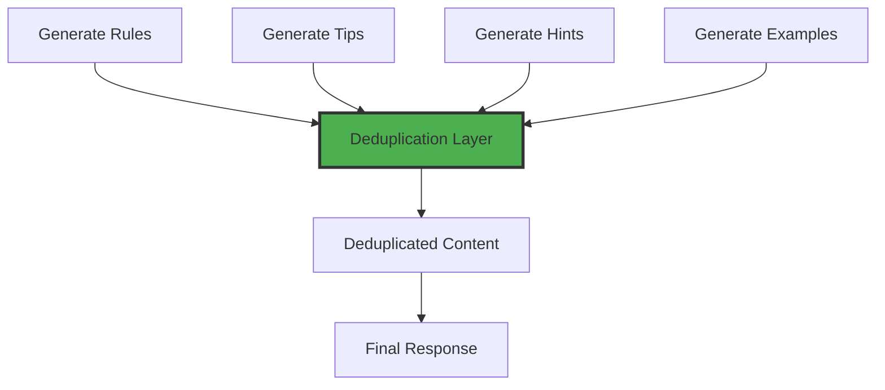

# Phase 2: Redundancy Reduction - Implementation Guide

**Status:** Ready for Implementation (Depends on Phase 1 completion)
**Assigned Agents:** coding-agent, system-architect-agent, test-orchestrator-agent
**Duration:** 15 hours
**Risk Level:** MEDIUM
**Priority:** HIGH

---

## 📋 Phase Overview

### Objectives
1. ✅ Reduce redundancy from 52% to <20%
2. ✅ Implement action-specific parameter filtering
3. ✅ Consolidate 8 sections → 4 sections
4. ✅ Achieve 350 token reduction per MCP response

### Success Criteria
- [ ] Redundancy rate: 52% → <20%
- [ ] Token reduction: 350 tokens per response
- [ ] Parameter guidance shows only relevant parameters
- [ ] Section count: 8 → 4 consolidated sections
- [ ] Cumulative improvement: 50% (with Phase 1)
- [ ] All tests pass, no breaking changes

---

## 🎯 Subtask Breakdown

### Subtask 2.1: Implement Content Deduplication Layer
**Duration:** 5 hours
**Assigned to:** system-architect-agent, coding-agent
**Priority:** HIGH
**Risk:** MEDIUM

#### Problem Statement
Same information repeated across rules, tips, examples, and parameter_guidance sections, causing 52% redundancy.

#### Files to Create/Modify
**New File:**
```
agenthub_main/src/fastmcp/task_management/application/services/deduplication_layer.py
```

**Modified File:**
```
agenthub_main/src/fastmcp/task_management/application/services/subtask_workflow_guidance.py
```

#### Architecture Design



#### Implementation: Deduplication Layer

```python
# deduplication_layer.py
from typing import Dict, List, Set
from dataclasses import dataclass
import difflib

@dataclass
class ContentItem:
    """Represents a piece of guidance content"""
    section: str  # 'rules', 'tips', 'hints', 'examples'
    content: str
    priority: int  # Higher = more important
    metadata: dict

class DeduplicationLayer:
    """
    Removes redundant content across workflow guidance sections.

    Strategy:
    1. Semantic similarity detection (>80% similar = duplicate)
    2. Priority-based retention (keep highest priority version)
    3. Cross-section deduplication (check all sections)
    """

    def __init__(self, similarity_threshold: float = 0.80):
        self.similarity_threshold = similarity_threshold
        self.seen_concepts: Set[str] = set()

    def deduplicate(self, guidance_sections: Dict[str, List]) -> Dict[str, List]:
        """
        Remove redundant content across all guidance sections.

        Args:
            guidance_sections: {
                'rules': [...],
                'tips': [...],
                'hints': [...],
                'examples': [...]
            }

        Returns:
            Deduplicated guidance sections
        """
        all_items = self._collect_all_items(guidance_sections)
        unique_items = self._filter_duplicates(all_items)
        return self._rebuild_sections(unique_items)

    def _collect_all_items(self, sections: Dict) -> List[ContentItem]:
        """Collect all items with metadata for deduplication"""
        items = []

        # Priority order: rules > examples > tips > hints
        priorities = {'rules': 4, 'examples': 3, 'tips': 2, 'hints': 1}

        for section, content_list in sections.items():
            priority = priorities.get(section, 0)
            for content in content_list:
                items.append(ContentItem(
                    section=section,
                    content=self._normalize_content(content),
                    priority=priority,
                    metadata={'original': content}
                ))

        return items

    def _normalize_content(self, content: str) -> str:
        """Normalize content for comparison"""
        # Remove emojis, extra whitespace, formatting
        import re
        normalized = re.sub(r'[^\w\s]', '', content.lower())
        normalized = ' '.join(normalized.split())
        return normalized

    def _filter_duplicates(self, items: List[ContentItem]) -> List[ContentItem]:
        """Filter out duplicate/similar items"""
        unique_items = []

        for item in sorted(items, key=lambda x: x.priority, reverse=True):
            if not self._is_duplicate(item, unique_items):
                unique_items.append(item)

        return unique_items

    def _is_duplicate(self, item: ContentItem, existing: List[ContentItem]) -> bool:
        """Check if item is duplicate of any existing item"""
        for existing_item in existing:
            similarity = difflib.SequenceMatcher(
                None,
                item.content,
                existing_item.content
            ).ratio()

            if similarity >= self.similarity_threshold:
                return True  # Too similar, is a duplicate

        return False

    def _rebuild_sections(self, unique_items: List[ContentItem]) -> Dict[str, List]:
        """Rebuild sections from unique items"""
        rebuilt = {
            'rules': [],
            'tips': [],
            'hints': [],
            'examples': []
        }

        for item in unique_items:
            rebuilt[item.section].append(item.metadata['original'])

        return rebuilt


# Example usage in subtask_workflow_guidance.py
class SubtaskWorkflowGuidance:
    def __init__(self):
        self.deduplicator = DeduplicationLayer(similarity_threshold=0.80)

    def enhance_response(self, response: dict, action: str) -> dict:
        # Generate all sections as before
        sections = {
            'rules': self.generate_rules(action),
            'tips': self.generate_tips(action),
            'hints': self.generate_hints(action),
            'examples': self.generate_examples(action, response)
        }

        # Apply deduplication BEFORE adding to response
        deduplicated = self.deduplicator.deduplicate(sections)

        response['workflow_guidance'] = {
            **response.get('workflow_guidance', {}),
            **deduplicated
        }

        return response
```

#### Testing
```python
# test_deduplication_layer.py
def test_deduplication_removes_similar_content():
    """Verify deduplication removes redundant content"""
    dedup = DeduplicationLayer(similarity_threshold=0.80)

    sections = {
        'rules': ["Update status to in_progress when starting"],
        'tips': ["🚀 Start working: Update status to 'in_progress'"],
        'hints': ["Remember to update status when you begin work"]
    }

    result = dedup.deduplicate(sections)

    # Should keep only 1 version (highest priority = rules)
    total_items = sum(len(items) for items in result.values())
    assert total_items == 1
    assert len(result['rules']) == 1
    assert len(result['tips']) == 0
    assert len(result['hints']) == 0

def test_deduplication_preserves_unique_content():
    """Verify unique content is preserved"""
    dedup = DeduplicationLayer()

    sections = {
        'rules': ["Update status when starting"],
        'tips': ["Use progress_percentage for accuracy"],  # Different concept
        'hints': ["Check parent task for context"]  # Different concept
    }

    result = dedup.deduplicate(sections)

    # All should be preserved (not similar enough)
    total_items = sum(len(items) for items in result.values())
    assert total_items == 3
```

#### Success Criteria
- [ ] Deduplication layer implemented and tested
- [ ] Similarity detection accuracy >90%
- [ ] Priority-based retention working correctly
- [ ] Integrated into workflow guidance generation
- [ ] Redundancy reduction measured (expect 30-40% drop)

---

### Subtask 2.2: Action-Specific Parameter Filtering
**Duration:** 4 hours
**Assigned to:** coding-agent
**Priority:** HIGH
**Risk:** MEDIUM

#### Problem Statement
parameter_guidance shows ALL 15+ parameters for every action, even when only 2-3 are relevant. Wastes ~200 tokens per response.

#### Files to Modify
```
agenthub_main/src/fastmcp/task_management/application/services/subtask_workflow_guidance.py:347-459
```

#### Current Code (WRONG)
```python
def generate_parameter_guidance(self) -> dict:
    """Shows ALL parameters regardless of action"""
    return {
        "task_id": {"requirement": "REQUIRED", "tip": "..."},
        "subtask_id": {"requirement": "OPTIONAL", "tip": "..."},
        "title": {"requirement": "OPTIONAL", "tip": "..."},
        "description": {"requirement": "OPTIONAL", "tip": "..."},
        # ... 12 more parameters always shown
    }
```

#### Target Code (CORRECT)
```python
# Parameter mapping by action
PARAMETER_MAP = {
    "create": ["task_id", "title", "assignees", "description", "priority"],
    "update": ["task_id", "subtask_id", "progress_percentage", "status", "details"],
    "get": ["task_id", "subtask_id"],
    "delete": ["task_id", "subtask_id"],
    "list": ["task_id"],
    "complete": ["task_id", "subtask_id", "completion_summary"]
}

def generate_parameter_guidance(self, action: str) -> dict:
    """
    Shows only relevant parameters for current action.

    Reduces parameter guidance from 300 tokens to ~60 tokens.
    """
    # Get relevant parameters for this action
    relevant_params = PARAMETER_MAP.get(action, [])

    # Full parameter definitions
    all_params = {
        "task_id": {
            "requirement": "REQUIRED for all actions",
            "format": "UUID string",
            "tip": "Parent task identifier"
        },
        "subtask_id": {
            "requirement": "REQUIRED for update/get/delete/complete",
            "format": "UUID string",
            "tip": "Subtask identifier from create response"
        },
        # ... other parameter definitions
    }

    # Return only relevant parameters
    return {
        param: all_params[param]
        for param in relevant_params
        if param in all_params
    }
```

#### Implementation Steps
1. Create PARAMETER_MAP constant with action → parameter list mapping
2. Update `generate_parameter_guidance` to accept `action` parameter
3. Filter parameters based on action
4. Update method calls to pass action
5. Test each action shows correct parameters

#### Testing
```python
def test_parameter_filtering_by_action():
    """Verify only relevant parameters shown for each action"""
    guidance = SubtaskWorkflowGuidance()

    # Test 'create' action
    params = guidance.generate_parameter_guidance(action="create")
    assert "title" in params  # Required for create
    assert "subtask_id" not in params  # Not needed for create

    # Test 'update' action
    params = guidance.generate_parameter_guidance(action="update")
    assert "subtask_id" in params  # Required for update
    assert "title" not in params  # Not typically updated

    # Test 'get' action
    params = guidance.generate_parameter_guidance(action="get")
    assert len(params) <= 3  # Should be minimal (task_id, subtask_id only)
```

#### Token Savings Calculation
```
Before: 15 parameters × 20 tokens each = 300 tokens
After:  3-5 parameters × 20 tokens each = 60-100 tokens
Savings: 200-240 tokens per response
```

#### Success Criteria
- [ ] PARAMETER_MAP created for all 6 actions
- [ ] Filtering logic implemented and tested
- [ ] Each action shows only relevant parameters
- [ ] Token reduction: 200+ tokens saved
- [ ] All tests pass

---

### Subtask 2.3: Consolidate Sections (8 → 4)
**Duration:** 3 hours
**Assigned to:** coding-agent
**Priority:** MEDIUM
**Risk:** MEDIUM

#### Problem Statement
8 separate sections cause fragmentation and redundancy. Consolidating to 4 sections improves clarity and reduces overhead.

#### Current Structure (8 sections)
```
workflow_guidance: {
    current_state: {...},      // 1
    rules: [...],              // 2
    tips: [...],               // 3
    hints: [...],              // 4
    warnings: [...],           // 5
    examples: [...],           // 6
    next_actions: [...],       // 7
    parameter_guidance: {...}  // 8
}
```

#### Target Structure (4 sections)
```
workflow_guidance: {
    current_state: {...},           // Essential state info
    guidance: {                     // Consolidated rules + tips + hints
        rules: [...],
        suggestions: [...]
    },
    examples: [...],                // Actionable code examples
    warnings: [...]                 // Only critical warnings
}

// Removed: next_actions (redundant with examples)
// Removed: parameter_guidance as separate (merged into examples)
```

#### Consolidation Strategy

```python
def build_consolidated_guidance(self, action: str, response: dict) -> dict:
    """
    Build consolidated 4-section guidance structure.

    Merges:
    - rules + tips + hints → guidance.rules + guidance.suggestions
    - next_actions → removed (redundant with examples)
    - parameter_guidance → integrated into example descriptions
    """

    # Generate all content
    rules = self.generate_rules(action)
    tips = self.generate_tips(action)
    hints = self.generate_hints(action)
    examples = self.generate_examples(action, response)
    warnings = self.check_warnings(action, response)

    # Apply deduplication
    deduplicated = self.deduplicator.deduplicate({
        'rules': rules,
        'tips': tips,
        'hints': hints
    })

    # Consolidate into 4 sections
    return {
        "current_state": self.analyze_current_state(action, response),
        "guidance": {
            "rules": deduplicated['rules'],
            "suggestions": deduplicated['tips'] + deduplicated['hints']
        },
        "examples": self._enhance_examples_with_params(examples, action),
        "warnings": warnings if warnings else []
    }

def _enhance_examples_with_params(self, examples: List[dict], action: str) -> List[dict]:
    """
    Add parameter descriptions to examples instead of separate section.

    This integrates parameter guidance directly into actionable examples.
    """
    relevant_params = self.PARAMETER_MAP.get(action, [])

    for example in examples:
        # Add parameter notes to example description
        param_notes = [
            f"  - {param}: {self.PARAM_DESCRIPTIONS[param]}"
            for param in relevant_params
        ]

        if param_notes:
            example['description'] += "\n\nParameters:\n" + "\n".join(param_notes)

    return examples
```

#### Migration Strategy
```python
# Feature flag for gradual rollout
USE_CONSOLIDATED_STRUCTURE = os.getenv("CONSOLIDATED_GUIDANCE", "false")

if USE_CONSOLIDATED_STRUCTURE:
    response['workflow_guidance'] = build_consolidated_guidance(action, response)
else:
    response['workflow_guidance'] = build_legacy_guidance(action, response)
```

#### Testing
```python
def test_consolidated_structure():
    """Verify new 4-section structure"""
    response = create_subtask(task_id="test", title="Test")
    guidance = response['workflow_guidance']

    # Should have exactly 4 top-level keys
    assert set(guidance.keys()) == {
        'current_state', 'guidance', 'examples', 'warnings'
    }

    # Guidance should have rules and suggestions
    assert 'rules' in guidance['guidance']
    assert 'suggestions' in guidance['guidance']

    # Should NOT have legacy sections
    assert 'tips' not in guidance
    assert 'hints' not in guidance
    assert 'next_actions' not in guidance
    assert 'parameter_guidance' not in guidance

def test_backward_compatibility():
    """Verify legacy structure still works with feature flag OFF"""
    os.environ['CONSOLIDATED_GUIDANCE'] = 'false'

    response = create_subtask(task_id="test", title="Test")
    guidance = response['workflow_guidance']

    # Should have old 8-section structure
    assert 'rules' in guidance
    assert 'tips' in guidance
    assert 'hints' in guidance
    assert 'next_actions' in guidance
```

#### Success Criteria
- [ ] 4-section structure implemented
- [ ] Content properly distributed across new sections
- [ ] Feature flag controls old vs new structure
- [ ] Backward compatibility maintained with flag OFF
- [ ] Token reduction: ~100 tokens from reduced overhead
- [ ] All tests pass

---

### Subtask 2.4: Integration Testing and Validation
**Duration:** 3 hours
**Assigned to:** test-orchestrator-agent
**Priority:** HIGH
**Risk:** LOW

#### Test Suite Requirements

##### Integration Tests
```python
# test_phase2_integration.py

def test_full_phase2_pipeline():
    """Test complete Phase 2 workflow"""
    # Enable Phase 2 features
    os.environ['PHASE1_ENABLED'] = 'true'
    os.environ['CONSOLIDATED_GUIDANCE'] = 'true'

    # Create subtask with full workflow
    response = create_subtask(
        task_id="test-task",
        title="Test Subtask",
        progress_percentage=50
    )

    guidance = response['workflow_guidance']

    # Verify deduplication worked
    all_content = (
        guidance['guidance']['rules'] +
        guidance['guidance']['suggestions']
    )
    assert no_duplicates_found(all_content)

    # Verify parameter filtering
    examples = guidance['examples']
    # Should mention only relevant parameters in descriptions

    # Verify consolidation
    assert set(guidance.keys()) == {
        'current_state', 'guidance', 'examples', 'warnings'
    }

def test_token_reduction_phase2():
    """Measure cumulative token reduction after Phase 2"""
    import tiktoken
    encoder = tiktoken.get_encoding("cl100k_base")

    response = create_subtask(task_id="test", title="Test")
    guidance_text = str(response['workflow_guidance'])

    token_count = len(encoder.encode(guidance_text))

    # Phase 1: 830 → 760 (70 tokens saved)
    # Phase 2: 760 → 410 (350 tokens saved)
    # Total: 830 → 410 (420 tokens saved, 50% reduction)
    assert token_count <= 410, f"Expected ≤410 tokens, got {token_count}"

def test_redundancy_rate_reduced():
    """Verify redundancy reduced to <20%"""
    response = create_subtask(task_id="test", title="Test")
    guidance = response['workflow_guidance']

    # Calculate redundancy rate
    redundancy = calculate_redundancy_rate(guidance)

    # Should be <20% (down from 52%)
    assert redundancy < 0.20, f"Redundancy {redundancy:.1%} still too high"
```

#### Performance Regression Tests
```python
def test_no_performance_regression():
    """Ensure deduplication doesn't slow down responses"""
    import time

    start = time.time()
    for _ in range(100):
        create_subtask(task_id="test", title="Perf Test")
    duration = time.time() - start

    # Should complete 100 operations in <5 seconds
    assert duration < 5.0, f"Too slow: {duration:.2f}s for 100 ops"
```

#### Success Criteria
- [ ] All integration tests pass
- [ ] Token reduction validated: 350 tokens saved
- [ ] Redundancy rate confirmed: <20%
- [ ] No performance regression detected
- [ ] Cumulative improvement: 50% token reduction
- [ ] All backward compatibility maintained

---

## 📊 Validation & Metrics

### Token Reduction (Cumulative)
| Metric | Baseline | After Phase 1 | After Phase 2 | Improvement |
|--------|----------|---------------|---------------|-------------|
| Tokens per response | 830 | 760 | 410 | **50%** |
| Useful content | 28% | 35% | >65% | **130%** |
| Redundancy rate | 52% | 45% | <20% | **62%** |

### Section Efficiency
| Metric | Before | After | Improvement |
|--------|--------|-------|-------------|
| Sections | 8 | 4 | **50% reduction** |
| Parameters shown | 15 | 3-5 | **70% reduction** |
| Duplicate content | 52% | <20% | **62% reduction** |

---

## 🚀 Deployment Strategy

### Gradual Rollout
1. **Week 1:** Deploy to dev with feature flags
2. **Week 2:** Enable for 25% of staging traffic
3. **Week 3:** Enable for 100% of staging, monitor metrics
4. **Week 4:** Production rollout at 10% → 50% → 100%

### Feature Flags
```bash
# Phase 2 controls
PHASE1_ENABLED=true           # Must be true for Phase 2
ENABLE_DEDUPLICATION=true     # Deduplication layer
CONSOLIDATED_GUIDANCE=true    # 4-section structure
PARAMETER_FILTERING=true      # Action-specific params
```

### Monitoring
```python
# Metrics to track
- token_count_per_response (target: ≤410)
- redundancy_rate (target: <20%)
- false_positive_rate (target: 0%)
- response_time_p95 (target: <200ms)
- error_rate (target: <0.1%)
```

---

## ✅ Phase 2 Completion Checklist

### Implementation
- [ ] Subtask 2.1: Deduplication layer implemented
- [ ] Subtask 2.2: Parameter filtering implemented
- [ ] Subtask 2.3: Sections consolidated to 4
- [ ] Subtask 2.4: All tests passing

### Validation
- [ ] Token reduction: 350 tokens saved ✅
- [ ] Redundancy: <20% ✅
- [ ] Cumulative improvement: 50% ✅
- [ ] No breaking changes ✅
- [ ] Performance maintained ✅

### Documentation
- [ ] CHANGELOG.md updated
- [ ] Code documented with comments
- [ ] This guide marked complete

### Deployment
- [ ] Feature flags configured
- [ ] Staging deployment successful
- [ ] Metrics validated
- [ ] Production rollout complete

---

**Status:** ✅ Ready for implementation (after Phase 1)
**Next Phase:** Phase 3 (Architectural Improvements)
**Dependencies:** Phase 1 must be complete and validated
