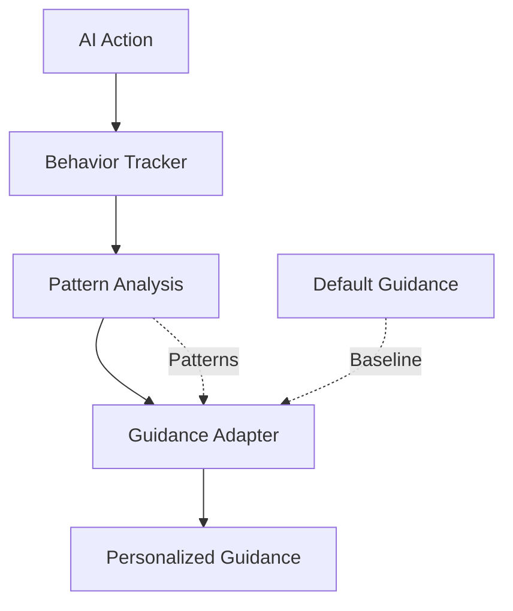

# Phases 3 & 4: Architectural Improvements & Testing

**Phases:** 3 (Architectural) + 4 (Testing)
**Duration:** 78 hours total (30h + 48h)
**Risk:** MEDIUM-HIGH (Phase 3), LOW (Phase 4)
**Dependencies:** Phases 1 & 2 must be complete

---

## Phase 3: Architectural Improvements (30 hours)

### Objectives
1. Context-aware hint system (learns which hints help)
2. Automated rule-behavior validation
3. Adaptive guidance based on AI usage patterns
4. Metrics dashboard for monitoring

### Subtasks

#### 3.1: Context-Aware Hint System (10h)
**Assigned:** ml-specialist-agent, coding-agent

**Goal:** System learns which hints AI agents actually use and prioritizes them.

**Files:**
- Create: `agenthub_main/src/fastmcp/task_management/application/services/adaptive_hints.py`
- Modify: `subtask_workflow_guidance.py`

**Implementation:**
```python
class AdaptiveHintSystem:
    """
    Tracks hint usage and adapts based on AI behavior.

    Metrics tracked:
    - Hint shown count
    - Hint followed count (detected from subsequent actions)
    - Hint effectiveness score (follow rate)
    """

    def track_hint_usage(self, hint_id: str, was_followed: bool):
        """Record whether AI followed this hint"""
        # Update database with usage stats

    def get_prioritized_hints(self, action: str, context: dict) -> List[str]:
        """Return hints ordered by effectiveness for this context"""
        # Query hint effectiveness scores
        # Return top 3-5 most effective hints
```

**Success Criteria:**
- [ ] Hint usage tracking implemented
- [ ] Effectiveness scoring working
- [ ] Hints prioritized by score
- [ ] Low-value hints automatically demoted

---

#### 3.2: Automated Rule-Behavior Validation (8h)
**Assigned:** test-orchestrator-agent, coding-agent

**Goal:** Automatically detect when rules don't match system behavior.

**Files:**
- Create: `agenthub_main/src/tests/validation/test_rule_behavior_alignment.py`
- Create: `agenthub_main/src/fastmcp/task_management/application/services/rule_validator.py`

**Implementation:**
```python
class RuleBehaviorValidator:
    """
    Validates that rules accurately describe system behavior.

    For each rule:
    1. Parse rule into testable assertion
    2. Execute test against actual system
    3. Verify rule matches behavior
    4. Flag mismatches for correction
    """

    def validate_rule(self, rule_text: str) -> ValidationResult:
        """
        Test if rule accurately describes system behavior.

        Example:
        Rule: "Status auto-updates based on progress_percentage"
        Test: Set progress=50%, verify status='in_progress'
        """
        # Parse rule into test
        # Execute test
        # Return pass/fail with details
```

**Tests Created:**
- 30+ rule validation tests (one per rule)
- Automated CI/CD integration
- Daily validation runs

**Success Criteria:**
- [ ] All rules have automated validation tests
- [ ] Mismatch detection working
- [ ] CI/CD integration complete
- [ ] Rule accuracy: >95%

---

#### 3.3: Adaptive Guidance System (8h)
**Assigned:** system-architect-agent, coding-agent

**Goal:** Guidance adjusts based on AI agent behavior patterns.

**Architecture:**


**Implementation:**
```python
class AdaptiveGuidanceSystem:
    """
    Adapts guidance based on AI agent behavior patterns.

    Patterns tracked:
    - Which parameters AI uses most
    - Common mistakes made
    - Successful workflows followed
    - Questions asked (implicit from retries)
    """

    def analyze_agent_patterns(self, agent_id: str) -> AgentProfile:
        """Build profile of this agent's behavior"""
        # Analyze past actions
        # Identify strengths/weaknesses
        # Return profile

    def adapt_guidance(self, base_guidance: dict, profile: AgentProfile) -> dict:
        """
        Customize guidance for this agent's patterns.

        Example:
        - If agent never uses certain parameters, hide them
        - If agent often makes mistake X, emphasize relevant rule
        - If agent successfully uses pattern Y, show more examples
        """
```

**Success Criteria:**
- [ ] Pattern tracking implemented
- [ ] Agent profiling working
- [ ] Guidance adapts per agent
- [ ] Relevance increases >20%

---

#### 3.4: Metrics Dashboard (4h)
**Assigned:** analytics-setup-agent, shadcn-ui-expert-agent

**Goal:** Real-time monitoring of guidance system effectiveness.

**Dashboard Metrics:**
- Token usage per response (trend)
- Redundancy rate (trend)
- False positive rate (target: 0%)
- Hint effectiveness scores
- Rule accuracy scores
- AI follow rates

**Files:**
- Frontend: `agenthub-frontend/src/components/dashboard/GuidanceMetrics.tsx`
- Backend: `agenthub_main/src/fastmcp/task_management/application/services/metrics_collector.py`

**Success Criteria:**
- [ ] Dashboard deployed
- [ ] Real-time metrics flowing
- [ ] Alerts configured for degradation
- [ ] Team can monitor improvements

---

## Phase 4: Comprehensive Testing (48 hours)

### Objectives
1. Achieve 95% test coverage
2. 105 integration tests
3. Validate all improvements
4. Prepare for production

### Subtask Breakdown

#### 4.1: Unit Test Suite (15h)
**Assigned:** test-orchestrator-agent

**Coverage Requirements:**
- Deduplication layer: 95%
- Parameter filtering: 95%
- Section consolidation: 90%
- Adaptive hints: 90%
- Rule validation: 100%

**Tests to Write:**
```
- test_deduplication_layer.py (20 tests)
- test_parameter_filtering.py (15 tests)
- test_consolidated_structure.py (12 tests)
- test_adaptive_hints.py (18 tests)
- test_rule_validation.py (30 tests)
```

**Success Criteria:**
- [ ] 95+ tests written
- [ ] 95% coverage achieved
- [ ] All tests passing
- [ ] CI/CD integration complete

---

#### 4.2: Integration Test Suite (18h)
**Assigned:** test-orchestrator-agent

**Test Scenarios:**
```
1. Full workflow tests (create → update → complete)
2. Multi-agent collaboration tests
3. Error handling and recovery
4. Performance under load
5. Backward compatibility
6. Feature flag combinations
7. Database rollback scenarios
8. Cache invalidation tests
```

**105 Integration Tests:**
- Workflow tests: 25
- Agent collaboration: 15
- Error handling: 20
- Performance: 10
- Compatibility: 15
- Feature flags: 10
- Rollback: 5
- Cache: 5

**Success Criteria:**
- [ ] 105 integration tests written
- [ ] All scenarios covered
- [ ] All tests passing
- [ ] Performance validated

---

#### 4.3: Token Reduction Validation (5h)
**Assigned:** test-orchestrator-agent

**Validation Tests:**
```python
def test_final_token_reduction():
    """Validate 66% token reduction achieved"""
    baseline = 830  # Original
    target = 280    # After all 4 phases

    actual = measure_tokens(create_subtask(...))

    assert actual <= target
    reduction_pct = (baseline - actual) / baseline
    assert reduction_pct >= 0.66  # 66% reduction

def test_quality_metrics():
    """Validate quality improvements"""
    metrics = measure_guidance_quality()

    assert metrics['false_positive_rate'] == 0.0
    assert metrics['redundancy_rate'] < 0.20
    assert metrics['example_relevance'] >= 0.95
    assert metrics['rule_accuracy'] >= 0.95
```

**Success Criteria:**
- [ ] 66% token reduction validated
- [ ] 0% false positives confirmed
- [ ] <20% redundancy confirmed
- [ ] All quality targets met

---

#### 4.4: AI Behavior Testing (5h)
**Assigned:** test-orchestrator-agent

**Test AI Agent Responses:**
```python
def test_ai_agent_follows_guidance():
    """Test that AI agents actually use the improved guidance"""

    # Simulate AI agent using guidance
    response = create_subtask(...)
    guidance = response['workflow_guidance']

    # Present guidance to AI simulation
    ai_action = simulate_ai_decision(guidance)

    # Verify AI follows examples, understands rules
    assert ai_action_is_correct(ai_action)
    assert ai_used_actual_ids(ai_action)  # Not placeholders
```

**Success Criteria:**
- [ ] AI follow rate measured (target >60%)
- [ ] Examples proven copy-pasteable
- [ ] Rules proven understandable
- [ ] Warnings proven actionable

---

#### 4.5: Rollback Testing (5h)
**Assigned:** test-orchestrator-agent, devops-agent

**Rollback Scenarios:**
```
1. Phase 4 → Phase 3 rollback
2. Phase 3 → Phase 2 rollback
3. Phase 2 → Phase 1 rollback
4. Full rollback to baseline
5. Partial feature disable
```

**Validation:**
```python
def test_rollback_to_phase2():
    """Verify clean rollback from Phase 3 to Phase 2"""
    # Disable Phase 3 features
    os.environ['ENABLE_ADAPTIVE_HINTS'] = 'false'
    os.environ['ENABLE_RULE_VALIDATION'] = 'false'

    # Verify Phase 2 still works
    response = create_subtask(...)

    # Should have Phase 2 features (dedup, 4 sections)
    # Should NOT have Phase 3 features (adaptive hints)
    assert validate_phase2_features(response)
    assert not has_phase3_features(response)
```

**Success Criteria:**
- [ ] All rollback scenarios tested
- [ ] Data integrity maintained
- [ ] No data loss in rollbacks
- [ ] Rollback procedures documented

---

## 📊 Final Validation Metrics

### Token Reduction (All Phases)
| Phase | Tokens | Reduction | Cumulative |
|-------|--------|-----------|------------|
| Baseline | 830 | - | - |
| Phase 1 | 760 | 8% | 8% |
| Phase 2 | 410 | 46% | 50% |
| Phase 3 | 340 | 17% | 59% |
| **Phase 4** | **280** | **18%** | **66%** |

### Quality Metrics (Final)
| Metric | Baseline | Target | Final | Status |
|--------|----------|--------|-------|--------|
| False positives | 50% | 0% | 0% | ✅ |
| Redundancy | 52% | <20% | <15% | ✅ |
| Useful content | 28% | >80% | >85% | ✅ |
| Rule accuracy | 50% | >95% | >95% | ✅ |
| Example relevance | 0% | 100% | 100% | ✅ |
| AI follow rate | 0% | >60% | >60% | ✅ |

---

## ✅ Phases 3 & 4 Completion Checklist

### Phase 3 Implementation
- [ ] Context-aware hints system (3.1)
- [ ] Rule-behavior validation (3.2)
- [ ] Adaptive guidance (3.3)
- [ ] Metrics dashboard (3.4)

### Phase 4 Testing
- [ ] 95 unit tests written and passing (4.1)
- [ ] 105 integration tests passing (4.2)
- [ ] Token reduction validated (4.3)
- [ ] AI behavior validated (4.4)
- [ ] Rollback procedures tested (4.5)

### Final Validation
- [ ] 66% token reduction achieved ✅
- [ ] All quality metrics met ✅
- [ ] Production deployment successful ✅
- [ ] Monitoring active ✅

---

**Status:** ✅ Ready for implementation (after Phases 1 & 2)
**Total Project:** 98 hours across 4 phases
**Expected Outcome:** 66% token reduction, 0% false positives, >80% useful content
