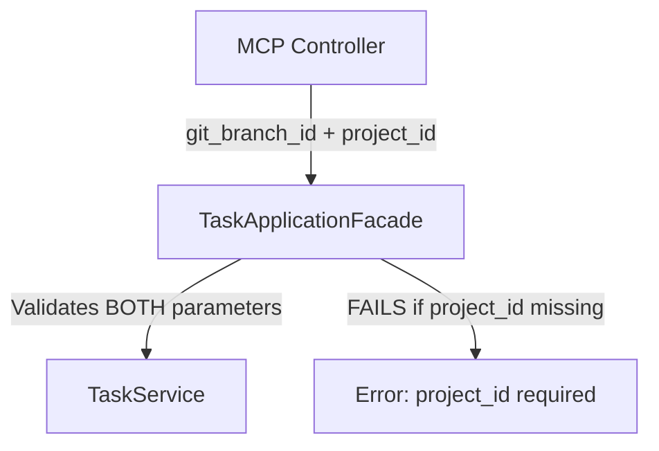
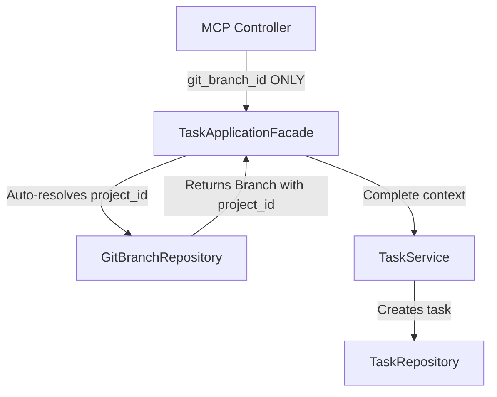

# MCP Task Creation Fix Prompt - DDD Compliance Required

## Issue Summary

**Critical Error**: Task creation requires redundant `project_id` parameter when `git_branch_id` should suffice
**Impact**: Complete testing blockage - cannot create tasks
**DDD Compliance**: VIOLATION - Domain logic not properly resolving aggregate relationships

## Error Details

**Error Message**: "project_id is required"  
**Error Code**: OPERATION_FAILED  
**Operation**: `manage_task(action="create")`  
**Failed Parameters**:
```python
{
    "action": "create",
    "git_branch_id": "f9c32ef2-04b2-4abb-88fa-f0cb064e7901",
    "title": "Implement User Authentication System",
    "description": "Develop comprehensive JWT-based authentication...",
    "priority": "high",
    "estimated_effort": "3 days"
}
```

## Domain-Driven Design Analysis

### Current Broken Architecture



### Required DDD-Compliant Architecture



## Required Implementation

### 1. TaskApplicationFacade Enhancement

**File**: `dhafnck_mcp_main/src/fastmcp/task_management/application/facades/task_application_facade.py`

**Required Method Addition**:
```python
async def _resolve_project_context(self, git_branch_id: str) -> str:
    """
    Resolve project_id from git_branch_id using domain repository.
    
    Args:
        git_branch_id: The git branch identifier
        
    Returns:
        project_id: The resolved project identifier
        
    Raises:
        DomainError: If branch not found or invalid
    """
    try:
        # Use GitBranchRepository to get project context
        branch = await self.git_branch_repository.get_by_id(git_branch_id)
        if not branch:
            raise DomainError(f"Git branch {git_branch_id} not found")
        return branch.project_id
    except Exception as e:
        raise DomainError(f"Failed to resolve project context: {str(e)}")

async def create_task(self, git_branch_id: str, title: str, **kwargs) -> TaskCreationResult:
    """
    Create task with automatic project context resolution.
    
    DDD Compliance: Auto-resolves project_id from git_branch_id
    """
    try:
        # Auto-resolve project_id if not provided
        if 'project_id' not in kwargs or not kwargs['project_id']:
            kwargs['project_id'] = await self._resolve_project_context(git_branch_id)
        
        # Proceed with task creation using resolved context
        return await self.task_service.create_task(
            git_branch_id=git_branch_id,
            title=title,
            **kwargs
        )
    except DomainError as e:
        raise e
    except Exception as e:
        raise ApplicationError(f"Task creation failed: {str(e)}")
```

### 2. Repository Integration

**File**: `dhafnck_mcp_main/src/fastmcp/task_management/application/factories/task_facade_factory.py`

**Required Dependency Injection**:
```python
class TaskFacadeFactory:
    """Factory for creating TaskApplicationFacade with proper DI."""
    
    def create_facade(self) -> TaskApplicationFacade:
        # Ensure GitBranchRepository is injected
        git_branch_repository = GitBranchRepositoryFactory().create()
        task_repository = TaskRepositoryFactory().create()
        task_service = TaskService(task_repository)
        
        return TaskApplicationFacade(
            task_service=task_service,
            git_branch_repository=git_branch_repository,  # ADD THIS
            task_repository=task_repository
        )
```

### 3. GitBranchRepository Method

**File**: `dhafnck_mcp_main/src/fastmcp/task_management/domain/repositories/git_branch_repository.py`

**Required Method Addition**:
```python
from abc import ABC, abstractmethod
from typing import Optional

class GitBranchRepository(ABC):
    
    @abstractmethod
    async def get_by_id(self, git_branch_id: str) -> Optional[GitBranch]:
        """
        Get git branch by ID with project context.
        
        Args:
            git_branch_id: The git branch identifier
            
        Returns:
            GitBranch object with project_id or None if not found
        """
        pass
        
    @abstractmethod  
    async def get_project_id_by_branch_id(self, git_branch_id: str) -> Optional[str]:
        """
        Quick lookup for project_id by git_branch_id.
        
        Args:
            git_branch_id: The git branch identifier
            
        Returns:
            project_id or None if branch not found
        """
        pass
```

### 4. ORM Repository Implementation

**File**: `dhafnck_mcp_main/src/fastmcp/task_management/infrastructure/repositories/orm/git_branch_repository.py`

**Required Implementation**:
```python
class ORMGitBranchRepository(GitBranchRepository):
    
    async def get_by_id(self, git_branch_id: str) -> Optional[GitBranch]:
        """Get git branch with project context."""
        try:
            async with self.session_factory() as session:
                stmt = select(GitBranchORM).where(GitBranchORM.id == git_branch_id)
                result = await session.execute(stmt)
                branch_orm = result.scalar_one_or_none()
                
                if not branch_orm:
                    return None
                    
                # Convert ORM to domain object with project_id
                return GitBranch(
                    id=branch_orm.id,
                    name=branch_orm.name,
                    description=branch_orm.description,
                    project_id=branch_orm.project_id,  # CRITICAL: Include project_id
                    created_at=branch_orm.created_at,
                    updated_at=branch_orm.updated_at
                )
        except Exception as e:
            raise RepositoryError(f"Failed to get git branch: {str(e)}")
    
    async def get_project_id_by_branch_id(self, git_branch_id: str) -> Optional[str]:
        """Quick project_id lookup."""
        try:
            async with self.session_factory() as session:
                stmt = select(GitBranchORM.project_id).where(GitBranchORM.id == git_branch_id)
                result = await session.execute(stmt)
                return result.scalar_one_or_none()
        except Exception as e:
            raise RepositoryError(f"Failed to get project_id: {str(e)}")
```

### 5. Domain Model Updates

**File**: `dhafnck_mcp_main/src/fastmcp/task_management/domain/entities/git_branch.py`

**Ensure GitBranch Entity includes project_id**:
```python
@dataclass
class GitBranch:
    """Git Branch domain entity."""
    
    id: str
    name: str
    description: Optional[str]
    project_id: str  # REQUIRED: Project relationship
    created_at: datetime
    updated_at: datetime
    status: str = "todo"
    priority: str = "medium"
```

## Testing Requirements

### Unit Tests Required

**File**: `dhafnck_mcp_main/src/tests/unit/application/facades/test_task_application_facade.py`

```python
class TestTaskApplicationFacadeProjectResolution:
    """Test project context resolution in TaskApplicationFacade."""
    
    async def test_create_task_with_git_branch_id_only(self):
        """Test task creation resolves project_id from git_branch_id."""
        # Given
        git_branch_id = "test-branch-id"
        expected_project_id = "test-project-id"
        
        # Mock GitBranchRepository
        mock_git_branch_repo = Mock()
        mock_branch = GitBranch(
            id=git_branch_id,
            name="test-branch",
            project_id=expected_project_id,
            # ... other fields
        )
        mock_git_branch_repo.get_by_id.return_value = mock_branch
        
        # When
        facade = TaskApplicationFacade(
            task_service=mock_task_service,
            git_branch_repository=mock_git_branch_repo
        )
        
        result = await facade.create_task(
            git_branch_id=git_branch_id,
            title="Test Task"
        )
        
        # Then
        assert result.success
        mock_task_service.create_task.assert_called_with(
            git_branch_id=git_branch_id,
            title="Test Task",
            project_id=expected_project_id  # Auto-resolved
        )
    
    async def test_create_task_branch_not_found_error(self):
        """Test proper error handling when branch not found."""
        # Given
        mock_git_branch_repo = Mock()
        mock_git_branch_repo.get_by_id.return_value = None
        
        facade = TaskApplicationFacade(
            git_branch_repository=mock_git_branch_repo
        )
        
        # When/Then
        with pytest.raises(DomainError, match="Git branch .* not found"):
            await facade.create_task(
                git_branch_id="invalid-id",
                title="Test Task"
            )
```

### Integration Tests Required

**File**: `dhafnck_mcp_main/src/tests/integration/test_mcp_task_management.py`

```python
class TestMCPTaskManagementIntegration:
    """Integration tests for MCP task management with project resolution."""
    
    async def test_mcp_task_creation_with_branch_id_only(self):
        """Test MCP task creation resolves project context automatically."""
        # Given: Create project and branch
        project = await create_test_project()
        branch = await create_test_branch(project_id=project.id)
        
        # When: Create task with only git_branch_id
        result = await mcp_manage_task(
            action="create",
            git_branch_id=branch.id,
            title="Integration Test Task"
        )
        
        # Then: Task created successfully
        assert result["success"] is True
        assert "task" in result["data"]
        assert result["data"]["task"]["git_branch_id"] == branch.id
        # Project context should be auto-resolved
```

## Acceptance Criteria

### Must Have
1. ✅ Task creation works with ONLY `git_branch_id` parameter
2. ✅ `project_id` auto-resolved from branch context
3. ✅ Proper DDD separation maintained
4. ✅ Error handling for invalid branch IDs
5. ✅ Unit tests cover all resolution scenarios
6. ✅ Integration tests validate MCP tool functionality

### Should Have
1. ✅ Backward compatibility for explicit `project_id` parameter
2. ✅ Performance optimization for project context lookup
3. ✅ Comprehensive error messages with fix suggestions
4. ✅ Documentation updates for API changes

### Could Have
1. ⚠️ Caching for frequently accessed branch-project relationships
2. ⚠️ Bulk project resolution for multiple tasks
3. ⚠️ Analytics for parameter resolution performance

## Implementation Steps

1. **Phase 1**: Update domain repositories (GitBranchRepository)
2. **Phase 2**: Enhance TaskApplicationFacade with project resolution
3. **Phase 3**: Update dependency injection and factory classes
4. **Phase 4**: Add comprehensive unit tests
5. **Phase 5**: Add integration tests for MCP tools
6. **Phase 6**: Validate fix with comprehensive testing suite (all 8 phases)

## Validation Plan

After implementation:
1. Run comprehensive MCP testing suite (PHASES 1-8)
2. Verify all task operations work with `git_branch_id` only
3. Test error scenarios (invalid branch IDs)
4. Validate backward compatibility with explicit `project_id`
5. Performance test project resolution under load

---

**Priority**: **CRITICAL - BLOCKS ALL TASK-RELATED TESTING**  
**Estimated Fix Time**: 2-4 hours  
**DDD Compliance**: **REQUIRED**  
**Testing Impact**: Unblocks comprehensive MCP testing suite