# TDD Analysis Remediation - Comprehensive Task Plan

## **Executive Summary**
This document provides a complete task breakdown for addressing critical JWT authentication issues identified through TDD analysis. The JWT authentication system was completely broken due to environment variable mismatch, requiring immediate remediation and systematic architecture improvements.

## **Critical Issues Identified**

### **🚨 EMERGENCY: JWT Authentication Completely Broken**
- **Root Cause**: Environment variable mismatch
  - `.env` file: `JWT_SECRET=...`
  - Code expects: `JWT_SECRET_KEY=...` (used in 18+ files)
- **Impact**: 400 errors in token generation, complete auth system failure
- **Status**: ✅ **FIXED** - Environment variable corrected in `.env` file

### **Architecture Issues**
1. **Starlette-FastAPI Bridge Layer**: Unnecessary complexity
2. **Multiple JWT Services**: 3 different services with inconsistent validation
3. **Test Dependencies**: 80+ test files need updates after architecture changes

## **Task Breakdown for MCP System**

### **PHASE 1: EMERGENCY STABILIZATION (P0 - Critical)**

#### **Task 1: ✅ JWT Secret Environment Variable Fix**
```json
{
  "title": "Fix JWT Secret Environment Variable",
  "description": "Critical fix for environment variable mismatch breaking JWT authentication",
  "priority": "critical",
  "status": "completed",
  "context": {
    "root_cause": "Environment variable name mismatch between .env and code",
    "files_changed": ["/home/daihungpham/agentic-project/.env"],
    "change_details": "JWT_SECRET -> JWT_SECRET_KEY on line 82",
    "validation": "Test token generation returns 200 instead of 400",
    "risk_level": "none",
    "impact": "Fixes complete authentication system failure"
  },
  "completion_summary": "Successfully corrected JWT_SECRET to JWT_SECRET_KEY in .env file. Authentication system should now function properly.",
  "testing_notes": "Requires validation that token generation endpoint now returns 200 status"
}
```

#### **Task 2: End-to-End Authentication Validation**
```json
{
  "title": "End-to-End Authentication Validation",
  "description": "Verify complete authentication flow works after JWT fix",
  "priority": "critical",
  "status": "pending",
  "context": {
    "goal": "Verify complete authentication flow works",
    "test_steps": [
      "1. Start backend server on port 8000",
      "2. Start frontend on port 3800", 
      "3. Test login via frontend UI",
      "4. Generate token via UI",
      "5. Use token for MCP authentication",
      "6. Verify all steps succeed without errors"
    ],
    "expected_results": "All authentication steps succeed without errors",
    "files_to_monitor": [
      "Browser console logs",
      "Backend server logs", 
      "Network request/response data"
    ],
    "validation_endpoints": [
      "POST /api/v2/tokens",
      "GET /api/v2/tokens",
      "MCP authentication endpoints"
    ]
  },
  "agent_assignment": "@uber_orchestrator_agent"
}
```

### **PHASE 2: ARCHITECTURE SIMPLIFICATION (P1 - High)**

#### **Task 3: Remove Starlette-FastAPI Bridge Layer**
```json
{
  "title": "Remove Starlette-FastAPI Bridge Layer",
  "description": "Eliminate unnecessary complexity in token routing architecture",
  "priority": "high",
  "status": "pending",
  "context": {
    "architecture_issue": "Unnecessary complexity with Starlette wrapper around FastAPI",
    "files_to_modify": [
      {
        "action": "remove",
        "file": "/home/daihungpham/agentic-project/dhafnck_mcp_main/src/fastmcp/server/routes/token_routes.py",
        "reason": "Starlette bridge layer - no longer needed"
      },
      {
        "action": "keep",
        "file": "/home/daihungpham/agentic-project/dhafnck_mcp_main/src/fastmcp/server/routes/token_router.py", 
        "reason": "FastAPI implementation - primary route handler"
      },
      {
        "action": "update",
        "file": "/home/daihungpham/agentic-project/dhafnck_mcp_main/src/fastmcp/server/mcp_entry_point.py",
        "reason": "Update server registration to use FastAPI routes directly"
      }
    ],
    "benefits": [
      "50% reduction in token route code complexity",
      "Improved maintainability",
      "Eliminated duplicate route handling",
      "Simplified debugging and testing"
    ],
    "migration_strategy": "Direct FastAPI route registration",
    "risk_assessment": "Low - removing redundant layer",
    "rollback_plan": "Keep backup files until validation complete"
  },
  "agent_assignment": "@coding_agent",
  "dependencies": ["Task 2"]
}
```

#### **Task 4: Consolidate JWT Services**
```json
{
  "title": "Consolidate JWT Services",
  "description": "Create unified JWT service to handle all token types consistently",
  "priority": "high", 
  "status": "pending",
  "context": {
    "problem": "3 different JWT services with inconsistent validation",
    "current_services": [
      {
        "name": "Custom JWTService",
        "purpose": "Application tokens",
        "location": "/home/daihungpham/agentic-project/dhafnck_mcp_main/src/fastmcp/auth/interface/"
      },
      {
        "name": "Supabase JWT", 
        "purpose": "Authentication tokens",
        "location": "Supabase integration"
      },
      {
        "name": "MCP JWT backend",
        "purpose": "Server authentication", 
        "location": "/home/daihungpham/agentic-project/dhafnck_mcp_main/src/fastmcp/auth/mcp_integration/"
      }
    ],
    "solution": "Create UnifiedJWTService handling all token types",
    "architecture_design": {
      "class_name": "UnifiedJWTService",
      "location": "/home/daihungpham/agentic-project/dhafnck_mcp_main/src/fastmcp/auth/services/",
      "responsibilities": [
        "Single validation point for all JWT tokens",
        "Consistent error handling across token types",
        "Unified configuration management",
        "Centralized logging and monitoring"
      ],
      "interfaces": [
        "validate_application_token()",
        "validate_auth_token()", 
        "validate_mcp_token()",
        "generate_token()",
        "refresh_token()"
      ]
    },
    "migration_steps": [
      "Create UnifiedJWTService class",
      "Implement token type detection",
      "Migrate existing services one by one",
      "Update all references",
      "Remove old service implementations"
    ]
  },
  "agent_assignment": "@coding_agent",
  "dependencies": ["Task 3"]
}
```

### **PHASE 3: TEST MODERNIZATION (P2 - Medium)**

#### **Task 5: Update Token-Related Tests**
```json
{
  "title": "Update Token-Related Tests", 
  "description": "Modernize test suite to reflect architecture changes",
  "priority": "medium",
  "status": "pending",
  "context": {
    "scope": "80+ test files with token-related functionality",
    "key_test_files": [
      "/home/daihungpham/agentic-project/dhafnck_mcp_main/src/tests/server/routes/token_routes_test.py",
      "/home/daihungpham/agentic-project/dhafnck_mcp_main/src/tests/server/routes/token_router_test.py",
      "/home/daihungpham/agentic-project/dhafnck-frontend/src/tests/pages/TokenManagement.test.tsx"
    ],
    "updates_needed": [
      "Remove mocks for eliminated Starlette layer",
      "Update JWT validation mocks to use UnifiedJWTService",
      "Add tests for new error handling patterns",
      "Update integration test scenarios"
    ],
    "coverage_goal": "Maintain >95% test coverage",
    "test_categories": [
      "Unit tests for UnifiedJWTService",
      "Integration tests for token endpoints", 
      "E2E tests for authentication flow",
      "Performance tests for token validation"
    ],
    "validation_criteria": [
      "All existing tests pass or are properly updated",
      "New architecture is fully tested",
      "No regression in functionality",
      "Performance benchmarks maintained"
    ]
  },
  "agent_assignment": "@test_orchestrator_agent",
  "dependencies": ["Task 4"]
}
```

#### **Task 6: Integration Test Updates**
```json
{
  "title": "Integration Test Updates",
  "description": "Update end-to-end authentication flow testing",
  "priority": "medium",
  "status": "pending", 
  "context": {
    "focus": "End-to-end authentication flow testing",
    "test_scenarios": [
      "Token generation workflow",
      "Token validation across services",
      "Token revocation and cleanup",
      "MCP authentication integration",
      "Frontend-backend token exchange",
      "Error handling and recovery"
    ],
    "performance_targets": [
      "Total test execution time: <5 minutes",
      "Token validation: <100ms",
      "Authentication flow: <2 seconds"
    ],
    "test_environments": [
      "Local development",
      "Docker containerized",
      "CI/CD pipeline"
    ],
    "success_metrics": [
      "100% of critical authentication paths tested",
      "Performance benchmarks met",
      "No authentication-related failures in CI",
      "Comprehensive error scenario coverage"
    ]
  },
  "agent_assignment": "@test_orchestrator_agent", 
  "dependencies": ["Task 5"]
}
```

## **Task Dependencies and Sequencing**

```mermaid
graph TD
    A[Task 1: JWT Fix ✅] --> B[Task 2: E2E Validation]
    B --> C[Task 3: Remove Bridge Layer]
    B --> D[Task 4: Consolidate JWT Services]
    C --> E[Task 5: Update Tests]
    D --> E
    E --> F[Task 6: Integration Tests]
```



## **Agent Specialization Assignments**

### **@uber_orchestrator_agent**
- Task 2: End-to-End Authentication Validation
- Overall coordination and progress monitoring

### **@coding_agent**  
- Task 3: Remove Starlette-FastAPI Bridge Layer
- Task 4: Consolidate JWT Services
- Core architecture implementation

### **@test_orchestrator_agent**
- Task 5: Update Token-Related Tests  
- Task 6: Integration Test Updates
- Test strategy and execution

## **Effort Estimation and Timeline**

| Phase | Tasks | Estimated Days | Priority |
|-------|-------|----------------|----------|
| Phase 1 | Tasks 1-2 | 1-2 days | P0 Critical |
| Phase 2 | Tasks 3-4 | 5-7 days | P1 High |
| Phase 3 | Tasks 5-6 | 3-4 days | P2 Medium |
| **Total** | **6 tasks** | **9-13 days** | **Mixed** |

## **Risk Assessment and Mitigation**

### **High Risk Areas**
1. **Token service consolidation** - Multiple services with different interfaces
   - *Mitigation*: Incremental migration, maintain backward compatibility
2. **Test suite updates** - Large number of dependent tests
   - *Mitigation*: Automated test discovery, parallel execution

### **Low Risk Areas**  
1. **Environment variable fix** - Simple configuration change
2. **Bridge layer removal** - Eliminating redundant code

## **Success Criteria**

### **Phase 1 Success**
- ✅ JWT authentication works end-to-end
- ✅ Token generation returns 200 status codes
- ✅ Frontend can authenticate with backend

### **Phase 2 Success**
- ✅ Single, unified JWT service handles all token types
- ✅ 50% reduction in token-related code complexity
- ✅ Improved error handling and debugging

### **Phase 3 Success**  
- ✅ >95% test coverage maintained
- ✅ All integration tests pass
- ✅ Performance benchmarks met

## **Context for MCP Task Creation**

When the MCP system is available, use this document to create tasks with the following MCP commands:

```python
# For each task above, create with:
task = mcp__dhafnck_mcp_http__manage_task(
    action="create",
    git_branch_id=branch_id,
    title=task["title"],
    description=task["description"], 
    priority=task["priority"]
)

# Create context for frontend visibility:
mcp__dhafnck_mcp_http__manage_context(
    action="create",
    level="task", 
    context_id=task["task"]["id"],
    git_branch_id=branch_id,
    data=task["context"]
)

# Assign to appropriate agent:
mcp__dhafnck_mcp_http__call_agent(name_agent=task["agent_assignment"])
```

## **Post-Implementation Validation**

After all tasks are complete:

1. **Authentication Flow Test**
   - Frontend login → Token generation → MCP authentication
   - All steps complete without errors

2. **Performance Validation** 
   - Token validation <100ms
   - Test suite execution <5 minutes
   - No regression in response times

3. **Code Quality Metrics**
   - Test coverage >95%
   - No critical security vulnerabilities
   - Architecture documentation updated

---

**Document Status**: Ready for MCP task creation  
**Last Updated**: 2025-08-20  
**Next Action**: Create tasks in MCP system when available