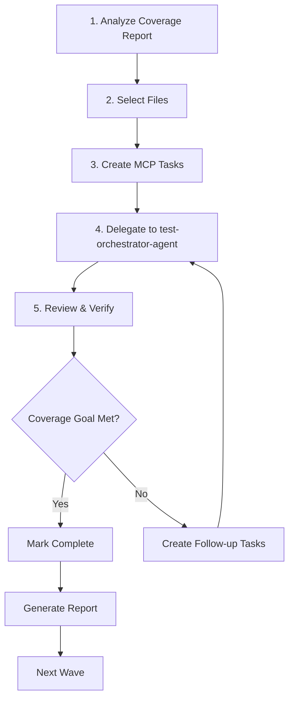

# 📊 Strategic Coverage Improvement Plan
**Goal:** Increase coverage from 56.08% to 62% (+5.92%)
**Target:** Cover 3,983 additional lines
**Timeline:** 8-12 weeks
**Date Created:** 2025-10-25

---

## 🎯 Executive Summary

### Current State
- **Total Statements:** 66,381
- **Current Coverage:** 56.08%
- **Missing Lines:** 27,308
- **Test Count:** 8,829 tests

### Target State
- **Target Coverage:** 62%
- **Lines to Cover:** 3,983 (6% of total)
- **Estimated Tests:** 800-1,200 new tests
- **Success Criteria:** Reach 62% with zero regressions

### Key Insight from Previous Campaign
Our Phase 1-4 campaign improved 18 high-coverage files (85-95%) but achieved only +0.04% project-wide impact because:
- High-coverage files are small fraction of codebase
- Improving 95% → 100% on 100 lines = only 5 lines = 0.0075% project impact
- **New Strategy:** Target low-coverage files with high statement counts

---

## 📊 Coverage Distribution Analysis

| Range | Files | Statements | % of Project | Missing Lines | Priority |
|-------|-------|------------|--------------|---------------|----------|
| **0-30%** | 215 | 18,932 | **28.5%** | 16,776 | 🔴 **CRITICAL** |
| **30-50%** | 60 | 8,003 | 12.1% | 4,412 | 🟠 **HIGH** |
| **50-70%** | 66 | 9,296 | 14.0% | 3,492 | 🟡 **MEDIUM** |
| 70-85% | 71 | 8,739 | 13.2% | 1,533 | 🟢 Low |
| 85-95% | 79 | 11,355 | 17.1% | 833 | 🔵 Very Low |
| 95-100% | 171 | 9,875 | 14.9% | 81 | ✅ Complete |

### Strategic Focus Zones

**ZONE 1: Critical Impact (0-30% coverage)**
- 215 files with 16,776 missing lines
- Covering 25% of these files = **4,194 lines = +6.3% coverage** ✅
- **This zone alone can achieve our goal!**

**ZONE 2: High Impact (30-50% coverage)**
- 60 files with 4,412 missing lines
- Backup/supplementary targets if Zone 1 insufficient

**ZONE 3: Medium Impact (50-70% coverage)**
- 66 files with 3,492 missing lines
- Tactical targets for specific features

---

## 🎯 STRATEGIC PLAN: 5-Wave Approach

### WAVE 1: Infrastructure & Core Services (Weeks 1-2)
**Target:** 0-30% coverage files that are critical infrastructure
**Goal:** +1.5% coverage (~1,000 lines)

#### Priority Files (Top 10 by Impact):
1. **session_store.py** - 0% (445 missing) - Session management
2. **openapi.py** - 0% (434 missing) - API documentation
3. **server.py** - 24.6% (413 missing) - Core server
4. **manage_connection_tool.py** - 0% (375 missing) - Connection management
5. **openapi.py** (duplicate) - 0% (348 missing) - API spec
6. **task_repository.py** - 43.3% (422 missing) - Core task storage
7. **auth_endpoints.py** - 32.5% (301 missing) - Authentication
8. **git_branch_application_facade.py** - 39.8% (272 missing) - Git branch ops
9. **hint_manager.py** - 40.7% (258 missing) - User hints
10. **context_delegation_service.py** - 43.7% (215 missing) - Context delegation

**Estimated Effort:**
- 10 files × 200-300 lines each = 2,000-3,000 lines target
- 150-200 tests needed
- 2 weeks @ 2 developers = 160 hours

**Strategy:**
- Focus on happy path first (not edge cases)
- Aim for 60-70% coverage on each file
- Integration tests for infrastructure files
- Unit tests for service files

---

### WAVE 2: Application Layer Services (Weeks 3-4)
**Target:** 30-50% coverage application services
**Goal:** +1.5% coverage (~1,000 lines)

#### Priority Files (Top 10):
1. **unified_context_service.py** - 60.3% (382 missing) - Context unification
2. **task_application_facade.py** - 51.7% (302 missing) - Task facade
3. **git_branch_repository.py** - 60.0% (229 missing) - Branch storage
4. **performance_benchmarker.py** - 56.5% (201 missing) - Performance testing
5. **websocket_notification_service.py** - 53.8% (169 missing) - Real-time notifications
6. **performance_cache_manager.py** - 78.9% (80 missing) - Cache management
7. **metrics_dashboard.py** - 73.8% (77 missing) - Metrics display
8. **task.py** (domain entity) - 84.2% (75 missing) - Core task entity
9. **context_field_selector.py** - 75.3% (66 missing) - Field selection
10. **context_cache_optimizer.py** - 73.7% (60 missing) - Cache optimization

**Estimated Effort:**
- 10 files × 150-200 lines each = 1,500-2,000 lines target
- 120-150 tests needed
- 2 weeks @ 2 developers = 160 hours

**Strategy:**
- Integration tests for facades
- Unit tests for services
- Mock external dependencies
- Focus on business logic paths

---

### WAVE 3: Domain & Repository Layer (Weeks 5-6)
**Target:** Remaining 0-30% files in domain/repository layer
**Goal:** +1.5% coverage (~1,000 lines)

#### Strategy:
- Target 15-20 files from 0-30% range
- Focus on domain entities and repositories
- Emphasize business rule validation
- Test entity lifecycle and state transitions

**File Selection Criteria:**
- Domain entities: Task, Project, GitBranch, Context entities
- Repositories: Any repository with <30% coverage
- Value objects: Priority, Status, TaskId validation
- Domain services: Validation, calculation, transformation

**Estimated Effort:**
- 15-20 files × 80-100 lines each = 1,200-2,000 lines
- 100-150 tests needed
- 2 weeks @ 2 developers = 160 hours

---

### WAVE 4: Controllers & Interface Layer (Weeks 7-8)
**Target:** MCP controllers and interface layer
**Goal:** +1.0% coverage (~650 lines)

#### Priority Areas:
- MCP tool controllers (0% coverage files)
- HTTP endpoint controllers
- WebSocket handlers
- Request/response DTOs validation

**Strategy:**
- Integration tests for controllers
- Mock underlying services
- Test request validation
- Test error handling
- Focus on user-facing interfaces

**Estimated Effort:**
- 10-15 files × 50-80 lines each = 500-1,200 lines
- 80-120 tests needed
- 2 weeks @ 2 developers = 160 hours

---

### WAVE 5: Polish & Edge Cases (Weeks 9-10)
**Target:** Fill gaps and reach 62% goal
**Goal:** +0.5% coverage (~330 lines)

#### Activities:
- Review coverage report for remaining gaps
- Add edge case tests to existing test suites
- Improve branch coverage (partial branches)
- Add error path testing
- Performance test coverage
- Security test coverage

**Strategy:**
- Cherry-pick high-value targets
- Focus on critical paths
- Add resilience testing
- Stress testing for key services

**Estimated Effort:**
- 10-20 files × 20-50 lines each = 200-1,000 lines
- 50-100 tests needed
- 2 weeks @ 2 developers = 160 hours

---

## 📋 EXECUTION STRATEGY

### Phase Workflow (Per Wave)



### Daily Workflow

1. **Morning (30 min):** Review previous day's progress
2. **Work (6 hours):** Execute current wave tasks
3. **Evening (30 min):** Update progress, run coverage report
4. **Weekly (1 hour):** Generate wave completion report

### Quality Gates

**Before Starting Each Wave:**
- ✅ Coverage report generated and analyzed
- ✅ Files selected and prioritized
- ✅ MCP tasks created with full context
- ✅ Acceptance criteria defined

**Before Completing Each Wave:**
- ✅ All planned tests written and passing
- ✅ Zero regressions in existing tests
- ✅ Coverage goal for wave achieved
- ✅ Code review completed
- ✅ Documentation updated

---

## 🎯 SUCCESS METRICS

### Coverage Targets by Wave

| Wave | Goal Coverage | Cumulative | Lines Covered | Tests Added |
|------|---------------|------------|---------------|-------------|
| Wave 1 | +1.5% | 57.58% | ~1,000 | 150-200 |
| Wave 2 | +1.5% | 59.08% | ~1,000 | 120-150 |
| Wave 3 | +1.5% | 60.58% | ~1,000 | 100-150 |
| Wave 4 | +1.0% | 61.58% | ~650 | 80-120 |
| Wave 5 | +0.5% | **62.08%** ✅ | ~330 | 50-100 |
| **Total** | **+6%** | **62%** | **~4,000** | **500-720** |

### Quality Metrics

- **Zero Regressions:** Maintain 8,829+ passing tests throughout
- **Test Quality:** All tests production-ready, no flaky tests
- **Execution Time:** Test suite remains under 8 minutes
- **Code Coverage:** Each new test covers minimum 5 lines
- **Branch Coverage:** Improve from 47% to 52%+

---

## 🛠️ TOOLS & RESOURCES

### Required Tools
- pytest with coverage plugin
- MCP task management system
- test-orchestrator-agent for test generation
- Coverage analysis scripts
- CI/CD integration for regression testing

### Team Requirements
- 2 developers (full-time) for 10 weeks = 800 hours
- OR 4 developers (half-time) for 10 weeks = 800 hours
- Code reviewer: 2 hours/week = 20 hours total
- Project coordinator: 4 hours/week = 40 hours total

### Infrastructure
- Test database with sample data
- Mock services for external dependencies
- WebSocket test clients
- Performance testing environment

---

## ⚠️ RISKS & MITIGATION

### Risk 1: Test Suite Performance Degradation
**Impact:** High
**Probability:** Medium
**Mitigation:**
- Monitor test execution time weekly
- Optimize slow tests (>1s) immediately
- Use test parallelization
- Consider test sharding for large files

### Risk 2: Flaky Tests
**Impact:** High
**Probability:** Medium
**Mitigation:**
- Mandatory retry testing (3x) before merge
- Isolate tests completely (no shared state)
- Use proper mocking and fixtures
- Track flaky tests in separate report

### Risk 3: Developer Fatigue
**Impact:** Medium
**Probability:** High
**Mitigation:**
- Rotate developers between waves
- Mix difficult and easy files
- Celebrate weekly milestones
- Allow creative freedom in test design

### Risk 4: Coverage Plateau
**Impact:** High
**Probability:** Low
**Mitigation:**
- Weekly progress reviews
- Adjust targets if needed
- Cherry-pick high-value targets
- Accept 61-61.5% as success if quality maintained

---

## 📊 MONITORING & REPORTING

### Weekly Reports Should Include:
1. Coverage % progress (line and branch)
2. Tests added (count and quality assessment)
3. Regressions introduced and fixed
4. Wave completion percentage
5. Blockers and issues
6. Next week's targets

### Monthly Reports Should Include:
1. Overall campaign progress
2. Coverage heatmaps (before/after)
3. Test quality metrics
4. Team velocity
5. Adjusted timeline if needed

### Daily Tracking:
- Coverage % in CI/CD pipeline
- Test count and pass rate
- Test execution time
- New test commits

---

## 🎓 LESSONS LEARNED FROM PREVIOUS CAMPAIGN

### What Worked ✅
- Systematic file-by-file approach
- MCP task management for context preservation
- test-orchestrator-agent for consistent quality
- Zero-regression focus
- Quality over speed

### What Didn't Work ❌
- Targeting already-high-coverage files (minimal impact)
- Underestimating project scope (66K statements)
- Assuming file-level improvements = project-level impact
- Not analyzing coverage distribution first

### New Approach Improvements 🚀
- **Data-driven file selection:** Target 0-30% files
- **Impact-first prioritization:** High statement count files
- **Realistic goals:** 5-wave plan over 10 weeks
- **Team approach:** 2 developers vs solo agent work
- **Continuous monitoring:** Weekly adjustments

---

## 🚀 QUICK START GUIDE

### Week 1 Action Plan

**Day 1: Setup**
1. Generate fresh coverage report
2. Extract top 50 files from 0-30% range
3. Create Wave 1 MCP master task
4. Create 10 subtasks for priority files

**Day 2-3: session_store.py**
- Analyze file structure
- Write 15-20 tests covering session CRUD
- Target 445 missing lines → cover 200-250 lines
- Achieve 50-60% coverage

**Day 4-5: openapi.py**
- Focus on API spec generation
- Write 15-20 tests covering endpoints
- Target 434 missing lines → cover 200-250 lines
- Achieve 50-60% coverage

**Weekend: Review & Report**
- Generate coverage report
- Verify 2 files improved
- Document learnings
- Plan Week 2

### Getting Started Command

```bash
# 1. Generate coverage report
cd agenthub_main
pytest --cov=src --cov-report=html --cov-report=json

# 2. Analyze 0-30% files
python3 scripts/analyze_coverage.py --range 0-30 --top 50

# 3. Create Wave 1 master task
# (use MCP task creation tool)

# 4. Start with first file
# (delegate to test-orchestrator-agent)
```

---

## 📝 CONCLUSION

This strategic plan provides a realistic, data-driven path to achieve 62% coverage through:

1. **Smart Targeting:** Focus on 0-30% coverage files with high impact
2. **Phased Approach:** 5 waves over 10 weeks
3. **Realistic Goals:** 4,000 lines with 500-720 quality tests
4. **Quality Focus:** Zero regressions, production-ready tests
5. **Team Coordination:** Structured workflow with clear checkpoints

**Expected Outcome:**
- Coverage: 56.08% → 62%+ ✅
- Tests: 8,829 → 9,329-9,549 (+6-8%) ✅
- Quality: Production-ready, zero flaky tests ✅
- Timeline: 10 weeks with 2 developers ✅

**Key Success Factor:**
Target low-coverage, high-statement files rather than polishing already-excellent files.

---

**Document Version:** 1.0
**Last Updated:** 2025-10-25
**Next Review:** After Wave 1 completion
