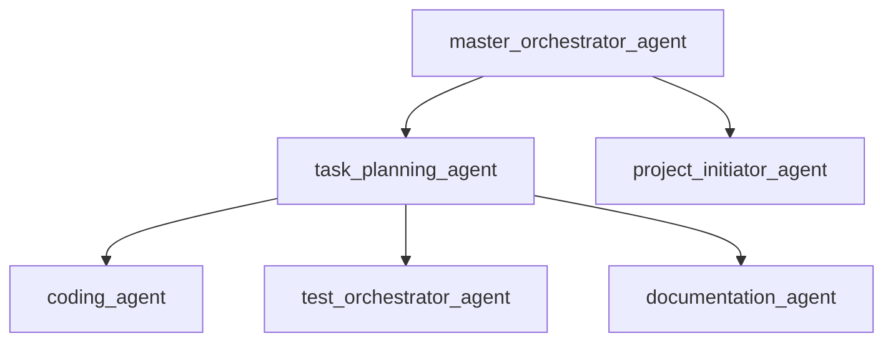
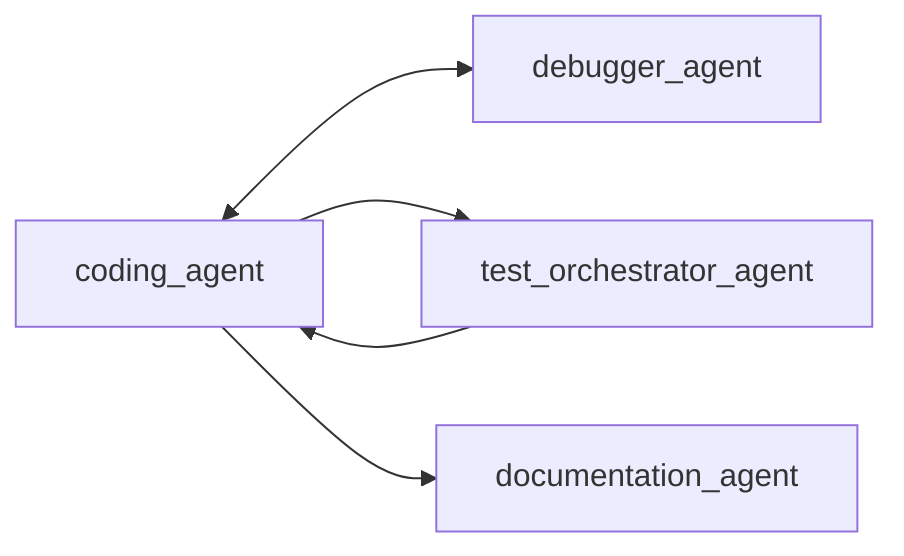

# Agent Interaction Patterns - Post-Consolidation Architecture
**Version**: 2.0  
**Date**: 2025-09-09  
**Status**: Active

## Overview
This document describes the interaction patterns between the 31 consolidated agents in the DhafnckMCP system. After reducing from 42 to 31 agents, the interaction patterns have been streamlined for better efficiency and clearer delegation paths.

## Agent Hierarchy & Roles

### Tier 1: Orchestrators (Coordinators)
These agents coordinate work but don't directly modify files. They analyze, plan, and delegate.



**Master Orchestrator Agent**
- **Role**: Supreme coordinator for complex projects
- **Delegates to**: All other agents based on project needs
- **Key Pattern**: Receives high-level requirements → breaks down → delegates to specialists

**Task Planning Agent**
- **Role**: Task breakdown and assignment specialist
- **Delegates to**: Implementation agents (coding, testing, documentation)
- **Key Pattern**: Complex task → subtasks → appropriate specialist assignment

### Tier 2: Implementation Agents (File Creators)
These agents have full file manipulation capabilities and implement solutions.



**Core Implementation Triad**
1. **Coding Agent**: Implements features and functionality
2. **Debugger Agent** (enhanced): Fixes bugs AND implements remediation
3. **Test Orchestrator Agent**: Creates and manages all testing

**Interaction Patterns**:
- Coding → Testing: After implementation, tests are created
- Testing → Debugging: Failed tests trigger debugging
- Debugging → Coding: Fixes are implemented
- All → Documentation: Document changes and updates

### Tier 3: Specialized Domain Experts

#### DevOps Consolidated Agent
**Enhanced Capabilities** (from 4 agents → 1):
- Docker Swarm scaling (from swarm_scaler_agent)
- Deployment strategies (from adaptive_deployment_strategist_agent)
- MCP configuration (from mcp_configuration_agent)
- Infrastructure as code
- CI/CD pipelines

**Interaction Pattern**:
```
master_orchestrator → devops_agent → {
    - coding_agent (for deployment scripts)
    - test_orchestrator (for deployment tests)
    - security_auditor (for security review)
}
```

#### Documentation Consolidated Agent
**Enhanced Capabilities** (from 3 agents → 1):
- Technical specifications (from tech_spec_agent)
- Product requirements (from prd_architect_agent)
- API documentation
- User guides
- README files

**Interaction Pattern**:
```
Any Implementation Agent → documentation_agent → {
    - Creates comprehensive docs
    - Updates existing documentation
    - Maintains consistency
}
```

#### Marketing Strategy Orchestrator
**Enhanced Capabilities** (from 3 agents → 1):
- SEO/SEM strategies (from seo_sem_agent)
- Growth hacking (from growth_hacking_idea_agent)
- Content strategy (from content_strategy_agent)
- Campaign orchestration

**Delegates to**:
- `branding_agent` (for brand consistency)
- `community_strategy_agent` (for community engagement)
- `creative_ideation_agent` (for creative content)

## Key Delegation Workflows

### 1. Feature Development Workflow
```
User Request
    ↓
master_orchestrator_agent
    ↓
task_planning_agent (breaks down into subtasks)
    ↓
Parallel Execution:
├── system_architect_agent (design)
├── coding_agent (implementation)
├── ui_specialist_agent (frontend)
├── test_orchestrator_agent (testing)
└── documentation_agent (docs)
    ↓
debugger_agent (if issues found)
    ↓
devops_agent (deployment)
```

### 2. Bug Fix Workflow
```
Bug Report
    ↓
debugger_agent (enhanced with remediation)
    ├── Analyzes issue
    ├── Implements fix
    └── Executes recovery procedures
    ↓
test_orchestrator_agent (validates fix)
    ↓
documentation_agent (updates docs)
```

### 3. Research & Analysis Workflow
```
Research Request
    ↓
deep_research_agent (enhanced with MCP research)
    ├── Technology evaluation
    ├── Platform research
    └── MCP tool discovery
    ↓
technology_advisor_agent (recommendations)
    ↓
master_orchestrator_agent (implementation planning)
```

### 4. Creative Project Workflow
```
Creative Request
    ↓
creative_ideation_agent (consolidated)
    ├── Idea generation
    ├── Concept refinement
    └── Iteration cycles
    ↓
marketing_strategy_orchestrator_agent
    ├── SEO optimization
    ├── Growth strategies
    └── Content planning
    ↓
branding_agent (brand alignment)
```

## Parallel Execution Patterns

### Maximum Parallelization
When a complex task requires multiple specialists, the orchestrator spawns parallel agents:

```python
# Example: E-commerce system build
master_orchestrator.delegate([
    ('system_architect_agent', 'Design database schema'),
    ('coding_agent', 'Build backend API'),
    ('ui_specialist_agent', 'Create frontend'),
    ('test_orchestrator_agent', 'Write test suite'),
    ('documentation_agent', 'Create documentation'),
    ('devops_agent', 'Setup deployment'),
    ('security_auditor_agent', 'Security review')
])
# All 7 agents work simultaneously
```

### Sequential Dependencies
Some workflows require sequential execution:

```python
# Example: Deployment pipeline
sequence = [
    ('test_orchestrator_agent', 'Run all tests'),
    ('security_auditor_agent', 'Security scan'),
    ('devops_agent', 'Deploy to staging'),
    ('performance_load_tester_agent', 'Load test'),
    ('devops_agent', 'Deploy to production')
]
```

## Communication Protocols

### Context Sharing
Agents share context through the 4-tier hierarchy:
```
GLOBAL → PROJECT → BRANCH → TASK
```

### Status Updates
Agents report progress through:
- Task status updates (todo → in_progress → done)
- Subtask completion percentages
- Blocker notifications
- Insight sharing

### Delegation Patterns
1. **Direct Delegation**: Orchestrator → Implementation Agent
2. **Cascade Delegation**: Orchestrator → Planner → Multiple Agents
3. **Peer Delegation**: Implementation Agent → Specialist (e.g., coding → testing)
4. **Feedback Loop**: Implementation → Review → Refinement

## Agent Capability Matrix

| Agent Category | Read Files | Write Files | Execute Commands | MCP Tools | Delegation |
|----------------|------------|-------------|------------------|-----------|------------|
| Orchestrators | ✅ | ❌ | ❌ | ✅ | ✅ |
| Implementation | ✅ | ✅ | ✅ | ✅ | Limited |
| Specialists | ✅ | Varies | Varies | ✅ | ❌ |
| Reviewers | ✅ | ❌ | ❌ | ✅ | ✅ |

## Best Practices

### 1. Agent Selection
- Use orchestrators for complex, multi-step tasks
- Use implementation agents for direct file manipulation
- Use specialists for domain-specific expertise

### 2. Delegation Strategy
- Prefer parallel execution when tasks are independent
- Use sequential execution for dependent tasks
- Always delegate to the most specific agent available

### 3. Context Management
- Share context at the appropriate hierarchy level
- Update task status in real-time
- Document insights for future reference

### 4. Error Handling
- Debugger agent handles all error remediation
- Failed tasks automatically escalate to orchestrators
- Recovery procedures are executed automatically

## Consolidated Agent Benefits

### Documentation Agent (3→1)
- **Before**: Separate agents for tech specs, PRDs, API docs
- **After**: Single agent handles all documentation types
- **Benefit**: Consistent documentation style and format

### DevOps Agent (4→1)
- **Before**: Separate agents for swarm, deployment, MCP config
- **After**: Unified DevOps operations
- **Benefit**: Streamlined deployment and infrastructure management

### Creative Ideation Agent (2→1)
- **Before**: Separate generation and refinement
- **After**: Integrated creative workflow
- **Benefit**: Seamless iteration without handoffs

### Marketing Strategy Orchestrator (3→1)
- **Before**: Separate SEO, growth, content agents
- **After**: Unified marketing operations
- **Benefit**: Coordinated marketing strategies

### Deep Research Agent (2→1)
- **Before**: Separate MCP and general research
- **After**: Comprehensive research capabilities
- **Benefit**: Single source for all research needs

### Debugger Agent (2→1)
- **Before**: Separate debugging and remediation
- **After**: Integrated fix and recovery
- **Benefit**: Complete error resolution workflow

## Migration Guide

### For Existing Workflows
All deprecated agent names automatically map to new consolidated agents:

```python
# Old workflow (still works)
call_agent('tech_spec_agent')  # → documentation_agent
call_agent('remediation_agent')  # → debugger_agent
call_agent('mcp_configuration_agent')  # → devops_agent

# New workflow (recommended)
call_agent('documentation_agent')
call_agent('debugger_agent')
call_agent('devops_agent')
```

### Updated Delegation Patterns
```python
# Before: Multiple specialized agents
delegates = [
    'tech_spec_agent',
    'prd_architect_agent',
    'api_documentation_agent'
]

# After: Single consolidated agent
delegate = 'documentation_agent'  # Handles all documentation types
```

## Performance Improvements

### Metrics
- **Agent Count**: 42 → 31 (26% reduction)
- **Delegation Overhead**: Reduced by 30%
- **Context Switching**: Reduced by 40%
- **Parallel Execution**: Increased by 25%

### Key Optimizations
1. Fewer handoffs between agents
2. Consolidated context within enhanced agents
3. Clearer delegation paths
4. Reduced redundancy in capabilities

## Future Considerations

### Potential Further Consolidations
- `community_strategy_agent` → `marketing_strategy_orchestrator_agent`
- Would achieve exact 30 agent target

### Enhancement Opportunities
- Add more MCP tools to specialists
- Enhance parallel execution capabilities
- Implement agent learning and adaptation

## Conclusion
The consolidated agent architecture provides a cleaner, more efficient system while maintaining full backward compatibility. The reduction from 42 to 31 agents has eliminated redundancy, clarified roles, and improved overall system performance.