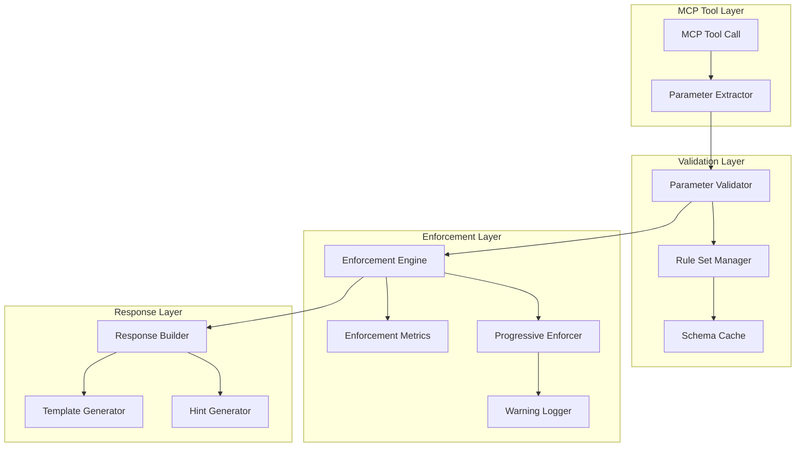

# Parameter Enforcement Technical Specification
**Version**: 1.0  
**Date**: February 3, 2025  
**Component**: Manual Context System - Enforcement Layer

## 1. Overview

This specification defines the parameter enforcement mechanisms that ensure AI agents provide context information through MCP tool parameters. The system uses a combination of validation, progressive enforcement, and helpful error responses to guide proper usage.

## 2. Enforcement Architecture

### 2.1 Component Hierarchy



### 2.2 Enforcement Flow

```python
async def enforce_parameters(tool: str, action: str, params: Dict) -> EnforcementResult:
    """Main enforcement flow"""
    
    # 1. Extract context-relevant parameters
    context_params = extract_context_params(params)
    
    # 2. Check enforcement rules
    rules = rule_manager.get_rules(tool, action)
    if not rules.requires_context:
        return EnforcementResult(allow=True)
    
    # 3. Validate against schema
    validation = validator.validate(tool, action, params)
    if not validation.success:
        return EnforcementResult(
            allow=False,
            error=validation.error,
            missing_params=validation.missing,
            hint=hint_generator.generate(tool, action, validation)
        )
    
    # 4. Check progressive enforcement
    enforcement_level = progressive_enforcer.get_level(
        agent_id=params.get("agent_id"),
        tool=tool,
        action=action
    )
    
    # 5. Apply enforcement based on level
    if enforcement_level == "strict":
        return strict_enforcement(validation)
    elif enforcement_level == "warning":
        return warning_enforcement(validation)
    else:
        return soft_enforcement(validation)
```

## 3. Parameter Schemas

### 3.1 Base Schema Structure

```python
from typing import Optional, List, Dict, Any, Union
from pydantic import BaseModel, Field, validator
from datetime import datetime

class BaseContextParams(BaseModel):
    """Base class for all context parameters"""
    
    class Config:
        extra = "forbid"  # Reject unknown fields
        validate_assignment = True
        json_encoders = {
            datetime: lambda v: v.isoformat()
        }

class WorkUpdateParams(BaseContextParams):
    """Parameters for work updates"""
    work_notes: str = Field(
        ...,
        min_length=10,
        max_length=1000,
        description="Description of work performed"
    )
    progress_made: str = Field(
        ...,
        min_length=10,
        max_length=500,
        description="Specific progress achieved"
    )
    files_modified: Optional[List[str]] = Field(
        default_factory=list,
        max_items=100,
        description="List of files modified"
    )
    
    @validator('files_modified', each_item=True)
    def validate_file_path(cls, v):
        if not v or '..' in v:
            raise ValueError('Invalid file path')
        return v

class CompletionParams(BaseContextParams):
    """Parameters for task completion"""
    completion_summary: str = Field(
        ...,
        min_length=20,
        max_length=2000,
        description="Detailed summary of completed work"
    )
    testing_notes: Optional[str] = Field(
        None,
        min_length=10,
        max_length=1000,
        description="Testing performed and results"
    )
    files_created: Optional[List[str]] = Field(
        default_factory=list,
        description="New files created"
    )
    patterns_identified: Optional[Dict[str, Any]] = Field(
        default_factory=dict,
        description="Reusable patterns discovered"
    )
    
    @validator('completion_summary')
    def validate_summary_quality(cls, v):
        # Check for minimum quality
        word_count = len(v.split())
        if word_count < 5:
            raise ValueError('Summary too brief - provide more detail')
        return v
```

### 3.2 Schema Registry

```python
class SchemaRegistry:
    """Central registry for parameter schemas"""
    
    def __init__(self):
        self._schemas: Dict[str, Dict[str, BaseModel]] = {
            "manage_task": {
                "update": WorkUpdateParams,
                "complete": CompletionParams,
                "create": TaskCreateParams,
            },
            "manage_context": {
                "update": ContextUpdateParams,
                "add_insight": InsightParams,
                "add_progress": ProgressParams,
            },
            "manage_subtask": {
                "update": SubtaskUpdateParams,
                "complete": SubtaskCompletionParams,
            }
        }
        self._cache = {}
    
    def get_schema(self, tool: str, action: str) -> Optional[BaseModel]:
        """Get schema for tool/action combination"""
        cache_key = f"{tool}:{action}"
        
        if cache_key in self._cache:
            return self._cache[cache_key]
        
        schema = self._schemas.get(tool, {}).get(action)
        if schema:
            self._cache[cache_key] = schema
        
        return schema
```

## 4. Enforcement Rules

### 4.1 Rule Definition

```python
from enum import Enum
from dataclasses import dataclass

class EnforcementLevel(Enum):
    DISABLED = "disabled"
    SOFT = "soft"          # Log only
    WARNING = "warning"    # Warn but allow
    STRICT = "strict"      # Block operation

@dataclass
class EnforcementRule:
    tool: str
    action: str
    level: EnforcementLevel
    required_params: List[str]
    optional_params: List[str]
    conditions: Optional[Dict[str, Any]] = None
    
    def applies_to(self, context: Dict) -> bool:
        """Check if rule applies given context"""
        if not self.conditions:
            return True
        
        for key, value in self.conditions.items():
            if context.get(key) != value:
                return False
        
        return True

class RuleManager:
    """Manages enforcement rules"""
    
    def __init__(self):
        self.rules = self._load_rules()
    
    def _load_rules(self) -> List[EnforcementRule]:
        return [
            # Task management rules
            EnforcementRule(
                tool="manage_task",
                action="update",
                level=EnforcementLevel.WARNING,
                required_params=["work_notes", "progress_made"],
                optional_params=["files_modified", "blockers"]
            ),
            EnforcementRule(
                tool="manage_task",
                action="complete",
                level=EnforcementLevel.STRICT,
                required_params=["completion_summary"],
                optional_params=["testing_notes", "files_created"]
            ),
            # Context management rules
            EnforcementRule(
                tool="manage_context",
                action="update",
                level=EnforcementLevel.SOFT,
                required_params=["data"],
                optional_params=["propagate_changes"]
            ),
        ]
    
    def get_rule(self, tool: str, action: str, context: Dict) -> Optional[EnforcementRule]:
        """Get applicable rule for tool/action"""
        for rule in self.rules:
            if rule.tool == tool and rule.action == action:
                if rule.applies_to(context):
                    return rule
        return None
```

### 4.2 Progressive Enforcement

```python
class ProgressiveEnforcer:
    """Implements progressive enforcement based on agent behavior"""
    
    def __init__(self, config: ProgressiveConfig):
        self.config = config
        self.agent_stats = {}
        self.warning_thresholds = {
            EnforcementLevel.SOFT: 0,
            EnforcementLevel.WARNING: 3,
            EnforcementLevel.STRICT: 5
        }
    
    def get_enforcement_level(
        self,
        agent_id: str,
        tool: str,
        action: str,
        base_level: EnforcementLevel
    ) -> EnforcementLevel:
        """Determine enforcement level based on agent history"""
        
        # Check feature flags
        if self.config.is_rollout_enabled(agent_id):
            return base_level
        
        # Get agent statistics
        stats = self.get_agent_stats(agent_id, tool, action)
        
        # Progressive enforcement logic
        if stats.compliance_rate > 0.9:
            # Good compliance - maintain current level
            return base_level
        elif stats.compliance_rate > 0.7:
            # Moderate compliance - increase by one level
            return self._increase_level(base_level)
        else:
            # Poor compliance - maximum enforcement
            return EnforcementLevel.STRICT
    
    def record_attempt(
        self,
        agent_id: str,
        tool: str,
        action: str,
        provided_params: bool
    ):
        """Record parameter provision attempt"""
        key = f"{agent_id}:{tool}:{action}"
        
        if key not in self.agent_stats:
            self.agent_stats[key] = AgentStats()
        
        stats = self.agent_stats[key]
        stats.total_attempts += 1
        
        if provided_params:
            stats.successful_attempts += 1
            stats.consecutive_failures = 0
        else:
            stats.consecutive_failures += 1
        
        stats.compliance_rate = stats.successful_attempts / stats.total_attempts
```

## 5. Validation Implementation

### 5.1 Parameter Validator

```python
class ParameterValidator:
    """Validates parameters against schemas"""
    
    def __init__(self, registry: SchemaRegistry):
        self.registry = registry
        self.validators = {}
        self._compile_validators()
    
    def validate(
        self,
        tool: str,
        action: str,
        params: Dict
    ) -> ValidationResult:
        """Validate parameters against schema"""
        
        # Get schema
        schema = self.registry.get_schema(tool, action)
        if not schema:
            return ValidationResult(success=True)  # No schema = pass
        
        try:
            # Use Pydantic validation
            validated = schema(**params)
            
            return ValidationResult(
                success=True,
                data=validated.dict(),
                warnings=self._check_optional_params(schema, params)
            )
            
        except ValidationError as e:
            return ValidationResult(
                success=False,
                errors=self._format_errors(e),
                missing_params=self._extract_missing_params(e),
                invalid_params=self._extract_invalid_params(e),
                hint=self._generate_validation_hint(schema, e)
            )
    
    def _format_errors(self, error: ValidationError) -> List[Dict]:
        """Format Pydantic errors for response"""
        formatted = []
        
        for err in error.errors():
            formatted.append({
                "field": ".".join(str(x) for x in err["loc"]),
                "type": err["type"],
                "message": err["msg"],
                "context": err.get("ctx", {})
            })
        
        return formatted
    
    def _extract_missing_params(self, error: ValidationError) -> List[str]:
        """Extract missing required parameters"""
        missing = []
        
        for err in error.errors():
            if err["type"] == "value_error.missing":
                field = err["loc"][0] if err["loc"] else "unknown"
                missing.append(str(field))
        
        return missing
```

### 5.2 Custom Validators

```python
class ContextContentValidator:
    """Custom validators for context content"""
    
    @staticmethod
    def validate_work_notes(value: str) -> str:
        """Ensure work notes are meaningful"""
        if len(value.split()) < 3:
            raise ValueError("Work notes too brief - describe what you did")
        
        # Check for placeholder text
        placeholders = ["todo", "tbd", "placeholder", "..."]
        if any(p in value.lower() for p in placeholders):
            raise ValueError("Work notes contain placeholder text")
        
        return value
    
    @staticmethod
    def validate_file_paths(paths: List[str]) -> List[str]:
        """Validate file paths"""
        validated = []
        
        for path in paths:
            # Security check
            if ".." in path or path.startswith("/"):
                raise ValueError(f"Invalid file path: {path}")
            
            # Normalize path
            normalized = path.replace("\\", "/")
            validated.append(normalized)
        
        return validated
    
    @staticmethod
    def validate_completion_summary(value: str) -> str:
        """Ensure completion summary is comprehensive"""
        
        # Minimum length check
        if len(value) < 20:
            raise ValueError("Completion summary too short")
        
        # Quality checks
        sentences = value.split(".")
        if len(sentences) < 2:
            raise ValueError("Completion summary should be multiple sentences")
        
        # Check for key elements
        keywords = ["implemented", "completed", "tested", "fixed", "added", "updated"]
        if not any(kw in value.lower() for kw in keywords):
            raise ValueError("Completion summary should describe what was accomplished")
        
        return value
```

## 6. Error Response Generation

### 6.1 Hint Generator

```python
class HintGenerator:
    """Generates helpful hints for validation errors"""
    
    def __init__(self):
        self.templates = self._load_templates()
    
    def generate(
        self,
        tool: str,
        action: str,
        validation: ValidationResult
    ) -> str:
        """Generate helpful hint based on validation errors"""
        
        if not validation.missing_params:
            return self._generate_invalid_param_hint(validation)
        
        # Build hint for missing parameters
        hints = []
        
        for param in validation.missing_params:
            param_hint = self._get_param_hint(tool, action, param)
            hints.append(f"• {param}: {param_hint}")
        
        return f"Missing required parameters:\n" + "\n".join(hints)
    
    def _get_param_hint(self, tool: str, action: str, param: str) -> str:
        """Get hint for specific parameter"""
        
        hints = {
            "work_notes": "Describe what work you performed (min 10 chars)",
            "progress_made": "Specify concrete progress achieved",
            "completion_summary": "Provide detailed summary of completed work (min 20 chars)",
            "testing_notes": "Describe testing performed and results",
            "files_modified": "List files you modified (e.g., ['src/app.py', 'tests/test_app.py'])",
        }
        
        return hints.get(param, f"Provide value for {param}")
    
    def generate_example(self, tool: str, action: str) -> str:
        """Generate example call"""
        
        examples = {
            ("manage_task", "update"): '''manage_task(
    action="update",
    task_id="task-123",
    work_notes="Implemented user authentication using JWT tokens",
    progress_made="Added login and logout endpoints with token validation",
    files_modified=["src/auth.py", "src/routes.py", "tests/test_auth.py"]
)''',
            ("manage_task", "complete"): '''manage_task(
    action="complete",
    task_id="task-123",
    completion_summary="Successfully implemented JWT authentication with login, logout, and token refresh. All endpoints are tested and documented. Integration tests passing.",
    testing_notes="Added 15 unit tests and 5 integration tests. All passing with 95% coverage.",
    files_created=["src/auth.py", "docs/auth-api.md"]
)'''
        }
        
        return examples.get((tool, action), "")
```

### 6.2 Response Builder

```python
class EnforcementResponseBuilder:
    """Builds enforcement error responses"""
    
    def __init__(self):
        self.hint_generator = HintGenerator()
        self.template_generator = TemplateGenerator()
    
    def build_error_response(
        self,
        tool: str,
        action: str,
        validation: ValidationResult,
        enforcement_level: EnforcementLevel
    ) -> Dict:
        """Build comprehensive error response"""
        
        response = {
            "success": False,
            "error": self._build_error_message(validation),
            "enforcement_level": enforcement_level.value,
            "missing_parameters": validation.missing_params,
            "invalid_parameters": validation.invalid_params,
            "hint": self.hint_generator.generate(tool, action, validation),
            "example": self.hint_generator.generate_example(tool, action),
        }
        
        # Add template for easy correction
        if template := self.template_generator.generate_correction_template(
            tool, action, validation
        ):
            response["suggested_correction"] = template
        
        # Add documentation link
        response["documentation"] = f"/docs/manual-context-system#{tool}-{action}"
        
        return response
    
    def build_warning_response(
        self,
        base_response: Dict,
        warning: str,
        suggestions: List[str]
    ) -> Dict:
        """Build warning response that allows operation"""
        
        response = base_response.copy()
        response["context_warning"] = warning
        response["suggestions"] = suggestions
        response["warning_level"] = "medium"
        
        return response
```

## 7. Enforcement Metrics

### 7.1 Metrics Collection

```python
from dataclasses import dataclass
from datetime import datetime
import prometheus_client as prom

@dataclass
class EnforcementMetrics:
    """Metrics for enforcement monitoring"""
    
    # Counters
    validation_total = prom.Counter(
        'parameter_validation_total',
        'Total parameter validations',
        ['tool', 'action', 'result']
    )
    
    enforcement_applied = prom.Counter(
        'enforcement_applied_total',
        'Enforcement actions applied',
        ['tool', 'action', 'level']
    )
    
    # Histograms
    validation_duration = prom.Histogram(
        'parameter_validation_duration_seconds',
        'Time spent validating parameters',
        ['tool', 'action']
    )
    
    # Gauges
    compliance_rate = prom.Gauge(
        'parameter_compliance_rate',
        'Rate of compliant parameter provision',
        ['agent_id']
    )
    
    def record_validation(
        self,
        tool: str,
        action: str,
        success: bool,
        duration: float
    ):
        """Record validation metrics"""
        result = "success" if success else "failure"
        self.validation_total.labels(tool, action, result).inc()
        self.validation_duration.labels(tool, action).observe(duration)
    
    def record_enforcement(
        self,
        tool: str,
        action: str,
        level: EnforcementLevel
    ):
        """Record enforcement action"""
        self.enforcement_applied.labels(tool, action, level.value).inc()
    
    def update_compliance(self, agent_id: str, rate: float):
        """Update agent compliance rate"""
        self.compliance_rate.labels(agent_id).set(rate)
```

### 7.2 Analytics Dashboard

```python
class EnforcementAnalytics:
    """Analytics for enforcement effectiveness"""
    
    def __init__(self, metrics: EnforcementMetrics):
        self.metrics = metrics
        self.cache = TTLCache(maxsize=1000, ttl=300)
    
    def get_enforcement_summary(self) -> Dict:
        """Get summary of enforcement metrics"""
        
        return {
            "validation_stats": {
                "total_validations": self._get_total_validations(),
                "success_rate": self._get_validation_success_rate(),
                "avg_duration_ms": self._get_avg_validation_duration() * 1000
            },
            "enforcement_stats": {
                "total_enforcements": self._get_total_enforcements(),
                "by_level": self._get_enforcements_by_level(),
                "trending": self._get_enforcement_trend()
            },
            "compliance_stats": {
                "overall_rate": self._get_overall_compliance(),
                "by_agent": self._get_compliance_by_agent(),
                "improving_agents": self._get_improving_agents()
            }
        }
    
    def get_problem_areas(self) -> List[Dict]:
        """Identify areas with low compliance"""
        
        problems = []
        
        # Check each tool/action combination
        for tool, action in self._get_all_combinations():
            stats = self._get_combination_stats(tool, action)
            
            if stats["compliance_rate"] < 0.5:
                problems.append({
                    "tool": tool,
                    "action": action,
                    "compliance_rate": stats["compliance_rate"],
                    "total_attempts": stats["total_attempts"],
                    "common_missing": stats["common_missing_params"]
                })
        
        return sorted(problems, key=lambda x: x["compliance_rate"])
```

## 8. Integration Points

### 8.1 MCP Tool Integration

```python
def integrate_enforcement(tool_function):
    """Decorator to add enforcement to MCP tools"""
    
    @functools.wraps(tool_function)
    async def enforced_wrapper(**kwargs):
        # Extract metadata
        tool_name = tool_function.__name__
        action = kwargs.get("action", "default")
        
        # Start timing
        start_time = time.time()
        
        try:
            # Validate parameters
            validation = validator.validate(tool_name, action, kwargs)
            
            # Check enforcement
            enforcement = enforcer.enforce(
                tool_name,
                action,
                kwargs,
                validation
            )
            
            # Record metrics
            metrics.record_validation(
                tool_name,
                action,
                validation.success,
                time.time() - start_time
            )
            
            # Block if needed
            if not enforcement.allow:
                metrics.record_enforcement(
                    tool_name,
                    action,
                    enforcement.level
                )
                return response_builder.build_error_response(
                    tool_name,
                    action,
                    validation,
                    enforcement.level
                )
            
            # Execute original function
            result = await tool_function(**kwargs)
            
            # Add warnings if applicable
            if enforcement.warnings:
                result = response_builder.build_warning_response(
                    result,
                    enforcement.warnings[0],
                    enforcement.suggestions
                )
            
            return result
            
        except Exception as e:
            logger.error(f"Enforcement error: {e}")
            # Fail open - allow operation on enforcement errors
            return await tool_function(**kwargs)
    
    return enforced_wrapper
```

### 8.2 Configuration

```yaml
# enforcement-config.yaml
enforcement:
  enabled: true
  
  # Global settings
  default_level: warning
  
  # Progressive enforcement
  progressive:
    enabled: true
    warning_threshold: 3
    strict_threshold: 5
    
  # Tool-specific overrides
  tools:
    manage_task:
      complete:
        level: strict
        required_params:
          - completion_summary
      update:
        level: warning
        required_params:
          - work_notes
          - progress_made
    
    manage_context:
      update:
        level: soft
        required_params:
          - data
  
  # Rollout configuration
  rollout:
    strategy: percentage
    percentage: 100
    
    # Agent-specific flags
    agents:
      test_agent:
        enabled: false
      production_agent:
        enabled: true
        level: strict
```

## 9. Testing Strategy

### 9.1 Unit Tests

```python
import pytest
from unittest.mock import Mock, patch

class TestParameterEnforcement:
    
    def test_validation_missing_params(self):
        """Test validation catches missing parameters"""
        validator = ParameterValidator(SchemaRegistry())
        
        result = validator.validate(
            "manage_task",
            "complete",
            {"task_id": "123"}  # Missing completion_summary
        )
        
        assert not result.success
        assert "completion_summary" in result.missing_params
        assert "Missing required parameters" in result.hint
    
    def test_progressive_enforcement(self):
        """Test progressive enforcement levels"""
        enforcer = ProgressiveEnforcer(ProgressiveConfig())
        
        # First attempts - soft enforcement
        level = enforcer.get_enforcement_level(
            "agent_1", "manage_task", "update",
            EnforcementLevel.WARNING
        )
        assert level == EnforcementLevel.WARNING
        
        # Record failures
        for _ in range(5):
            enforcer.record_attempt("agent_1", "manage_task", "update", False)
        
        # Should escalate to strict
        level = enforcer.get_enforcement_level(
            "agent_1", "manage_task", "update",
            EnforcementLevel.WARNING
        )
        assert level == EnforcementLevel.STRICT
    
    def test_hint_generation(self):
        """Test helpful hint generation"""
        generator = HintGenerator()
        
        validation = ValidationResult(
            success=False,
            missing_params=["work_notes", "progress_made"]
        )
        
        hint = generator.generate("manage_task", "update", validation)
        
        assert "work_notes" in hint
        assert "progress_made" in hint
        assert "min 10 chars" in hint
```

### 9.2 Integration Tests

```python
@pytest.mark.integration
class TestEnforcementIntegration:
    
    async def test_mcp_tool_enforcement(self):
        """Test enforcement integrated with MCP tool"""
        
        # Call tool without required params
        result = await manage_task(
            action="complete",
            task_id="test-123"
        )
        
        assert not result["success"]
        assert "completion_summary" in result["missing_parameters"]
        assert result["example"] is not None
        
    async def test_enforcement_metrics(self):
        """Test metrics collection during enforcement"""
        
        with patch.object(metrics, 'record_validation') as mock_metric:
            await manage_task(
                action="update",
                task_id="test-123",
                work_notes="Updated implementation"
            )
            
            mock_metric.assert_called_once()
            call_args = mock_metric.call_args[0]
            assert call_args[0] == "manage_task"
            assert call_args[1] == "update"
```

## 10. Deployment Considerations

### 10.1 Performance Requirements

- Validation latency: < 5ms (p95)
- Memory overhead: < 100MB per service
- Cache hit rate: > 90% for schemas
- Zero impact on success path

### 10.2 Monitoring

- Validation success rates by tool/action
- Enforcement escalations by agent
- Compliance trends over time
- Error rates and types

### 10.3 Rollback Plan

1. Feature flag to disable enforcement
2. Bypass validation on errors
3. Gradual rollback by agent/tool
4. Metrics to track impact

## Conclusion

This technical specification provides a comprehensive enforcement system that guides AI agents to provide context through parameters while maintaining a positive user experience through helpful errors, progressive enforcement, and useful templates.

---
*Technical Specification v1.0 - February 2025*