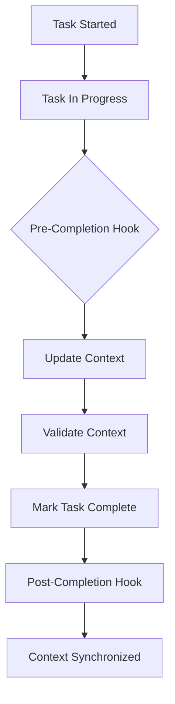

# Claude Code Hooks Reference - Task Completion & Context Updates

## Overview
This document provides comprehensive guidance for configuring hooks in `.claude/settings.json` to automatically update context before completing tasks or subtasks in the DhafnckMCP system.

## Hook Execution Flow



## Core Hook Types

### 1. Pre-Task-Completion Hook
Executes **BEFORE** a task is marked as complete to ensure context is updated.

### 2. Pre-Subtask-Completion Hook
Executes **BEFORE** a subtask is marked as complete to update subtask-specific context.

### 3. Context Sync Hook
Ensures context hierarchy (GLOBAL ’ PROJECT ’ BRANCH ’ TASK) is synchronized.

## Configuration in .claude/settings.json

### Basic Configuration

```json
{
  "hooks": {
    "pre-task-complete": {
      "enabled": true,
      "command": "python dhafnck_mcp_main/scripts/update_context_before_complete.py",
      "args": ["--task-id", "${TASK_ID}", "--context-level", "${CONTEXT_LEVEL}"],
      "timeout": 5000,
      "blocking": true
    },
    "pre-subtask-complete": {
      "enabled": true,
      "command": "curl",
      "args": [
        "-X", "POST",
        "http://localhost:8000/api/manage_context",
        "-H", "Content-Type: application/json",
        "-d", "{\"action\":\"update\",\"level\":\"task\",\"task_id\":\"${TASK_ID}\",\"status\":\"completing\"}"
      ],
      "timeout": 3000,
      "blocking": true
    },
    "context-sync": {
      "enabled": true,
      "command": "bash",
      "args": ["-c", "curl -X POST http://localhost:8000/api/sync_context"],
      "timeout": 2000,
      "blocking": false
    }
  }
}
```

### Advanced Configuration with Multiple Hooks

```json
{
  "hooks": {
    "pre-task-complete": {
      "enabled": true,
      "hooks": [
        {
          "name": "validate-context",
          "command": "python",
          "args": ["dhafnck_mcp_main/scripts/validate_context.py", "${TASK_ID}"],
          "timeout": 2000,
          "blocking": true,
          "onError": "abort"
        },
        {
          "name": "update-context",
          "command": "python",
          "args": ["dhafnck_mcp_main/scripts/update_task_context.py", "${TASK_ID}", "${USER_ID}"],
          "timeout": 3000,
          "blocking": true,
          "onError": "warn"
        },
        {
          "name": "log-completion",
          "command": "echo",
          "args": ["Task ${TASK_ID} completing with context update at $(date)"],
          "timeout": 1000,
          "blocking": false
        }
      ]
    },
    "pre-subtask-complete": {
      "enabled": true,
      "command": "python",
      "args": [
        "dhafnck_mcp_main/scripts/subtask_handler.py",
        "--action", "pre-complete",
        "--subtask-id", "${SUBTASK_ID}",
        "--parent-task", "${TASK_ID}",
        "--update-context", "true"
      ],
      "timeout": 3000,
      "blocking": true,
      "retries": 2,
      "retryDelay": 1000
    }
  }
}
```

## Hook Scripts Examples

### 1. Python Script for Context Update (update_context_before_complete.py)

```python
#!/usr/bin/env python3
"""Update context before task completion"""

import sys
import json
import requests
from datetime import datetime

def update_context_before_complete(task_id, context_level):
    """Update context in the hierarchy before marking task complete"""
    
    # API endpoint for context management
    api_url = "http://localhost:8000/api/manage_context"
    
    # Prepare context update payload
    payload = {
        "action": "update",
        "level": context_level,  # "task", "branch", "project", or "global"
        "task_id": task_id,
        "updates": {
            "status": "completing",
            "completion_time": datetime.utcnow().isoformat(),
            "final_validation": "pending"
        }
    }
    
    try:
        # Update context
        response = requests.post(api_url, json=payload)
        response.raise_for_status()
        
        # Validate context update
        result = response.json()
        if result.get("success"):
            print(f"Context updated for task {task_id}")
            return 0
        else:
            print(f"Failed to update context: {result.get('error')}")
            return 1
            
    except Exception as e:
        print(f"Error updating context: {str(e)}")
        return 1

if __name__ == "__main__":
    if len(sys.argv) < 5:
        print("Usage: update_context_before_complete.py --task-id <id> --context-level <level>")
        sys.exit(1)
    
    task_id = sys.argv[2]
    context_level = sys.argv[4]
    
    sys.exit(update_context_before_complete(task_id, context_level))
```

### 2. Bash Script for Subtask Context Update

```bash
#!/bin/bash
# update_subtask_context.sh

TASK_ID=$1
SUBTASK_ID=$2
API_URL="http://localhost:8000/api"

# Update subtask context
curl -X POST "${API_URL}/manage_context" \
  -H "Content-Type: application/json" \
  -d "{
    \"action\": \"update\",
    \"level\": \"task\",
    \"task_id\": \"${TASK_ID}\",
    \"subtask_id\": \"${SUBTASK_ID}\",
    \"updates\": {
      \"subtask_status\": \"completing\",
      \"subtask_progress\": 95
    }
  }"

# Sync context hierarchy
curl -X POST "${API_URL}/sync_context" \
  -H "Content-Type: application/json" \
  -d "{\"task_id\": \"${TASK_ID}\"}"
```

## Environment Variables Available in Hooks

| Variable | Description | Example |
|----------|-------------|---------|
| `${TASK_ID}` | Current task UUID | `550e8400-e29b-41d4-a716-446655440000` |
| `${SUBTASK_ID}` | Current subtask UUID | `6ba7b810-9dad-11d1-80b4-00c04fd430c8` |
| `${USER_ID}` | Current user identifier | `user_123` |
| `${PROJECT_ID}` | Current project UUID | `project_456` |
| `${BRANCH_ID}` | Current git branch UUID | `branch_789` |
| `${CONTEXT_LEVEL}` | Context hierarchy level | `task`, `branch`, `project`, `global` |
| `${TIMESTAMP}` | Current timestamp | `2024-01-15T10:30:00Z` |
| `${WORKING_DIR}` | Current working directory | `/home/user/project` |

## Hook Execution Options

### Blocking vs Non-Blocking

```json
{
  "hooks": {
    "pre-task-complete": {
      "blocking": true,  // Wait for hook to complete
      "timeout": 5000    // Maximum wait time in ms
    },
    "post-task-complete": {
      "blocking": false, // Continue without waiting
      "timeout": 10000   // Still has timeout for cleanup
    }
  }
}
```

### Error Handling

```json
{
  "hooks": {
    "pre-task-complete": {
      "onError": "abort",    // Options: "abort", "warn", "ignore"
      "retries": 3,          // Number of retry attempts
      "retryDelay": 1000     // Delay between retries in ms
    }
  }
}
```

## Complete .claude/settings.json Example

```json
{
  "version": "1.0",
  "project": "dhafnck-mcp",
  "hooks": {
    "pre-task-complete": {
      "enabled": true,
      "description": "Update context before marking task as complete",
      "command": "python",
      "args": [
        "${HOME}/__projects__/agentic-project/dhafnck_mcp_main/scripts/pre_complete_hook.py",
        "--task-id", "${TASK_ID}",
        "--user-id", "${USER_ID}",
        "--action", "validate-and-update"
      ],
      "env": {
        "API_URL": "http://localhost:8000",
        "CONTEXT_SYNC": "true"
      },
      "timeout": 5000,
      "blocking": true,
      "onError": "abort",
      "retries": 2,
      "retryDelay": 1000
    },
    "pre-subtask-complete": {
      "enabled": true,
      "description": "Update subtask context and sync with parent task",
      "command": "bash",
      "args": [
        "-c",
        "curl -X POST http://localhost:8000/api/manage_context -H 'Content-Type: application/json' -d '{\"action\":\"update\",\"level\":\"task\",\"task_id\":\"${TASK_ID}\",\"subtask_id\":\"${SUBTASK_ID}\",\"status\":\"completing\"}'"
      ],
      "timeout": 3000,
      "blocking": true,
      "onError": "warn"
    },
    "context-hierarchy-sync": {
      "enabled": true,
      "description": "Synchronize context across hierarchy levels",
      "triggers": ["pre-task-complete", "pre-subtask-complete"],
      "command": "python",
      "args": [
        "${HOME}/__projects__/agentic-project/dhafnck_mcp_main/scripts/sync_hierarchy.py",
        "--cascade", "true"
      ],
      "timeout": 4000,
      "blocking": false
    },
    "validation-hook": {
      "enabled": true,
      "description": "Validate context integrity before completion",
      "triggers": ["pre-task-complete"],
      "command": "python",
      "args": [
        "${HOME}/__projects__/agentic-project/dhafnck_mcp_main/scripts/validate_context.py",
        "--strict", "true"
      ],
      "timeout": 2000,
      "blocking": true,
      "onError": "abort"
    }
  },
  "contextSync": {
    "enabled": true,
    "autoSync": true,
    "syncInterval": 30000,
    "hierarchyLevels": ["global", "project", "branch", "task"]
  },
  "logging": {
    "hookExecutions": true,
    "contextUpdates": true,
    "logLevel": "info",
    "logFile": "${HOME}/.claude/hooks.log"
  }
}
```

## Testing Your Hooks

### 1. Test Command Line Execution

```bash
# Test pre-task-complete hook
export TASK_ID="test-task-123"
export USER_ID="test-user"
export CONTEXT_LEVEL="task"

python dhafnck_mcp_main/scripts/update_context_before_complete.py \
  --task-id $TASK_ID \
  --context-level $CONTEXT_LEVEL

# Check exit code
echo $?
```

### 2. Test API Endpoint

```bash
# Test context update API
curl -X POST http://localhost:8000/api/manage_context \
  -H "Content-Type: application/json" \
  -d '{
    "action": "update",
    "level": "task",
    "task_id": "test-task-123",
    "status": "completing"
  }'
```

### 3. Validate Hook Configuration

```bash
# Validate your settings.json
python -m json.tool ~/.claude/settings.json
```

## Troubleshooting

### Common Issues and Solutions

1. **Hook Not Executing**
   - Check if hook is enabled: `"enabled": true`
   - Verify command path is absolute or in PATH
   - Check file permissions for script execution

2. **Context Not Updating**
   - Verify API endpoint is accessible
   - Check authentication/authorization
   - Review API response for errors

3. **Timeout Issues**
   - Increase timeout value
   - Optimize hook script performance
   - Consider non-blocking execution for long operations

4. **Hook Blocking Task Completion**
   - Set `"onError": "warn"` instead of `"abort"`
   - Add proper error handling in scripts
   - Use `"blocking": false` for non-critical updates

## Best Practices

1. **Always Update Context Before Completion**
   - Ensures data consistency
   - Prevents lost updates
   - Maintains audit trail

2. **Use Blocking Hooks for Critical Updates**
   - Context updates should be blocking
   - Logging can be non-blocking

3. **Implement Proper Error Handling**
   - Return appropriate exit codes
   - Log errors for debugging
   - Use retries for network operations

4. **Keep Hooks Fast**
   - Timeout after 5 seconds max for blocking hooks
   - Offload heavy processing to background jobs

5. **Test Hooks Thoroughly**
   - Test with various task states
   - Verify context hierarchy synchronization
   - Check error scenarios

## API Reference

### manage_context Endpoint

```http
POST /api/manage_context
Content-Type: application/json

{
  "action": "update",
  "level": "task|branch|project|global",
  "task_id": "uuid",
  "subtask_id": "uuid (optional)",
  "updates": {
    "status": "completing",
    "progress": 95,
    "metadata": {}
  }
}
```

### sync_context Endpoint

```http
POST /api/sync_context
Content-Type: application/json

{
  "task_id": "uuid",
  "cascade": true,
  "levels": ["task", "branch", "project"]
}
```

## Related Documentation

- [Context Management System](../context-system/01-overview.md)
- [Task Management API](../api-integration/task-management-api.md)
- [DDD Architecture](../architecture-design/ddd-patterns.md)
- [Claude Code Settings](https://docs.anthropic.com/claude-code/settings)

## Support

For issues or questions about hooks configuration:
1. Check the troubleshooting section above
2. Review logs in `~/.claude/hooks.log`
3. Consult the DhafnckMCP documentation
4. Submit issues to the project repository