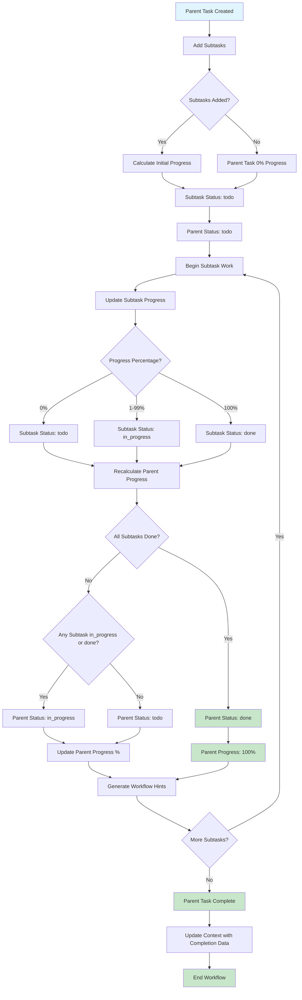
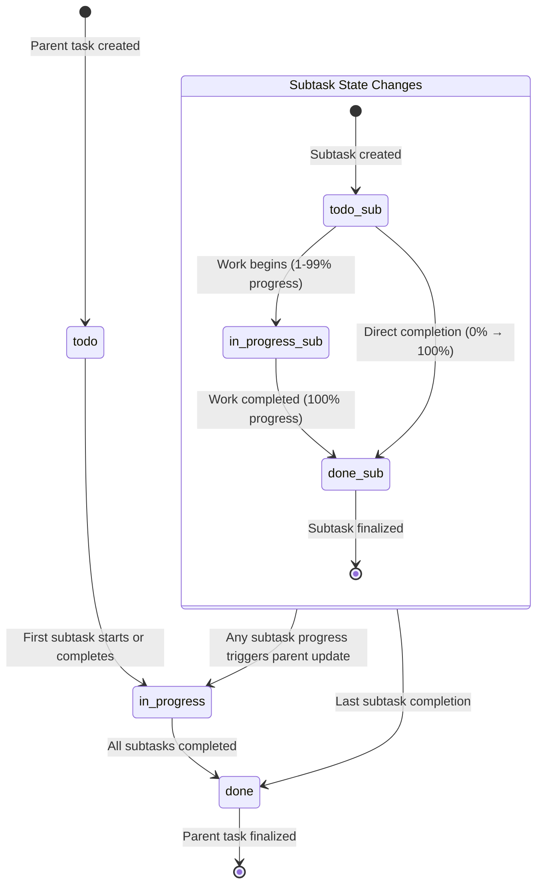

# Subtask Completion Workflow and Parent Task Progress Updates

## Overview
This document provides comprehensive documentation of the subtask completion workflow, parent task progress updates, and the relationships between subtasks and parent tasks.

## Workflow Diagram



## Subtask-Parent Relationship Architecture

```mermaid
classDiagram
    class ParentTask {
        +id: string
        +title: string
        +status: string
        +progress_percentage: int
        +subtasks: List[Subtask]
        +context: Dict
        +calculate_progress()
        +add_subtask(subtask)
        +complete_subtask(id, summary)
    }
    
    class Subtask {
        +id: string
        +title: string
        +status: string
        +progress_percentage: int
        +completion_summary: string
        +impact_on_parent: string
        +insights_found: List[string]
        +completed_at: datetime
        +complete(summary, impact, insights)
    }
    
    class ProgressCalculator {
        +calculate_parent_progress(subtasks)
        +map_progress_to_status(percentage)
        +generate_completion_rate(completed, total)
    }
    
    class ContextManager {
        +update_parent_context(task, completion_data)
        +propagate_completion_summary(subtask, parent)
        +store_insights(insights, context)
    }
    
    class WorkflowHints {
        +generate_hints(progress)
        +get_next_action(status, percentage)
        +create_recommendations(remaining_work)
    }
    
    ParentTask ||--o{ Subtask : contains
    ParentTask --> ProgressCalculator : uses
    ParentTask --> ContextManager : updates_via
    ParentTask --> WorkflowHints : generates_with
    
    Subtask --> ContextManager : updates_parent_via
    ProgressCalculator --> WorkflowHints : provides_data_to
```

## Progress Calculation Formula

### Core Formula
```
Parent Progress Percentage = (Completed Subtasks / Total Subtasks) × 100
```

### Status Mapping Logic
```python
def calculate_parent_status(subtasks):
    total = len(subtasks)
    completed = count(subtask.status == "done" for subtask in subtasks)
    in_progress = count(subtask.status == "in_progress" for subtask in subtasks)
    
    if completed == total:
        return "done"
    elif completed > 0 or in_progress > 0:
        return "in_progress"
    else:
        return "todo"
```

### Progress Examples

| Subtasks | Completed | Progress % | Status | Description |
|----------|-----------|------------|---------|-------------|
| 0 | 0 | 0% | todo | No subtasks defined |
| 1 | 0 | 0% | todo | Single subtask not started |
| 1 | 1 | 100% | done | Single subtask completed |
| 4 | 1 | 25% | in_progress | 1 of 4 subtasks complete |
| 4 | 2 | 50% | in_progress | 2 of 4 subtasks complete |
| 4 | 4 | 100% | done | All subtasks complete |
| 7 | 3 | 42% | in_progress | 3 of 7 subtasks (42.857% → 42%) |
| 100 | 50 | 50% | in_progress | Large-scale task halfway done |

## Status Transition Flow



## Context Update Mechanism

### Context Data Structure
```json
{
  "completed_subtasks": [
    {
      "subtask_id": "sub_001",
      "completion_summary": "Implemented authentication API with JWT tokens",
      "impact_on_parent": "Authentication module is now complete (25% of total feature)",
      "insights_found": [
        "Existing JWT library simplified implementation",
        "Password hashing library already configured"
      ],
      "completed_at": "2025-01-13T10:30:00Z"
    }
  ],
  "progress_history": [
    {
      "timestamp": "2025-01-13T10:30:00Z",
      "progress_percentage": 25,
      "completed_count": 1,
      "total_count": 4,
      "trigger": "subtask_completion",
      "subtask_id": "sub_001"
    }
  ],
  "workflow_stage": "in_progress",
  "estimated_completion": "2025-01-13T16:00:00Z"
}
```

### Context Update Process
1. **Subtask Completion Event**
   - Subtask status → "done"
   - Subtask progress_percentage → 100%
   - Capture completion_summary, impact_on_parent, insights_found
   - Set completed_at timestamp

2. **Parent Progress Recalculation**
   - Count completed subtasks
   - Calculate new progress percentage
   - Determine new parent status
   - Update parent task fields

3. **Context Propagation**
   - Add completion data to parent context
   - Update progress history
   - Store insights for future reference
   - Generate workflow hints

4. **Notification Generation**
   - Create progress update notifications
   - Generate workflow guidance
   - Update task dependencies if applicable

## Workflow Hints Generation

### Hint Generation Logic
```python
def generate_workflow_hints(progress_info):
    percentage = progress_info["progress_percentage"]
    completed = progress_info["completed_subtasks"]
    total = progress_info["total_subtasks"]
    
    if percentage == 0:
        return {
            "hint": "📋 Ready to begin! Start with the first subtask.",
            "next_action": "start_first_subtask",
            "recommendation": "Choose highest priority subtask to begin"
        }
    
    elif percentage == 100:
        return {
            "hint": "🎉 All subtasks completed! Ready to complete parent task.",
            "next_action": "complete_parent_task",
            "recommendation": "Review all deliverables and mark parent task as complete"
        }
    
    else:
        remaining = total - completed
        return {
            "hint": f"⚡ Making progress! {remaining} subtasks remaining ({percentage}% complete).",
            "next_action": "continue_next_subtask",
            "recommendation": f"Keep momentum on remaining subtasks"
        }
```

### Hint Examples by Progress Stage

| Progress | Hint | Next Action | Recommendation |
|----------|------|-------------|----------------|
| 0% | 📋 Ready to begin! | start_first_subtask | Choose highest priority subtask |
| 25% | 🚀 Getting started! | continue_next_subtask | Keep working systematically |
| 50% | ⚡ Good progress! | continue_next_subtask | Maintain momentum |
| 75% | 📈 Excellent progress! | continue_remaining_subtasks | Focus on final subtasks |
| 100% | 🎉 All subtasks completed! | complete_parent_task | Review and complete parent |

## Edge Cases and Handling

### Edge Case 1: No Subtasks
- **Scenario**: Parent task has no subtasks
- **Progress**: 0%
- **Status**: "todo"
- **Handling**: Direct parent task completion allowed

### Edge Case 2: Single Subtask
- **Scenario**: Parent task has exactly one subtask
- **Progress Jump**: 0% → 100% (no intermediate states)
- **Status Transition**: "todo" → "done" (may skip "in_progress")

### Edge Case 3: Large Number of Subtasks (100+)
- **Progress Granularity**: 1% increments
- **Performance**: Efficient batch calculations
- **Status**: Gradual progression through "in_progress"

### Edge Case 4: Prime Number of Subtasks
- **Example**: 7 subtasks → 3 completed = 42.857% → 42%
- **Rounding**: Floor division (round down)
- **Precision**: Integer percentages only

### Edge Case 5: Subtask Deletion
- **Impact**: Recalculate total count
- **Progress Adjustment**: May increase parent percentage
- **Status Check**: Verify parent status remains valid

### Edge Case 6: Subtask Status Regression
- **Scenario**: Completed subtask marked as "in_progress" again
- **Handling**: Recalculate parent progress downward
- **Context**: Update progress history with regression event

## Testing Scenarios

### Scenario 1: Linear Progression (4 Subtasks)
```
Initial: 0% (0/4) - Status: todo
Step 1:  25% (1/4) - Status: in_progress
Step 2:  50% (2/4) - Status: in_progress  
Step 3:  75% (3/4) - Status: in_progress
Step 4:  100% (4/4) - Status: done
```

### Scenario 2: Non-Linear Progression (7 Subtasks)
```
Initial: 0% (0/7) - Status: todo
Step 1:  14% (1/7) - Status: in_progress
Step 2:  28% (2/7) - Status: in_progress
Step 3:  42% (3/7) - Status: in_progress
Step 4:  57% (4/7) - Status: in_progress
Step 5:  71% (5/7) - Status: in_progress
Step 6:  85% (6/7) - Status: in_progress
Step 7:  100% (7/7) - Status: done
```

### Scenario 3: Bulk Completion (10 Subtasks)
```
Initial: 0% (0/10) - Status: todo
Bulk 1:  30% (3/10) - Status: in_progress (3 completed at once)
Bulk 2:  70% (7/10) - Status: in_progress (4 more completed)
Final:   100% (10/10) - Status: done (remaining 3 completed)
```

## Implementation Guidelines

### 1. Database Updates
- **Atomic Operations**: Ensure parent-subtask updates are atomic
- **Triggers**: Use database triggers for automatic progress calculation
- **Indexing**: Index on subtask status for efficient queries

### 2. Event Handling
- **Progress Events**: Emit events on progress changes
- **Listeners**: Register listeners for progress notifications
- **Async Processing**: Handle context updates asynchronously if needed

### 3. Performance Optimization
- **Batch Updates**: Group multiple subtask updates
- **Caching**: Cache parent progress for read-heavy scenarios
- **Lazy Loading**: Load subtasks only when needed

### 4. Error Handling
- **Validation**: Validate subtask completion data
- **Rollback**: Provide rollback for failed updates
- **Logging**: Log all progress change events

### 5. Testing Strategy
- **Unit Tests**: Test progress calculations in isolation
- **Integration Tests**: Test complete workflow end-to-end
- **Edge Cases**: Test all identified edge cases
- **Performance Tests**: Test with large numbers of subtasks

## Expected Outcomes

### Success Criteria
1. ✅ Progress calculation matches formula exactly
2. ✅ Status transitions follow defined logic
3. ✅ Context updates propagate correctly
4. ✅ Workflow hints provide actionable guidance
5. ✅ Edge cases handled gracefully
6. ✅ Performance remains acceptable with scale

### Key Metrics
- **Progress Accuracy**: 100% formula compliance
- **Status Consistency**: No invalid status states
- **Context Completeness**: All completion data captured
- **Hint Relevance**: Context-appropriate guidance
- **Performance**: <100ms for progress recalculation
- **Reliability**: 99.9% success rate for updates

This comprehensive workflow ensures reliable, predictable, and efficient subtask completion with proper parent task progress updates.